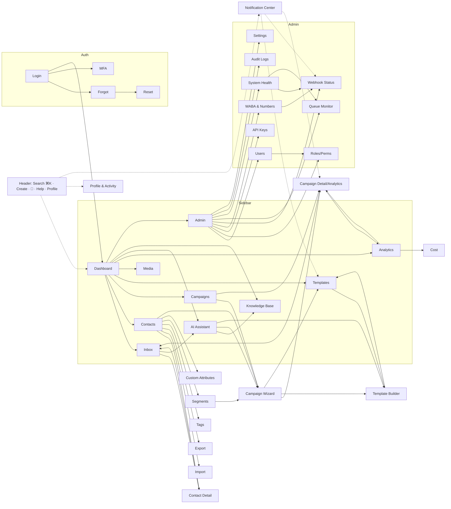

# UI/UX Design Specification
### Self-Hosted WhatsApp Business Platform

| | |
|---|---|
| **Document** | 5 of 8 — UI/UX Design Specification (product design blueprint) |
| **Version** | 1.1 — **FROZEN** (final additive pass: Part G Executive Business Dashboard) |
| **Date** | 2026-07-15 |
| **Status** | ✅ Frozen — do not edit; record changes in `CHANGELOG.md`. Part F (F1–F15) added in the enhancement pass. |
| **Note** | Owner reordered UI/UX ahead of Queue & Scheduler; Queue & Scheduler is now Doc 6. |
| **Preceded by** | Docs 1–4 (frozen) |
| **Followed by** | Doc 6 — Queue & Scheduler Design |

> This is a **product design specification — not code**. No React, HTML, CSS, Tailwind, components, or
> Figma export. It describes the complete experience — design system, layout, every screen, workflows,
> user journeys, navigation, responsive behavior, accessibility, motion, and states — in enough detail
> that a UI/UX and frontend team can build the entire application **without asking design questions**.
>
> **Structure (as directed):**
> **Part A — Design System** (20 standards; every screen inherits these).
> **Part B — Screens** (each with the 14-point template).
> **Part C — User Journeys** (multi-screen flows).
> **Part D — Navigation Map**.
> Values (colors, sizes, timings) are **design tokens expressed as a spec**, not stylesheets. Every screen
> cites the Doc 4 APIs it uses and the Doc 1 permissions that gate it.

---

## Objective & how we designed it

Goal: **the best self-hosted WhatsApp Business Platform in the world** — modern, fast, minimal,
enterprise, keyboard-first, accessible, dark/light, future-proof. We studied the UX of the products you
named and took the strongest idea from each, improving where possible and never reducing functionality.

### UX pattern synthesis — what we borrow and improve

| Source | Pattern we adopt | How we improve it |
|---|---|---|
| **Linear** | Keyboard-first everything; command palette (`⌘K`); instant, optimistic UI; crisp minimal density | Extend the palette to run actions *and* jump to any record; every list action has a shortcut |
| **Notion** | Calm, uncluttered surfaces; slash-driven inputs; generous whitespace with high information density | Apply to campaign/template builders so complex tasks feel simple |
| **Slack / Discord** | Three-pane messaging (nav / conversation list / thread); presence; unread affordances | Add WhatsApp 24-h window state, agent-collision indicators, per-number scoping |
| **Zendesk / Freshchat** | Agent workspace: customer context beside the thread; macros/quick replies; assignment | Merge with AI suggestions and internal notes in one focused workspace |
| **Respond.io** | Real automation + reporting depth; unified inbox polish | Match reporting; make scheduling & analytics standard, not premium |
| **HubSpot** | Saved views, segmentation UX, property (attribute) management | Unlimited typed attributes; composable AND/OR segment builder |
| **Meta Business Suite** | Campaign creation flow; template management; audience selection | A guided multi-step wizard with live cost estimate on Meta's real rate card |
| **Twilio Flex / Trengo / SleekFlow** | Multi-channel-ready agent tooling; queue/routing concepts | Channel-abstracted UI so Instagram/Messenger/etc. slot in without redesign |
| **ClickUp / Teams / Google Workspace** | Dense navigation that scales to many modules; global search; notification center | A collapsible, permission-aware sidebar + a unified notification center |
| **Zendesk Explore / Meta** | Analytics dashboards, drill-downs, exports | Add exact **cost analytics** (our differentiator) and click tracking |

**Design north stars:** (1) *Speed is a feature* — instant navigation, optimistic writes, virtualized
lists. (2) *Keyboard-first, mouse-friendly* — everything reachable without a mouse. (3) *Progressive
disclosure* — powerful without being overwhelming. (4) *Trust & safety* — compliance and AI-approval
states are always visible. (5) *One consistent system* — every screen is assembled from the same parts.

---

# PART A — DESIGN SYSTEM

The design system is the single source of visual and interaction truth. **Every screen in Part B is
assembled only from these standards** — no screen invents its own components, colors, spacing, or states.
The 20 standards are presented in the order you specified.

---

## DS-1. Design Principles

| # | Principle | What it means in practice |
|---|---|---|
| 1 | **Clarity over cleverness** | Plain labels, obvious affordances, no mystery-meat icons; every icon has a text label or tooltip. |
| 2 | **Speed is a feature** | Perceived latency < 100 ms for interactions; optimistic UI; skeletons never blank screens; virtualized long lists. |
| 3 | **Keyboard-first** | Every primary action has a shortcut; a command palette reaches any action/record; visible focus always. |
| 4 | **Progressive disclosure** | Show the 80% path first; advanced options behind "More"/expanders; wizards for complex tasks. |
| 5 | **Consistency** | One button system, one table, one form pattern, one set of states — learn once, apply everywhere. |
| 6 | **Density with breathing room** | Enterprise information density (Linear-like) balanced with an 8-pt rhythm so it never feels cramped. |
| 7 | **Accessible by default** | WCAG 2.1 AA is a floor, not a feature: contrast, focus, screen-reader semantics, reduced motion. |
| 8 | **Feedback for everything** | Every action confirms (toast/inline), every wait shows progress, every error explains + offers a next step. |
| 9 | **Safe by design** | Destructive actions confirm; irreversible ones require typing to confirm; AI output is always human-approved. |
| 10 | **Theming & future-proofing** | Token-driven light/dark; channel-agnostic components so new channels/modules drop in without redesign. |
| 11 | **Permission-aware** | The UI shows only what the user may do; forbidden actions are hidden or clearly disabled with a reason. |
| 12 | **Content-first empty states** | Empty screens teach and guide to the first action, never a dead end. |

---

## DS-2. Component Library

A closed set of composable components. Each is theme-driven (DS-5), sized on the spacing scale (DS-6),
and meets the accessibility rules (DS-10). For every component below: **Variants · Sizes · States ·
Behavior · A11y**. (Token values are defined in DS-3…DS-8; components reference them by name.)

### 2.1 Buttons
- **Variants:** `primary` (filled accent), `secondary` (subtle/tonal), `outline`, `ghost` (text-only),
  `destructive` (filled danger), `link`. Plus **icon-button** (square, icon-only, requires `aria-label`).
- **Sizes:** `sm` (28px h), `md` (36px, default), `lg` (44px). Full-width variant for mobile/forms.
- **States:** default, hover, active/pressed, focus-visible (2px focus ring), disabled (40% opacity, no
  pointer), **loading** (inline spinner replaces leading icon, label persists, button disabled), success
  flash (brief check on confirm).
- **Behavior:** one **primary** action per view/region; leading/trailing icon slots; supports keyboard
  activation (Enter/Space); async buttons auto-enter loading and block double-submit.
- **A11y:** real `<button>` semantics; disabled state announced; loading sets `aria-busy`.

### 2.2 Inputs & form controls (spec detailed in DS-13)
- **Text input, textarea (auto-grow), number, password (reveal toggle), search (with clear + `/` focus).**
- **Select** (native-feel) and **Combobox** (typeahead, async options, multi-select chips).
- **Checkbox, Radio, Switch** (switch = immediate side-effect toggles; checkbox = form values).
- **Date & time picker** (range mode for filters/scheduling; timezone-aware, shows tz).
- **Tags input** (create-on-enter, autocomplete existing).
- **File dropzone** (drag-drop + click, progress, type/size validation, preview).
- **States (all):** default, focus, filled, disabled, read-only, **invalid** (danger border + message +
  `aria-invalid`), **success**, loading (async validation). Sizes `sm/md/lg` matching buttons.

### 2.3 Dropdown menu / Context menu
- **Variants:** action menu (from button), right-click **context menu** (tables/cards), nested submenus,
  menus with sections/dividers, destructive items (danger color, grouped last).
- **Behavior:** opens on click/right-click; full keyboard nav (↑↓, Enter, Esc, type-ahead); closes on
  outside click/Esc; positions to stay in viewport (flip/shift).
- **A11y:** `menu`/`menuitem` roles; focus trap while open; returns focus to trigger on close.

### 2.4 Tabs
- **Variants:** underline (default, page-level), pill/segmented (compact filters), vertical (settings).
- **Behavior:** keyboard arrow navigation; lazy-loads tab panels; deep-linkable (tab in URL); overflow
  scrolls or collapses to a "More" menu on narrow widths.
- **A11y:** `tablist/tab/tabpanel`; selected tab `aria-selected`.

### 2.5 Badges, chips, pills, status dots
- **Badge:** small count/label (e.g., unread `12`). **Chip:** removable token (tags, filters). **Status
  pill:** semantic label (e.g., `Delivered`, `Failed`, `Pending`). **Status dot:** quality/health
  (green/yellow/red), presence.
- **Semantics:** color always paired with text/icon (never color-only — DS-10). Sizes `sm/md`.

### 2.6 Alerts / inline banners
- **Variants:** info, success, warning, danger, neutral. Optional title, body, action link, dismiss.
- **Use:** page-level context (e.g., "Number quality dropped to RED"), form-level errors summary,
  compliance notices (opt-in/window). Not for transient feedback (use toasts).
- **A11y:** `role="status"` (polite) or `role="alert"` (assertive) by severity.

### 2.7 Dialog (modal) & Confirmation
- **Variants:** standard dialog (form/content), **confirmation** (title, message, cancel + confirm),
  **destructive confirmation** (type-to-confirm for irreversible actions), fullscreen dialog (mobile).
- **Behavior:** focus trap; Esc + backdrop-click close (destructive requires explicit choice); scroll
  lock; one dialog at a time; returns focus to invoker.
- **A11y:** `role="dialog"`, `aria-modal`, labelled by title; initial focus on first field/primary.

### 2.8 Drawer / Sheet / Side panel
- **Variants:** right drawer (detail/edit without leaving list — e.g., contact quick-view), left drawer
  (mobile nav), bottom sheet (mobile actions), **resizable** side panel (inbox/analytics).
- **Behavior:** overlay (modal) or push (persistent); resizable panels remember width per user (DS-12);
  swipe-to-dismiss on mobile.
- **A11y:** same trap/return-focus rules as dialog when modal.

### 2.9 Toast / snackbar
- **Variants:** success, error, info, loading→resolve (promise toasts), **undo** toast (action + timer).
- **Behavior:** top-right stack (bottom on mobile); auto-dismiss (4s default, errors persist until
  dismissed); max visible (3) then queue; **Undo** window (5s) for reversible bulk/delete actions.
- **A11y:** `role="status"`; never the only signal for critical errors (also inline).

### 2.10 Progress & loaders
- **Determinate bar** (imports/exports/campaign send — shows %/counts), **indeterminate bar** (top-of-page
  route load), **spinner** (button/inline), **circular progress** (widgets).
- **Behavior:** long jobs show live counts (processed/total) sourced from job polling/SSE.

### 2.11 Skeletons (detailed in DS-19)
- Shape-matched placeholders for cards, table rows, chart areas, conversation lists, message threads.
  Shimmer respects reduced-motion (fades instead).

### 2.12 Empty states (detailed in DS-17)
- Illustration/icon + headline + one-line guidance + primary CTA (+ secondary "learn more"). Distinct
  variants for *no data yet*, *no results (filtered)*, *no permission*, *error*.

### 2.13 Cards
- **Variants:** stat/KPI card (label, value, delta, sparkline), content card, list card, selectable card
  (campaign audience/template pickers), interactive/hover-elevate.
- **Anatomy:** header (title + actions menu), body, footer; optional media/thumbnail.

### 2.14 Avatars & presence
- User avatar (initials fallback, color from name hash), contact avatar (WhatsApp profile pic when
  available), avatar group (assignees), presence dot (online/away).

### 2.15 Tooltip & Popover
- **Tooltip:** hover/focus, short text, 400ms delay, keyboard-accessible. **Popover:** richer content
  (filters, quick actions), click-triggered, focusable.

### 2.16 Breadcrumbs, Pagination controls, Steppers
- **Breadcrumb:** deep pages (Settings ▸ Webhooks ▸ Event). **Cursor pager:** "Newer/Older" + page size
  (matches Doc 4 cursor model; no page numbers for big lists). **Stepper:** multi-step wizard progress
  (campaign wizard, import).

### 2.17 Command palette (global)
- Invoked `⌘K`/`Ctrl-K`. Fuzzy search across **actions** (navigate, create, run) and **records**
  (contacts, campaigns, templates, conversations). Recent + suggested. Grouped results. Fully keyboard
  driven. (Behavior detailed in DS-12 layout and the Search screens.)

### 2.18 Data visualization primitives (detailed in DS-15)
- Line/area, bar/column, stacked bar, donut, funnel, single-stat, sparkline, heatmap (agent activity),
  table-with-inline-bars. Shared palette, tooltips, legends, empty/loading/error states.

---

## DS-3. Design Tokens

Tokens are the atomic, named design decisions. They are defined once and **themeable** — the app ships
**Light** and **Dark** themes by swapping token values, never component code. Three layers:

1. **Primitive tokens** — raw scales (e.g., `color.slate.700`, `space.4`, `radius.md`). No meaning.
2. **Semantic tokens** — role-based aliases that screens use (e.g., `color.bg.surface`,
   `color.text.primary`, `color.border.default`, `color.accent`, `color.danger`). **Screens only ever
   reference semantic tokens**, so re-theming is global and safe.
3. **Component tokens** — per-component overrides where needed (e.g., `button.primary.bg`).

**Token categories:** color, typography (family/size/weight/line-height/letter-spacing), spacing, sizing,
radius, border width, elevation/shadow, opacity, z-index, motion (duration/easing), breakpoints.
Delivered as a platform-agnostic token set (the frontend maps them to CSS variables; this doc defines the
*values and names*, not the CSS).

---

## DS-4. Typography System

- **Families:** UI/text → **Inter** (with system-ui fallback stack); numerals tabular for tables/metrics;
  **JetBrains Mono** (or system mono) for IDs, code, tokens, and monospace fields.
- **Type scale** (rem @ 16px base; line-height):

| Token | Size | LH | Weight | Use |
|---|---|---|---|---|
| `display` | 32px | 40 | 700 | Empty-state hero, marketing-ish headers |
| `h1` | 24px | 32 | 700 | Page titles |
| `h2` | 20px | 28 | 600 | Section headers |
| `h3` | 16px | 24 | 600 | Card titles, subsections |
| `body-lg` | 16px | 24 | 400 | Emphasis body / reading |
| `body` | 14px | 20 | 400 | Default UI text, tables, forms |
| `body-sm` | 13px | 18 | 400 | Secondary text, table meta |
| `caption` | 12px | 16 | 500 | Labels, timestamps, helper text |
| `overline` | 11px | 16 | 600 | Uppercase group labels (tracked) |

- **Weights:** 400 regular, 500 medium (labels/UI), 600 semibold (headings/emphasis), 700 bold (titles).
- **Rules:** max ~75ch line length for reading; never below 12px; numbers in tables use tabular figures;
  truncation with tooltip on overflow; no more than 3 weights on a screen.

---

## DS-5. Color System

Color is **token-based and theme-aware**. Screens reference **semantic** tokens only. Color never carries
meaning alone — always pair with icon/text/shape (DS-10).

**Primitive palettes** (each 50→950): **Slate** (neutrals/UI), **Indigo** (primary/accent), **Emerald**
(success), **Amber** (warning), **Red** (danger), **Sky** (info). Plus a fixed **WhatsApp channel** accent
`#25D366` reserved strictly for channel/identity markers (not general UI).

**Semantic tokens (Light → Dark):**

| Semantic token | Light | Dark | Use |
|---|---|---|---|
| `bg.canvas` | `#F8FAFC` | `#0B1120` | App background |
| `bg.surface` | `#FFFFFF` | `#111827` | Cards, panels, tables |
| `bg.surface-2` | `#F1F5F9` | `#1E293B` | Nested/secondary surfaces |
| `bg.hover` | `#F1F5F9` | `#1E293B` | Row/menu hover |
| `text.primary` | `#0F172A` | `#F1F5F9` | Primary text |
| `text.secondary` | `#475569` | `#94A3B8` | Secondary/meta text |
| `text.disabled` | `#94A3B8` | `#475569` | Disabled |
| `border.default` | `#E2E8F0` | `#1F2A3C` | Dividers, input borders |
| `border.strong` | `#CBD5E1` | `#334155` | Emphasis borders |
| `accent` | `#4F46E5` | `#6366F1` | Primary actions, active nav, links |
| `accent.fg` | `#FFFFFF` | `#FFFFFF` | Text on accent |
| `success` | `#059669` | `#10B981` | Delivered/positive |
| `warning` | `#D97706` | `#F59E0B` | Caution/quality-yellow |
| `danger` | `#DC2626` | `#EF4444` | Failed/destructive |
| `info` | `#0284C7` | `#38BDF8` | Informational |
| `focus.ring` | `#6366F1` | `#818CF8` | Focus outline |

**Domain-semantic colors (consistent everywhere):**

| Meaning | Token/Color | Where |
|---|---|---|
| Message: queued/sent | `text.secondary` (gray) + single check | inbox, ledger |
| Message: delivered | `info` (blue) + double check | inbox, analytics |
| Message: read | `success` (green) + double check | inbox, analytics |
| Message: failed | `danger` (red) + alert icon | inbox, analytics, campaigns |
| Quality: GREEN/YELLOW/RED | `success`/`warning`/`danger` dot | number health, headers |
| Campaign: running/paused/completed/failed | `info`/`warning`/`success`/`danger` pill | campaign list/detail |
| 24-h window open/closed | `success`/`text.secondary` with countdown | conversation composer |
| Opt-in/opt-out | `success`/`danger` badge | contacts |

**Contrast:** all text/background pairs meet **WCAG AA** (≥4.5:1 body, ≥3:1 large/UI). Verified for both
themes. Charts use the accessible categorical palette from DS-15.

---

## DS-6. Spacing Scale

- **Base unit: 4px.** All margins, paddings, gaps, and sizes are multiples.

| Token | px | Common use |
|---|---|---|
| `space.0` | 0 | reset |
| `space.1` | 4 | icon-text gap, tight |
| `space.2` | 8 | control padding, chip gap |
| `space.3` | 12 | input padding, list row gap |
| `space.4` | 16 | card padding, form field gap |
| `space.5` | 20 | — |
| `space.6` | 24 | section gap, card gap |
| `space.8` | 32 | block separation |
| `space.10` | 40 | page section spacing |
| `space.12` | 48 | large section |
| `space.16` | 64 | page top/bottom rhythm |

- **Radius:** `radius.sm 6`, `radius.md 8` (default), `radius.lg 12` (cards/dialogs), `radius.xl 16`,
  `radius.full` (pills/avatars).
- **Border width:** `1px` default; `2px` for focus/selected/emphasis.
- **Elevation (shadows, light theme; dark uses lower-alpha + border):** `e0` none, `e1` cards
  (subtle), `e2` dropdowns/popovers, `e3` dialogs/drawers, `e4` command palette. Dark theme leans on
  `border` + `bg.surface-2` more than shadow.
- **Icon sizes:** 16 (dense/inline), 20 (default UI), 24 (nav/headers). **Hit target ≥ 40×40** even if
  the glyph is smaller (DS-10).

---

## DS-7. Iconography

- **Library:** a single consistent **outline icon set** (Lucide-style, MIT-licensed), 24px grid,
  1.75px stroke; 20/16 variants share metaphors. One library only — no mixing sets.
- **Rules:** icons are **decorative + labeled** (never icon-only without `aria-label`/tooltip); consistent
  metaphors across the app:

| Concept | Icon | Concept | Icon |
|---|---|---|---|
| Contacts | user/users | Campaigns | megaphone/send |
| Inbox | chat bubble | Templates | layout-template |
| Analytics | bar-chart | Media | image |
| Segments | filter | Tags | tag |
| Settings | gear | Webhooks | webhook/plug |
| AI | sparkles | Search | magnifier |
| Success | check-circle | Failed | alert-triangle |
| Schedule | calendar-clock | Cost | wallet/coins |

- **Brand/channel:** the WhatsApp glyph appears only as a channel marker (per-number, per-conversation),
  never to imply endorsement; the app is not WhatsApp-branded.

---

## DS-8. Motion Guidelines

Motion is **functional** — it explains change, never decorates. Subtle, fast, interruptible.

- **Durations:** `instant 0ms`, `fast 120ms` (hover, small toggles), `base 200ms` (default enter/exit,
  drawers, dropdowns), `slow 320ms` (page/section transitions, larger surfaces). Nothing exceeds 400ms.
- **Easing:** `standard` (ease-in-out) for moves; `decelerate` (ease-out) for entrances; `accelerate`
  (ease-in) for exits.
- **Patterns:** dropdowns/menus fade+scale (95→100%); drawers/sheets slide; toasts slide+fade; dialogs
  fade backdrop + scale content; list reorders animate position; skeleton→content cross-fades; number
  counters tween on dashboards.
- **Reduced motion (`prefers-reduced-motion`):** replace slides/scales with instant or simple opacity;
  disable shimmer, counters, parallax; keep essential feedback (focus, loading). This is a **hard rule**
  (DS-10).

---

## DS-9. Interaction Guidelines

| Interaction | Standard |
|---|---|
| **Hover** | Subtle `bg.hover` + cursor change; reveals row actions (also keyboard-focusable, not hover-only). |
| **Press/active** | 100–120ms depress feedback; buttons show pressed tone. |
| **Focus** | Always a visible 2px `focus.ring`; never removed; focus-visible only for keyboard. |
| **Selection** | Row/card selection via checkbox or `Space`; range with `Shift`, multi with `⌘/Ctrl`; a sticky "N selected" bulk bar appears. |
| **Optimistic UI** | Writes reflect immediately with a pending style; on failure, revert + error toast + retry. |
| **Undo** | Reversible destructive actions (delete, bulk) show a 5s **Undo** toast before committing. |
| **Inline edit** | Editable fields (contact attributes, quick replies) edit in place: click/Enter to edit, Enter to save, Esc to cancel. |
| **Drag & drop** | Media upload, reordering (campaign steps, columns, pinned items); keyboard-accessible alternative always provided. |
| **Autosave** | Long forms (campaign wizard, template builder) autosave drafts with a "Saved" indicator; explicit save for commit. |
| **Confirmation** | Destructive → confirm dialog; irreversible → type-to-confirm; low-risk → undo toast instead of a dialog. |
| **Gestures (touch)** | Swipe conversation for quick actions (assign/resolve); pull-to-refresh lists; long-press = context menu. |
| **Empty inputs** | Search/filters clear with one control; "Reset filters" always available when filters are active. |

**Global keyboard model** (screen-specific keys listed per screen in Part B):

| Key | Action |
|---|---|
| `⌘/Ctrl-K` | Command palette (actions + jump-to record) |
| `/` | Focus search on the current list |
| `g` then `d/c/i/t/a/s` | Go to Dashboard/Contacts/Inbox/Templates/Analytics/Settings |
| `c` | Create (context: new contact/campaign/template) |
| `?` | Keyboard-shortcut cheat sheet overlay |
| `Esc` | Close dialog/drawer/menu; clear selection |
| `j / k` | Move down/up in lists (inbox, tables) |
| `x` | Toggle row selection |
| `⌘/Ctrl-Enter` | Submit/send (composer, forms) |
| `[` / `]` | Collapse/expand sidebar or panels |

---

## DS-10. Accessibility Standards

Target: **WCAG 2.1 AA** across the app (Doc 1 FR-UX-06), verified in light and dark themes.

- **Contrast:** ≥4.5:1 text, ≥3:1 large text & meaningful UI/graphics; never convey status by color alone
  (icon/label always accompany).
- **Keyboard:** every interactive element reachable and operable by keyboard in a logical tab order; no
  keyboard traps (except intended modal focus-traps that Esc releases); visible focus everywhere.
- **Screen readers:** semantic roles/landmarks (`banner`, `nav`, `main`, `complementary`,
  `contentinfo`); accessible names on all controls; tables use proper header semantics; icons decorative
  or labeled; dynamic updates via **live regions** (`aria-live`: polite for toasts/status, assertive for
  errors).
- **Focus management:** dialogs/drawers trap focus and restore it to the invoker on close; route changes
  move focus to the page `h1`; skip-to-content link at the top.
- **Forms:** every field has a visible label (placeholders are not labels); errors are programmatically
  associated (`aria-describedby`, `aria-invalid`) and summarized; required fields marked in text.
- **Targets:** ≥40×40px touch targets; adequate spacing to avoid mis-taps.
- **Reduced motion:** honor `prefers-reduced-motion` (DS-8).
- **Zoom/reflow:** usable at 200% zoom and 320px width without loss of content/function.
- **Media:** inbound audio (voice notes) offers a transcript affordance where available; images support
  alt text.

---

## DS-11. Responsive Grid & Breakpoints

- **Breakpoints:**

| Name | Min width | Target device | Shell behavior |
|---|---|---|---|
| `xs` | 0 | Phone | Sidebar → drawer; single column; bottom tab bar for primary nav |
| `sm` | 640 | Large phone | Single column; compact toolbars |
| `md` | 768 | Tablet | Collapsible icon sidebar; 2-col grids; inbox becomes 2-pane (list ↔ thread) |
| `lg` | 1024 | Laptop | Full sidebar (collapsible); multi-pane; standard density |
| `xl` | 1280 | Desktop | Default target; 3-pane inbox; right context panels |
| `2xl` | 1536 | Large monitor | Wider content max, more columns/widgets |
| `3xl` | 1920 | Ultrawide | Content max-width caps; extra columns optional; avoids overlong line lengths |

- **Grid:** 12-column fluid grid; gutter `space.6` (24px) desktop, `space.4` (16) mobile. **Content
  max-width** ~1440px on ultrawide (centered) to prevent unreadable line lengths; full-bleed allowed for
  the inbox and tables that benefit from width.
- **Rule:** design **mobile-first**; every screen has a defined behavior at each breakpoint (stated per
  screen in Part B under "Mobile Behaviour").

---

## DS-12. Layout Templates

### 12.1 The Application Shell (frame for all authenticated screens)
```
┌───────────────────────────────────────────────────────────────────────────┐
│ HEADER: [logo] [breadcrumb]      [ global search ⌘K ] [+ Create][🔔][?][◐][avatar] │
├──────────┬────────────────────────────────────────────────────────────────┤
│ SIDEBAR  │  PAGE HEADER: title · subtitle · primary actions · tabs          │
│ (nav)    │ ───────────────────────────────────────────────────────────────│
│ Dashboard│                                                                  │
│ Inbox  12│           WORKSPACE (page content — one Layout Template below)   │
│ Contacts │                                                                  │
│ Campaigns│                                                                  │
│ Templates│                                                                  │
│ Analytics│                                                                  │
│ AI       │                                                                  │
│ ───────  │                                                                  │
│ Settings │                                                     [right panel?]│
│ [collapse]│                                                                 │
└──────────┴────────────────────────────────────────────────────────────────┘
```

- **Header (global):** app logo (→ dashboard), breadcrumb, **global search** (click or `/`; opens command
  palette on `⌘K`), **+ Create** menu (context-aware: campaign/contact/template), **notification bell**
  (unread count → notification center drawer), **help** (`?`), **theme toggle** (light/dark/system),
  **profile menu** (profile, preferences, sessions, logout). Sticky; condenses on scroll.
- **Sidebar (primary nav):** grouped, permission-filtered items with icons + labels + optional badges
  (unread inbox count, pending items). **Collapsible** to icon-rail (`[`); state persists per user.
  Sections: *Work* (Dashboard, Inbox, Contacts, Campaigns, Templates, Media), *Insight* (Analytics,
  Reports, Cost), *AI* (Assistant, Knowledge Base), *Admin* (Users, WABA & Numbers, Webhooks, Queue,
  System, Settings, Audit). Items the user lacks permission for are **hidden** (DS-20).
- **Breadcrumbs:** show hierarchy on nested pages (Settings ▸ Webhooks ▸ Event #123); clickable.
- **Right context panel (optional):** resizable, collapsible; used for details/quick-view/AI/help;
  width persisted per user; becomes an overlay drawer < `lg`.
- **Notification center:** right drawer; grouped by type; real-time via SSE; mark read/all-read; deep-links
  to source; filter unread.
- **Command palette (`⌘K`):** overlay; fuzzy actions + jump-to-record; recent & suggested; keyboard-only
  operable.
- **Floating actions:** on mobile, the primary "Create/Send" becomes a FAB; on desktop it lives in the
  page header.

### 12.2 Layout Templates (each screen declares which it uses)

| Template | Structure | Used by |
|---|---|---|
| **L1 List/Table** | Page header + filter bar + standard table (DS-14) | Contacts, Campaigns, Templates, Media, Users, Audit, Webhook events |
| **L2 Master–Detail** | List (L1) + right drawer or split detail; deep-linkable | Contact detail, Campaign detail, Template detail |
| **L3 Three-Pane** | Nav rail · conversation list · conversation panel · (optional profile panel) | Inbox / Agent workspace |
| **L4 Dashboard/Grid** | Responsive widget grid (KPI + charts + lists), drag-to-rearrange | Dashboard, System Health |
| **L5 Wizard/Focus** | Full-width focused flow, stepper, sticky footer (Back/Next), autosave, exit-guard | Campaign Wizard, Import |
| **L6 Settings** | Left sub-nav + content pane (or tabs) | Settings, Roles/Permissions, API keys, WABA config |
| **L7 Centered/Auth** | Centered card on branded canvas | Login, Forgot/Reset, MFA |
| **L8 Split-Builder** | Editor form (left) + **live preview** (right) | Template Builder, Campaign message step |

Resizable panels (L2/L3/L8) use draggable dividers with min/max widths and remembered sizes; keyboard
resize supported.

---

## DS-13. Form Standards

- **Layout:** labels **above** fields; one column by default; two columns on `≥lg` for short paired
  fields; logical grouping with section headers; related fields inline (e.g., country + phone).
- **Labels & help:** every field visibly labeled; helper text below; required marked with text
  ("Required") not just `*`; units/format hints shown (e.g., "E.164, e.g. +14155552671").
- **Validation timing:** validate **on blur** for the touched field and **on submit** for all; never
  validate keystroke-by-keystroke (except strength meters/format helpers). Show first error field focused
  + a summary alert for long forms.
- **Error display:** danger border + icon + message under the field (`aria-describedby`); server (422)
  field errors map to the same slots; non-field errors → form-level alert (DS-6).
- **Actions:** primary + cancel in a **sticky footer** for long/scrolling forms; primary disabled until
  valid *or* validates on click (never silently no-op); async submit shows button loading.
- **Drafts & guards:** long forms **autosave drafts**; navigating away with unsaved changes prompts
  ("Discard changes?"); "Saved" indicator with timestamp.
- **Disabled/readonly:** disabled = not applicable (explained on hover); readonly = view-only due to
  permission/state. Destructive actions separated and styled danger.

---

## DS-14. Table Standards (one standard table system)

Every list uses **one** table system so behavior is identical app-wide.

- **Structure:** sticky header; zebra-off (borders only) for density; configurable row density
  (comfortable/compact); row hover reveals **row actions** (also in a `⋯` menu and keyboard-accessible).
- **Columns:** **column picker** (show/hide/reorder, persisted per user per table); **resize** by drag;
  **sticky first column** (name/id) and sticky actions column; min/max widths; truncation + tooltip.
- **Sorting:** click header to sort (asc/desc/none); only indexed columns sortable (Doc 4 §7.2);
  multi-sort via `Shift`-click; sort state in URL.
- **Filtering:** a **filter bar** above the table with add-filter chips mapping to the Doc 4 filter grammar
  (eq/contains/range/in/has_tag/attr…); active filters shown as removable chips; "Clear all".
- **Saved views:** save a filter+sort+column configuration as a named **view** (e.g., "Opted-in VIPs");
  personal or shared; set a default; switch via a view dropdown. (HubSpot/Linear pattern.)
- **Selection & bulk:** checkbox column; select-page and **select-all-matching-filter** (with count);
  a sticky **bulk action bar** appears ("1,240 selected — Tag · Delete · Export · …") mapping to Doc 4
  bulk endpoints; bulk ops show progress + partial-success result (Doc 4 §29–§30).
- **Export:** export current view (respecting filters/columns) to CSV/Excel/JSON as an async job.
- **Scrolling:** **virtualized rows** for large sets; **infinite scroll** (cursor pagination) with a
  "Load more"/auto-load sentinel; a compact cursor pager alternative; total shown as estimate.
- **Inline edit:** where allowed (attributes, quick fields), edit in place (DS-9).
- **States:** skeleton rows (loading), empty (DS-17 variants), error with retry (DS-18); per-cell loading
  for async values.
- **Responsive:** below `md`, the table collapses to **stacked cards** (primary fields + a `⋯` menu);
  horizontal scroll with sticky first column as a fallback for data-dense tables.

---

## DS-15. Chart Standards

- **Types & when:** line/area (trends over time), bar/column (comparisons), stacked bar (composition over
  time — sent/delivered/read/failed), donut (share — cost by category), funnel (sent→delivered→read→
  replied), single-stat + delta (KPI tiles), sparkline (inline trend), heatmap (agent/hourly activity),
  table-with-inline-bars (leaderboards).
- **Palette:** an **accessible categorical palette** (6–8 hues distinguishable in both themes and for
  common color-vision deficiencies); **sequential** palette for intensity (heatmaps); domain-semantic
  colors reused for status series (delivered=blue, read=green, failed=red — DS-5).
- **Anatomy:** concise titles; axis labels + units; smart tick formatting (e.g., `12.4k`, `$1.2k`,
  localized dates); legends interactive (click to toggle series); tooltips on hover/focus with exact
  values; no chartjunk (minimal gridlines, no 3-D).
- **States:** loading skeleton (shaped like the chart), **no-data** empty state with guidance, error with
  retry; partial/stale data flagged.
- **Accessibility:** every chart has an accessible summary and a **"view as table"** toggle (data table
  alternative); never rely on color alone (patterns/labels); keyboard-focusable data points.
- **Responsive:** charts reflow; on small screens, reduce ticks, allow horizontal scroll, or switch to a
  compact variant; maintain min touch target for interactive points.

---

## DS-16. Notification Standards

Four channels, each with a clear job:

| Channel | Use | Behavior |
|---|---|---|
| **Toast** (DS-2.9) | Transient result of a user action (saved, sent, failed, undo) | Auto-dismiss (errors persist); top-right; `aria-live` |
| **Inline alert** (DS-2.6) | Contextual state on a screen (quality RED, window closed, validation summary) | Persists until resolved |
| **Notification center** | Async/system events the user should catch up on | Real-time via SSE; grouped by type; unread badge; mark read/all-read; deep-link; filter |
| **Email/outbound webhook** | Important events off-app (campaign failed, quality drop, backup failed) | Per Doc 1 FR-ADM-07; user-configurable in preferences |

- **Event → channel mapping** (examples): `message.failed` spike → notification + optional email;
  `campaign.finished` → notification + toast if user on the campaign; `template.approved/rejected` →
  notification; `number.quality_changed` (→RED) → notification + inline banner + optional email.
- **Preferences:** per-user, per-event opt-in for email/push; quiet hours; severity thresholds.
- **Grouping & rate:** similar notifications collapse ("142 messages failed in Campaign X"); no
  notification storms.

---

## DS-17. Empty State Standards

Every list/section/panel defines four empty variants:

| Variant | When | Content |
|---|---|---|
| **First-run (no data yet)** | Feature never used | Friendly illustration + headline + one-line value + **primary CTA** ("Import contacts", "Create campaign") + link to help |
| **No results (filtered)** | Filters/search exclude everything | "No matches" + the active filters + "Clear filters" CTA |
| **No permission** | User can't access | Neutral message + who to contact; never a scary error |
| **Empty by success** | e.g., inbox all handled | Positive reinforcement ("You're all caught up ✨") |

Tone: encouraging, specific, action-oriented — never a blank area or a bare "No data".

---

## DS-18. Error State Standards

| Level | Pattern |
|---|---|
| **Field** | Inline message + danger styling + `aria-invalid` (DS-13). |
| **Form** | Summary alert listing errors with anchor links to fields; maps server `422` errors. |
| **Section/widget** | In-place error card with a short message + **Retry**; rest of page still works. |
| **Page (route)** | Friendly full-page states for `403` (no access), `404` (not found), `500` (something broke — with `request_id` to report), each with a way back. |
| **Offline / network** | Global offline banner; queued optimistic actions retried on reconnect; reads served from cache where possible. |
| **API failure** | Non-blocking toast + inline retry; never lose user input; exponential backoff on auto-retry. |
| **Conflict (409)** | Optimistic-lock conflicts show a "This changed since you opened it" dialog with **reload / overwrite / merge** options. |
| **Partial success** | Bulk/import results show `N succeeded / M failed` with a downloadable error report (Doc 4 §29). |
| **Rate limit (429)** | Explain + show when to retry (from `Retry-After`); disable the action until then. |

All errors: plain language, cause + next step, never expose stack traces; a global **error boundary**
prevents a component crash from taking down the app.

---

## DS-19. Loading State Standards

| Situation | Pattern |
|---|---|
| **Initial page/data** | **Skeletons** shaped like the final content (never spinners for full pages, never blank). |
| **Route transition** | Thin top **indeterminate bar** + skeleton of the destination; code-split routes lazy-load. |
| **In-control action** | Button/inline **spinner**; control disabled; `aria-busy`. |
| **Long jobs (import/export/campaign send)** | **Determinate progress** with live counts from job polling/SSE; can background it and get notified on completion. |
| **Background refresh** | **Stale-while-revalidate**: show cached data instantly, refresh silently, subtle "updating…" hint; never block on refresh. |
| **Search/typeahead** | Debounced (250ms); inline spinner in the field; results skeleton. |
| **Infinite scroll** | Row skeletons at the list tail while the next page loads. |
| **Optimistic** | Immediate reflected change with a pending style; reconcile on response (DS-9). |

Targets (Doc 1 §5.1): dashboard interactive < 1.5s, inbox feels instant, search < 500ms — met via
skeletons, prefetching on hover/intent, virtualization, and cached-first rendering.

---

## DS-20. Permission-aware UI Standards

The UI is a projection of the user's permissions (Doc 1 RBAC; Doc 4 §4).

- **Hide vs disable:** actions the user can **never** do (by role) are **hidden**; actions unavailable due
  to **state** (e.g., can't resume a completed campaign) are **disabled with a tooltip reason**.
- **Route guards:** navigating to a forbidden route shows the **no-permission** state (DS-17), not a raw
  403; nav items for forbidden areas are hidden entirely.
- **Read-only mode:** users with `:read` but not `:write` see the screen fully but with actions hidden and
  a subtle "View only" chip.
- **Owner/superuser:** sees everything; a discreet indicator distinguishes admin-only controls.
- **Source of truth:** the server always enforces (Doc 4); the UI mirrors `/auth/me` permissions and
  **fails safe** (hide if unknown). Permission changes reflect on next token refresh.
- **Consistency:** the same permission gates the nav item, the page, and every action within it — no
  "visible button that 403s".
- **Design deliverable:** each screen in Part B lists its governing permissions so the frontend gates
  consistently.

---

# PART B — SCREENS

Every screen is documented with the same template. To stay readable, screens **inherit the Design System
by reference** — a screen only states what is *specific* to it; anything not stated follows the DS
default (e.g., "standard table" = DS-14, "standard states" = DS-17/18/19, "standard shell" = DS-12).

**Per-screen template:** Purpose · User Goals · Entry Points · Layout · Components · Actions ·
Permissions · Required APIs · Empty · Error · Loading · Keyboard · Mobile · Accessibility · Performance.

**Screen index (Part B):** Auth (Login, Forgot, Reset, MFA) · Dashboard · Contacts (List, Detail, Import,
Export, Tags, Segments, Custom Attributes) · Campaigns (List, Wizard, Detail/Analytics) · Templates (List,
Builder) · Media (Library, Upload) · Inbox (Agent Workspace) · AI Assistant · Knowledge Base · Analytics
(Overview, Campaign, Delivery, Cost, Agent, Template, Click) · Admin (Users, Roles, Permissions, API Keys,
WABA, Phone Numbers, Webhooks, Queue Monitor, System Health, Audit Logs, Settings, Notifications) · Profile
& Activity · Global/Advanced Search · Help Center.

---

## B1. Authentication screens (Layout L7 — centered, no app shell)

### B1.1 Login
- **Purpose:** authenticate a staff user. **User Goals:** sign in quickly and safely.
- **Entry Points:** app root when unauthenticated; session expiry redirect (returns to intended page).
- **Layout:** centered card on branded canvas; logo, email, password (reveal toggle), "Remember me",
  "Forgot password?" link, primary **Sign in**; theme toggle in corner.
- **Components:** inputs, primary button, inline alert, link.
- **Actions:** submit → `POST /auth/login`; on `mfa_required`, transition to **MFA** step in the same card.
- **Permissions:** public.
- **APIs:** `POST /auth/login`, then `GET /auth/me`.
- **Empty:** n/a. **Error:** invalid credentials → inline alert (generic, no user enumeration); locked
  (`423`) → "Account locked, try later / reset"; network → retry.
- **Loading:** button spinner; whole card disabled during submit.
- **Keyboard:** Enter submits; autofocus email; tab order email→password→submit.
- **Mobile:** full-width card, large tap targets, numeric keyboard for MFA later.
- **Accessibility:** labeled fields, error `aria-live`, password reveal has `aria-pressed`.
- **Performance:** tiny bundle (auth route code-split); no shell loaded pre-auth.

### B1.2 Forgot Password
- **Purpose/Goal:** request a reset link. **Entry:** login "Forgot?".
- **Layout:** email field + **Send reset link**; success view ("If the email exists, we sent a link").
- **Actions:** `POST /auth/forgot-password` (always returns 202 — no enumeration).
- **Error/Loading/Mobile/A11y:** standard. **Perf:** minimal.

### B1.3 Reset Password
- **Purpose:** set a new password from an emailed token. **Entry:** email link (`?token=`).
- **Layout:** new password + confirm, **live strength meter**, rules checklist; **Set password**.
- **Actions:** `POST /auth/reset-password`. **Error:** expired/invalid token → clear message + request-new
  link. Standard states otherwise.

### B1.4 MFA (TOTP)
- **Purpose:** second factor at login; and enrollment in Settings.
- **Login step:** 6-digit code input (auto-advance, paste-aware), "Use backup code" link.
- **Enrollment (Settings ▸ Security):** QR + secret, verify code to enable, backup codes shown once.
- **APIs:** `/auth/mfa/setup|verify|disable`; login verifies code.
- **A11y:** grouped code inputs announce position; error `aria-live`. **Mobile:** numeric keypad, OTP
  autofill.

---

## B2. Dashboard (Layout L4 — widget grid)

- **Purpose:** an at-a-glance operational home — health, volume, cost, and what needs attention.
- **User Goals:** understand "how are we doing right now?", spot problems, jump to work.
- **Entry Points:** default post-login landing; logo click; `g d`.
- **Layout:** top **KPI row** (stat cards), then a responsive grid of widgets; date-range + number/WABA
  filter in the page header; **live** counters via SSE. Users can rearrange/hide widgets (persisted).
- **Widgets:**

| Widget | Shows | Source |
|---|---|---|
| Messages | sent/delivered/read/failed totals + trend | `GET /analytics/dashboard` |
| Delivery rate | % delivered + sparkline | dashboard |
| Read rate | % read + trend | dashboard |
| Response rate | inbound replies / outbound | dashboard |
| Cost | spend this period + by category donut | `/analytics/cost` |
| Active campaigns | running/scheduled with mini progress | `/campaigns` |
| Recent campaigns | last N with status + rates | `/campaigns` |
| Queue status | depth, throughput, failures | `/queues` |
| System health | dependency status dots | `/ready`,`/monitoring/metrics` |
| Active agents | online agents + open conversations | inbox/presence |
| Number health | quality/limit per number | `/phone-numbers` |
| Notifications | latest important events | `/notifications` |

- **Actions:** change range/filters; drill into any widget (→ analytics/campaign/inbox); rearrange;
  "Create campaign" CTA.
- **Permissions:** widgets are permission-filtered (`analytics:read`, `campaigns:read`, `system:read`,
  `inbox:read`); a user sees only widgets they may view.
- **APIs:** `GET /analytics/dashboard`, `/analytics/cost`, `/campaigns`, `/queues`,
  `/monitoring/metrics`, `/notifications`; SSE `dashboard` topic for live counters.
- **Empty:** first-run shows a guided "Set up your first number / import contacts / create a campaign"
  checklist instead of zeros. **Error:** per-widget error card + retry (one failing widget never breaks
  the page). **Loading:** skeleton tiles; KPIs animate on load; stale-while-revalidate on range change.
- **Keyboard:** `g d`; range picker keyboard-operable; `r` refresh.
- **Mobile:** widgets stack single-column, KPIs become a horizontal scroll strip; charts compact.
- **Accessibility:** each widget has a heading + "view as table" for charts; live regions polite.
- **Performance:** reads pre-aggregated rollups (Doc 6) → <1.5s; widgets lazy-load below the fold;
  counters update via SSE without refetch.

---

## B3. Contacts

### B3.1 Contacts — List (Layout L1)
- **Purpose:** manage the contact base at scale (1M+). **User Goals:** find, segment, edit, act on
  contacts; import/export; run bulk operations.
- **Entry Points:** sidebar Contacts; `g c`; command palette; from a segment/campaign audience.
- **Layout:** page header (title, count, **Import**, **Export**, **+ Contact**) + **filter bar** +
  **standard table** (DS-14). Columns (default, configurable): avatar+name, phone, tags, opt-in status,
  last inbound, source, created. Row click → detail drawer (L2).
- **Components:** table, filter bar, saved views, bulk action bar, chips, badges, drawer.
- **Filters/Sort/Search:** DS-14 + domain filters — opt-in status, tags (has_tag), custom attributes
  (`attr.*`), country, last-inbound range, source; quick search `q` (name/phone/email); **saved views**
  ("Opted-in VIPs", "No reply 30d"). Advanced AND/OR via a **"Build filter"** popover → `POST
  /contacts/search`.
- **Bulk Actions:** tag/untag, set attribute, add to campaign, export, delete — sticky bulk bar; supports
  **select-all-matching-filter** with count; async with progress + partial-success (Doc 4 §29–§30).
- **Permissions:** `contacts:read` (view), `contacts:write` (edit/bulk), `contacts:import/export`.
- **APIs:** `GET /contacts`, `POST /contacts/search`, `/contacts/bulk*`, `/tags`, `/segments`,
  `/contacts/export`.
- **Empty:** first-run → "Import your contacts" CTA + sample template download; no-results → clear filters.
- **Error/Loading:** standard (skeleton rows, retry). **Keyboard:** `/` search, `j/k` navigate, `x`
  select, `c` new, `e` edit focused, `⌘K`.
- **Mobile:** table → stacked cards; filters in a bottom sheet; bulk via long-press select.
- **Accessibility:** table semantics, selection announced, filter chips labeled.
- **Performance:** virtualized + cursor pagination (Doc 4 §6); search <500ms (indexed); prefetch detail on
  row hover.

### B3.2 Contact — Detail (Layout L2 — drawer or full page)
- **Purpose:** full view/edit of one contact + history. **Goals:** see everything, edit inline, act
  (message, tag, add to campaign).
- **Layout:** header (avatar, name, phone, opt-in badge, quality/active dot) + tabs: **Overview**
  (fields + **custom attributes**, inline-editable), **Tags**, **Timeline** (messages/campaigns/events),
  **Conversations** (link to inbox), **Notes**. Right rail: quick actions (Message, Add to campaign,
  Export, Delete).
- **Actions:** edit fields (inline, optimistic), add/remove tags, set attributes, open conversation,
  delete (undo toast). **Permissions:** `contacts:read/write`, `inbox:read` for conversation link.
- **APIs:** `GET /contacts/{uuid}`, `PATCH`, `/tags`, `/attributes`, `/contacts/{uuid}/timeline`.
- **Empty/Error/Loading:** timeline empty state; optimistic edits with revert-on-error; skeleton on load.
- **Mobile:** full-screen; tabs become a scrollable segmented control.
- **Accessibility:** inline edits keyboard-operable; timeline is a semantic list. **Performance:** lazy-load
  timeline tab; detail prefetched from list hover.

### B3.3 Import Contacts (Layout L5 — wizard)
- **Purpose:** bring in CSV/Excel at scale safely. **Goals:** map columns, handle duplicates, see results.
- **Steps:** **1 Upload** (dropzone, CSV/Excel, size check) → **2 Map columns** (auto-match + manual;
  map to fields/attributes/tags; preview first rows) → **3 Options** (dedup strategy skip/merge/overwrite,
  default tags, opt-in assumption with a compliance note) → **4 Review & start** (row count, validation
  summary) → **5 Progress** (live processed/total, then result: succeeded/failed + **download error
  report**).
- **Components:** stepper, dropzone, mapping table, radio groups, progress, partial-success result.
- **Permissions:** `contacts:import`. **APIs:** upload → `POST /media/upload`; `POST /contacts/import`;
  poll `GET /contacts/import/{job}`; SSE progress.
- **Empty/Error:** invalid file → inline; per-row errors → downloadable report; can background the job and
  get a notification on completion.
- **Keyboard/Mobile/A11y:** stepper keyboard-navigable; exit-guard on unsaved; mobile single-column steps.
- **Performance:** async ≥10k/min (Doc 1 NFR-PERF-08); UI never blocks; streamed validation.

### B3.4 Export Contacts
- **Purpose:** export current view/segment. **Layout:** dialog — choose format (CSV/Excel/JSON), columns,
  scope (selection / filter / segment), then async job → toast/notification with download when ready.
- **APIs:** `POST /contacts/export`, `GET /jobs/{uuid}`. **Perf:** async, streamed; link expires (Doc 4).

### B3.5 Tags (Layout L6/L1)
- **Purpose:** manage the tag taxonomy. **Layout:** list with usage counts, color, create/edit inline,
  merge, delete (with reassignment note). **Permissions:** `contacts:write`. **APIs:** `/tags`.
- **Empty:** "Create your first tag". **Perf:** small list, instant.

### B3.6 Segments (Layout L1 + builder)
- **Purpose:** create/manage dynamic audiences. **Layout:** list (name, cached count, dynamic/static,
  last evaluated) + a **segment builder** (AND/OR rule groups mirroring `segment_rules`) with a **live
  count preview** and a "Preview contacts" table.
- **Actions:** create/edit rules, preview, refresh count, use in a campaign, duplicate, delete.
- **Permissions:** `segments:read/write`. **APIs:** `/segments`, `/segments/{uuid}/contacts`, `/refresh`.
- **Empty:** guided builder; **Loading:** count computes async with a spinner; **Perf:** count is cached,
  recompute on demand (Doc 3 §6.4).

### B3.7 Custom Attributes (Layout L6)
- **Purpose:** define the typed custom fields available on contacts. **Layout:** list of definitions
  (key, label, type, indexed, PII flag) + create/edit dialog (choose type; enum values; mark indexed for
  fast filtering; mark PII). **Permissions:** `contacts:write`. **APIs:** `/custom-attributes`.
- **Notes:** changing a type warns about existing values; deleting warns it removes values. **Perf:**
  marking "indexed" promotes to hot filters (Doc 3 §6.3).

---

## B4. Campaigns

### B4.1 Campaigns — List (Layout L1)
- **Purpose:** manage all broadcasts. **Goals:** monitor performance, control running campaigns, create new.
- **Entry Points:** sidebar Campaigns; `g` +; dashboard widgets; command palette.
- **Layout:** page header (**+ Create campaign**) + status tabs (All / Draft / Scheduled / Running /
  Completed / Failed) + **standard table**: name, status pill, template, number, audience size, sent/
  delivered/read/failed (mini bars), cost, schedule, created. Live progress on running rows (SSE).
- **Actions (row + bulk):** open, **pause/resume/cancel** (running), retry-failed, duplicate, view
  analytics, delete draft; bulk pause/resume/cancel/archive (Doc 4 `/campaigns/bulk-action`).
- **Permissions:** `campaigns:read` (view), `campaigns:write` (create/edit draft), `campaigns:send`
  (send/schedule/retry), `campaigns:manage` (pause/resume/cancel).
- **APIs:** `GET /campaigns`, lifecycle `POST /campaigns/{id}/{action}`; SSE `campaigns`.
- **Empty:** "Create your first campaign" with a 3-step explainer. **Error/Loading:** standard.
- **Keyboard:** `c` create, `j/k`, Enter open. **Mobile:** cards with status + progress + `⋯`.
- **Accessibility:** progress announced; status pills have text. **Performance:** counters from denormalized
  campaign row (O(1)); live rows via SSE, not polling.

### B4.2 Campaign Wizard (Layout L5 — focused multi-step)
The centerpiece creation flow. **Autosaves a draft** at every step; **exit-guard** on unsaved; a **sticky
footer** (Back · Save draft · Next) and a **stepper** header. A persistent **summary rail** (right) shows
running choices + **live cost estimate**.

| Step | Purpose | UI & behavior |
|---|---|---|
| **1 · Basics** | Name + sending number | Name field; number picker showing **quality/limit** per number (warns if RED/near limit). |
| **2 · Audience** | Who receives it | Choose **Segment / Tags / Uploaded list / Manual selection**; live **audience count**; **opt-in filter is always on** with a note ("Only opted-in contacts are messaged"); excluded counts shown (opted-out, invalid). |
| **3 · Template** | What is sent | Pick an **approved** template (filter by category/language); only `approved` selectable; shows category (marketing/utility/auth) and a **live preview**. Link to create a template (opens Builder). |
| **4 · Variables & Media** | Personalize | Map each `{{n}}` to a contact field/attribute or static text (**Split-Builder** L8: mapping left, live preview right); attach/confirm media header; per-recipient preview with sample contacts; validation for unmapped variables. |
| **5 · Schedule** | When | **Send now** / **Schedule** (date-time, timezone-aware) / **Recurring** (cron-like friendly builder) / **Drip**; optional **send-rate/pacing** to protect quality. |
| **6 · Review & Cost** | Confirm | Full summary; **cost estimate** on Meta's real rate card broken down by country/category (`/estimate-cost`); **pre-send validation** results (opt-in ok, template approved, within messaging limit) with clear blockers if any. |
| **7 · Confirmation** | Launch | Explicit **Send/Schedule** (requires `Idempotency-Key`); type-to-confirm for very large audiences; success screen with a link to the live campaign detail. |

- **Components:** stepper, cards, combobox, segment picker, live preview, date/time picker, cost breakdown,
  validation checklist, confirm dialog.
- **Permissions:** `campaigns:write` to build; `campaigns:send` to launch/schedule.
- **APIs:** `/segments`, `/tags`, `/contacts/search`, `/templates`, `/campaigns` (create/patch),
  `/campaigns/{id}/preview`, `/estimate-cost`, `/schedule`, `/send`.
- **Empty/Validation errors:** each step blocks Next until valid; step 6 lists any compliance blockers with
  fixes (e.g., "120 contacts not opted-in — excluded"). **Loading:** cost/preview compute async with
  skeletons. **Keyboard:** Enter=Next, `⌘Enter`=launch on last step, Esc=exit-guard.
- **Mobile:** one step per screen, sticky footer, summary collapsible. **Accessibility:** stepper announces
  progress; each step has an `h1`; validation summary is a live region.
- **Performance:** audience counts and cost use cached aggregates; drafts autosave without blocking;
  preview renders a sample, not the whole audience.

### B4.3 Campaign Detail & Analytics (Layout L2)
- **Purpose:** monitor and control one campaign; analyze results. **Goals:** watch live progress, react to
  failures, understand outcomes and cost.
- **Layout:** header (name, status, number, template, controls: **Pause/Resume/Cancel/Retry-failed/
  Duplicate**) + KPI row (sent/delivered/read/failed/replied, cost actual vs estimate) + charts (delivery
  funnel, over-time stacked area) + **recipients table** (filter by status; per-recipient wamid, status,
  error code, timestamps) + **failure breakdown** by Meta error code with guidance.
- **Actions:** lifecycle controls (permission-gated + state-aware disable); export recipients/report; open a
  recipient's conversation.
- **Permissions:** `campaigns:read`+`analytics:read` (view); `campaigns:manage/send` (controls).
- **APIs:** `GET /campaigns/{id}`, `/recipients`, `/analytics/campaigns/{id}`; SSE `campaign.progress`.
- **Empty:** pre-send shows the plan; **Error:** failed sends surfaced with codes; **Loading:** skeletons +
  live counters. **Keyboard:** control shortcuts (`p` pause/resume). **Mobile:** KPIs strip, collapsible
  charts, recipients as cards.
- **Accessibility:** live progress polite; controls labeled with state. **Performance:** counters O(1);
  recipients cursor-paginated over the partitioned ledger; charts from rollups.

---

## B5. Templates

### B5.1 Templates — List (Layout L1)
- **Purpose:** manage WhatsApp message templates + their Meta approval status. **Goals:** see what's
  usable, create/submit, fix rejections, sync.
- **Layout:** header (**+ Create template**, **Sync with Meta**) + filters (WABA, status, category,
  language, `q`) + **standard table**: name, language, category, **status pill** (draft/pending/approved/
  rejected/paused/disabled), quality, last synced, usage. Rejected rows show reason on hover.
- **Actions:** create, edit draft, resubmit, delete, sync, preview, view versions.
- **Permissions:** `templates:read/write/sync`. **APIs:** `/templates`, `/templates/sync`,
  `/templates/{id}/preview|versions`.
- **Empty:** "Create your first template" + explainer on approval. **Error/Loading:** standard.
- **Performance:** status via periodic + webhook sync (no live Meta call on view).

### B5.2 Template Builder (Layout L8 — split editor + live preview)
- **Purpose:** compose a compliant template and submit to Meta. **Goals:** build header/body/footer/buttons
  with variables and see exactly how it renders.
- **Layout:** **left editor** — category (marketing/utility/auth), name, language; components: **Header**
  (none/text/media), **Body** (text with `{{n}}` variable insertion + sample values), **Footer**,
  **Buttons** (quick-reply / URL / phone, up to Meta limits); **right live preview** (WhatsApp-style bubble,
  light/dark) updating as you type.
- **Validation (pre-submit):** category correctness hints, variable numbering, button limits, media rules,
  character limits — inline, before hitting Meta (reduces rejections).
- **Actions:** save draft, **submit for approval**, duplicate, preview with sample data.
- **Permissions:** `templates:write`. **APIs:** `POST/PATCH /templates`, `/preview`.
- **Empty:** starter scaffold; **Error:** Meta submission errors mapped to fields; **Loading:** submit
  spinner. **Keyboard:** `/` to insert variable; `⌘S` save; `⌘Enter` submit. **Mobile:** preview toggles
  above editor (tabs). **Accessibility:** preview has a text alternative; variable inserts announced.
- **Performance:** preview is client-side/instant; submission async.

---

## B6. Media

### B6.1 Media Library (Layout L1 — grid)
- **Purpose:** central reusable asset store. **Goals:** find, preview, reuse, manage media.
- **Layout:** header (**Upload**, filters by type, `q`) + responsive **grid of media cards** (thumbnail,
  type, size, usage count) with a detail drawer (metadata, where-used, signed preview, replace, delete).
- **Actions:** upload, preview, copy reference, delete (blocked if in use → shows usages), refresh Meta id.
- **Permissions:** `media:read/write`. **APIs:** `/media`, `/media/{id}`, `/media/{id}/content`,
  `/media/upload`.
- **Empty:** "Upload your first asset"; **Error/Loading:** thumbnail skeletons, retry.
- **Mobile:** 2-col grid, bottom-sheet detail. **Accessibility:** each asset labeled (alt/name); grid is a
  semantic list. **Performance:** thumbnails lazy-load; signed URLs; dedup on upload (Doc 4 §16).

### B6.2 Media Upload (dialog/dropzone)
- **Purpose:** add assets. **Layout:** dropzone (drag-drop/click), multi-file, per-file progress,
  type/size validation to Cloud API limits, dedup notice ("already in library"), preview before confirm.
- **Actions:** upload → returns asset; used inline by Template Builder, Campaign Wizard, Inbox composer.
- **Errors:** `413/415` mapped to friendly messages. **Perf:** direct-to-storage where possible;
  SHA-256 dedup avoids re-upload.

---

## B7. Inbox / Agent Workspace (Layout L3 — three-pane, world-class CRM inbox)

The most-used screen. Modeled on the best of Slack/Discord (conversation UX), Zendesk/Freshchat (agent
context + macros), and Respond.io (unified polish), with WhatsApp-specific compliance built in.

```
┌───────────┬───────────────────────────────┬───────────────────────────┐
│ FILTERS/  │  CONVERSATION LIST            │  CONVERSATION PANEL         │  CUSTOMER
│ FOLDERS   │  (search, tabs, virtualized)  │  (thread + composer)        │  PROFILE
│ • Mine    │  ┌─────────────────────────┐  │  header: contact, number,   │  (collapsible)
│ • Unread  │  │ avatar name  · 2m       │  │  window countdown, assign   │  • details
│ • Unassn. │  │ preview…      ● 3        │  │  ─────────────────────────  │  • tags
│ • Open    │  │ [tag] status  ✔✔        │  │  message bubbles (status    │  • attributes
│ • Pending │  └─────────────────────────┘  │  ticks, media, reactions)   │  • timeline
│ • Resolved│  … virtualized rows …         │  ─────────────────────────  │  • notes
│ • Pinned  │                               │  COMPOSER: text / template   │  • AI panel
│ • Archived│                               │  / media / quick replies /   │  (suggest/
│ ─ Numbers │                               │  AI suggest · [Send ⌘↵]      │  summarize)
└───────────┴───────────────────────────────┴───────────────────────────┘
```

- **Purpose:** shared team inbox to handle two-way WhatsApp conversations across numbers. **User Goals:**
  triage quickly, reply with context, collaborate, stay compliant with the 24-h window.
- **Entry Points:** sidebar Inbox (with unread badge); `g i`; notification deep-links; from a contact.

**Pane 1 — Filters/Folders:** Mine, Unassigned, Unread, Open, Pending, Resolved, **Pinned**, **Archived**;
by number/WABA; by tag; SLA/overdue. Counts per folder.

**Pane 2 — Conversation List:** search (`/`), sort (recent/unread/oldest-waiting), **virtualized** rows
showing avatar, name, last-message preview, timestamp, unread badge, status pill, assignee avatar, channel
marker, last outbound **status ticks**. Multi-select for bulk (assign/resolve/tag/archive). Real-time
reorder on new messages (SSE).

**Pane 3 — Conversation Panel:**
- **Header:** contact name/number, sending number, **24-hour window countdown** (green open / grey closed),
  assignee (reassign), status control (open/pending/resolved), pin, archive, **agent-collision indicator**
  (who else is viewing/typing).
- **Thread:** message bubbles (inbound left / outbound right), **status ticks** (sent/delivered/read/failed
  colors per DS-5), timestamps, **media preview** (image/video/doc/audio player, voice notes), reactions,
  reply-context, template vs free-form marker, system events (assignment, opt-out).
- **Composer:** free-form text (**only when window open**; when closed it switches to **template picker**
  with an inline explainer), emoji, **media attach**, **quick replies** (`/shortcut` autocomplete),
  **AI Suggest** button, send (`⌘Enter`). Character count; typing indicator; draft persistence per
  conversation.
- **Internal Notes:** a toggle in the composer or profile — **staff-only** notes on the conversation
  (distinct styling), @mention teammates (notifies).
- **AI Suggestions:** inline panel — **Suggest reply** (draft, editable, requires human send), **Summarize**
  thread, **Translate** inbound/outbound; every AI output is a **draft the agent must approve/send** (never
  auto-sent — DS + Doc 1 FR-AI-10); shows KB sources used.

**Pane 4 — Customer Profile (collapsible right):** contact details, tags (add/remove), custom attributes
(inline edit), lifecycle/timeline, other conversations, quick actions (add to campaign, open full contact).

- **Actions:** send message, assign/reassign, set status, pin, archive, add note, add tag, insert quick
  reply, AI suggest/summarize/translate, open contact.
- **Permissions:** `inbox:read` (view; agents may be limited to assigned), `inbox:write` (reply/notes),
  `inbox:assign` (assign), `messages:send`, `ai:use`.
- **APIs:** `GET /conversations`, `/conversations/{id}`, `/messages`, `POST /messages/send`,
  `/conversations/{id}/assign|status|read|notes`, `/quick-replies`, `/ai/*`; **SSE** `inbox` topic for
  new messages, status updates, assignment, typing/presence.
- **Empty:** no conversations → "You're all caught up ✨"; no selection → helpful placeholder in pane 3.
- **Error:** send failure → message bubble shows failed + **retry**; window-closed free-form → inline
  guidance to use a template; offline → queued send retried.
- **Loading:** list skeleton; thread skeleton; optimistic outbound bubble (pending→sent).
- **Keyboard:** `j/k` conversations, `Enter` open, `⌘Enter` send, `a` assign, `e` resolve, `n` note,
  `/` search, `⌘/` quick-reply picker, `[`/`]` toggle panels.
- **Mobile:** panes become **stacked views** with back navigation (list → thread → profile); swipe actions
  (assign/resolve) on list rows; composer docks to bottom; window state prominent.
- **Accessibility:** thread is a labeled log with message roles; new messages announced politely; status
  ticks have text equivalents; composer fully keyboard-operable; focus stays sensible on new-message
  arrival.
- **Performance:** **feels instant** — virtualized list + thread, cached-first render, SSE deltas (no
  polling), optimistic sends, media lazy-loads with blur-up; message history cursor-paginated over the
  partitioned ledger.

---

## B8. AI Assistant (Layout L2 / panel)

- **Purpose:** a workspace for AI capabilities beyond the inbox — draft campaigns/templates, summarize,
  translate, ask the knowledge base. **Goals:** speed up content + insight with **human control**.
- **Entry Points:** sidebar AI; inbox AI panel; "Generate with AI" buttons in Campaign Wizard/Template
  Builder.
- **Layout:** left = capability picker (Suggest reply, Summarize, **Campaign generator**, **Template
  generator**, Translate, Sentiment, Auto-tag, **KB search**); center = a prompt/preview conversation;
  right = context (selected contact/segment/campaign, KB sources).
- **Behavior:** every generation returns a **draft** with a clear **"Requires your approval"** state; the
  user edits then routes it into the real action (e.g., "Use in campaign", "Insert as reply") — **the AI
  never sends to customers on its own**. Token/usage awareness; provider shown (default latest Claude).
- **Actions:** generate, regenerate, edit, accept-into-target, discard; cite KB sources.
- **Permissions:** `ai:use` (use), `ai:manage` (KB). **APIs:** `/ai/suggest-reply|summarize|
  generate-campaign|generate-template|translate|sentiment|auto-tag|knowledge-base/search`.
- **Empty:** capability explainers with examples. **Error:** provider/rate errors → friendly retry;
  guardrail refusals surfaced calmly. **Loading:** streaming tokens where possible; skeleton otherwise.
- **Keyboard:** `⌘Enter` generate; `⌘Enter` again to accept-into-target (confirm). **Mobile:** single-column;
  capability picker as a sheet.
- **Accessibility:** streaming output in a live region (polite); drafts clearly labeled as AI + unapproved.
- **Performance:** streamed responses; usage counted (Doc 4 §32); never blocks other work.

---

## B9. Knowledge Base (Layout L1 + editor)

- **Purpose:** manage the documents that power AI answers (RAG) and agent lookup. **Goals:** add/organize
  knowledge; keep answers grounded.
- **Layout:** list of documents (title, source type, status, updated) + an editor (title + rich text /
  upload / URL) + a "test search" panel to see what the AI retrieves.
- **Actions:** create/edit/delete, upload file, add URL, re-index, test retrieval.
- **Permissions:** `ai:manage` (edit), `ai:use` (search). **APIs:** `/ai/knowledge-base*`,
  `/ai/knowledge-base/search`.
- **Empty:** "Add your first document so the assistant can answer accurately." **Error/Loading:** indexing
  progress; retrieval test states. **Mobile:** list + full-screen editor. **Accessibility:** editor
  labeled; test results as a list. **Performance:** chunk+embed async (Doc 3 §10); indexing shown as a job.

---

## B10. Analytics & Reports (Layout L4/L1)

Shared shell: a **time-range + number/WABA + campaign** filter bar, granularity toggle, **Export report**
(async), and a "view as table" toggle on every chart (DS-15). Tabs/routes:

| Screen | Shows | Key components | APIs |
|---|---|---|---|
| **Overview** | cross-metric KPIs + trends | KPI cards, stacked area, funnel | `/analytics/dashboard` |
| **Campaign analytics** | performance across/within campaigns | comparison table, funnel, over-time | `/analytics/campaigns[/{id}]` |
| **Delivery analytics** | delivered/read/failed rates + failure reasons | line, stacked bar, failure-by-code table | `/analytics/delivery` |
| **Cost analytics** ⭐ | exact spend by category/country/number/campaign/date | donut, bar, trend, breakdown table | `/analytics/cost` |
| **Agent analytics** | volume, response time, resolution | leaderboard table, heatmap | `/analytics/agents` |
| **Template analytics** | usage, quality, performance | table + bars | `/analytics/templates` |
| **Click analytics** | link clicks by campaign/link/contact | table, trend | `/analytics/clicks` |

- **Permissions:** `analytics:read`. **Actions:** filter, drill down (click a bar → filtered detail),
  export (CSV/Excel/JSON, async).
- **Empty:** "No data in this range" with range hint. **Error:** per-chart retry. **Loading:** chart-shaped
  skeletons; stale-while-revalidate on filter change.
- **Keyboard/Mobile/A11y:** range picker keyboard-operable; charts reflow/stack on mobile; each chart has a
  table alternative. **Performance:** all reads hit **pre-aggregated rollups** (Doc 6) → fast; cost from the
  ledger's category/country/cost fields (Doc 3 §9.2).

---

## B11. Administration

### B11.1 Users (Layout L1)
- **Purpose/Goals:** manage staff accounts. **Layout:** table (name, email, roles, status, last login) +
  **+ Invite/Create user** dialog (name, email, roles) + row actions (edit, activate/deactivate, reset
  password, view activity). **Permissions:** `users:read/manage`. **APIs:** `/users*`.
- **Empty/Error/Loading/Mobile/A11y/Perf:** standard L1. Deactivate revokes sessions (explained).

### B11.2 Roles & B11.3 Permissions (Layout L6)
- **Roles:** list + **role editor** — a **permission matrix** (grouped `resource:action` toggles) with
  descriptions; system roles read-only; shows how many users hold the role. **Permissions:** `roles:read/
  write`. **APIs:** `/roles*`, `/permissions`.
- **Permissions screen:** read-only catalog grouped by resource (reference for admins).
- **A11y:** matrix is a labeled grid; **Perf:** small; changes reflect on users' next token refresh.

### B11.4 API Keys (Layout L6)
- **Purpose:** manage keys for the future public API/automation. **Layout:** list (name, prefix, scopes,
  last used, status) + create dialog (name, scopes) → **secret shown once** with copy + warning; revoke.
- **Permissions:** `apikeys:manage`. **APIs:** `/api-keys*` (per Doc 4 §4). **Security:** secret never
  re-shown; revoke is immediate.

### B11.5 WABA & B11.6 Phone Numbers (Layout L6/L1)
- **WABA:** list of connected WABAs (status, currency); **Connect WABA** (id + system-user token — token is
  write-only), sync numbers+templates, rotate token, disconnect. **Phone Numbers:** list per WABA with
  **quality dot**, messaging tier/limit (with used/cap), status, default flag; detail shows health +
  **Refresh** and **Webhook status**.
- **Permissions:** `waba:read/manage`, `webhooks:manage`. **APIs:** `/waba*`, `/phone-numbers*`,
  `/waba/{id}/webhook*`. **Notes:** RED quality shows a prominent inline banner + notification.
- **Perf:** health cached; sync is async.

### B11.7 Webhook Status & Troubleshooting (Layout L1)
- **Purpose:** verify and debug inbound webhooks. **Layout:** verification status card (endpoint, verified,
  last event received) + **events table** (time, type, number, status: received/processed/failed/duplicate)
  + **dead-letter** tab (failed events with error + **Replay/Discard**).
- **Actions:** verify webhook, inspect event payload (drawer), replay event, replay/discard dead-letter.
- **Permissions:** `webhooks:manage`. **APIs:** `/webhooks/events`, `/webhooks/dead-letter*`,
  `/waba/{id}/webhook*`. **Notes:** replay follows the safe policy (Doc 4 §23.1). **Empty:** "No events yet
  — send a test message." **Perf:** events cursor-paginated (partitioned table).

### B11.8 Queue Monitor (Layout L4)
- **Purpose:** watch background processing. **Layout:** per-queue cards (depth, throughput, oldest-job age,
  failures) + workers status + **jobs table** (type, status, progress, retries) with cancel where allowed.
- **Permissions:** `system:read/manage`. **APIs:** `/queues`, `/jobs*`, `/monitoring/metrics`; SSE for live.
- **Empty/Error/Loading:** standard; **Perf:** live via SSE, backed by `job_metadata` + Redis stats.

### B11.9 System Health (Layout L4)
- **Purpose:** overall platform health. **Layout:** dependency status (MySQL/Redis/Meta) dots, API latency
  (p50/p95/p99), webhook latency, error rate, backup status. **Permissions:** `system:read`. **APIs:**
  `/ready`, `/monitoring/metrics`, `/backups`. **Notes:** ties to FR-MON; red states raise notifications.

### B11.10 Audit Logs (Layout L1)
- **Purpose:** compliance trail. **Layout:** filterable table (actor, action, entity, date) + detail drawer
  with **before/after diff** and request id. **Permissions:** `audit:read`. **APIs:** `/audit-logs`.
- **Notes:** read-only, immutable; export supported. **Perf:** partitioned, indexed by entity/actor.

### B11.11 Settings (Layout L6)
- **Purpose:** organization + platform configuration. **Sub-nav:** Organization (name, tz, locale),
  Security (password policy, MFA, IP allow/block, sessions), Notifications (per-event email/webhook, quiet
  hours), Data (retention windows, backup schedule, export/erase), Feature Flags, Branding (logo, theme
  defaults), Numbers & WABA (link to B11.5). **Permissions:** `settings:read/manage`. **APIs:** `/settings`,
  `/feature-flags`, `/backups`, `/ip-access-rules` (Doc 4 §22).
- **Notes:** destructive/data settings require confirmation; changes audited. **Mobile:** sub-nav becomes a
  select/accordion.

### B11.12 Notifications Center (drawer + full page)
- **Purpose:** catch up on async/system events (DS-16). **Layout:** grouped list (unread first), filter,
  mark read/all-read, deep-link to source, preferences link. **APIs:** `/notifications*`; SSE live.
- **Empty:** "You're all caught up." **A11y:** unread announced politely.

---

## B12. Profile & Activity (Layout L6)
- **Profile:** own name/avatar/phone, **preferences** (theme, density, default landing, keyboard hints,
  language), **Security** (change password, MFA enroll, **active sessions/devices** with revoke + "log out
  all"). **Activity:** own recent actions feed.
- **Permissions:** `auth:self`. **APIs:** `/auth/me`, `/users/me/preferences`, `/auth/sessions*`,
  `/auth/mfa/*`, `/users/{me}/activity`. **A11y/Perf:** standard.

---

## B13. Global & Advanced Search
- **Global search (`⌘K` / header):** command palette + unified results across contacts, conversations,
  campaigns, templates, users — **permission-filtered**, grouped, keyboard-driven; recent + suggestions;
  Enter navigates, actions inline. **APIs:** `GET /search`, plus action routes.
- **Advanced search:** per-resource **Build filter** (AND/OR) → results table; **save as segment/view**;
  **search history** and **saved searches** surfaced. **APIs:** `POST /{resource}/search`.
- **A11y:** combobox semantics, result count announced. **Performance:** debounced, indexed, <500ms;
  results cached briefly.

---

## B14. Help Center (Layout L2 / drawer)
- **Purpose:** in-app guidance. **Layout:** searchable articles, contextual help (opens relevant article
  for the current screen), keyboard-shortcut cheat sheet (`?`), "what's new"/release notes, contact/support
  link. **Entry:** header `?`, empty-state "learn more" links. **A11y:** fully keyboard/screen-reader
  navigable. **Perf:** content lazy-loaded; offline-friendly for cached articles.

---

# PART C — USER JOURNEYS

End-to-end flows that stitch multiple screens together, so the frontend understands the complete path,
the state carried between screens, and the decision points. Notation: **Screen** → *action* → **Screen**.

### J1. Customer Reactivation Campaign (marketer)
1. **Dashboard** → notices "Read rate down" / decides to re-engage → *g c* → **Contacts**.
2. **Contacts** → *Build filter*: `last_inbound_at < 60 days AND opt_in = opted_in AND tag = customer`
   → *Save as Segment* "Dormant Customers" → **Segments** (count preview).
3. *+ Create campaign* → **Campaign Wizard**: Basics (pick GREEN number) → Audience (**Dormant Customers**,
   opt-in auto-filtered) → Template (approved "we_miss_you" marketing) → Variables (map `{{1}}`=first_name)
   → Schedule (tomorrow 10:00 local) → **Review & Cost** (sees exact spend by country) → Confirm (Idempotency).
4. **Campaign Detail** → watches live progress (SSE) → a spike of failures → opens **failure breakdown** →
   retries retryable failures → **Analytics ▸ Cost** to confirm spend.
- *Value:* segmentation → compliant send → cost clarity → reliability, all without leaving the flow.

### J2. Contact Import (ops)
1. **Contacts** → *Import* → **Import Wizard**: Upload CSV → Map columns (auto-matched, fix "Plan"→`attr.plan`)
   → Options (dedup = merge, default tag "import-jul", opt-in note) → Review (12,540 rows, 30 invalid) →
   Start.
2. **Progress** (live counts) → user backgrounds it → gets a **notification** on completion →
   opens **result**: 12,510 succeeded, 30 failed → *Download error report* → fixes and re-imports the 30.
- *Value:* large import never blocks; partial success is transparent and recoverable.

### J3. Inbox Conversation (agent)
1. **Inbox** (unread badge) → *g i* → filters **Unassigned** → picks a conversation (`j/k`, Enter).
2. **Conversation Panel** → reads thread + **Customer Profile** context → window is **open** → types reply,
   inserts a **quick reply** (`/refund`), or clicks **AI Suggest** → edits the AI draft → **Send** (`⌘Enter`).
3. Adds an **internal note** @mentioning a colleague → sets status **Resolved** (`e`).
4. Later the customer replies → **notification** + list reorder (SSE) → agent reopens.
- *Value:* fast, context-rich, compliant (window-aware), collaborative, AI-assisted but human-sent.

### J4. Template Approval (marketer + Meta)
1. **Templates** → *+ Create* → **Template Builder**: category=utility, body with `{{1}}`, a URL button →
   inline validation passes → **Submit for approval**.
2. Row shows **Pending** → Meta webhook returns → **notification** "Template approved" (or **rejected** with
   reason shown on the row) → status flips to **Approved**.
3. Approved template becomes selectable in **Campaign Wizard ▸ Template**.
- *Value:* pre-submit validation reduces rejections; status is transparent; approval unblocks campaigns.

### J5. Campaign Creation (end-to-end, quick path)
1. **Anywhere** → *+ Create ▸ Campaign* → **Campaign Wizard** (see J1 steps) → **Send now**.
2. **Confirmation** → success → **Campaign Detail** live view.
- *Value:* create-from-anywhere; one guided flow; instant visibility.

### J6. AI Reply Workflow (agent, human-approved)
1. **Inbox** conversation → **AI Suggest** → assistant drafts a reply using **Knowledge Base** (shows
   sources) → labeled **"Requires your approval"**.
2. Agent edits tone/content → optionally **Translate** → **Send** (human action).
3. Every AI step recorded (audit); AI **never** sends autonomously.
- *Value:* speed of AI with the safety of mandatory human approval (Doc 1 FR-AI-10).

### J7. Admin creates a user (admin)
1. **Settings/Users** → *+ Create user* → enters name/email, assigns **role** (e.g., "Agent") → save.
2. System emails an invite/reset → new user sets password (**Reset Password**) → optionally enrolls **MFA**.
3. New user signs in → **sidebar** shows only permitted areas (permission-aware) → lands on **Dashboard**.
- *Value:* RBAC-driven onboarding; the UI a user sees is exactly their permissions.

### J8. Webhook Troubleshooting (admin)
1. **System Health** or a **notification** flags "webhook failures rising" → **Webhook Status**.
2. Verification card shows connected; **Events** table shows recent `failed` → open a payload (drawer) to
   inspect → **Dead-letter** tab lists failures with error → **Replay** (safe, idempotent) → status flips to
   processed.
3. If systemic, checks **Queue Monitor** for the processing worker → resolves → confirms events flowing.
- *Value:* full observability and safe recovery — no lost events, clear path from alert to fix.

---

# PART D — NAVIGATION MAP

How every screen connects. **Primary navigation** is the sidebar; **cross-links** are contextual jumps.



**Global reachability (from anywhere):** Command palette (`⌘K`) → any screen or record; **+ Create** →
Campaign/Contact/Template; **Notification** → its source screen; **Global search** → grouped results.
**Nav is permission-filtered** — users only see sections they can access (DS-20).

---

# PART E — Future-Ready UI (no redesign required)

The UI is built so the roadmap's future modules slot in **without a redesign**, mirroring the schema/API
extensibility (Doc 1 NFR-EXT, Doc 3 §16, Doc 4 §26):

| Future capability | How the UI already accommodates it |
|---|---|
| **WhatsApp Flows** | Template Builder has a component slot model; the composer can render a Flow launch; no new screen shape needed. |
| **Instagram / Messenger / Telegram / Email / Voice** | Inbox is **channel-abstracted** (a `channel_type` marker per conversation/number); adding a channel adds a filter + icon, not a new inbox. Composer adapts per channel capability. |
| **Omnichannel inbox** | The three-pane workspace already supports multiple numbers/channels and per-channel folders. |
| **CRM integrations / Shopify** | Contact profile + timeline can host synced fields and events; Settings has an Integrations slot; attributes are unlimited. |
| **Automation / Flow builder** | A dedicated builder screen (Split-Builder L8 pattern) plugs into the existing nav ("AI/Automation" section) and reuses components; events already stream via SSE. |
| **Public API console** | API Keys + usage screens exist; an interactive docs (Swagger/Redoc) link fits the Help/Settings area. |

New modules appear as **new sidebar items** (permission-gated) using existing layout templates and
components — the design system absorbs them by construction.

---

# PART F — ENTERPRISE UX ENHANCEMENTS

Additive enhancements (owner-requested). These extend Parts A–E **without altering them**; every
enhancement reuses existing Design-System components, layout templates, the Doc 4 API contract, and the
Doc 1 permission model.

## F1. Personalized Dashboards
- Create **multiple dashboards** (e.g., "Marketing", "Ops", "Exec") switchable via a tabbed selector.
- **Drag to rearrange** and **resize** widgets on the L4 grid; add/remove from a **widget catalog**; each
  widget configures its own metric, range, and number/WABA scope.
- **Save layouts** per user (persisted); optionally publish a dashboard as a **shared org template**
  (role-gated); set one as the default landing (ties to F2). **Reset to default**; layouts are versioned so
  an accidental change is recoverable.
- Components: L4 grid, cards, drag handles, widget-catalog drawer. Reduced-motion respected while dragging.
- Mobile: editing disabled (view-only); layout auto-stacks. APIs: preferences store + `/analytics/*`.

## F2. User Workspace Preferences
Central **Preferences** (Profile ▸ Preferences), persisted server-side and synced across devices:

| Preference | Options |
|---|---|
| Theme | Light / Dark / System |
| Density | Comfortable / Compact |
| Sidebar | Expanded / Collapsed (remembered) |
| Language | UI locale (i18n-ready) |
| Timezone | IANA tz; timestamps localized (data stays UTC) |
| Date / number format | locale or explicit (DD/MM/YYYY, 24h, decimal sep) |
| Default landing page | Dashboard / Inbox / a saved dashboard / last-visited |
| Keyboard hints | show / hide inline shortcut hints |
| Notifications | per-event channel prefs (→ F7) |

Applied instantly (optimistic) and synced across sessions. APIs: `GET/PUT /users/me/preferences`.

## F3. Multi-Monitor Workflows
- **Pop-out** a conversation, campaign detail, or dashboard into a **detached, deep-linkable window/tab** —
  e.g., inbox on one monitor, customer profile/analytics on another.
- **Multiple tabs stay in sync** via shared real-time: a **leader tab** owns the SSE stream and broadcasts to
  others (cross-tab messaging) so there are no duplicate streams or double-counts.
- **Independent panel states** per window; drag a conversation into a second window; closing the main window
  never drops the others; all windows share auth/session.

## F4. Power-User Mode
- **Favorites / pinned:** star any screen, saved view, segment, campaign, or conversation → a **Favorites**
  sidebar section + palette group; `⌘[1-9]` jumps to pinned items.
- **Recent items:** auto-maintained recents (records + screens) in the palette and a header dropdown.
- **Quick switcher:** `⌘K` (commands + records) and a jump-to-record mode.
- **Keyboard workflow:** discoverable `?` cheat sheet, action chords, and a guarantee that every action is
  keyboard-reachable; optional compact "pro" density with reduced chrome.

## F5. Global Activity Feed
- An org-wide **Activity** stream (who did what, across modules) — distinct from personal Activity (B12) and
  from compliance **Audit** (B11.10). Filter by user, module, action, date; each entry deep-links to the
  affected record; real-time via SSE.
- Entry points: Admin ▸ Activity, and a "team activity" dashboard widget. **Permission-filtered** (users see
  only areas they can access). Backed by `activity_logs` (Doc 3).

## F6. Universal Workspace Search
- Extends B13 into an **everything search** over one `⌘K` surface: records (contacts, conversations,
  campaigns, templates, media, users), **settings**, **help articles**, and **commands/actions**.
- Grouped, labeled result types; **scoped prefixes** (`contact:`, `campaign:`, `in:inbox`); recent +
  suggested + **saved searches**; keyboard-only; permission-filtered; <500ms (debounced, indexed).
- APIs: `GET /search` + settings/help indices.

## F7. Enhanced Notification Center
Extends DS-16 / B11.12 with lifecycle controls:
- **Pin** to top; **Snooze** (1h / tomorrow / custom → resurfaces later); **Mute** a source (e.g., a noisy
  campaign) for a period; **Reminders** (turn a notification into a personal reminder).
- Threading/grouping of related events; per-type read/unread + bulk mark-read; **Do-Not-Disturb / quiet
  hours**; severity filter. All states persisted; real-time via SSE. APIs: `/notifications*` (+ pin/snooze/
  mute/remind attributes).

## F8. AI Workspace UX (expanded)
Extends B8 and the inbox AI panel with a richer, safer workflow:

| Feature | Behavior |
|---|---|
| **Prompt history** | Per-user searchable history of prompts + generations; re-run or duplicate a prompt. |
| **Approval workflow** | Every customer-facing generation is a **draft** with explicit **Approve & send / Edit / Discard**; optional second approver for sensitive sends; fully audited — **never auto-sent**. |
| **Confidence score** | Each answer shows a confidence indicator + a caution when low; low confidence nudges human review. |
| **Knowledge sources** | Cited KB passages with links (click to open source); "no sources" is flagged so agents know an answer is ungrounded. |
| **Regenerate** | Re-run with tweaks (shorter / friendlier / different tone) without losing the original. |
| **Compare answers** | Generate 2–3 variants **side by side**; pick or merge the best. |
| **Feedback** | 👍/👎 + reason per output → feeds prompt/routing quality and AI analytics. |
| **Suggested actions** | Proposes next steps ("tag as VIP", "add to segment", "draft utility template") that the user **confirms** before running — never automatic. |

Streaming output in live regions; token/usage awareness (Doc 4 §32); provider-agnostic (default latest
Claude). APIs: `/ai/*` + history/feedback stores.

## F9. Native Mobile/Tablet UX Guidelines (future apps)
Guidelines so a future native iOS/Android/tablet app feels first-class (the web app is already responsive,
DS-11):
- **Navigation:** bottom tab bar (Inbox, Contacts, Campaigns, Dashboard, More); per-tab back-stack.
- **Inbox-first:** the mobile app centers on the agent inbox; push notifications for new messages/assignments.
- **Gestures:** swipe to assign/resolve/archive; pull-to-refresh; long-press context menus; action sheets.
- **Offline:** cached conversations/drafts; queued sends (F14).
- **Platform norms:** native date/media pickers, share sheet, biometric unlock, OS dark mode + dynamic type
  + reduce-motion.
- **Tablet:** two-/three-pane layouts, external-keyboard shortcuts, drag-and-drop. Shares the Doc 4 API and
  the same design tokens.

## F10. White-Label Readiness
- **Branding config** (Settings ▸ Branding): logo (light/dark), app name, favicon, primary/accent color
  (contrast-validated), default theme, login background — all **token overrides** (DS-3/DS-5), no code change,
  with **live preview** before apply.
- **Custom domain** + branded emails/notifications (deployment-level, Doc 7).
- **Per-workspace branding** possible later via `organization_id` (multi-workspace-ready).
- Permission: `settings:manage`. Guardrail: cannot drop required accessibility contrast.

## F11. First-Time Onboarding & Setup Checklist
- **Welcome wizard** on first admin login: connect a WABA → register a number → verify webhook → invite team
  → import contacts → create first template; each step deep-links to the relevant screen and marks complete.
- A persistent, dismissible **Setup Checklist** widget tracks progress and surfaces the next best action;
  disappears when core setup is done.
- **Role-aware:** agents get an inbox tour, marketers a campaign tour. Empty states double as onboarding CTAs
  (DS-17). Reads setup state from waba/numbers/webhook/contacts/templates.

## F12. Collaboration Features
- **@Mentions** in internal notes/comments notify the mentioned user (notification + optional email).
- **Comments** on campaigns/templates/segments — a lightweight review thread for approval discussion.
- **Assignments** beyond the inbox: assign a campaign/template/task to a user with status → their "assigned
  to me".
- **Presence:** who's online and **who's viewing/editing** the same record (collision avoidance) via avatars;
  typing indicators in the inbox. Real-time via SSE; permission-aware; reuses avatars/presence (DS-2.14).

## F13. Built-in Help Center & Guided Tours
Extends B14:
- **Guided tours:** interactive step-by-step overlays for key flows (first campaign, inbox basics, template
  builder); progress remembered; skippable; reduced-motion friendly.
- **Contextual help:** a `?` on complex screens opens the relevant article/tour; inline tips on new features.
- **Cheat sheet** (`?`), **What's New** release notes, and searchable articles (indexed into F6).
- Non-blocking, dismissible; power users can disable tips.

## F14. Offline-First UX & Reconnect Behavior
- **Connection awareness:** subtle global offline/reconnecting indicator; SSE auto-reconnect (Doc 4 §24.1).
- **Reads:** last-loaded data (inbox, contacts, dashboards) stays viewable from cache while offline
  (stale-flagged).
- **Writes:** queued locally (drafts, notes, sends, status changes) with a "pending" style and
  **auto-retried in order on reconnect**; idempotency keys prevent duplicates (Doc 4 §8).
- **Conflict on reconnect:** server-side change → merge/overwrite/reload dialog (DS-18). **No data loss:**
  composer drafts and form input survive disconnects and reloads.

## F15. UI Performance Budgets
Explicit, testable budgets (enforced in CI via Lighthouse + bundle checks; complement Doc 1 §5.1):

| Metric | Budget |
|---|---|
| First contentful paint (dashboard, warm cache) | < 1.0 s |
| Time-to-interactive (dashboard) | < 1.5 s |
| Route transition (code-split) → skeleton | < 300 ms |
| Interaction latency (click → visible feedback) | < 100 ms |
| Search results render | < 500 ms |
| Scroll / animation frame rate | 60 FPS; no long tasks > 50 ms during scroll |
| List virtualization | virtualize any list > 50 rows; render only the visible window |
| Inbox thread | virtualized; smooth at 10,000+ messages |
| Initial JS bundle (gzipped) | < 250 KB; per-route chunks < 150 KB |
| Memory ceiling (8-hour inbox session) | < 300 MB; no leaks |
| Media | lazy-load, blur-up, responsive sizes |
| Data fetching | cache-first (stale-while-revalidate), prefetch-on-intent, request dedup |

Techniques: per-route code-splitting, virtualization, memoization, optimistic UI, SSE deltas (not polling),
debounced inputs, and web-worker offload for heavy parsing (e.g., CSV preview).

---

## Self-review record

Reviewed as **Principal Product Designer, Senior UX, Senior UI, Frontend Architect, Backend Architect,
Accessibility Expert, Performance Engineer, QA Lead, Product Manager**; issues fixed before presenting:

- **Design-system-first (Product/UX):** all 20 standards defined up front; **every screen inherits by
  reference** and invents nothing — verified each Part B screen cites DS components/states. ✔
- **Completeness (PM/QA):** every screen in the brief is specified with the full 14-point template; the 8
  requested user journeys and a full navigation map are included. ✔
- **Consistency (UI):** one table system, one form system, one set of states, one motion/spacing/color
  language; domain-semantic colors reused everywhere (status ticks, quality, window). ✔
- **Accessibility (A11y):** WCAG 2.1 AA baked into DS-10 and repeated per screen (focus, live regions,
  table semantics, reduced motion, target sizes, color-never-alone). ✔
- **Performance (Perf):** targets from Doc 1 §5.1 mapped to concrete techniques — skeletons, virtualization,
  cursor pagination, pre-aggregated analytics, SSE deltas, optimistic UI, prefetch-on-intent. ✔
- **Backend alignment (Backend Arch):** every screen lists the exact Doc 4 APIs and Doc 1 permissions;
  cursor pagination, idempotent sends, async jobs, and SSE events match the API contract. ✔
- **Compliance/safety (Product):** 24-hour window state, opt-in enforcement, quality alerts, and
  **mandatory human approval for AI** are visible, first-class UI states — not hidden logic. ✔
- **Responsive (Frontend):** breakpoints + per-screen mobile behavior defined; inbox/table/dashboard each
  have explicit small-screen patterns. ✔
- **Future-proofing (Architect):** channel-abstracted inbox, component-slot builders, and nav that absorbs
  new modules mean new channels/automation/CRM slot in without redesign (Part E). ✔
- **Buildable without questions (QA):** tokens have concrete values; components have variants/sizes/states;
  screens have layouts, APIs, states, shortcuts, and mobile behavior — a frontend team can build directly. ✔

### Enhancement-pass review (v1.0 freeze)
Added **Part F (F1–F15)** without altering Parts A–E; re-reviewed as the same nine roles:
- **Additive integrity:** no existing section, screen, journey, or map was modified or renumbered; Part F
  reuses existing DS components, layout templates, APIs, and the permission model. ✔
- **Personalization & power-use (UX):** personalized dashboards, workspace preferences, favorites/recents,
  quick-switcher, and multi-monitor pop-outs sit coherently on existing layouts. ✔
- **AI safety (Product):** the expanded AI workspace keeps **mandatory human approval**; confidence scores,
  sources, compare, and feedback strengthen trust without enabling autonomous sends. ✔
- **Collaboration & presence (UX):** mentions, comments, assignments, and presence reuse avatars + SSE. ✔
- **Onboarding & help (PM):** first-run wizard, setup checklist, and guided tours guide new users while
  power users can disable tips. ✔
- **Resilience (Frontend):** offline-first reads/writes + reconnect + conflict handling reuse DS-18 and
  idempotency (Doc 4 §8). ✔
- **Performance (Perf):** explicit, CI-enforceable budgets (FCP/TTI/FPS/memory/bundle) added, consistent with
  Doc 1 §5.1. ✔
- **White-label & mobile (Architect):** branding is token-driven and native-mobile guidelines share the API
  and tokens — future-ready without redesign. ✔

**Document 5 frozen as Version 1.0 — authoritative UI/UX specification for the project.**

---

# PART G — EXECUTIVE BUSINESS DASHBOARD (additive, v1.1)

> This is **not** the operational dashboard (B2, which already exists and covers technical/operational health).
> This is a separate **Executive Business Dashboard** presenting *business outcomes* for leadership. It renders
> **only** the metrics defined in the Business-KPI Catalog (Doc 6 §48) computed from the business-event ledger
> (Doc 3 §21); it **must not** duplicate operational monitoring widgets (queues, latency, worker health — those
> stay in B2 / System Health). Built entirely from the existing Design System (Part A).

## G1. Executive Business Dashboard

- **Purpose.** Give the Vi Reactivation Team's leadership an at-a-glance, business-outcome view — is
  reactivation working, at what cost, and what's the forecast — separate from operational monitoring.
- **User Goals.** Answer "how is the business performing?": reactivation success, ROI, revenue recovered,
  pipeline health, forecast — and export/share it.
- **Entry Points.** Sidebar → "Executive" (visible only to executive/owner/admin roles); permission-gated.
- **Layout.** L4 widget grid (DS-12), with a business-focused header: **filter bar** (date range, campaign,
  agent, region, **channel = Meta / Support Connector**) + **Export** (PDF, Excel, Scheduled reports). Distinct
  visual framing from B2 so the two dashboards are never confused.
- **Components / widgets** (each reads a KPI from Doc 6 §48 — no operational widgets):

| Widget | Shows (KPI, Doc 6 §48) | Form (DS-15) |
|---|---|---|
| **Executive KPI cards** | Reactivation Rate, Revenue Recovery, Cost per Reactivation, Campaign ROI, AI Acceptance Rate | stat cards + delta + sparkline |
| **Business trend charts** | Reactivations / revenue / cost over time | line/area |
| **Conversion funnel** | Lead Funnel (created → … → reactivated) | funnel |
| **Revenue Recovery** | Revenue recovered by period/campaign | bar/trend |
| **Campaign ROI** | ROI by campaign | bar + table-with-inline-bars |
| **Lead Pipeline Overview** | Lead Funnel + Lead Velocity by stage | funnel + stat |
| **Agent Performance** | Agent Productivity (business) | leaderboard table |
| **Forecast widgets** | Forecast Metrics (projected reactivations/revenue/cost) | line with forecast band |
| **Business Health Score** | Composite of the above (weighted) | single-stat gauge |

- **Actions.** Change filters; drill from a KPI into its definition (Doc 6 §48) / underlying campaign; **export**
  (PDF/Excel) and **schedule recurring reports** (email/webhook, Doc 5 DS-16 / Doc 8 §47 cadence).
- **Permissions.** New role/permission **`analytics:executive`** (roles: **Executive**, plus Owner/Admin);
  finance-sensitive figures (ROI, revenue, cost) additionally gated by **`finance:read`** (Doc 6 §37). *(Both
  are additive to the Doc 4 §4.3 catalog — seeded when Module 10 RBAC/analytics is built; logged in CHANGELOG.)*
- **Required APIs.** `GET /analytics/executive` (business-KPI aggregates from rollups, Doc 6 §35/§48),
  `POST /analytics/reports/export` (PDF/Excel, async — Doc 4 §20), report scheduling (Doc 8 §47). No new
  operational endpoints.
- **Empty.** Pre-data / no-events-in-range → guidance ("business metrics populate as events are captured");
  never a broken zero state.
- **Error.** Per-widget error card + retry (one failing KPI never breaks the page); missing KPI source flagged.
- **Loading.** Skeleton tiles; stale-while-revalidate on filter change; forecast marked "projected".
- **Keyboard.** Standard dashboard shortcuts (DS-9); `g e` to open Executive; export via the header action.
- **Mobile.** Widgets stack single-column; KPI cards become a horizontal strip; charts compact (DS-11).
- **Accessibility.** Each widget has a heading + "view as table" (DS-15); forecast bands described; WCAG AA.
- **Performance.** Reads **pre-aggregated business rollups** (Doc 6 §35/§48), not the raw ledger → fast
  (< 1.5 s, Doc 1 §5.1 / F15); heavy exports are async.

## G2. Scheduled Executive Reports
- **Purpose.** Deliver the executive view on a cadence without logging in.
- **Behavior.** Configure a recurring report (daily/weekly/monthly) of selected KPIs → generated async
  (PDF/Excel) → delivered by email/webhook (Doc 5 DS-16; Doc 8 §47). Role-gated (`analytics:executive`).
- **APIs.** report scheduling + `POST /analytics/reports/export` (Doc 4 §20); runs on the maintenance cadence
  (Doc 6 §10). **Accessibility/Performance.** Standard; async generation.

### Part G — self-review
- **Additive integrity:** Parts A–F unchanged; Part G appended; it reuses DS components/layouts (Part A) and
  references **only** the KPI catalog (Doc 6 §48) — no operational-widget duplication (those remain in B2). ✔
- **Business-only:** every widget is a business outcome; technical monitoring stays in B2 / System Health. ✔
- **Dual-channel:** channel filter (Meta / Support Connector) and connector KPIs included. ✔
- **Governed:** new `analytics:executive` permission flagged for the Doc 4 catalog (via CHANGELOG); finance
  figures gated by `finance:read`. ✔

---

*End of Document 5 — UI/UX Design Specification (Version 1.1, FROZEN). Parts A–F = v1.0 baseline; **Part G
(Executive Business Dashboard)** added in the final additive pass — business-outcome view built on the KPI
Catalog (Doc 6 §48) and the business-event ledger (Doc 3 §21); distinct from the operational dashboard (B2).*


