# Queue & Scheduler Design
### Self-Hosted WhatsApp Business Platform

| | |
|---|---|
| **Document** | 6 of 8 — Queue & Scheduler Design (authoritative async architecture) |
| **Version** | 1.2 — **FROZEN** (final additive pass: §47 Event Bus, §48 Business KPI Catalog) |
| **Date** | 2026-07-15 |
| **Status** | ✅ Frozen — record changes in `CHANGELOG.md`. §21–§34 added in pass 1 (v1.0); §35–§46 added in pass 2 (v1.0 → v1.1). |
| **Stack (context only)** | Celery · Redis · FastAPI · MySQL — **architecture only, no code** |
| **Preceded by** | Docs 1–5 (frozen) |
| **Followed by** | Doc 7 — Deployment Architecture |

> This is the **authoritative architecture specification for every asynchronous operation** on the
> platform. It is design only — **no Python, Celery, Redis, Docker, YAML, or configuration**. It is
> detailed enough that a senior backend engineer can build the complete queue system without asking
> architectural questions. It is fully consistent with the frozen documents: the tables it references
> (`campaign_recipients`, `campaign_batches`, `campaign_retry_queue`, `webhook_events`,
> `webhook_dead_letter`, `job_metadata`, `monitoring_metrics`, `messages`, `message_status_history`) are
> defined in **Doc 3**; the endpoints/events it drives (`/messages/send`, `/campaigns/*`, `/webhooks/*`,
> `/queues`, `/jobs`, SSE events) are defined in **Doc 4**; the operator surfaces (Queue Monitor, System
> Health) are in **Doc 5**; and the guarantees it upholds (idempotency, smart retry, resume-interrupted,
> messaging-limit compliance, RPO/RTO) come from **Doc 1**.

**Design targets** (the numbers this architecture must comfortably serve): **1M+ contacts, 10M+ messages,
100M+ delivery logs, thousands of simultaneous conversations, hundreds of concurrent campaigns**, with
**horizontal scaling, crash recovery, zero duplicate messages, and a 10-year lifespan.**

### How each section is written
Every substantial section covers: **Purpose · Architecture · Responsibilities · Design Decisions ·
Trade-offs · Failure Handling · Scaling · Performance · Future Extensibility** — and always explains
**why** the design exists, never merely lists it.

### The three guarantees everything else serves
1. **Exactly-once effect (zero duplicate messages).** Delivery is *at-least-once* at the transport layer;
   **idempotency keys + MySQL unique constraints + monotonic status** make the *effect* exactly-once.
2. **Durable truth in MySQL, rebuildable state in Redis.** No message, campaign checkpoint, or delivery
   record depends on Redis surviving. Redis is a fast, disposable accelerator (Doc 1 NFR-DR-06).
3. **Compliance is enforced in the pipeline.** Opt-in, the 24-hour window, template approval, and each
   number's messaging tier/MPS are checked *before* a message leaves the system (Doc 1 §7).

---

## 1. Architecture Overview

### 1.1 Purpose
Move every slow, bursty, failure-prone, or scheduled operation **off the request path** and onto a
durable, observable, horizontally-scalable asynchronous fabric — so the API stays fast (Doc 1 §5.1) and
the platform stays reliable under load and failure.

### 1.2 Sync vs Async boundary
The single most important architectural line. A request does the **minimum durable work** synchronously,
then hands off.

| Done **synchronously** (in the API request) | Done **asynchronously** (workers) |
|---|---|
| AuthN/AuthZ, validation, permission checks | Campaign fan-out & per-recipient sends |
| Writing the **intent** durably (e.g., create campaign row, persist webhook payload, create import job) | Contact import parsing & upsert |
| Enqueuing a task + returning `202`/resource | Exports, media processing, template sync |
| Reading cached/aggregated data for the UI | Webhook processing (status/inbound) |
| Fast single reads/writes (a contact edit) | AI generation, embeddings, analytics rollups |
| Acknowledging a webhook (`200` < 200 ms) | Notifications, cleanup, maintenance, backups |

**Rule:** anything that can exceed ~200 ms, fan out, call Meta, or must survive a restart is asynchronous.
Anything a user is *waiting on the screen for* and is cheap stays synchronous.

### 1.3 High-level architecture

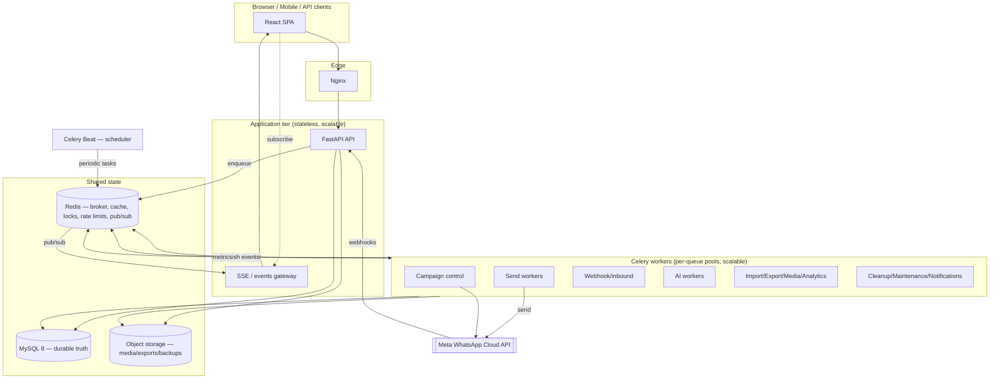

**Reading it:** the API only *enqueues* + persists intent; **workers** own the heavy work; **Redis** is the
broker + real-time bus + rate-limit/lock store; **MySQL** is the durable source of truth; **Beat** injects
scheduled work; **workers publish domain events** that fan out to the UI via SSE (Doc 4 §24).

### 1.4 Message lifecycle (outbound) — overview
```
intent (API)  →  enqueue  →  eligibility+render (worker)  →  rate-limit gate  →  Meta send
   → wamid persisted (messages)  →  status webhooks (sent→delivered→read | failed)
   → status applied idempotently (message_status_history, counters)  →  UI updated via SSE
```
Every transition is **durable** (MySQL) and **idempotent**; a failure at any step is retried or dead-lettered
without producing a duplicate customer message (§6, §8).

### 1.5 Responsibilities (separation of concerns)
- **API:** validate, authorize, persist intent, enqueue, return fast. Never calls Meta for bulk work.
- **Broker (Redis):** transport tasks, hold rate-limit/lock/progress keys, carry the real-time bus.
- **Workers:** execute one bounded unit of work idempotently; update durable state; emit events/metrics.
- **Beat:** translate schedules (`campaign_schedules`) and system cadences into enqueued tasks.
- **MySQL:** the ledger of truth for every message, campaign, and job.

### 1.6 Design decisions (overview level)
- **Control plane vs data plane split** for campaigns (orchestration is separate from per-message sends) —
  a single stuck campaign never blocks unrelated sends. *(Detail §4, decision D2.)*
- **Transactional sends outrank bulk sends** — agent replies and single sends use a higher-priority queue so
  they are never stuck behind a million-recipient campaign. *(Decision D3.)*
- **Persist-first webhooks** — the API stores the raw event and acks `200` before processing. *(§11, D9.)*
- **At-least-once + idempotency = effectively-once** — `acks_late` redelivery is safe because the data layer
  rejects duplicates. *(§8, D5.)*

### 1.7 Trade-offs, failure, scaling, performance, future — at a glance
- **Trade-off:** more queues/pools = more operational surface, but far better isolation and scaling control.
- **Failure handling:** every async unit has a retry policy and a failure destination (§2, §6, §7).
- **Scaling:** workers are **stateless**; add worker replicas per hot queue independently (§16).
- **Performance:** the API never blocks on Meta or fan-out; throughput is bounded only by Meta limits and
  worker count (§14).
- **Future:** the same fabric absorbs new channels and modules by adding queues/tasks, not redesigning (§17).

---

## 2. Queue Taxonomy

### 2.1 Purpose & philosophy
Queues are **isolation and prioritization boundaries**, not just task lists. We separate work so that:
(a) a slow/failing class of work can't starve another, (b) each class scales independently, (c) priorities
reflect *user-perceived urgency* (an agent's reply > a bulk marketing send > a nightly cleanup), and
(d) each class has a tailored retry/timeout/idempotency policy. **Every queue exists for a stated reason.**

### 2.2 The queue map

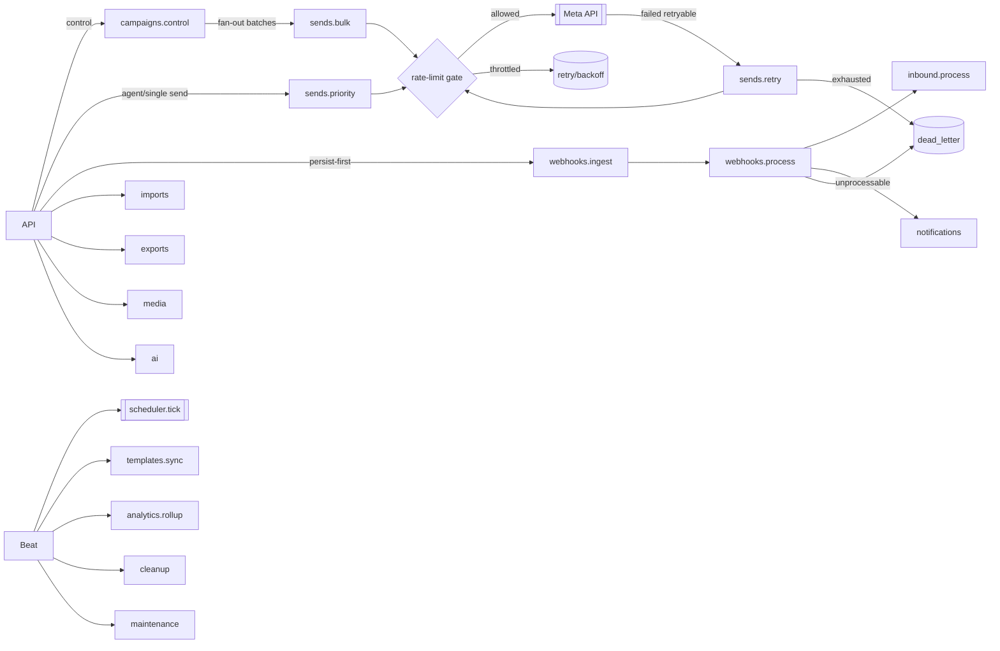

### 2.3 Master queue specification
Priority `P0` = highest (control/urgent) … `P4` = lowest (background). "Idempotency key" = the stable key
that makes the task safe to re-run. "Failure dest." = where work goes after retries are exhausted.

| Queue | Purpose (why it exists) | Prio | Concurrency model | Worker pool | Retry policy | Soft/Hard timeout | Idempotency key | Failure dest. | Key metrics |
|---|---|---|---|---|---|---|---|---|---|
| `campaigns.control` | Orchestrate campaigns: resolve audience, create batches, dispatch, pause/resume/cancel. Small count, must be responsive. | P0 | Low concurrency, singleton-per-campaign (lock) | Control pool | 5×, backoff; control tasks are idempotent (re-derive from DB) | 60s / 120s | `campaign_id`+phase | park + alert | in-flight campaigns, fan-out lag |
| `sends.priority` | Transactional/agent sends: inbox replies, single `/messages/send`, batch (≤10k). User is waiting. | P1 | High, sharded by number | Send pool (priority) | Smart retry (§6) | 15s / 30s | `message_uuid` / recipient id | `sends.retry` → DLQ | p95 send latency, throughput |
| `sends.bulk` | Campaign per-recipient sends (millions). Throughput-oriented, must not starve P1. | P2 | Very high, sharded by number | Send pool (bulk) | Smart retry (§6) | 15s / 30s | `campaign_recipient_id` (+wamid) | `sends.retry` → DLQ | send rate/number, backlog |
| `sends.retry` | Delayed re-attempt of retryable failures with backoff. Separated so retries don't inflate primary latency. | P2 | Medium, ETA/eta-delay | Send pool | Bounded attempts (§6) | 15s / 30s | recipient id + attempt | DLQ | retry depth, exhaustion rate |
| `webhooks.ingest` | Turn persisted `webhook_events` rows into processing tasks quickly (decouple from HTTP ack). | P1 | High | Webhook pool | 5×, backoff | 10s / 20s | `webhook_event_id` | `webhooks.process` DLQ | ingest lag |
| `webhooks.process` | Apply status callbacks + route inbound; update ledger/counters idempotently. | P1 | High, sharded by conversation/number | Webhook pool | 5×, backoff | 15s / 30s | `event_id`/`wamid`+status | `webhook_dead_letter` | processing lag, dup rate |
| `inbound.process` | Higher-level handling of inbound messages: conversation upsert, active-detection, auto-reply rules, notifications. | P1 | High, sharded by conversation | Webhook pool | 5×, backoff | 20s / 40s | inbound `wamid` | DLQ | inbound→UI latency |
| `ai` | AI generation, summarization, embeddings, KB indexing. Cost/rate-bound, longer runtimes; isolated so it never blocks sends. | P2 | Medium, provider-rate-limited | AI pool | 3×, backoff (idempotent per request id) | 60s / 180s | `ai_request_id` | park + surface | tokens, latency, error rate |
| `imports` | Chunked contact import: parse, validate, dedup, upsert. Long-running. | P3 | Low-medium, chunk parallelism | Jobs pool | Per-chunk retry; resumable | 300s / 600s per chunk | `import_id`+chunk | job=failed + error report | rows/min, failure rows |
| `exports` | Generate CSV/Excel/JSON exports (streamed). Long-running, memory-aware. | P3 | Low | Jobs pool | 3× | 300s / 600s | `export_id` | job=failed | rows/min, duration |
| `media` | Download inbound media, upload outbound to Meta, thumbnails, media-id refresh. | P2 | Medium | Jobs pool | 5×, backoff | 60s / 120s | `media_id`/sha256 | DLQ | queue depth, fetch latency |
| `templates.sync` | Sync templates + approval status from Meta (periodic + on demand). | P3 | Low, singleton-per-WABA (lock) | Maint pool | 3×, backoff | 60s / 120s | `waba_id`+run | park + alert | last sync age |
| `analytics.rollup` | Build pre-aggregated dashboards/report rollups from the ledger. | P3 | Low-medium | Maint pool | 3×, idempotent (recompute) | 120s / 300s | window+metric | park + alert | rollup lag |
| `notifications` | Dispatch in-app/email/outbound-webhook notifications. | P2 | Medium | Maint pool | 5×, backoff | 30s / 60s | notification id | DLQ | delivery lag, failures |
| `cleanup` | Retention enforcement: archive/purge per policy (dry-run capable). | P4 | Low | Maint pool | 3× | 300s / 900s | window+table | park | rows pruned, errors |
| `maintenance` | Partition pre-creation/drop, backups, reconciliation of denormalized counters, health sweeps. | P4 | Low, singleton-per-task (lock) | Maint pool | 3×, idempotent | 300s / 900s | task+date | park + **alert** | job success, drift found |
| `scheduler.tick` | Beat-injected ticks that scan `campaign_schedules`/cadences and enqueue due work. | P0 | Singleton | Beat/Control | none (fire-and-scan; idempotent) | 30s / 60s | tick timestamp | log + alert | missed ticks |
| `default` | Small miscellaneous tasks that don't warrant a dedicated queue. | P3 | Medium | Jobs pool | 3× | 30s / 60s | task-defined | DLQ | depth |
| `dead_letter` | **Not a worker queue** — a durable store (`webhook_dead_letter` + a task-parking table) for exhausted work, with inspection/replay (§7). | — | — | — | — | — | source id | — | DLQ size, age |

> **Future queues** (reserved, added without redesign — §17): `channels.instagram.send`,
> `channels.messenger.send`, `sms.send`, `email.send`, `automation.run` (flow engine),
> `crm.sync`. They follow the **same shape** as `sends.*` (rate-gated, idempotent, retried, DLQ'd), so the
> taxonomy grows by adding rows, not by re-architecting.

### 2.4 Per-attribute design rationale
- **Priority** encodes user-perceived urgency: **control (P0)** keeps campaigns steerable even under load;
  **agent/transactional (P1)** protects the human-in-the-loop experience; **bulk (P2)** yields to P1;
  **background (P3/P4)** never competes with live traffic. Redis priority is approximated with **separate
  queues consumed by prioritized workers** (Redis has no true priority within a list — decision D4).
- **Concurrency & sharding:** send queues are **sharded by phone number** so per-number MPS limits are
  enforced locally and one number's throttling doesn't stall others (§5).
- **Idempotency key** is chosen so a redelivered task is a **no-op if already applied** (recipient id, wamid,
  event id) — the backbone of zero-duplication (§8).
- **Failure destination** is explicit for every queue: retryable → `sends.retry`; exhausted/unprocessable →
  **DLQ**; singleton maintenance failures → **park + alert** (never silently dropped).
- **Timeouts** are twofold: a **soft** timeout (raises inside the task for graceful cleanup) and a **hard**
  timeout (kills a stuck task) — so a hung Meta call or bad chunk can't pin a worker forever.

### 2.5 Failure handling / scaling / performance / future (queue layer)
- **Failure:** no queue can "swallow" work — retries are bounded and terminate in a DLQ or a parked+alerted
  state that an operator sees on the Queue Monitor (Doc 5 B11.8).
- **Scaling:** each queue maps to an independently-scalable worker pool; hot queues (`sends.bulk`,
  `webhooks.process`) scale horizontally without touching others (§16).
- **Performance:** isolation guarantees tail-latency protection — a 1M-recipient campaign on `sends.bulk`
  cannot degrade agent reply latency on `sends.priority`.
- **Future:** new work classes = new queues + pools; the control plane, rate gate, retry engine, and DLQ are
  **generic** and reused unchanged.

---

## 3. Worker Architecture

### 3.1 Purpose
Workers are the compute that drains queues. The architecture must isolate work classes, scale each
independently, recover from crashes without losing or duplicating work, and shut down without cutting a
task in half.

### 3.2 Dedicated vs shared worker pools
We run **pools mapped to work classes**, not one giant undifferentiated pool:

| Pool | Consumes | Concurrency model | Why dedicated |
|---|---|---|---|
| **Control pool** | `campaigns.control`, `scheduler.tick` | Low concurrency, mostly I/O to DB | Orchestration must stay responsive; never blocked by sends |
| **Send-priority pool** | `sends.priority` | High, I/O-bound (async HTTP to Meta) | Protects agent/transactional latency |
| **Send-bulk pool** | `sends.bulk`, `sends.retry` | Very high, I/O-bound | Throughput plane; scales out horizontally |
| **Webhook pool** | `webhooks.ingest/process`, `inbound.process` | High, I/O-bound | Real-time inbound must keep up with Meta firehose |
| **AI pool** | `ai` | Medium, provider-rate-limited | Long, costly tasks isolated so they never block sends |
| **Jobs pool** | `imports`, `exports`, `media`, `default` | Low–medium, some CPU (parsing) | Long-running jobs isolated from latency-sensitive work |
| **Maintenance pool** | `templates.sync`, `analytics.rollup`, `notifications`, `cleanup`, `maintenance` | Low | Background cadence; lowest priority |

**Decision (D6):** send work is **I/O-bound** (waiting on Meta), so send pools use **high concurrency per
process** (async or greenlet/thread execution) rather than many CPU processes — one process can hold
hundreds of in-flight HTTP sends cheaply. Parsing-heavy jobs (imports) use **process-based** concurrency to
use multiple cores and isolate memory.

### 3.3 Autoscaling philosophy
- **Scale the bottleneck, not everything.** Autoscaling signals are **per-queue backlog + oldest-message
  age + throughput vs. target** (from `monitoring_metrics`), not just CPU.
- **Send pools scale to saturate Meta limits, then stop** — beyond the aggregate messaging tier/MPS,
  more workers add no throughput (they'd just wait at the rate gate). The scaler is **limit-aware**.
- **Independent policies per pool:** webhook pool scales on ingest lag; jobs pool on queued imports/exports;
  AI pool is capped by provider limits + cost budget.
- **Scale-in is graceful** (drain first, §3.5). Min replicas keep latency-sensitive pools warm; background
  pools can scale to a small floor.

### 3.4 Worker lifecycle & startup
1. **Startup:** load config from environment (Doc 7), open pooled DB + Redis connections, register the pool's
   queues, run a **readiness self-check** (DB reachable, Redis reachable) before accepting tasks; register
   in a worker registry (Redis) with a heartbeat.
2. **Warm:** prefetch is **bounded** (`prefetch multiplier = 1` for long/send tasks) so a worker never hoards
   messages it can't promptly process — critical for even load distribution and fast rebalancing (D7).
3. **Running:** each task is wrapped with: idempotency guard, structured logging (request/trace id), metrics
   emission (start/stop/duration/outcome), and a `job_metadata` upsert for durable job state.

### 3.5 Graceful shutdown (zero cut tasks)
- On `SIGTERM` (deploy/scale-in): **stop consuming new tasks**, finish in-flight tasks up to a drain
  deadline, then exit. Tasks use **`acks_late`** so anything still running at a hard stop is **redelivered**
  to another worker (safe because idempotent — §8).
- **Deploy strategy:** rolling — new workers come up ready before old ones drain (Doc 7), so throughput
  doesn't dip and no task is orphaned.

### 3.6 Heartbeat, health & replacement
- **Heartbeat:** each worker writes a heartbeat (Redis key with TTL) + liveness/readiness signals.
- **Health:** unhealthy = missed heartbeats, event-loop/pool stalls, rising task failure rate, or DB/Redis
  connection loss. Surfaced on **Queue Monitor / System Health** (Doc 5 B11.8/B11.9; Doc 1 FR-MON-02).
- **Replacement:** an unresponsive worker's lease expires; the orchestrator (Doc 7) replaces it; its
  un-acked tasks (from `acks_late`) are redelivered. **Poison-task protection:** a task that repeatedly kills
  its worker (hard-timeout/OOM) is capped by max-retries and routed to the DLQ so it can't crash-loop the
  pool (D8).
- **Concurrency safety:** singleton tasks (campaign control, template sync, maintenance) hold a **distributed
  lock** (§9) so a replacement worker never runs a second copy.

### 3.7 Trade-offs / failure / scaling / performance / future
- **Trade-off:** multiple pools add ops overhead vs. one pool — accepted for isolation and independent
  scaling. **Failure:** `acks_late` + idempotency turns crashes into safe redeliveries. **Scaling:**
  stateless workers scale per pool (§16). **Performance:** bounded prefetch + I/O concurrency maximizes send
  throughput per core. **Future:** a new channel adds a new pool of the same shape.

---

## 4. Campaign Send Pipeline

### 4.1 Purpose
Turn "send campaign X" into millions of **compliant, rate-limited, idempotent, trackable** messages — with
live progress, safe pause/resume, and crash recovery — without ever blocking the API or duplicating a send.

### 4.2 Architecture: control plane → data plane
- **Control plane** (`campaigns.control`, one logical orchestrator per campaign, lock-guarded): resolves the
  audience, snapshots recipients into `campaign_recipients`, splits them into **batches**
  (`campaign_batches`), and dispatches batch tasks. It **owns state transitions** (queued→running→paused→
  completed) and reconciles counters.
- **Data plane** (`sends.bulk` / `sends.priority`): each task sends **one message** (or a small micro-batch)
  through the rate gate to Meta, records the `wamid` on `messages` + `campaign_recipients`, and emits
  progress. Data-plane tasks are **stateless and idempotent**.

**Why split:** orchestration is low-volume and stateful; sending is high-volume and stateless. Splitting
lets sends scale to millions while control stays simple and responsive, and lets **pause/cancel** act on the
control plane instantly (stop dispatching) while in-flight sends drain safely.

### 4.3 End-to-end sequence (each stage explained)
1. **Trigger** — `POST /campaigns/{id}/send|schedule` (Doc 4) validates + persists intent, sets status
   `queued`, enqueues a control task (with `Idempotency-Key`).
2. **Segment resolution** — control task materializes the audience: evaluate the segment/tags/list/upload
   into a concrete contact set (Doc 3 §6.4). Done **once**, snapshotted, so a dynamic segment can't shift
   mid-send.
3. **Recipient expansion** — write one `campaign_recipients` row per contact (status `pending`) in batches;
   this is the **durable checkpoint ledger** (Doc 3 §8.3). Large audiences are inserted in chunks.
4. **Eligibility validation** (per recipient, before send): **opt-in verified** (Doc 1 CMP-02) → opted-out
   marked `skipped`; **valid WhatsApp id**; **not already sent** (idempotency check).
5. **24-hour window / category check** — marketing templates always allowed to opted-in contacts; the window
   rule is enforced for any non-template path (Doc 1 FR-WA-12). Ineligible → `skipped` with reason.
6. **Template validation** — the chosen template must be `approved` for the WABA/language (Doc 3 §7.1);
   otherwise the campaign is blocked at launch (control-plane guard) — never a per-message surprise.
7. **Variable rendering** — resolve `{{n}}` from the mapped contact fields/attributes per recipient
   (`variables_json`); missing-required → recipient `failed(render)` (surfaced pre-send in the wizard, Doc 5
   B4.2).
8. **Media preparation** — ensure the header media has a valid, cached Meta media id; refresh if expired
   (`media` queue) — done once per campaign asset, reused across recipients (Doc 1 FR-MED-07).
9. **Rate limiting** — the send task passes through the **per-number rate gate** (§5): a distributed token
   bucket enforcing the number's **MPS** and rolling-24h **tier cap**. Throttled tasks are delayed (backoff),
   not dropped.
10. **Queue placement** — eligible, rendered sends are dispatched to `sends.bulk` (campaign) or
    `sends.priority` (agent/single), sharded by number.
11. **Meta API send** — the worker calls Meta; on success it records `wamid`, sets recipient `sent`,
    increments counters; on failure it classifies the error (§6) → retry or terminal.
12. **Status updates** — Meta returns async **status webhooks** (`sent→delivered→read` or `failed`) which the
    webhook pipeline (§11) applies **idempotently** to `message_status_history` + `messages.status` +
    campaign counters.
13. **Delivery tracking** — the campaign's denormalized counters (Doc 3 §8.1) update live; the UI receives
    `campaign.progress` events via SSE (Doc 4 §24).
14. **Completion** — when every recipient is terminal (sent-or-skipped-or-failed and no pending retries), the
    control task sets `completed`, finalizes counters + actual cost, emits `campaign.finished`, and (for
    recurring) computes the next run (§10).

### 4.4 Sequence diagram
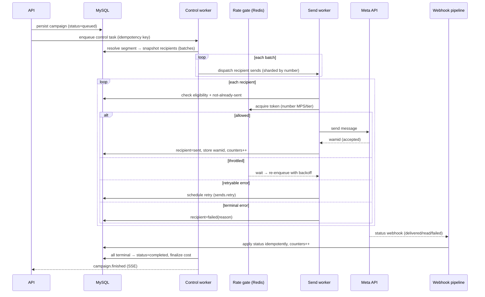

### 4.5 Pause / Resume / Cancel (control-plane semantics)
- **Pause:** control sets status `paused` and **stops dispatching** new batches; in-flight sends finish
  (they're idempotent). No new tokens are consumed. Instant, safe.
- **Resume:** control resumes dispatch from the **next pending batch** (checkpoint, §8) — already-sent
  recipients are skipped by the idempotency check. Zero duplicates.
- **Cancel:** status `cancelled`; pending recipients marked `cancelled`; in-flight drain. Terminal.
- All three are **idempotent** control operations guarded by the campaign lock (§9).

### 4.6 Trade-offs / failure / scaling / performance / future
- **Trade-off:** snapshotting recipients up front costs storage but guarantees a **stable, resumable,
  auditable** audience (vs. re-evaluating a moving segment). **Failure:** any crash resumes from the ledger
  (§8). **Scaling:** sends scale by adding send-pool replicas up to Meta limits (§5, §16). **Performance:**
  counters are O(1); recipient writes are chunked; the API is never in the send path. **Future:** the same
  pipeline drives any channel — only the "Meta send" step is channel-specific (§17).

---

## 5. Tier-aware Sending

### 5.1 Purpose
Send as fast as possible **without ever exceeding Meta's per-number limits or harming quality** — because
exceeding limits or sending to unengaged users causes throttling, quality drops (GREEN→YELLOW→RED), and
ultimately number suspension. Throughput is a **managed resource**, not a free-for-all.

### 5.2 The constraints we respect
- **Messaging tier** — unique customers reachable per rolling 24h (1K / 10K / 100K / Unlimited), per number
  (Doc 3 `phone_numbers.messaging_tier`).
- **MPS** — messages/second throughput ceiling per number (`mps_limit`, default ~80).
- **Quality rating** — GREEN/YELLOW/RED; low quality caps/relegates a number.
- **Business-level throughput** — aggregate limits across numbers.

### 5.3 Architecture: the per-number rate gate
- A **distributed token bucket in Redis** per number enforces **MPS** (refill = mps_limit tokens/second),
  and a **rolling-24h unique-recipient counter** enforces the **tier cap**. Every send worker (across all
  machines) acquires a token before calling Meta, so the *collective* fleet honors the number's limit
  regardless of worker count (D10).
- **Sharding by number:** send tasks are partitioned per number so each bucket is contended by a bounded set
  of workers; numbers are independent lanes.
- **Adaptive pacing:** the effective send rate = `min(mps_limit, quality-derived pacing, remaining-tier-
  budget/time-left)`. Campaigns can set a lower `send_rate_mps` to protect quality (Doc 1 FR-CAM-13).

### 5.4 Tier upgrades / downgrades & quality reactions
- **Upgrade** (e.g., 10K→100K): detected via number sync/webhook; the gate's tier budget widens
  automatically — no code change, campaigns simply flow faster.
- **Downgrade / quality drop:** on YELLOW, pacing is **automatically reduced** (safety margin); on **RED**,
  the platform **pauses marketing sends** on that number and **alerts** (Doc 1 CMP-06, Doc 5 B11.5) — protecting
  the asset. Utility/service traffic policy is configurable.
- **Approaching the 24h cap:** the gate slows and then **holds** further unique-recipient sends until the
  rolling window frees budget; the campaign isn't failed — it **paces across the window**.

### 5.5 Multiple numbers: load distribution, balancing, traffic shifting
- **Load distribution:** a campaign may be configured to send from **one** number (default, for consistent
  sender identity) or **spread across several eligible numbers** for higher aggregate throughput.
- **Balancing:** when spreading, recipients are distributed to numbers by **available budget** (tier
  remaining + MPS headroom + quality), not round-robin — a GREEN, under-utilized number gets more.
- **Traffic shifting:** if a number degrades (YELLOW/RED) or nears its cap mid-campaign, the balancer
  **shifts new recipients to healthier numbers** automatically (already-sent recipients are untouched).
- **Queue balancing:** because send queues are sharded per number, shifting traffic = redistributing
  dispatch across number lanes; no queue is a global bottleneck.

### 5.6 Trade-offs / failure / scaling / performance / future
- **Trade-off:** the rate gate adds a Redis round-trip per send — negligible vs. a Meta call, and essential
  for compliance. **Failure:** if Redis is briefly unavailable, the gate **fails safe to conservative local
  pacing** rather than blasting Meta (D11). **Scaling:** more numbers = more parallel lanes = more aggregate
  throughput; workers scale until the sum of number budgets is saturated. **Performance:** the gate is O(1)
  Redis ops. **Future:** other channels plug in with their own per-sender rate buckets, same mechanism.

---

## 6. Smart Retry Engine

### 6.1 Purpose & philosophy
Retries exist to survive **transient** failures (network blips, Meta 5xx, throttling) **without** wasting
effort on **permanent** failures (invalid number, opt-out, rejected template) and **without** ever creating
a duplicate. The engine's core rule: **retry only what can succeed on retry, back off politely, cap
attempts, and terminate everything else cleanly.**

### 6.2 Error classification (the heart of "smart")
Every failure is classified from the Meta error code / HTTP status into a **class**, and each class has a
strategy:

| Failure | Class | Strategy | Max attempts | Notes |
|---|---|---|---|---|
| `429` / rate-limited / throughput | **Throttle** | Back off **and reduce send pacing** for that number (feed the rate gate); re-queue to `sends.retry` | high (doesn't count as a "failure") | Signals we're pushing too hard (§5) |
| `5xx` / Meta server error | **Transient** | Exponential backoff + jitter | 5 | Meta-side; usually clears |
| Network timeout / connection reset | **Transient** | Backoff + jitter | 5 | Also trips circuit breaker if sustained |
| Temporary Meta errors (e.g., transient re-engagement/limits) | **Transient-Meta** | Backoff, longer base | 4 | Per Meta error semantics |
| Permanent Meta error (bad request, unsupported) | **Terminal** | No retry → recipient `failed` + code | 0 | Fix is data/template, not retry |
| Invalid / non-WhatsApp number | **Terminal-data** | No retry → `failed(invalid_number)`; flag contact | 0 | Suppress future sends to it |
| Opt-out / user blocked | **Terminal-policy** | No retry → `skipped/failed`; **mark contact opted-out** (Doc 1 CMP-03) | 0 | Compliance action, not a retry |
| Template paused/rejected/disabled | **Terminal-config** | No retry → **pause the campaign** + alert | 0 | Whole-campaign blocker, not per-message |
| Media fetch/upload failure | **Transient-media** | Retry media prep (`media` queue), then the send | 3 | Refresh expired media id |
| Webhook processing failure | **Transient-proc** | Backoff; then DLQ (§7) | 5 | Never lose an event |

### 6.3 Backoff, jitter, caps
- **Exponential backoff with full jitter** (e.g., base × 2^attempt, randomized) so retries don't
  synchronize into thundering herds after a Meta hiccup.
- **Per-class base and cap** (throttle backs off gently and keeps trying; transient uses a moderate curve;
  the overall retry horizon is bounded, e.g., minutes-to-hours, never indefinite).
- **Durable retry state:** retries are recorded in `campaign_retry_queue` (Doc 3 §8.4) with `attempt` and
  `next_attempt_at`, so retry scheduling survives a Redis flush or restart (not just an in-memory ETA).

### 6.4 Circuit breaker
- **Per dependency + per number:** if Meta (or a specific number) returns sustained errors/timeouts beyond a
  threshold, the breaker **opens** — sends for that scope pause briefly rather than hammering a failing
  endpoint (protecting quality and avoiding wasted work).
- **Half-open probes:** after a cool-down, a few probe sends test recovery; success **closes** the breaker
  and resumes normal flow; failure re-opens with a longer cool-down.
- **Scope isolation:** a breaker open on number A doesn't stop number B; a Meta-wide breaker pauses all sends
  and surfaces a System Health alert (Doc 5 B11.9).

### 6.5 Retry exhaustion → terminal
- When attempts are exhausted, the recipient is set `failed` with the **final error code** (for failure
  analytics, Doc 1 FR-AN-07), the campaign counters update, and the item is **removed from the retry queue**.
- Send-side exhaustion does **not** go to the message DLQ (the outcome is a legitimate `failed` recipient we
  can report and re-target); **only unclassifiable/poison tasks and webhook-processing failures go to the
  DLQ** (§7). This keeps the DLQ meaningful (things needing human attention) rather than a dump of ordinary
  delivery failures.

### 6.6 Trade-offs / failure / scaling / performance / future
- **Trade-off:** rich classification needs an up-to-date **error-code map** (versioned, updatable without a
  deploy — decision D12) vs. a naive "retry everything." **Failure:** exhaustion is always terminal + visible.
  **Scaling:** `sends.retry` scales with the send pool; backoff+jitter prevents retry storms. **Performance:**
  classification is a cheap lookup. **Future:** new channels register their own error maps into the same
  engine.

---

## 7. Dead Letter Queue (DLQ)

### 7.1 Purpose
A **durable holding area for work that could not be processed** after exhausting retries — so nothing is
ever silently lost, root causes can be investigated, and items can be **replayed** once the cause is fixed
(Doc 1 FR-WA-08). The DLQ is for **exceptional** work needing human attention, not ordinary delivery
failures (§6.5).

### 7.2 What lands in the DLQ
- **Webhook processing** that failed after retries → `webhook_dead_letter` (Doc 3 §9.4).
- **Poison tasks** that repeatedly crash a worker (hard-timeout/OOM/unhandled) → a parked task record with the
  payload, error, and stack.
- **Notification/media/maintenance** tasks that exhausted retries with an unexpected error.

### 7.3 Architecture
- **Durable in MySQL** (`webhook_dead_letter` + a general `dead_letter`/parked-task table) — not a Redis list —
  so DLQ contents survive restarts and are queryable (Doc 1 NFR-DR-06). Each entry stores the **original
  payload**, error detail, attempt count, source queue/task, and timestamps.
- **Operator surface:** the Webhook Status / Queue Monitor screens (Doc 5 B11.7/B11.8) expose the DLQ.

### 7.4 Capabilities
- **Inspection:** open any entry to see payload + error + attempt history + correlation/request id.
- **Filtering:** by source queue/type, error class/code, date, number/WABA.
- **Replay:** single-item replay routes the payload back through the **same idempotent processor** — a replay
  that was actually already applied is a safe no-op (§8). Manual replay is audited (Doc 4 §23.1).
- **Bulk replay:** filter → replay-matching as an async job following the partial-success standard (Doc 4 §29).
- **Discard:** explicitly drop an entry (audited) when it's known-bad.
- **Root-cause analysis:** entries are grouped by **fingerprint** (error class + shape) so a spike shows one
  root cause, not thousands of rows; links to related `error_logs` (Doc 3 §11.3).
- **Audit:** every replay/discard writes an `audit_logs` row (actor, item, outcome).

### 7.5 Retention & policy
- DLQ entries retained per policy (e.g., webhook DLQ **180 days**, Doc 4 §23.1); beyond retention → recovery
  from backup only. Alerts fire on DLQ **size/age thresholds** (a growing DLQ is an incident signal).

### 7.6 Trade-offs / failure / scaling / performance / future
- **Trade-off:** DB-backed DLQ is slightly heavier than a Redis list but **durable and queryable** — the right
  call for auditability. **Failure:** the DLQ is the *last* safety net; if even the DLQ write fails, the raw
  event still exists in `webhook_events`/logs. **Scaling:** DLQ is low-volume by design. **Future:** any new
  queue points its "failure destination" at the same DLQ machinery.

---

## 8. Checkpoint & Resume

### 8.1 Purpose
Guarantee that **any interruption** — worker crash, machine reboot, deployment, or a full Redis loss —
resumes campaigns and jobs **exactly where they stopped, with zero duplicate messages** (Doc 1 FR-CAM-09,
NFR-DR-05/06/07).

### 8.2 The checkpoint model (durable in MySQL)
Redis holds *in-flight* task transport; **truth lives in MySQL**:
- **`campaign_recipients`** — one row per recipient with a **status** (`pending→queued→sent→delivered/read/
  failed/skipped/cancelled`) and `wamid`. This is the fine-grained checkpoint: what's done, what's left.
- **`campaign_batches`** — batch-level progress (`pending/in_progress/done`) — the coarse checkpoint the
  control plane resumes from.
- **`job_metadata`** — durable state for imports/exports/other jobs (processed/total, status).

### 8.3 Checkpoint frequency
- **Per-batch** for the control plane (a batch flips to `done` when all its recipients are terminal) — cheap
  and sufficient to resume within one batch.
- **Per-recipient** for the data plane (each send updates its recipient row) — the finest granularity, so at
  most the currently in-flight sends are re-attempted on resume (and those are idempotent).
- Checkpointing is a **side effect of doing the work** (updating the recipient/batch you just processed), not
  a separate expensive snapshot — so it adds no extra pass.

### 8.4 Recovery scenarios
| Event | What happens | Duplicates? |
|---|---|---|
| **Worker crash** | `acks_late` → the in-flight task is redelivered to another worker; idempotency check sees the recipient may already be `sent` → no-op or completes | **None** |
| **Machine reboot** | Same as worker crash for its tasks; control task (lock-guarded) is re-acquired by a healthy control worker and resumes from `campaign_batches` | **None** |
| **Deployment restart** | Graceful drain (§3.5); anything not drained is redelivered post-deploy; resume from checkpoints | **None** |
| **Redis loss / flush** | Transport + rate-gate + progress cache are gone, **but** `campaign_recipients`/`batches` are intact → a **reconciliation task** re-enqueues pending/queued recipients; already-sent are skipped | **None** |
| **Long outage** | On recovery, control re-scans campaigns in non-terminal states and re-dispatches remaining work; rate gate re-warms | **None** |

### 8.5 Resume without duplicates — the mechanism
Three overlapping guarantees make duplication impossible:
1. **Idempotency check before send** — a recipient already `sent` (has a `wamid`) is skipped.
2. **MySQL unique constraint** on `(campaign_id, contact_id, …)` and on `wamid` (Doc 3 §8.3) — even a race
   can't insert a second send row.
3. **Idempotency key on the Meta call** — a resend carries a stable key so the same logical message isn't
   duplicated at the boundary.
Together: **at-least-once delivery + idempotent application = effectively-once** (D5).

### 8.6 Idempotent continuation
Resume is not a special code path — it is the **normal** path re-run: the control plane always "dispatch the
next pending batch," the send task always "send this recipient **if not already sent**." Because every task
is idempotent, replay/redelivery/resume are all just safe re-execution.

### 8.7 Trade-offs / failure / scaling / performance / future
- **Trade-off:** per-recipient rows cost storage (100M+ rows, partitioned — Doc 3) but buy exact resumability
  and analytics. **Failure:** covered above for every interruption class. **Scaling:** resume work is just
  normal queue work, scales with the send pool. **Performance:** checkpoints piggyback on existing writes.
  **Future:** the same recipient-ledger model works for any channel's fan-out.

---

## 9. Distributed Locking

### 9.1 Purpose
Prevent **concurrent duplicate execution** of operations that must run **once at a time** — e.g., two workers
both orchestrating the same campaign, syncing the same WABA's templates, or importing the same file — across
a fleet of stateless workers on multiple machines.

### 9.2 Architecture: Redis locks (with correctness guarantees)
- **Lock primitive:** a Redis lock keyed by the resource, acquired with a **unique fence token** and a
  **TTL**; released only by the holder (compare-token-then-delete) so a slow worker can't release another's
  lock. This is the standard safe single-instance Redis lock; a Redlock-style multi-node variant is available
  if Redis is clustered (§16).
- **Fencing:** the fence token is checked at the point of a critical write so a lock that expired mid-work
  (holder stalled) cannot cause a stale write to win over a newer holder — defense in depth beyond the lock.
- **Lease renewal (watchdog):** long operations periodically **extend** the TTL while healthy, so the lock
  lasts as long as real work is progressing but auto-expires if the holder dies.

### 9.3 What we lock (and why)
| Lock | Scope | Why |
|---|---|---|
| **Campaign lock** | per `campaign_id` | One orchestrator per campaign; makes pause/resume/cancel and dispatch race-free |
| **Conversation lock** | per `conversation_id` | Serialize inbound/status application + outbound so a thread's state is consistent (no interleaved status regressions) |
| **Import lock** | per `import_id` (or file hash) | Prevent double-processing the same upload |
| **Template sync lock** | per `waba_id` | One sync per WABA at a time (avoid Meta rate abuse + conflicting writes) |
| **Maintenance/singleton lock** | per periodic task | Ensure partition/backup/rollup tasks run once even if Beat double-fires |

### 9.4 Duplicate prevention layering
Locks prevent **concurrent** duplication; **idempotency + DB constraints** prevent **sequential/redelivery**
duplication (§8). We rely on **both** — a lock is a performance/correctness optimization, but the system is
**still correct if a lock is lost** (expired early) because the data layer is the ultimate guard (D13). This
"don't trust the lock alone" stance is what makes zero-duplication robust.

### 9.5 Expiration & recovery
- Every lock has a TTL, so a dead holder's lock **auto-releases** — no permanent deadlock.
- On acquire failure, the task either **defers** (re-queues with backoff) or **no-ops** (if another holder is
  clearly handling it) — never busy-waits.
- If a lock expires mid-work, fencing + idempotency ensure the takeover is safe.

### 9.6 Trade-offs / failure / scaling / performance / future
- **Trade-off:** locks add coordination latency and a Redis dependency; mitigated by short critical sections
  and the data-layer safety net. **Failure:** lock loss degrades to "possible duplicate attempt," which the
  DB rejects — no duplicate effect. **Scaling:** single-Redis locks suffice at target scale; Redlock/cluster
  path documented for later (§16). **Performance:** locks are O(1) Redis ops on hot paths only. **Future:**
  new singletons (e.g., a channel sync) reuse the same lock service.

---

## 10. Scheduler Design

### 10.1 Purpose
Fire time-based work reliably: scheduled and recurring campaigns, and system cadences (rollups, cleanup,
partition maintenance, backups, health sweeps, template sync) — timezone-correct, resilient to downtime, and
**exactly once per intended fire**.

### 10.2 Architecture: Beat + DB-backed schedule
- **Celery Beat** is the single ticker. It runs as a **singleton** (only one Beat instance active; guarded by
  a leader lock, §9) so schedules aren't double-fired.
- **Beat does not embed the business schedule.** It fires a lightweight **`scheduler.tick`** on a short
  cadence (e.g., every minute) plus fixed system cadences. The tick **scans the database** (`campaign_
  schedules`, Doc 3 §8.2) for anything **due** and enqueues the corresponding control task. This "**DB is the
  schedule, Beat is the heartbeat**" design (D14) means schedules are created/edited/paused via the API at
  runtime (Doc 4 `/campaigns/{id}/schedule`) with **no redeploy**, and survive restarts.
- **Due detection** uses each schedule's precomputed `next_run_at` (indexed) so the scan is O(due-rows), not
  a full table scan.

### 10.3 Recurring, one-time, cron
- **One-time:** `run_at` (UTC) — fired once when `now ≥ run_at`, then the schedule is marked complete.
- **Recurring:** a **cron expression** + timezone; after each fire, `next_run_at` is recomputed from the cron
  in the schedule's timezone. A friendly builder in the UI (Doc 5 B4.2) produces the cron.
- **Drip sequences** are modeled as a series of scheduled steps relative to enrollment (same mechanism).

### 10.4 Timezone & holiday handling
- **Timezones:** schedules store an **IANA timezone**; `next_run_at` is computed in that zone and stored as
  UTC — so "every weekday 10:00 in Asia/Kolkata" is correct across DST and server-tz changes (data is UTC,
  interpretation is tz-aware; Doc 3 §1.3).
- **Holiday / send-window rules (configurable):** optional org rules can **skip** or **shift** a fire that
  lands on a blackout date or outside allowed send hours (respecting recipient-friendly windows and local
  regulations). This is a policy layer on top of the cron, not a redesign.

### 10.5 Pause / resume / missed executions
- **Pause:** `is_active=false` — the tick skips it; no fires accrue.
- **Resume:** re-activate; `next_run_at` is recomputed **forward from now** (we don't retroactively fire every
  missed occurrence).
- **Missed executions (Beat/worker downtime):** on recovery the tick sees `next_run_at` in the past. Policy
  (D15): for **recurring** schedules, **fire once** to catch up then realign to the next slot (avoid a
  "thundering catch-up" of many missed fires); for **one-time** schedules, fire if still within a **grace
  window**, else mark **missed** + alert (sending a day-late marketing blast is worse than skipping). The
  policy is explicit and configurable, never accidental.

### 10.6 System cadences (also via Beat)
Partition pre-create/drop (Doc 3 §14), analytics rollups, retention cleanup, backups + verification
(Doc 1 NFR-DR), counter reconciliation, template sync, number-health refresh, DLQ/age alerts — each a
singleton periodic task on the `maintenance`/`cleanup` queues.

### 10.7 Trade-offs / failure / scaling / performance / future
- **Trade-off:** the DB-scan-per-tick is slightly more work than Beat-embedded schedules, but buys **runtime
  editability + durability**. **Failure:** Beat is a singleton with a standby (leader lock) — if it dies, a
  standby takes over; missed-fire policy covers the gap. **Scaling:** the tick is tiny; the *work* it enqueues
  scales on the normal pools. **Performance:** indexed `next_run_at` keeps scans cheap. **Future:** the flow
  engine's time-based triggers reuse the same tick+DB-schedule model.

---

## 11. Webhook Processing

### 11.1 Purpose
Ingest Meta's inbound firehose (status callbacks + inbound messages) **reliably and in order enough** to keep
the ledger and inbox correct — while acking Meta in **<200 ms** so Meta never marks our endpoint unhealthy
(Meta retries non-200 for up to 7 days).

### 11.2 Architecture: persist-first, process-async
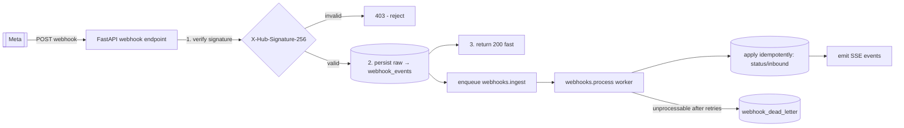
1. **Verify signature** (`X-Hub-Signature-256`, HMAC over the raw body) **before** trusting anything → invalid
   ⇒ `403` (Doc 1 security).
2. **Persist raw** to `webhook_events` (durable) — this is the only synchronous DB write.
3. **Ack `200`** immediately (<200 ms; Doc 1 FR-WA-05).
4. **Enqueue** `webhooks.ingest` → `webhooks.process` handles the real work off the request path.

### 11.3 Ordering
- **Per-conversation ordering** is what matters (not global). Processing is **sharded by conversation/number**
  and a conversation is **serialized** (conversation lock, §9) so events for one thread apply in order.
- **Monotonic status** (D16): a message's status only moves **forward** (`sent<delivered<read`; `failed` is
  terminal). A late/out-of-order `delivered` arriving after `read` is a **no-op**, so even reordered webhook
  delivery cannot corrupt state.

### 11.4 Deduplication
- Meta may deliver the same event multiple times (its retries). Dedup by **`event_id`/message id + status**
  (Doc 3 `webhook_events`, `message_status_history`); a duplicate is marked `duplicate` and **not re-applied**
  (Doc 1 FR-WA-07). Idempotent application means duplicates are harmless.

### 11.5 Replay & retries
- **Processing retries:** transient failures retry with backoff (§6); exhausted → `webhook_dead_letter`.
- **Replay:** operator/automated replay of events or DLQ entries runs through the same idempotent processor
  with the safe policy (Doc 4 §23.1) — ordered by `occurred_at`, dedup-protected, audited.

### 11.6 Failure isolation
- A bad event (unparseable, unknown type) is **isolated** — it goes to the DLQ without blocking the stream;
  the rest keep flowing. A spike in failures triggers an alert (Doc 5 B11.7) but does **not** stall ingestion,
  because ingest (persist+ack) is decoupled from process.

### 11.7 Trade-offs / failure / scaling / performance / future
- **Trade-off:** persist-first adds one sync DB write, but guarantees **no lost webhook** and a **fast ack** —
  the right trade. **Failure:** every stage has retries + DLQ; nothing is dropped. **Scaling:** the webhook
  pool scales on ingest lag; sharding by conversation keeps ordering while parallelizing across threads.
  **Performance:** ack path is O(1) insert; processing is batched where possible. **Future:** other channels'
  webhooks (IG/Messenger) land in the same ingest→process→apply pipeline with a channel tag (§17).

---

## 12. Redis Design

### 12.1 Purpose
Redis is the **fast, shared, disposable** layer that makes the async fabric work: broker, cache, rate limiter,
locks, presence, progress, and the real-time bus. **It is never the source of truth** (Doc 1 NFR-DR-06).

### 12.2 Logical separation
Distinct **logical databases / key namespaces** (and, at scale, separate Redis instances) for concerns with
different sizes, TTLs, and eviction needs (D17):

| Concern | Namespace (prefix) | Persistence / eviction |
|---|---|---|
| Broker (Celery) | `broker:*` | Durable-ish (AOF) so queued tasks survive a restart; **no eviction** |
| Result/job hints | `result:*` | Short TTL; source of truth is `job_metadata` |
| Cache | `cache:*` | LRU-evictable; rebuildable from MySQL |
| Rate limiter (per number) | `rl:number:{id}` | TTL-scoped windows; **no eviction** |
| Locks | `lock:{resource}` | TTL = lease; **no eviction** |
| Presence / typing | `presence:*` | Short TTL, volatile |
| Progress | `progress:campaign:{id}` | TTL; mirror of DB counters |
| Heartbeat / worker registry | `hb:worker:{id}` | TTL |
| Idempotency (short-window) | `idem:{key}` | 24h TTL (mirrors Doc 4 §8); DB constraints are the durable guard |
| Pub/Sub (SSE bus) | `events:*` channels | ephemeral |

### 12.3 Key naming convention
- **`{domain}:{entity}:{id}:{attr}`**, lowercase, colon-delimited, always prefixed by concern
  (e.g., `rl:number:018f...:tokens`, `lock:campaign:018f...`, `progress:campaign:018f...`,
  `cache:dashboard:{org}:{range}`). Predictable prefixes enable targeted scans, metrics, and safe flushes.

### 12.4 TTL strategy
- **Everything volatile has a TTL** — locks (lease), rate windows (window length), cache (freshness),
  presence (seconds), idempotency (24h). Nothing volatile is immortal, so a leaked key self-heals.
- **Broker & rate-limit keys are not TTL-evicted mid-use** (their loss would drop tasks / mis-meter sends) —
  they live in a **no-eviction** instance/DB.

### 12.5 Memory management & eviction policy
- **Separate instances by eviction need:** cache instance uses **`allkeys-lru`** (safe to evict — rebuildable);
  broker/locks/rate instance uses **`noeviction`** (must not drop) with capacity headroom and alerts.
- **Bounded footprint:** large data never goes in Redis (media→object storage, ledger→MySQL). Cache values are
  small and TTL'd. Progress/presence are tiny.
- **Monitoring:** Redis memory, hit rate, evictions, and latency are tracked (`monitoring_metrics`) and
  alerted (Doc 5 B11.9).

### 12.6 What Redis stores vs. never stores (recap of Doc 3 §2)
- **Stores:** broker messages, cache, rate-limit counters, locks, presence, progress mirrors, heartbeats,
  short-window idempotency, pub/sub.
- **Never stores as source of truth:** messages, campaign checkpoints, delivery logs, audit, or any data whose
  loss would be unrecoverable. A full Redis flush costs performance, **not** data (§8.4).

### 12.7 Trade-offs / failure / scaling / performance / future
- **Trade-off:** multiple Redis roles add ops surface but isolate blast radius (a cache flush can't drop
  tasks). **Failure:** cache loss = rebuild; broker loss = redelivery from durable state + reconciliation;
  rate-limit loss = fail-safe conservative pacing (§5.6). **Scaling:** roles split to separate instances, then
  Redis Cluster (§16). **Performance:** all hot-path ops are O(1). **Future:** new namespaces for new
  channels/modules; the conventions above absorb them.

---

## 13. Monitoring & Observability

### 13.1 Purpose
You cannot operate an async fabric you cannot see. Every queue, worker, task, and dependency emits metrics so
operators (and autoscalers) can detect backlog, slowness, failures, and saturation **before** they become
incidents — feeding the Queue Monitor and System Health screens (Doc 5 B11.8/B11.9; Doc 1 FR-MON-01..10).

### 13.2 What we measure
| Signal | Metric(s) | Why |
|---|---|---|
| **Queue depth** | pending count per queue | backlog / capacity |
| **Backlog age** | oldest-message age per queue | latency SLO breach detection |
| **Throughput** | tasks/sec + sends/sec (per number) | capacity vs demand, tier saturation |
| **Task duration** | p50/p95/p99 per task type | slow tasks, regressions |
| **Task outcome** | success/failure/retry rates | health, retry storms |
| **Retry depth** | `sends.retry` size, exhaustion rate | Meta/number trouble |
| **Dead letters** | DLQ size + age + fingerprints | needs-human signal |
| **Worker status** | count, liveness, active tasks, restarts | fleet health (FR-MON-02) |
| **Redis** | memory, hit rate, evictions, latency, connections | broker/cache health |
| **MySQL** | connections, slow queries, replication lag, disk | data-tier health |
| **Meta** | send latency, error-rate by code, breaker state | upstream health |
| **Webhook** | ingest lag, process lag, dup rate, DLQ | inbound pipeline health |
| **Campaign** | per-campaign progress + ETA, stalled detection | operator + FR-MON-08 |

### 13.3 Architecture
- **Emission:** workers/tasks emit metrics on start/stop/outcome; a lightweight time-series is written to
  `monitoring_metrics` (Doc 3 §11.7) for in-app charts, **and** exposed in **Prometheus** format for external
  scraping.
- **Prometheus + Grafana:** Prometheus scrapes app/worker/Redis/MySQL exporters; **Grafana dashboards** provide
  the deep operational view (queues, workers, sends, Redis, Meta). The in-app Queue Monitor covers the
  day-to-day; Grafana covers deep-dive/SRE.
- **Tracing/correlation:** every task carries a **request/trace id** (propagated from the API) so a campaign
  send can be followed API→queue→worker→Meta→webhook in logs (`system_logs`/`error_logs`, Doc 3 §11.3).
- **Live to UI:** key counters stream to the operator UI via SSE (Doc 4 §24) — no polling.

### 13.4 Alerts
- **Threshold + trend alerts:** queue backlog/age over SLO, DLQ growth, worker loss, retry-exhaustion spike,
  Redis memory/eviction, MySQL slow-query/disk, Meta error-rate/breaker-open, quality→RED, stalled campaign,
  backup failure. Routed to in-app notifications + email/webhook (Doc 5 DS-16; Doc 1 FR-ADM-07/FR-MON-10).
- **Alert hygiene:** grouped/deduped so one root cause = one alert (no storms).

### 13.5 Trade-offs / failure / scaling / performance / future
- **Trade-off:** dual sink (in-app + Prometheus) is slight duplication but serves both operators and SREs.
  **Failure:** metrics loss never affects correctness (best-effort, TTL'd). **Scaling:** Prometheus scales
  independently; in-app metrics are sampled/rolled up. **Performance:** emission is cheap/async. **Future:**
  new queues/tasks auto-appear (labeled) with no dashboard rewrite.

---

## 14. Performance Targets (concrete KPIs)

These are the async-fabric SLOs; they uphold the product targets in Doc 1 §5.1 and Doc 5 F15.

| Area | Target |
|---|---|
| **Dashboard updates (live counters)** | reflected in UI **< 2 s** after the source event (SSE) |
| **Campaign throughput** | **saturate each number's Meta tier/MPS** (e.g., ~80 msg/s per number); aggregate scales linearly with numbers + send-pool replicas; ≥ **1M-recipient** campaign paced across its window |
| **Enqueue latency (API→queued)** | **< 20 ms** added to the request |
| **Queue latency (queued→worker start), hot queues** | p95 **< 1 s** at nominal load |
| **Send latency (worker→Meta accepted)** | p95 **< 500 ms** (network-bound), excluding intentional throttle waits |
| **Retry latency** | first retry within its backoff floor (e.g., seconds); bounded horizon (§6) |
| **Webhook latency** | ack **< 200 ms**; ingest→applied p95 **< 2 s**; status visible in UI **< 3 s** end-to-end |
| **Import speed** | **≥ 10,000 contacts/min** (Doc 1 NFR-PERF-08), async, streamed |
| **Export speed** | **≥ 50,000 rows/min** (Doc 1 NFR-PERF-09), streamed |
| **Worker utilization** | send pools target **60–80%** busy at steady state (headroom for bursts); autoscale beyond |
| **Memory (per worker)** | bounded, no leaks over long runs; large jobs stream, never load whole datasets |
| **CPU** | send/webhook pools I/O-bound (low CPU); parsing jobs use cores deliberately |
| **Redis** | hot-path ops **< 1 ms**; memory within budget with eviction only on the cache instance |

**Note:** campaign throughput is deliberately **limit-bound, not machine-bound** — going faster than Meta
allows is a *bug*, not a feature (it harms quality). The KPI is "saturate the allowed rate efficiently."

---

## 15. Failure Scenarios & recovery

Every realistic failure has a defined behavior and recovery. The through-line: **degrade safely, lose
nothing, never duplicate.**

| # | Scenario | Behavior | Recovery | Data loss? | Dupes? |
|---|---|---|---|---|---|
| F1 | **Redis outage** | Broker/rate/locks unavailable → new enqueues fail fast at API (return `503`/retry-after); in-flight durable state intact | Redis restarts (AOF) or standby promoted; reconciliation re-enqueues pending recipients; rate gate re-warms (fail-safe pacing meanwhile) | No | No |
| F2 | **Worker crash** | `acks_late` → task redelivered; heartbeat lease expires; orchestrator replaces worker | Automatic; idempotent resume | No | No |
| F3 | **Database outage** | Tasks that must write **fail and retry** (backoff); API reads degrade to cache where possible; sends **pause** (can't checkpoint safely) | DB restored/failover; queued work drains; campaigns resume from checkpoints | No | No |
| F4 | **Meta outage** | Sends get 5xx/timeouts → circuit breaker opens per number/Meta-wide; sends **pause** and back off; webhooks stop arriving | Breaker half-opens, probes, resumes; paced catch-up within tier | No | No |
| F5 | **Webhook outage (our endpoint down)** | Meta retries up to 7 days; we miss real-time status temporarily | On recovery, Meta redelivers; idempotent apply; optional status reconciliation via Meta reads | No | No |
| F6 | **Network split (workers ↔ Redis/DB)** | Isolated workers stop acking; leases expire; tasks redelivered to the healthy partition; locks prevent double-run across the split (TTL + fencing) | Heal partition; reconcile | No | No |
| F7 | **Server reboot** | Graceful drain if planned; else `acks_late` redelivery; Beat standby takes scheduling | Auto-restart (Doc 7); resume from checkpoints; missed-fire policy (§10.5) | No | No |
| F8 | **Disk full (MySQL/Redis/logs)** | Writes fail → sends pause (can't checkpoint); **critical alert**; log rotation/retention frees space | Add capacity / prune (cleanup queue); resume | No (writes refused, not corrupted) | No |
| F9 | **High latency (Meta/DB slow)** | Soft/hard timeouts fire; slow tasks shed/retried; breaker may open; autoscaler adds workers to drain backlog | Latency subsides or breaker paces; backlog drains | No | No |
| F10 | **Poison task** (repeatedly crashes worker) | Max-retries cap + hard-timeout → routed to DLQ; pool protected from crash-loop | Human inspects DLQ, fixes cause, replays | No | No |

**Cross-cutting recovery guarantees:** durable ledger (MySQL) + `acks_late` + idempotency + bounded retries +
DLQ + checkpoints mean **RPO≈0 for messages** (nothing accepted is lost) and **RTO within minutes** for the
async fabric (Doc 1 NFR-DR).

---

## 16. Horizontal Scaling

### 16.1 Purpose
Grow from a single modest host to a multi-machine fleet handling the target scale (and beyond) **by adding
capacity, not rewriting** — because every worker is stateless and all shared state is in Redis/MySQL.

### 16.2 Scaling dimensions
- **More workers (scale-out per pool):** add replicas to the hot pool (`sends.bulk`, `webhooks.process`). No
  code change; the broker distributes work; bounded prefetch keeps load even.
- **More servers:** workers run on N machines against shared Redis/MySQL; the control plane, rate gate, locks,
  and checkpoints are all **fleet-global**, so correctness holds across machines.
- **More numbers = more send throughput:** aggregate send capacity scales with eligible numbers (each a
  rate-limited lane, §5) — the primary lever for campaign speed.
- **Multiple Redis:** split by role (broker vs cache vs rate/locks) first; then **Redis Cluster** for
  broker/rate at very high volume (the lock design supports a Redlock variant — §9.2).
- **MySQL:** read replicas for analytics/reads; time-partitioning (Doc 3 §14) keeps the hot set small;
  sharding by `organization_id`/time is the documented escape hatch (Doc 3 §16).

### 16.3 Statelessness & orchestration
- **Stateless workers** (all state in Redis/MySQL) → any worker can process any task; instances are
  cattle, not pets. **Container orchestration** (Doc 7: Compose now, Kubernetes-ready) manages replicas,
  rolling deploys (graceful drain, §3.5), health checks, and autoscaling on queue-depth signals.
- **Cloud deployment:** the same containers run on any Docker/K8s host or managed platform; Redis/MySQL can be
  self-hosted or managed services — no architectural change.

### 16.4 Future broker option (RabbitMQ)
- Celery's broker is abstracted; the design does not depend on Redis-only broker semantics for correctness
  (durability comes from MySQL). If future needs demand richer routing/priorities/guaranteed delivery,
  **RabbitMQ** can replace Redis-as-broker with **no change to task logic** (D18) — queues, retries,
  idempotency, and checkpoints are broker-agnostic.

### 16.5 Trade-offs / failure / performance / future
- **Trade-off:** distributed correctness (locks, rate gate) requires shared Redis/MySQL — accepted; the
  data-layer safety net keeps things correct even under coordination loss. **Failure:** scaling out also
  scales resilience (no single worker is critical). **Performance:** near-linear scaling until Meta limits
  bound it. **Future:** channels/modules add pools+queues; the scaling model is unchanged.

---

## 17. Future Ready (no redesign)

The async fabric is **channel- and workload-agnostic** by construction. Adding the roadmap's future
capabilities = **adding queues, tasks, rate buckets, and error maps** — never re-architecting the control
plane, retry engine, checkpointing, DLQ, scheduler, or observability.

| Future capability | How it slots in |
|---|---|
| **Omnichannel** (unified) | The pipeline already separates "prepare/validate/render/rate-gate/track" (generic) from "send to provider" (channel-specific). A channel = a send task + a rate bucket + an error map. |
| **Instagram / Messenger** | New `channels.*.send` queues + webhook ingest with a channel tag; same idempotent apply, same DLQ. |
| **Telegram / SMS / Email / Voice** | Same shape: provider send task + provider rate limits + provider error classification; email/SMS get their own pools. |
| **AI Agents** (autonomous) | Reuse the `ai` pool + **human-approval gate** (Doc 1 FR-AI-10) as a control step; agent "actions" are enqueued tasks with the same idempotency/retry/audit. |
| **Flow / Automation Builder** | An `automation.run` queue driven by the internal **event bus** (worker-emitted domain events) + the scheduler's tick for time triggers; steps are idempotent tasks. |
| **CRM integrations** | A `crm.sync` queue (outbound webhooks/API calls) with retry+DLQ; inbound via the same webhook ingest pattern. |
| **Event bus / outbound webhooks** | Worker-published domain events (already used for SSE) become the substrate for automation and external subscribers. |

**Guiding invariant:** the *generic* async machinery (queues, workers, rate gate, retry, checkpoint, DLQ,
scheduler, locks, observability) is **built once** and **reused for every workload** — which is exactly why
new capabilities require no redesign.

> **Dual-channel note:** the platform supports a second channel — the vendor-neutral **Support Connector**
> (Channel 2) — in addition to the Meta Cloud API (Channel 1). Its async concerns (connector session
> lifecycle, health monitoring, auto-reconnect, unified inbound processing) are specified in the dedicated
> **Doc 6.5 — Dual-Channel Architecture**, which reuses *this* document's generic fabric unchanged: the
> Support Connector is "just another channel" with its own queues, adapter, rate/health rules, retries, DLQ,
> checkpointing, and observability. Docs 1–6 remain frozen; Doc 6.5 is authoritative for dual-channel.

---

## 18. Mermaid Diagrams (index)

The primary diagrams appear inline where they are explained; this section indexes them and adds the
remaining required views.

| Diagram | Location |
|---|---|
| High-level async architecture | §1.3 |
| Queue topology | §2.2 |
| Campaign send pipeline (sequence) | §4.4 |
| Webhook flow | §11.2 |
| Retry flow | §18.1 (below) |
| Worker lifecycle | §18.2 (below) |
| Scheduler flow | §18.3 (below) |

### 18.1 Retry flow
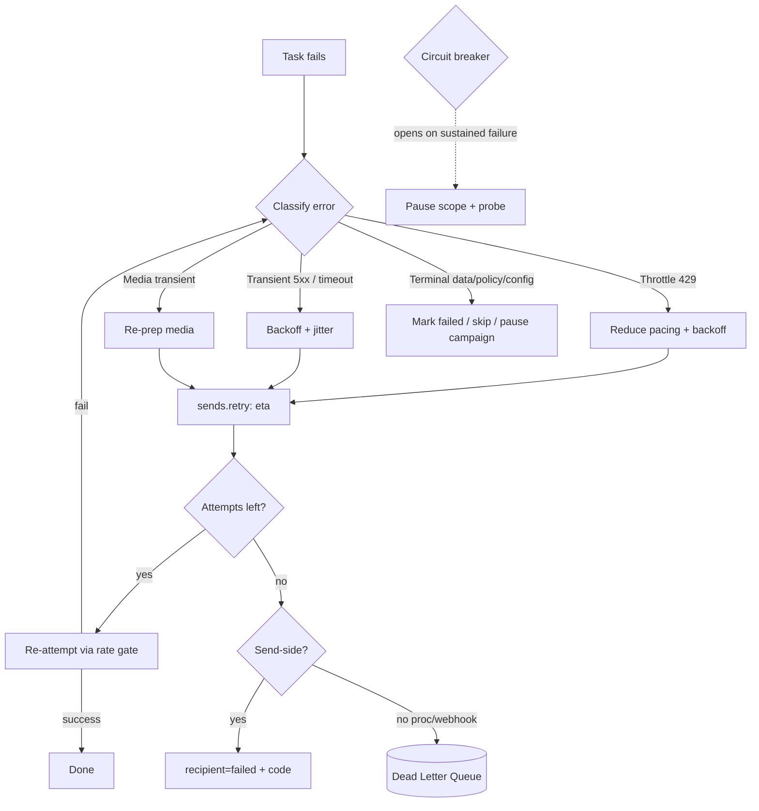

### 18.2 Worker lifecycle
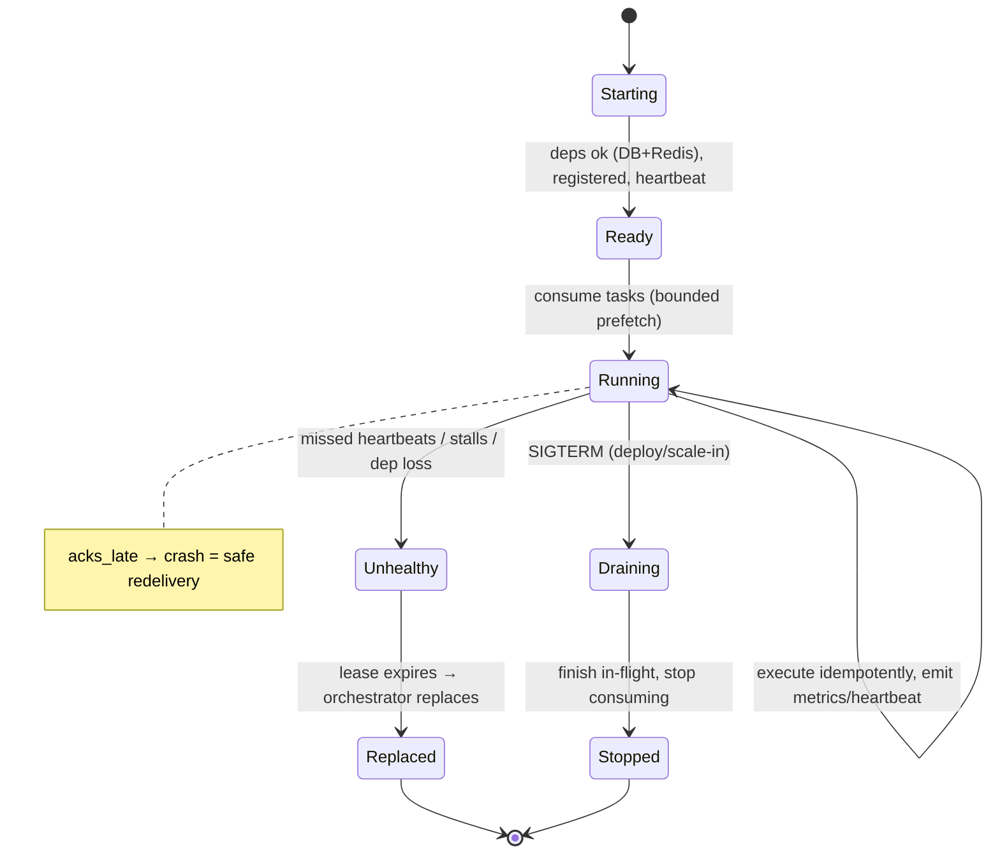

### 18.3 Scheduler flow
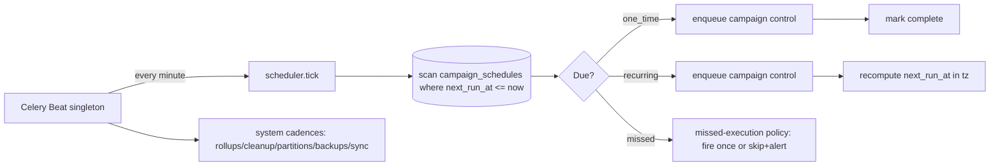

---

## 19. Engineering Decisions

At least 20 architectural decisions, each with **Decision · Reason · Alternatives · Why rejected ·
Benefits · Trade-offs · Migration**.

**D1 — Async-first (offload everything slow/bursty/failure-prone).**
Reason: keep the API fast and reliable. Alternatives: synchronous processing; a separate microservice per
concern. Rejected: sync blocks the request and can't survive restarts; premature microservices add ops
overhead. Benefits: fast API, resilience, scalability. Trade-offs: eventual consistency, more moving parts.
Migration: concerns can later split into services behind the same queues.

**D2 — Control plane vs data plane split for campaigns.**
Reason: orchestration (stateful, low-volume) and sending (stateless, high-volume) have opposite scaling
needs. Alternatives: one monolithic campaign task. Rejected: a single task can't fan out to millions or
resume cleanly. Benefits: independent scaling, instant pause/cancel, simple resume. Trade-offs: more task
types. Migration: control can become its own service.

**D3 — Transactional sends outrank bulk (separate priority queues).**
Reason: an agent's reply must never queue behind a 1M-recipient blast. Alternatives: one send queue.
Rejected: head-of-line blocking harms the human experience. Benefits: protected p95 for live work.
Trade-offs: two pools to size. Migration: add more priority tiers if needed.

**D4 — Approximate priority via multiple queues + prioritized consumers.**
Reason: Redis lists have no intra-queue priority. Alternatives: RabbitMQ priorities; sorted-set scheduling.
Rejected (for now): adds a broker dependency we don't yet need. Benefits: simple, effective priority.
Trade-offs: more queues. Migration: RabbitMQ (D18) gives native priorities without task changes.

**D5 — At-least-once delivery + idempotency = effectively-once.**
Reason: guarantee zero duplicate messages despite retries/redelivery. Alternatives: exactly-once transport.
Rejected: true exactly-once transport is impractical/expensive. Benefits: robust, simple, correct.
Trade-offs: every task must be idempotent (design discipline). Migration: none needed.

**D6 — I/O-concurrency for sends, process-concurrency for parsing.**
Reason: sends wait on Meta (I/O); imports burn CPU. Alternatives: uniform pool model. Rejected: wastes
resources for one class or the other. Benefits: max throughput per core, isolated memory. Trade-offs:
two execution models. Migration: tune per pool.

**D7 — Bounded prefetch (multiplier = 1 for long/send tasks).**
Reason: prevent a worker hoarding tasks it can't promptly run; enable even rebalancing. Alternatives: large
prefetch. Rejected: causes uneven load and slow failover. Benefits: smooth distribution, fast scale/failover.
Trade-offs: marginal broker chatter. Migration: adjust per queue.

**D8 — Poison tasks routed to DLQ after capped retries.**
Reason: a task that repeatedly kills its worker must not crash-loop the pool. Alternatives: infinite retry.
Rejected: takes down the pool. Benefits: pool stability, human visibility. Trade-offs: needs inspection.
Migration: none.

**D9 — Persist-first webhooks (store raw, ack `200`, process async).**
Reason: never lose an event; ack Meta < 200 ms. Alternatives: process inline before ack. Rejected: slow ack
→ Meta marks endpoint unhealthy; risk of loss on crash. Benefits: durability + speed. Trade-offs: one sync
insert. Migration: none.

**D10 — Distributed per-number rate gate (Redis token bucket).**
Reason: the whole fleet must collectively honor each number's MPS/tier. Alternatives: per-worker local limits.
Rejected: N workers × local limit = N× over the real limit → quality damage/bans. Benefits: fleet-correct
pacing. Trade-offs: a Redis op per send. Migration: cluster/Redlock variant at scale.

**D11 — Rate gate fails safe (conservative pacing) if Redis is unavailable.**
Reason: never blast Meta when the limiter is down. Alternatives: fail-open (send freely) or fail-closed (stop).
Rejected: fail-open risks bans; fail-closed halts business. Benefits: safe continuity. Trade-offs: reduced
throughput during Redis trouble. Migration: none.

**D12 — Versioned, hot-updatable error-code map.**
Reason: Meta error semantics evolve; retry logic must adapt without a deploy. Alternatives: hard-coded map.
Rejected: brittle, needs a release for every Meta change. Benefits: agility, correctness. Trade-offs: a
config surface to govern. Migration: extend for new channels.

**D13 — Locks are an optimization; the data layer is the ultimate guard.**
Reason: correctness must not depend on a lock never expiring early. Alternatives: trust locks alone.
Rejected: lock loss would allow duplicates. Benefits: robust zero-duplication. Trade-offs: belt-and-suspenders
complexity. Migration: none.

**D14 — "DB is the schedule, Beat is the heartbeat."**
Reason: schedules must be runtime-editable and durable. Alternatives: Beat-embedded static schedules.
Rejected: requires redeploys, not user-editable. Benefits: dynamic, durable scheduling. Trade-offs: a small
DB scan per tick. Migration: reuse for automation triggers.

**D15 — Missed-execution catch-up: fire once, then realign.**
Reason: avoid a thundering herd of missed fires after downtime. Alternatives: fire all missed; skip all.
Rejected: firing all can spam customers; skipping all can miss critical sends. Benefits: sane, predictable.
Trade-offs: policy nuance. Migration: configurable per schedule.

**D16 — Monotonic message status.**
Reason: out-of-order webhooks must never regress state. Alternatives: last-write-wins. Rejected: a late
`delivered` could overwrite `read`. Benefits: correct status under reordering. Trade-offs: status compare on
apply. Migration: none.

**D17 — Redis role separation + tailored eviction.**
Reason: cache is evictable; broker/locks/rate are not. Alternatives: one Redis, one policy. Rejected: a
cache-driven eviction could drop tasks or mis-meter sends. Benefits: safe memory management. Trade-offs: more
instances. Migration: split → cluster.

**D18 — Broker abstraction (RabbitMQ swap path).**
Reason: don't couple correctness to Redis-as-broker. Alternatives: Redis-only forever. Rejected: limits future
routing/priority/guarantees. Benefits: optionality without task rewrites (durability is in MySQL). Trade-offs:
avoid Redis-broker-specific tricks. Migration: switch broker config only.

**D19 — Durable truth in MySQL; Redis is rebuildable.**
Reason: a Redis loss must never lose data. Alternatives: Redis-authoritative state. Rejected: not durable
enough. Benefits: strong recovery (RPO≈0 for messages). Trade-offs: more DB writes. Migration: none.

**D20 — Snapshot the campaign audience up front.**
Reason: a dynamic segment must not shift mid-send; enables resume/audit. Alternatives: stream a live query.
Rejected: unstable audience, hard to resume. Benefits: stable, resumable, auditable. Trade-offs: storage
(100M+ rows, partitioned). Migration: none.

**D21 — Circuit breaker per number and per dependency.**
Reason: stop hammering a failing endpoint; protect quality. Alternatives: keep retrying blindly. Rejected:
wastes work, worsens quality. Benefits: fast failure isolation, recovery probing. Trade-offs: tuning
thresholds. Migration: reuse per channel.

**D22 — DLQ in MySQL (durable, queryable), not a Redis list.**
Reason: dead letters must survive restarts and be inspectable/replayable. Alternatives: Redis list DLQ.
Rejected: not durable/queryable enough for RCA + audit. Benefits: durable, filterable, auditable. Trade-offs:
slightly heavier writes. Migration: none.

**D23 — DLQ reserved for exceptional work, not ordinary delivery failures.**
Reason: keep the DLQ meaningful (needs-human), not a dump of normal `failed` recipients. Alternatives: DLQ
everything that fails. Rejected: drowns real problems in noise. Benefits: actionable DLQ. Trade-offs:
delivery failures live in the recipient ledger instead. Migration: none.

---

## 20. Self-review record

Reviewed as **Enterprise Architect, Backend Lead, Distributed Systems Engineer, Performance Engineer, DevOps
Engineer, Security Engineer, DBA, QA Lead, SRE, Product Architect**; gaps closed before presenting:

- **Zero-duplication (Distributed Systems):** proven via three overlapping guarantees — idempotency keys, DB
  unique constraints, monotonic status — safe under retry, redelivery, resume, replay, and network split. ✔
- **Isolation (Enterprise Architect):** control vs data plane, priority separation, per-queue pools, and
  per-number lanes prevent any work class from starving another; tail latency protected. ✔
- **Reliability/DR (SRE/DevOps):** every failure scenario (F1–F10) has defined behavior + recovery; durable
  checkpoints + `acks_late` + DLQ + circuit breakers give RPO≈0 for messages and minutes-level RTO. ✔
- **Compliance (Product/Security):** the rate gate enforces MPS/tier; quality-RED pauses marketing; opt-in/
  window/template checks happen before send — Meta limits are honored by design (Doc 1 §7). ✔
- **Performance (Perf Eng):** concrete KPIs (§14); throughput is limit-bound not machine-bound; hot-path ops
  are O(1); the API never blocks on Meta or fan-out. ✔
- **Scaling (Enterprise Architect):** stateless workers, per-pool scale-out, more-numbers = more throughput,
  Redis role-split→cluster, RabbitMQ swap path, MySQL replicas/partitioning — no rewrite to grow. ✔
- **Data alignment (DBA):** all durable state maps to Doc 3 tables (recipients/batches/retry/webhook/DLQ/job/
  metrics); partitioned high-volume tables; checkpoints piggyback on existing writes. ✔
- **Security (Security Eng):** webhook signature verified before trust; locks fenced; secrets/config external;
  every replay/discard audited. ✔
- **Observability (SRE):** queue/worker/task/Redis/MySQL/Meta/webhook metrics + Prometheus/Grafana + in-app
  monitor + tracing; alerting with hygiene. ✔
- **Correctness under coordination loss (Distributed Systems):** locks are optimizations; the data layer is
  the guard — the system stays correct even if a lock is lost (D13). ✔
- **Future-ready (Product Architect):** new channels/modules add queues+adapters+rate buckets+error maps; the
  generic fabric is unchanged — dual-channel Support Connector specifics are centralized in **Doc 6.5**. ✔

---

## 21. Multi-Channel Queue Scheduler

### 21.1 Purpose
Make scheduling and dispatch **channel-aware** so the platform runs **Channel 1 (Official Meta Cloud API)**
and **Channel 2 (vendor-neutral Support Connector)** in **independent execution lanes** — without changing
the core queue engine. The generic fabric (control plane, rate gate, retry engine, DLQ, checkpointing,
observability) is built once (§1–§20); channels differ only in **lane parameters**.

### 21.2 Architecture
The scheduler tick and every dispatch decision read `channel_type` (Doc 3) and route through a **channel
lane** — a named set of queues + worker pool + throttle profile + retry map + health monitor. Lanes are
data (a routing table), not code branches, so a new channel = a new lane entry + adapter.

| Lane concern | Channel 1 — Meta Cloud API | Channel 2 — Support Connector |
|---|---|---|
| **Independent queues** | `sends.bulk`, `sends.priority`, `webhooks.*` (Meta) | `support.send`, `support.inbound`, `support.session` (per §31 envelope) |
| **Independent throttling** | Meta **tier/MPS** token bucket (§5) | connector-appropriate, human-support pacing (not bulk-blast); per-connector cap |
| **Independent retry strategy** | Meta error-code map (§6) | connector error map (session-dropped, QR-expired, reconnect) — distinct classification |
| **Independent health monitoring** | Number Health Engine (§28) | Connector health/session engine (Doc 6.5), same state-machine pattern |
| **Independent scheduling** | campaign schedules target Channel 1 | schedules/reminders/SLAs target Channel 2 |
| **Independent pause/resume** | pause Channel-1 sends per number/campaign | pause Channel-2 per connector without touching Channel 1 |
| **Independent failure recovery** | Meta outage → Channel-1 breaker (§15 F4) | connector outage → only that lane pauses; Channel 1 unaffected |

### 21.3 Responsibilities
The scheduler decides **when** and **on which lane** work runs; the **core engine** executes it identically
regardless of lane. A **routing policy** (§31) resolves `(channel_type, connector_type, priority)` → lane.

### 21.4 Design decisions / trade-offs
- **Decision:** channels are **lanes over one engine**, not separate engines (extends D2/D4). **Trade-off:**
  a routing table to govern vs. duplicating the whole fabric per channel — the table is far cheaper and keeps
  behavior consistent.
- **Why not per-channel engines:** duplicated retry/DLQ/checkpoint logic would drift and double maintenance.

### 21.5 Failure handling / scaling / performance / future
- **Failure:** lane isolation means one channel's outage never stalls the other (independent breakers/pauses).
- **Scaling:** each lane's pools scale independently (§22, §30). **Performance:** routing is an O(1) lookup.
- **Future:** Instagram/Messenger/Telegram/SMS/Email/Voice are **additional lanes** — no engine change (§17,
  Doc 6.5).

---

## 22. Worker Affinity

### 22.1 Purpose
Specialize workers by work class so failures, resource profiles, and scaling are **isolated**. A stuck
connector session must never slow a campaign; a memory-heavy import must never evict a webhook worker.

### 22.2 Dedicated worker pools
| Pool | Consumes | Affinity rationale |
|---|---|---|
| **Campaign workers** | `campaigns.control`, `sends.bulk`, `sends.retry` | High-throughput, I/O-bound; scale to saturate Meta limits |
| **Support Connector workers** | `support.send`, `support.inbound`, `support.session` | **Session-affine** — a connector session is driven by one worker at a time (pinned via lock, §9); isolated egress/state |
| **Webhook workers** | `webhooks.ingest/process`, `inbound.process` | Latency-sensitive real-time; keep pace with Meta/connector firehose |
| **AI workers** | `ai` | Long, costly, provider-rate-limited; isolated so they never block sends |
| **Media workers** | `media` | Mixed I/O + light CPU (thumbnails); bounded memory |
| **Import/Export workers** | `imports`, `exports`, `default` | CPU-heavy parsing/streaming; process-based, memory-isolated |
| **Analytics workers** | `analytics.rollup` | Batch, off-peak, DB-heavy reads |
| **Maintenance workers** | `templates.sync`, `cleanup`, `maintenance`, `notifications` | Background cadence, lowest priority |

### 22.3 Why specialization helps
- **Isolation:** a crash/leak/backlog in one class is contained to its pool (blast-radius control).
- **Stability:** poison-task protection (§3.6/D8) is per-pool; one bad job can't take down unrelated work.
- **Scalability:** scale the *hot* pool only (e.g., add Support Connector workers when connectors grow) —
  independent, cost-efficient.
- **Resource fit:** I/O-concurrency for sends/webhooks vs. process-concurrency for parsing (D6) — right model
  per pool.
- **Security:** Support Connector workers may have different network egress and hold session material; keeping
  them separate limits exposure and eases policy.

### 22.4 Support Connector affinity (key nuance)
Unlike stateless send workers, a Support Connector worker **attaches to a specific connector session**.
Affinity + a per-connector lock (§9) guarantee **one worker per connector session** (no split-brain), while
the pool still scales across many connectors. If that worker dies, the session is **re-pinned** to a healthy
worker via the registry (§23) and the connector's health engine (Doc 6.5) drives reconnect.

### 22.5 Trade-offs / failure / scaling / performance / future
- **Trade-off:** more pools = more to size/operate vs. one pool — accepted for isolation. **Failure:** per-pool
  containment + re-pinning. **Scaling:** independent per pool (§30). **Performance:** each pool tuned to its
  workload. **Future:** each new channel adds a pool of the same shape (a "Telegram workers" pool, etc.).

---

## 23. Multi-Server Architecture

### 23.1 Purpose
Run the worker fleet across **many nodes** with automatic discovery, heartbeat health, node-failure handling,
and horizontal scale — while shared state (Redis/MySQL) keeps the fleet globally correct.

### 23.2 Topology
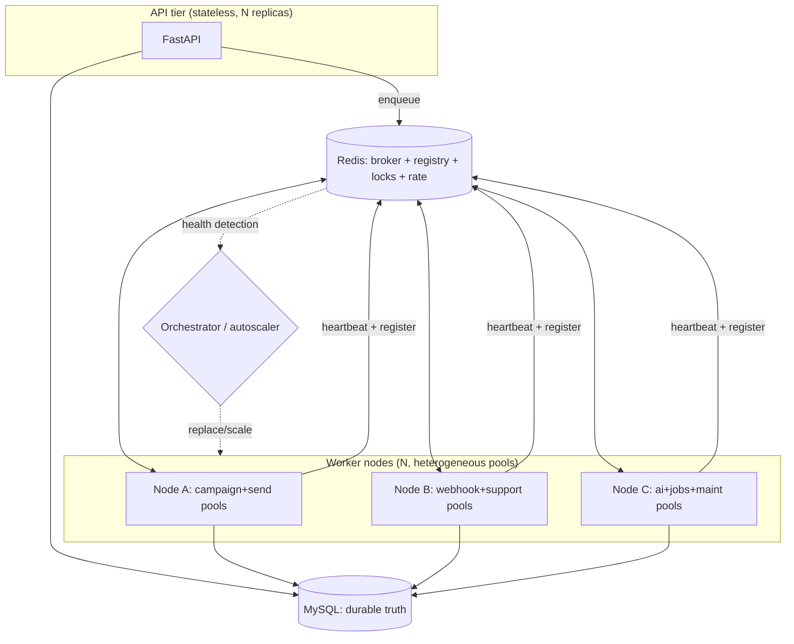

### 23.3 Worker discovery & registration
- On startup a worker **registers** in a Redis **worker registry** (node id, host, pools consumed, capacity,
  version, start time) and begins a **heartbeat** (a TTL'd key refreshed on an interval).
- The Queue Monitor / System Health screens (Doc 5 B11.8/B11.9) read the registry to show the live fleet.

### 23.4 Heartbeat monitoring & node failure handling
- **Heartbeat lease:** a node's registry entry has a TTL; a healthy node refreshes it. A node that stops
  refreshing (crash, network partition, reboot) has its **lease expire** → it's marked **down**.
- **Automatic recovery:** the down node's in-flight tasks were **`acks_late`** → the broker **redelivers** them
  to healthy nodes; idempotency makes this safe (§8). **Support Connector sessions** pinned to the down node
  are **re-pinned** to a healthy Support-Connector worker, which triggers reconnect (Doc 6.5).
- **Split-brain protection:** per-connector and singleton **locks** (§9) plus fencing ensure a "resurrected"
  node can't double-drive a session or a campaign.

### 23.5 Horizontal scaling
- Add nodes (or pool replicas on nodes); they self-register and start draining their queues — **no
  configuration of peers** (broker + registry mediate everything). Remove nodes via graceful drain (§3.5).
- Node roles can be **heterogeneous** (a node dedicated to Support Connector workers near required egress; a
  node dedicated to send throughput) — the routing/affinity model supports it.

### 23.6 Trade-offs / failure / performance / future
- **Trade-off:** distributed correctness needs shared Redis/MySQL — accepted; data layer is the guard (D13).
  **Failure:** every node-loss path recovers automatically with no duplication. **Performance:** near-linear
  with nodes up to Meta/connector limits. **Future:** the same registry/heartbeat model underpins Kubernetes
  orchestration (Doc 8).

---

## 24. Queue Priority Matrix

A single enterprise view of **who yields to whom**. Priority `P0` (highest) … `P4` (lowest). "Blocking" =
whether it can hold up other work; "Parallelism" = how it fans out; "Retry class" = the retry regime (§6);
"Isolation" = dedicated vs shared pool (§22).

| Work / queue | Priority | Blocking behavior | Parallel execution | Retry class | Isolation level |
|---|---|---|---|---|---|
| **Agent reply** (`sends.priority`) | **P1** | Never blocked by bulk; preempts bulk share | High, sharded by number/connector | Smart (§6) | Dedicated (send-priority) |
| **Campaign send** (`sends.bulk`) | P2 | Yields to P0/P1; never blocks them | Very high, sharded by number | Smart | Dedicated (send-bulk) |
| **Support Connector** (`support.*`) | **P1** (inbound/reply) / P2 (bulk-ish) | Session-affine; isolated lane | Per-connector parallel | Connector map (§21) | Dedicated (support pool) |
| **Webhook** (`webhooks.*`) | P1 | Non-blocking; decoupled from ack | High, sharded by conversation | Standard-bounded | Dedicated (webhook) |
| **Media** (`media`) | P2 | Non-blocking | Medium | Bounded (5×) | Dedicated (media) |
| **AI** (`ai`) | P2 | Isolated; never blocks sends | Medium, provider-limited | Bounded (3×) | Dedicated (AI) |
| **Import** (`imports`) | P3 | Long-running; isolated | Chunk-parallel | Per-chunk retry | Dedicated (jobs) |
| **Export** (`exports`) | P3 | Long-running; isolated | Low | Bounded (3×) | Dedicated (jobs) |
| **Analytics** (`analytics.rollup`) | P3 | Off-peak; non-blocking | Low-medium | Idempotent recompute | Dedicated (maint) |
| **Cleanup** (`cleanup`) | P4 | Background only | Low | Bounded (3×) | Dedicated (maint) |
| **Maintenance** (`maintenance`) | P4 | Background; singleton-locked | Low | Idempotent | Dedicated (maint) |

**Reading the matrix:** live human-facing work (agent replies, inbound, webhooks) is **P1** and protected;
bulk campaigns are **P2** and always yield; background work is **P3/P4** and never competes with live traffic.
Control/scheduler ticks are **P0** so the system stays steerable under any load. This matrix is the contract
the **backpressure strategy** (§29) and **resource optimizer** (§30) enforce.

---

## 25. Worker Resource Protection

### 25.1 Purpose
Guarantee that no task can exhaust a node — bounding memory, CPU, concurrency, and runtime, and recycling
workers proactively — so the fleet stays stable for the 10-year lifespan without manual babysitting.

### 25.2 Production limits (architecture guidance; tuned in Doc 8)
| Control | Guidance | Rationale |
|---|---|---|
| **Max RAM / worker process** | Hard cgroup limit (e.g., 512 MB–1 GB for send/webhook; higher for import/media) | Prevent a leak/large job from starving the node; enables OOM-kill+restart |
| **Max CPU / worker** | Bounded CPU share per pool | Keep parsing jobs from starving latency-sensitive pools |
| **Max concurrent tasks / worker** | Bounded prefetch = 1 for long/send tasks (D7); higher only for tiny tasks | Even distribution + fast failover |
| **Max task duration** | Soft + hard timeout per queue (§2) | Kill hung Meta/connector calls; free the slot |
| **Worker restart policy** | Auto-restart on crash; rolling on deploy | Self-healing; zero-downtime deploys |
| **Memory-leak protection** | **Recycle after N tasks** or **M memory growth** (max-tasks/max-memory per child) | Bounds long-run drift regardless of leaks in any dependency |
| **Automatic recycling** | Periodic proactive child replacement | Steady-state stability |
| **Graceful shutdown** | Drain in-flight, stop consuming, exit (§3.5) | No cut tasks; `acks_late` covers the rest |
| **OOM protection** | cgroup memory limit → OOM-kill the worker (not the node) → restart; the killed task is redelivered or DLQ'd if poison | Node survives; work isn't lost |

### 25.3 Responsibilities & failure handling
The **node/orchestrator** enforces cgroup limits and restarts; the **worker** enforces per-task timeouts,
recycling, and graceful drain; the **engine** guarantees redelivery/idempotency so any kill is safe. A task
that repeatedly trips OOM/hard-timeout is capped by max-retries → **DLQ** (poison protection, D8).

### 25.4 Trade-offs / scaling / performance / future
- **Trade-off:** aggressive recycling adds occasional restart overhead vs. unbounded drift — the restart cost
  is trivial next to a leaked/oOM node. **Scaling:** limits make per-worker capacity **predictable**, which is
  what capacity planning (§32) relies on. **Performance:** bounded concurrency + timeouts protect tail
  latency. **Future:** the same limits apply to any new pool (including Support Connector workers, whose
  session memory is bounded and recycled).

## 26. Campaign State Machine

### 26.1 Purpose
Make the campaign lifecycle an **explicit, enforced state machine** so every transition is legal, auditable,
and recoverable — the control-plane contract behind §4.5.

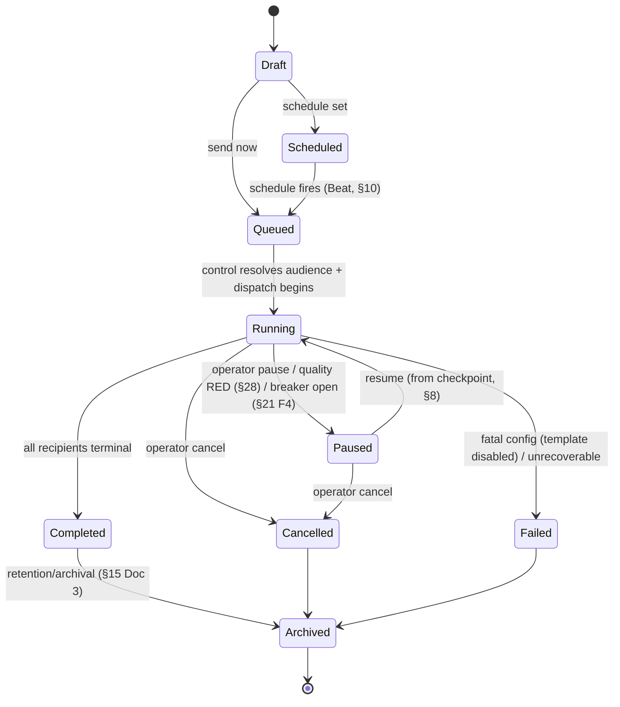

### 26.2 Transition rules
- **Draft→Scheduled/Queued:** requires valid number, approved template, resolved audience, passing pre-send
  validation (opt-in/window/limit, §4.3). Blocked transitions surface the reason (Doc 5 B4.2).
- **Queued→Running:** the control task (lock-guarded) has snapshotted recipients and started dispatch.
- **Running↔Paused:** pause stops dispatch (in-flight drain); resume continues from the next pending batch.
  **Auto-pause** on quality RED (§28) or an open circuit breaker (§21) — protection, not failure.
- **→Cancelled:** stops pending sends; already-sent are untouched; terminal.
- **→Completed:** every recipient is `sent/delivered/read/failed/skipped/cancelled` and no retries pending;
  counters + actual cost finalized; `campaign.finished` emitted.
- **→Failed:** only for whole-campaign blockers (e.g., template becomes disabled mid-run) — per-message
  failures do **not** fail the campaign.
- **→Archived:** background lifecycle per retention (Doc 3 §15).

### 26.3 Recovery behavior
`Running` is the only volatile state; on any interruption it resumes to `Running` from checkpoints (§8) with
zero duplicates. `Paused`/`Scheduled`/`Queued` are durable in MySQL and survive restarts. Illegal transitions
(e.g., resume a `Completed` campaign) are rejected by the API (`409`, Doc 4 §17).

---

## 27. Queue Lifecycle Diagram

### 27.1 Purpose
A single canonical view of a task's journey from enqueue to completion, including retry and dead-lettering —
the operational mental model behind §6/§7.

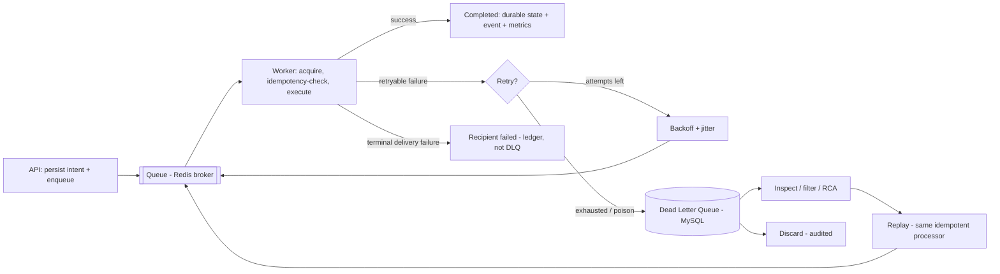

### 27.2 Stage explanations
1. **API** persists intent (Doc 3) and enqueues — the only synchronous step.
2. **Queue** transports the task (Redis broker; durable-ish AOF, D17).
3. **Worker** acquires it (bounded prefetch), runs the **idempotency check**, executes, and updates durable
   state + emits event/metrics.
4. **Retry** — retryable failures re-enter via `sends.retry`/backoff (§6); bounded attempts.
5. **Dead Letter Queue** — poison/unprocessable work (not ordinary delivery failures, §6.5) lands durably for
   inspection.
6. **Replay** — fixed items re-enter through the *same* idempotent processor (safe no-op if already applied).
7. **Completed** — terminal success; or **recipient failed** recorded in the ledger for analytics.

---

## 28. Number Health Engine

### 28.1 Purpose
Protect each Channel-1 number's **deliverability and standing** by automatically reacting to Meta's quality
signal — pacing down, pausing, alerting, and recovering — so a dip never becomes a ban. (The Support
Connector's analogous **connector-health engine** follows the same pattern and is specified in Doc 6.5.)

### 28.2 Health state machine
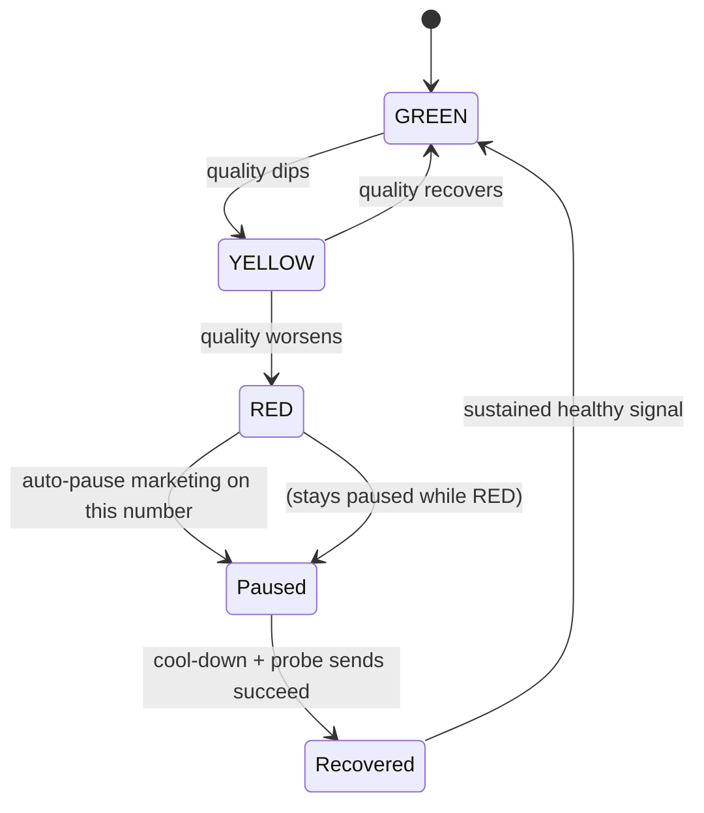

### 28.3 Automatic behaviors per state
| State | Pacing | Protection | Operator signal |
|---|---|---|---|
| **GREEN** | Full (up to tier/MPS) | — | normal |
| **YELLOW** | **Reduced** (safety-margin pacing on the rate gate, §5) | slow down proactively | warning notification (Doc 5 DS-16) |
| **RED** | **Halt marketing** on this number | auto-**pause** affected campaigns for this number (§26 auto-pause); utility/service policy configurable | **critical** notification + inline banner (Doc 5 B11.5) |
| **Paused** | none (marketing) | asset protected; traffic **shifted** to healthy numbers (§5.5) | shows paused + reason |
| **Recovered** | **Ramp-up** (gradual, not full-blast) | probe before full trust | info notification |
| back to **GREEN** | Full | — | resolved |

### 28.4 Recovery strategy
Recovery is **gradual**: after a cool-down, a limited set of **probe sends** tests standing; success ramps
pacing up in steps (not instantly to full) to avoid re-triggering a drop; sustained GREEN restores full
throughput. Quality transitions are driven by number sync + webhook signals and are **audited**.

### 28.5 Trade-offs / failure / scaling / future
- **Trade-off:** conservative auto-pacing may under-utilize a number briefly vs. risking quality — protecting
  the asset always wins. **Failure:** if the signal is stale, the gate defaults to safe pacing (D11).
  **Scaling:** per-number engines run independently across the fleet. **Future:** the same engine shape covers
  connector health and any future channel's standing.

---

## 29. Backpressure Strategy

### 29.1 Purpose
Define exactly how the platform behaves under **overload** — degrading gracefully, preserving priority, and
protecting the queues/broker/DB — rather than collapsing. Overload is expected at scale; the response is
designed, not accidental.

### 29.2 Overload scenarios & response
| Overload | Detection | Response |
|---|---|---|
| **Huge campaign backlog** | `sends.bulk` depth/age over SLO | Backlog is *fine* by design (paced to Meta limits); optimizer (§30) adds bulk workers up to the limit; P1 stays protected; ETA recomputed |
| **Redis saturation** | memory/latency/evictions high | Shed **P3/P4** enqueues first; cache instance evicts (LRU) while broker/rate instance is protected (D17); alert; add capacity/cluster |
| **Worker saturation** | all pools busy, queue age rising | Autoscale hot pools; **admission control** at the API sheds low-priority requests (`429`/`503` + `Retry-After`); P0/P1 preserved |
| **API burst traffic** | request rate spike | Rate limiting (Doc 4 §9) + admission control; heavy/bulk endpoints return `202` fast and defer work; reads served from cache |
| **Meta throttling (429)** | rising 429s | The rate gate **reduces pacing** (§5); breaker may open (§21); sends pace within limits — never dropped |
| **Webhook spikes** | ingest lag rising | Ingest is **decoupled** (persist+ack fast, §11); processing scales on lag; ordering preserved per conversation; nothing lost |

### 29.3 Mechanisms
- **Graceful degradation:** non-essential work (analytics, cleanup) is **deferred**; core paths (inbox,
  agent sends, webhook ingest) stay available.
- **Priority preservation:** the §24 matrix is enforced — P0/P1 never starve; P3/P4 shed first.
- **Queue protection:** broker/rate Redis is `noeviction` with headroom + alerts; cache is separately
  evictable (D17); enqueue admission control prevents unbounded growth.
- **Rate reduction:** self-throttle to Meta/connector limits (never exceed to "catch up").
- **Admission control:** at the API edge, low-priority or bulk submissions are shed/deferred under pressure
  (`429`/`503` + `Retry-After`) so accepted work is honored.
- **Recovery strategy:** as load subsides, deferred work resumes oldest-first; backlogs drain at the allowed
  rate; breakers half-open and close; alerts clear.

### 29.4 Trade-offs / scaling / performance / future
- **Trade-off:** shedding/deferring reduces peak throughput of low-priority work to protect the system and
  live traffic — the correct enterprise trade. **Scaling:** backpressure buys time for autoscaling to catch
  up. **Performance:** live paths hold their SLOs under overload. **Future:** per-channel backpressure uses
  the same rules on each lane.

---

## 30. Queue Resource Optimizer

### 30.1 Purpose
Continuously **balance** CPU, RAM, Redis capacity, worker pools, and queue throughput against demand — so the
fleet auto-tunes instead of requiring constant manual sizing.

### 30.2 Architecture
- **Signals** (from §13): per-queue depth + oldest-message age, throughput vs. target, worker utilization,
  Redis memory/latency, DB load, breaker/health states.
- **Decisions:** a control loop maps signals → actions: **scale a pool out/in**, **rebalance** workers across
  pools (shift capacity from a quiet pool to a hot one within a node's budget), **adjust pacing** (feed the
  rate gate), and **defer** low-priority work (§29).
- **Limit-awareness:** send-pool scaling stops at the point where **Meta/connector limits** bind — beyond
  that, more workers add cost, not throughput (D10). The optimizer targets **saturating the allowed rate
  efficiently**, not raw worker count.

### 30.3 Autoscaling & balancing philosophy
- **Scale the bottleneck, not everything** — per-pool policies on backlog/age/throughput (not just CPU).
- **Keep latency-sensitive pools warm** (min replicas for send-priority/webhook/support); background pools
  scale to a small floor.
- **Queue balancing:** distribute dispatch across **number/connector lanes** by available budget (§5.5), and
  across nodes by registry capacity (§23) — no single lane or node is a global bottleneck.
- **Hysteresis:** scale decisions use dampening/cool-downs to avoid flapping.

### 30.4 Trade-offs / failure / performance / future
- **Trade-off:** an optimizer is a moving part vs. static sizing — but static sizing either wastes capacity or
  under-serves peaks; the optimizer with capacity-planning bounds (§32) gives both efficiency and safety.
  **Failure:** if signals are unavailable, it holds the last-known-good scale (never scales to zero on hot
  pools). **Performance:** keeps utilization in the healthy 60–80% band (§14). **Future:** new pools/lanes
  register signals and are optimized automatically.

## 31. Connector-Aware Queue Design

### 31.1 Purpose
Make **every queued task self-describing** about its channel/connector so the generic engine routes,
throttles, and retries correctly **without branching on channel** — the mechanism that makes §21 (multi-channel
scheduler) and Doc 6.5 (Support Connector) work with **no future queue redesign**.

### 31.2 The task envelope
Every task carries a standard **routing envelope** alongside its payload:

| Field | Meaning | Example (Channel 1) | Example (Channel 2) |
|---|---|---|---|
| `channel_type` | Which channel | `meta_cloud_api` | `support_connector` |
| `connector_type` | Which adapter implementation | `whatsapp_cloud` | `qr_session` (abstract; swappable) |
| `priority` | §24 priority class | P2 (bulk) / P1 (agent) | P1 (inbound/reply) |
| `retry_policy` | Which error map + backoff (§6) | `meta_error_map` | `connector_error_map` |
| `throttle_profile` | Which rate rules (§5) | `number_tier_mps` | `connector_pacing` |
| `routing_policy` | Which lane/pool/queue (§21/§22) | `meta.sends.*` | `support.*` |

The worker reads the envelope and applies the corresponding **adapter, rate profile, retry map, and lane** —
it never contains `if channel == …` business logic. Adding a channel = **registering new envelope values +
an adapter**, not editing the engine.

### 31.3 Responsibilities & guarantees
- **Routing policy** resolves `(channel_type, connector_type, priority)` → queue + pool + throttle + retry.
- **Idempotency, checkpointing, DLQ, observability** are envelope-agnostic — they work identically for any
  channel because they operate on the durable ledger (Doc 3), which already carries `channel_type`.
- **Consistency:** the same envelope shape flows through API → queue → worker → metrics, so dashboards and
  the Queue Monitor are automatically channel-aware.

### 31.4 Trade-offs / failure / scaling / future
- **Trade-off:** a richer task envelope vs. bare payloads — a tiny, worthwhile cost for total channel
  neutrality. **Failure:** an unknown envelope value is rejected to the DLQ with a clear reason (never
  mis-routed). **Scaling:** routing is O(1). **Future:** Instagram/Messenger/Telegram/SMS/Email/Voice each add
  envelope values + an adapter — the queue engine is **untouched** (the core promise of the dual-channel
  mandate; see Doc 6.5).

---

## 32. Capacity Planning

### 32.1 Purpose
Give **architecture-level sizing guidance** for common deployment scales, so operators can provision sensibly.
This is **guidance, not provisioning** — real numbers depend on message mix, media, campaign cadence, and
retention; validate with load tests (Doc 10). Assumes Channel 1 peak ≈ up to ~80 MPS per number (tier-
permitting); Channel 2 connectors add human-support-rate volume, not bulk.

### 32.2 Sizing table (per scale; ranges, guidance only)
| Numbers | Peak aggregate throughput | Send workers | Total worker processes (all pools) | vCPU (fleet) | RAM (fleet) | Redis | Database posture | Msg + status storage growth¹ | Operational notes |
|---|---|---|---|---|---|---|---|---|---|
| **1** | ~80 msg/s | 1–2 | 6–8 | 4–8 | 8–16 GB | 1 GB (single) | single MySQL (SSD) | ~GBs/mo | Single node fine; Compose ok |
| **5** | ~400 msg/s | 2–3 | 10–12 | 8–16 | 16–32 GB | 2 GB | single MySQL | ~tens of GB/mo | Single/dual node |
| **10** | ~800 msg/s | 3–5 | 14–18 | 16–24 | 32–48 GB | 4 GB (role-split) | MySQL + read replica | ~tens–100 GB/mo | 2 worker nodes; start replica |
| **25** | ~2,000 msg/s | 6–10 | 24–32 | 24–48 | 48–96 GB | 8 GB (split) | primary + replica; partition pruning | ~100s GB/mo | 3–4 nodes; role-specialize |
| **50** | ~4,000 msg/s | 12–20 | 40–56 | 48–96 | 96–192 GB | 16 GB (split; consider cluster) | primary + replicas; partitioning essential | ~100s GB–TB/mo | 5–8 nodes; dedicated send/webhook nodes |
| **100** | ~8,000 msg/s | 24–40 | 80–120 | 96–200+ | 192–384 GB | Redis Cluster | primary + multiple replicas; partitioning + sharding path (Doc 3 §16) | ~TB/mo | 10–16 nodes; K8s recommended (Doc 8) |

¹ Storage growth is order-of-magnitude for the message ledger + status history at sustained high volume;
time-partitioning + retention (Doc 3 §14/§15) keep the **hot** set small and prune cheaply.

### 32.3 What scales with what
- **Send workers ∝ target throughput** but capped by Meta/connector limits (I/O-bound; a few processes with
  high async concurrency saturate many numbers — D6).
- **Webhook/support workers ∝ inbound volume** (conversations, connectors).
- **Redis ∝ backlog + cache + rate/lock keys** — role-split early, cluster by ~50 numbers.
- **DB load ∝ messages × (ledger + several status rows)** — replicas for reads, partitioning for the hot set,
  sharding as the documented escape hatch (Doc 3 §16).

### 32.4 Operational recommendations
- Keep **latency-sensitive pools warm** (min replicas) at every scale.
- Separate Redis roles (broker vs cache vs rate/locks) from ~10 numbers; cluster from ~50.
- Add MySQL read replicas from ~10 numbers; enforce partition maintenance from day one.
- Move from Docker Compose (small) to **Kubernetes** (≥ ~25 numbers) for autoscaling + rolling deploys (Doc 8).
- Re-validate with load tests when adding numbers, enabling a new channel/connector, or raising campaign
  cadence (Doc 10).

---

## 33. Cross-Document References

This document is consistent with, and depends on, the following. Frozen documents are authoritative for their
domain; this document is authoritative for the **asynchronous fabric**.

| Document | Status | Relationship to this document |
|---|---|---|
| **Doc 1 — SRS** | Frozen v1.0 | Requirements upheld here: idempotency, smart retry, resume-interrupted, messaging-limit compliance (CMP), RPO/RTO (NFR-DR), monitoring (FR-MON). |
| **Doc 3 — Database Design** | Frozen v1.0 | Durable state: `campaign_recipients`, `campaign_batches`, `campaign_retry_queue`, `webhook_events`, `webhook_dead_letter`, `job_metadata`, `monitoring_metrics`, `messages`, `message_status_history`; `channel_type` enables channel-aware queues. |
| **Doc 4 — API Design** | Frozen v1.0 | Endpoints/events this fabric serves: `/campaigns/*`, `/messages/send`, `/webhooks/*`, `/queues`, `/jobs`, `Idempotency-Key`, SSE events. |
| **Doc 5 — UI/UX** | Frozen v1.0 | Operator surfaces: Queue Monitor, System Health, campaign progress, notifications; connector dashboard (Doc 6.5). |
| **Doc 6.5 — Dual-Channel Architecture** | Planned (authoritative for dual-channel) | Support Connector abstraction, connector session lifecycle/health, unified inbox, lead management — reuses this fabric's queues/retry/DLQ/checkpointing/observability unchanged (§21, §31). |
| **Doc 7 — Integrations Architecture** | Planned | External integrations/outbound webhooks/CRM connectors ride the same queue fabric (retry/DLQ). |
| **Doc 8 — Deployment & DevOps** | Planned | Worker orchestration, cgroup limits (§25), autoscaling (§30), multi-node topology (§23), Redis/MySQL provisioning (§32). |
| **Doc 9 — AI & Automation** | Planned | AI pool + automation/flow engine on the internal event bus + scheduler (§10). |
| **Doc 10 — Testing & QA** | Planned | Load/chaos tests validating throughput (§14), failure scenarios (§15), and capacity (§32). |
| **Doc 11 — Operations Runbook** | Planned | Runbooks for DLQ replay (§7), health recovery (§28), backpressure (§29), node failure (§23). |

> The overall document roadmap (final numbering of Docs 7–11) is reconciled in the Development Roadmap; the
> references above reflect the owner's stated future document set.

---

## 34. Self-review record — enhancement pass (v1.0 freeze)

Re-reviewed the **entire** document (§1–§33) as **Enterprise Architect, Backend Lead, Distributed Systems
Engineer, Performance Engineer, DevOps Engineer, Security Engineer, DBA, QA Lead, SRE, Product Architect**;
gaps closed before freezing:

- **Additive integrity:** no existing section (§1–§20) was modified, renumbered, removed, or simplified; §21–§34
  are appended and reuse existing terminology, style, and decision IDs (extending D1–D23). ✔
- **Channel-awareness (Enterprise/Product Architect):** the scheduler (§21), task envelope (§31), and priority
  matrix (§24) make the fabric run Channel 1 **and** the vendor-neutral Support Connector (Channel 2) as
  independent lanes over one engine — **no queue redesign** for future channels; connector specifics deferred to
  Doc 6.5. ✔
- **Isolation & stability (Backend/SRE):** worker affinity (§22), resource protection (§25), and multi-server
  registration/recovery (§23) contain blast radius and self-heal without duplication. ✔
- **Overload behavior (Distributed Systems/SRE):** backpressure (§29) + resource optimizer (§30) preserve the
  priority matrix and protect broker/DB under saturation, with defined recovery. ✔
- **Deliverability protection (Product/Security):** the Number Health Engine (§28) auto-paces/pauses/recovers to
  protect numbers; consistent with the rate gate (§5) and compliance (Doc 1 §7). ✔
- **Lifecycle clarity (QA):** explicit campaign state machine (§26) and queue lifecycle (§27) diagrams make
  every transition legal, recoverable, and testable. ✔
- **Capacity (DevOps/Perf):** sizing guidance for 1–100 numbers (§32) ties worker/CPU/RAM/Redis/DB/throughput/
  storage to scale, with clear "scales-with-what" rules and load-test caveats. ✔
- **Consistency (all):** cross-document references (§33) align with frozen Docs 1/3/4/5 and forward to Doc 6.5
  and the planned Docs 7–11; nothing here contradicts a frozen document. ✔

**No further architectural gaps identified. Document 6 frozen as Version 1.0 — authoritative asynchronous
architecture for the platform.**


---

## 35. Queue Analytics Engine

**Purpose.** Turn the raw operational metrics (§13) into **decision-grade analytics** — so operators and the
optimizer (§30) can see utilization, trends, bottlenecks, and SLA compliance over time, not just instantaneous
gauges. Observability tells you *what is happening now*; analytics tells you *what has been happening and where
the constraint is*.

**Responsibilities.** Aggregate metrics into historical series and rollups; compute derived analytics
(efficiency, bottleneck scores, SLA compliance); expose them to the UI and reports; never itself affect
production processing (read-only over metrics).

**Architecture.** Workers emit metrics (§13) → time-series in `monitoring_metrics` (Doc 3 §11.7) + **Prometheus**
for real-time → the `analytics.rollup` queue (§2) periodically compresses raw points into hourly/daily rollups
→ served via the analytics/queue APIs (Doc 4 `/queues`, `/analytics/*`) to the **Queue Monitor** and historical
reports (Doc 5 B11.8). Real-time deep-dives use Grafana; historical/business views use the MySQL rollups.

| Analytic | What it measures | **Why it exists** |
|---|---|---|
| **Queue utilization** | % of capacity a queue's consumers are busy | detect under/over-provisioned pools |
| **Worker utilization** | busy-time per worker/pool | right-size pools; find idle capacity |
| **Queue throughput trend** | tasks/sec over time (per queue/channel) | capacity planning, demand seasonality |
| **Retry trend analysis** | retry rate + exhaustion over time | early warning of Meta/number/connector trouble |
| **Queue latency trend** | queued→start and start→done over time | SLA drift detection |
| **Campaign throughput** | messages/sec per campaign/number | pacing effectiveness, ETA accuracy |
| **Worker efficiency** | useful work ÷ (useful + retries + idle) | spot inefficient pools / hot spots |
| **Bottleneck detection** | which stage constrains flow | target scaling precisely (see below) |
| **Historical queue reports** | daily/weekly summaries | audits, reviews, trend reporting |
| **SLA compliance reporting** | actuals vs the §42 SLA matrix | prove/track service objectives |

**Bottleneck detection.** The engine correlates queue depth+age with downstream utilization: a queue with
rising age while its pool is **saturated** ⇒ *consumer-bound* (scale the pool); rising age while the pool is
**idle** ⇒ *upstream/producer-bound* or a lock/rate gate constraint; the send lane blocked at the rate gate ⇒
*Meta-limit-bound* (expected, not a defect). This turns "it's slow" into "scale pool X" or "add a number."

**Design decisions (D24).** Analytics are computed from **durable rollups**, not only sampled gauges, so
history survives restarts and is queryable/auditable. **Trade-off:** rollup storage + compute vs. richer
insight — bounded by retention (Doc 3 §15). **Failure handling:** analytics loss never affects processing
(best-effort, TTL'd raw + durable rollups); a rollup gap self-heals on the next run. **Performance:** rollups
keep dashboards fast (pre-aggregated, Doc 1 NFR-PERF-06). **Scalability:** Prometheus scales for real-time;
MySQL rollups partition/prune with the metrics table. **Security:** analytics are permission-gated
(`system:read`/`analytics:read`, Doc 4 §4). **Future extensibility:** per-channel labels (Meta / Support
Connector, §31) mean new channels appear automatically. **Cross-refs:** §13, §30, §42; Doc 3 §11.7; Doc 4
`/queues`,`/analytics`; Doc 5 B11.8.

---

## 36. Predictive Capacity Planning

**Purpose.** Forecast **future** infrastructure needs from historical trends, so scaling is **proactive**
(provisioned before saturation) rather than reactive. It extends the static sizing tables (§32) with
data-driven projection.

**Responsibilities.** Consume historical analytics (§35); project each resource forward over a horizon;
emit **scaling recommendations** with confidence + lead time; surface them in the capacity/System Health view.
It **recommends**, it does not auto-provision (a human or the orchestrator's autoscaler acts).

**Architecture.** A forecasting service reads rollups (workers, CPU, RAM, Redis, DB size, queue backlog,
storage, AI tokens) and applies **explainable trend models** (growth-rate + seasonality/linear/holt-winters
style) to project usage and the date each resource crosses a threshold. Outputs are stored and shown in the UI;
alerts fire on projected-breach horizons.

| Prediction | Inputs | Method | Typical output |
|---|---|---|---|
| **Worker growth** | throughput trend, utilization | trend → required replicas per pool | "add 2 send workers in ~18 days" |
| **CPU forecast** | per-pool CPU trend | trend projection | "send-pool CPU at 80% in ~24 days" |
| **RAM forecast** | memory trend + recycling | trend | "webhook RAM +25% in 30 days" |
| **Redis growth** | memory + backlog + keys | trend + backlog model | "broker Redis at 80% in ~20 days → cluster" |
| **Database growth** | ledger/status insert rate | volume × retention | "hot set +N GB/mo; add replica" |
| **Queue backlog** | arrival vs service rate | queueing projection | "campaign season backlog risk in Q4" |
| **Storage** | media + exports + ledger | volume × retention | "object storage +N TB in 90 days" |
| **AI workload** | token trend (Doc 4 §32) | trend + cost | "AI tokens +40% MoM; raise budget/limits" |
| **Scaling recommendations** | all of the above | threshold-crossing + lead time | prioritized, dated actions |

**Design decisions (D25).** Start with **explainable statistical models** (interpretable, auditable) before any
opaque ML — operators must trust a recommendation to act on it; ML can be layered later behind the same
interface. **Trade-off:** simple models are less precise on irregular spikes vs. interpretability + zero
training overhead. **Failure handling:** if history is sparse/absent, fall back to the static capacity tables
(§32); never block on a forecast. **Performance:** forecasts run as scheduled `analytics`/`maintenance` jobs,
off the hot path. **Scalability:** forecasting cost is trivial vs. the fleet it plans. **Security:** capacity/
cost projections gated (`system:read`). **Future extensibility:** per-channel forecasts (Meta vs Support
Connector growth) and pluggable models. **Cross-refs:** §32, §35, §30; Doc 4 §32; Doc 5 System Health.

---

## 37. Cost Analytics Engine

**Purpose.** Give **complete cost visibility** — combining exact **Meta messaging cost** (our differentiator,
Doc 1 FR-AN-03) with **infrastructure and resource cost** — so the business sees true cost per campaign, queue,
worker, and channel, with forecasting, anomaly detection, and budgets.

**Responsibilities.** Attribute costs to their drivers; aggregate into a cost warehouse; forecast spend; detect
anomalies; monitor budgets; generate **finance reports**. It reads cost drivers; it never gates production
(budget enforcement is advisory unless an operator sets a hard cap).

**Architecture.** Two cost streams are unified:
1. **Messaging cost** — from the `messages` ledger's `category`/`country`/`cost_amount` (Doc 3 §9.2) on Meta's
   real rate card; per-message, per-campaign, per-number.
2. **Infrastructure/resource cost** — **attributed** by consumption: worker cost by **task-seconds × pool
   rate**, queue cost by its share of worker time, Redis/DB/storage/media-bandwidth by usage, **AI token cost**
   from usage (Doc 4 §32), import/export by job resource use.

These feed scheduled rollups → a cost warehouse (rollup tables) → **finance reports** and the **Cost Analytics**
screen (Doc 5 B10) and exports.

| Cost dimension | Source / attribution |
|---|---|
| Meta messaging cost | `messages` ledger (real rate card) |
| Campaign cost | messaging cost grouped by campaign + attributed compute |
| Cost per queue | queue's share of worker task-seconds × pool rate |
| Cost per worker | worker-hours × node rate |
| Redis cost | instance size/usage allocation |
| Database growth cost | storage GB × rate + IOPS |
| Storage cost | object-storage GB (media/exports/backups) |
| Media bandwidth | egress GB for media |
| AI token cost | prompt+completion tokens × model rate (Doc 4 §32) |
| Export / Import cost | job resource-seconds |
| Infrastructure cost | node/Redis/DB/storage totals |

**How finance reports are generated.** Scheduled `analytics.rollup` jobs compute period costs (day/week/month)
by category/campaign/number/channel/queue; reports are **exportable** (CSV/Excel/JSON, Doc 4 `/analytics/reports/
export`) and viewable per period; **budgets** (per category/channel) are configured in Settings and tracked with
**threshold alerts** (Doc 5 DS-16); **anomaly detection** compares current spend to a rolling baseline and flags
spikes (e.g., a runaway campaign or AI usage surge). **Cost forecasting** reuses §36's trend engine on spend.

**Design decisions (D26).** Cost = **exact messaging (from the ledger)** + **attributed infra (by
consumption)** — no reseller markup, unlike competitors (Doc 2). **Trade-off:** infra attribution is an
estimate (allocation model) vs. exact per-tenant metering — acceptable and clearly labeled. **Failure
handling:** missing infra rates fall back to messaging-only cost. **Performance:** all from rollups; never live
scans. **Scalability:** cost warehouse partitions with volume. **Security:** cost/finance data is sensitive —
gated behind `analytics:read` and (recommended) a dedicated `finance:read` permission (add via CHANGELOG to the
Doc 4 catalog); exports audited. **Future extensibility:** per-channel cost (Meta vs Support Connector) and new
cost drivers plug in as dimensions. **Cross-refs:** Doc 1 FR-AN-03; Doc 2 (no-markup advantage); Doc 3 §9.2;
Doc 4 §32, `/analytics/*`; Doc 5 B10.

## 38. Queue Simulation Engine

**Purpose.** **Dry-run** a campaign or workload *before* executing it, to predict completion time, resource
load, backlog, retries, and messaging-window usage — so operators launch with confidence and the platform
avoids surprises. It powers the Campaign Wizard's "Review" step (Doc 5 B4.2) and pre-flight capacity checks.

**Responsibilities.** Take a proposed workload + current fleet/limit state + historical rates → produce
projections. It is **strictly read-only against production**: no real enqueue, no Meta/connector calls, no
recipient sends.

**Architecture.** An isolated simulator models the send pipeline (§4) **analytically** using a queueing model:
inputs = audience size, sending number(s) + tier/MPS + quality, template category, pacing, current backlog, and
historical send/latency/retry rates (from §35). It computes the projected timeline and resource envelope in a
**sandbox** — the only thing it may persist is a labeled *simulation record* (never a production task/recipient).

| Estimate | Basis |
|---|---|
| **Campaign completion time / ETA** | audience ÷ effective paced rate (min of MPS, tier budget/window, pacing) |
| **Worker utilization** | projected send concurrency vs pool capacity |
| **Queue backlog** | arrival vs service rate over the send window |
| **Redis usage** | projected in-flight tasks + rate/lock keys |
| **Database load** | recipient writes + status rows × volume |
| **Network utilization** | message + media egress estimate |
| **API rate consumption** | projected calls vs Meta rate limits |
| **Expected retry count** | audience × historical retryable-error rate |
| **Meta messaging-window usage** | unique-recipient draw against the 24-h tier budget |
| **Completion ETA** | end-to-end projected finish time |

**Never affects production (D27).** The simulator reads live state but writes nothing to production queues/DB;
it runs in the `analytics`/dedicated sandbox context. **Design decisions:** analytical model (fast, safe) over
a "shadow run" (which would risk real side effects). **Trade-off:** a model is an approximation vs. a real run —
acceptable and clearly labeled as an estimate. **Failure handling:** if inputs are missing, it degrades to a
simple `audience ÷ rate` estimate; simulator downtime never blocks launching. **Performance:** sub-second for
typical campaigns. **Scalability:** stateless; trivial cost. **Security:** gated by `campaigns:read`; no PII in
the model beyond counts. **Future extensibility:** per-channel models (Support Connector pacing differs from
Meta bulk); "what-if" scenarios (add a number, change pacing). **Cross-refs:** §4, §5, §14, §35; Doc 5 B4.2.

---

## 39. Queue Versioning Strategy

**Purpose.** Evolve **task payloads** safely over time so **rolling deployments with mixed worker versions**
never lose, mis-run, or duplicate work — the queue-layer analogue of the API versioning policy (Doc 4 §26).

**Responsibilities.** Version every task; guarantee old and new workers interoperate during rollout; define
migration and deprecation for breaking changes; enable zero-downtime upgrades.

**Architecture.** The task **envelope** (§31) carries a **`task_version`**. Rules:
- **Backward compatibility:** newer workers can process older payloads (they understand all supported versions
  within a window).
- **Forward compatibility:** older workers **tolerate unknown fields** (ignore additive fields) and, for a
  payload version they can't handle, **re-queue for a capable worker** rather than fail.
- **Additive-first:** like the API, changes are additive within a version; a truly breaking change bumps
  `task_version` and follows a migration.
- **Migration strategy:** for a breaking change, run a **compatibility window** where both versions are
  understood; producers may **dual-emit** or negotiate; drain the old version before removing support.
- **Deprecation:** a retired task version has a published sunset; after the window, unsupported payloads are
  DLQ'd with a clear reason (never silently dropped).

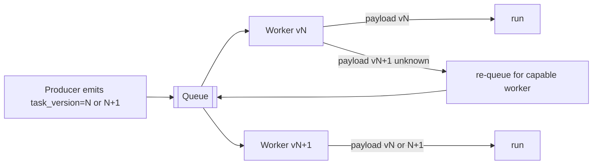

**Design decisions (D28).** Versioned, tolerant payloads + `acks_late` make **rolling deploys safe** without a
maintenance window. **Trade-off:** producers/consumers must honor the compatibility contract (discipline) vs.
zero-downtime upgrades. **Failure handling:** an un-handleable version is re-queued or DLQ'd, never lost;
idempotency covers any re-run. **Performance:** version check is negligible. **Scalability:** independent of
fleet size. **Security:** version negotiation can't be used to smuggle unauthorized work (workers validate the
envelope). **Future extensibility:** the same scheme versions **new channels'** tasks (Support Connector, etc.).
**Cross-refs:** §31, §3.5 (graceful drain), Doc 4 §26; Doc 8 (rolling deploys).

---

## 40. Maintenance Mode

**Purpose.** Provide **controlled, first-class operational states** for safe deploys, upgrades, and incident
response — so maintenance never means data loss, duplicate work, or an abrupt outage.

**Responsibilities.** Expose maintenance states to API + workers; gate new work while finishing active work;
show operators and (optionally) end-users the right banners; drive a clean operator workflow.

**Architecture.** A **global maintenance state** (durable in `settings`/`feature_flags`, Doc 3 §11.5/§11.8) is
read by the API and every worker. States compose:

| Mode | Behavior |
|---|---|
| **Drain mode** | Stop consuming new tasks; **finish in-flight** (§3.5); used before deploy/scale-in |
| **Stop accepting jobs** | Admission closed at the API for new enqueues (returns `503` + `Retry-After`); reads still served |
| **Read-only mode** | API serves reads; **defers writes/sends** (queued for after maintenance); inbox viewable |
| **Continue active jobs** | Running campaigns/imports proceed to a safe checkpoint, then pause |
| **Queue draining** | Let queues empty to a target depth before proceeding |
| **Worker draining** | Per-node graceful drain for rolling replacement |
| **Deployment mode** | Combined drain + rolling replace + version compatibility (§39) |
| **Rollback mode** | Revert to the prior version; checkpoints + idempotency make in-flight work safe |
| **Maintenance banners** | UI banner (Doc 5 DS-16) informs operators/users of the state + ETA |

**Operator workflow.** Enable maintenance (governed, §43) → system shows banner + closes admission as chosen →
drain queues/workers → deploy/upgrade → **verify** (health §11.9, smoke checks) → **resume production** →
deferred writes/sends flush → banner clears. Every step is **audited** (§44).

**Design decisions (D29).** Maintenance is an explicit **state**, not an ad-hoc "kill the workers" — so it's
safe, observable, and reversible. **Trade-off:** reduced availability of writes during read-only vs. safe
upgrades. **Failure handling:** if maintenance is enabled during active work, jobs pause at checkpoints and
resume cleanly (§8). **Performance:** the flag check is O(1). **Scalability:** fleet-global via shared state.
**Security:** entering/exiting maintenance and rollback are **governed operations** (§43) requiring elevated
permission; all audited (§44). **Future extensibility:** per-channel maintenance (e.g., pause only Channel 2
for connector maintenance) reuses the same state model. **Cross-refs:** §3.5, §8, §29, §43, §44; Doc 3
§11.5/§11.8; Doc 5 DS-16; Doc 8.

---

## 41. Disaster Replay Architecture

**Purpose.** A **complete, orchestrated, and verified** recovery/replay workflow for catastrophic events — so
that after any loss the platform returns to a **known-correct** state with **no data loss and no duplicates**,
and can *prove* it (integrity + audit verification). This operationalizes Doc 1's NFR-DR and §8/§15.

**Responsibilities.** Coordinate restore → reconciliation → re-enqueue → replay → verification → reporting. It
is an **operator-invoked, governed** workflow (§43) with each step audited (§44).

**Architecture (recovery orchestrator).**
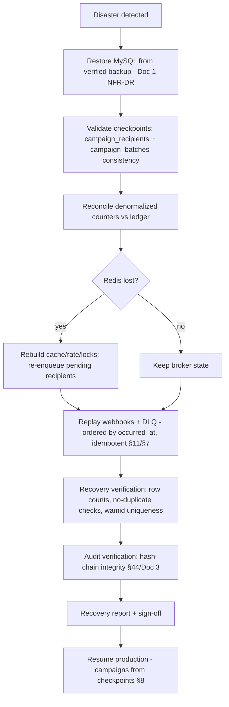

| Scenario | Replay action |
|---|---|
| **Redis loss** | Rebuild cache/rate/locks; re-enqueue pending/queued recipients from the ledger (§8.4 F1) |
| **Worker loss** | `acks_late` redelivery; re-pin Support Connector sessions (§23) |
| **Database recovery** | Restore latest **verified** backup (Doc 1 NFR-DR-04); reconcile counters |
| **Webhook replay** | Replay `webhook_events`/DLQ ordered by `occurred_at`, idempotent, dedup-protected (§11) |
| **Campaign replay** | Resume from `campaign_batches`; already-sent skipped (§8) |
| **Checkpoint validation** | Verify recipient/batch status coherence before resuming |
| **Recovery verification** | Row counts, `wamid` uniqueness, no-duplicate assertions |
| **Audit verification** | Validate the audit hash-chain (§44) — detect tampering during the incident |
| **Integrity validation** | DB constraints + reconciliation prove effectively-once (§8.5) |

**Design decisions (D30).** Recovery is a **verified workflow with sign-off**, not an ad-hoc scramble — because
"we restored" is not the same as "we proved it's correct." **Trade-off:** verification adds recovery time vs.
guaranteed integrity — integrity wins for a messaging system. **Failure handling:** each step is idempotent and
re-runnable; a failed verification blocks resume until resolved. **Performance:** re-enqueue/replay scale on the
normal pools; verification is bounded by partition/time. **Scalability:** works across the multi-node fleet
(§23). **Security:** disaster replay is a **highly-governed** operation (§43); every action is audited (§44);
replays cannot bypass idempotency/compliance. **Future extensibility:** per-channel replay (Support Connector
session/inbox recovery, Doc 6.5) reuses this orchestrator. **Cross-refs:** §7, §8, §11, §15, §23, §44; Doc 1
NFR-DR; Doc 3 backups/audit; Doc 5 System Health; Doc 11 (runbooks).

## 42. Enterprise SLA Matrix

**Purpose.** Turn implicit expectations into **explicit, owned, monitored service objectives** per queue — so
"is it healthy?" has a numeric answer, alerts have thresholds, and incidents have owners. This is the contract
that monitoring (§13/§35), backpressure (§29), and governance (§43) enforce.

**Responsibilities.** Define availability/latency/RTO/RPO per queue; assign business priority, a recovery owner,
an escalation level, and the monitoring each requires.

**Architecture.** The matrix is the reference the alerting layer (§13.4) and SLA-compliance reports (§35) are
computed against; breaches route to the escalation path and the on-call owner (Doc 11 runbook).

| Queue / work | Availability | Latency SLO | RTO | RPO | Business priority | Recovery owner | Escalation | Monitoring |
|---|---|---|---|---|---|---|---|---|
| `sends.priority` (agent) | 99.9% | p95 queued→send < 1 s | ≤ 5 min | 0 (ledger) | **Critical** | On-call SRE | L1→L2 | real-time + alert |
| `support.*` (Support Connector) | 99.9% | p95 inbound→UI < 3 s | ≤ 5 min | 0 | **Critical** | On-call SRE | L1→L2 | real-time + connector health |
| `sends.bulk` (campaign) | 99.5% | paced to tier (not latency-SLO'd) | ≤ 15 min | 0 | High | Campaign ops | L2 | throughput + backlog |
| `webhooks.*` | 99.9% | ack < 200 ms; applied p95 < 2 s | ≤ 5 min | 0 (Meta 7-day retry) | **Critical** | On-call SRE | L1→L2 | ingest/process lag |
| `sends.retry` | 99.5% | first retry within backoff floor | ≤ 15 min | 0 | High | Campaign ops | L2 | retry depth/exhaustion |
| `media` | 99.5% | p95 < 60 s | ≤ 30 min | 0 | Medium | Platform ops | L3 | depth + fetch latency |
| `ai` | 99.0% | p95 < 180 s | ≤ 30 min | 0 | Medium | Platform ops | L3 | latency + token/cost |
| `imports`/`exports` | 99.0% | job SLA (≥10k/min · ≥50k/min) | ≤ 1 h | 0 | Medium | Platform ops | L3 | rows/min, failures |
| `analytics.rollup` | 99.0% | rollup lag < 1 h | ≤ 4 h | ≤ 1 h | Low | Data ops | L4 | rollup lag |
| `cleanup`/`maintenance` | 99.0% | cadence met | ≤ 24 h | ≤ 24 h | Low | Platform ops | L4 | job success + drift |
| `scheduler.tick` (Beat) | 99.9% | tick on schedule | ≤ 5 min | 0 | **Critical** (singleton+standby) | On-call SRE | L1 | missed ticks |

**Design decisions (D31).** SLOs are **per queue** (not one blanket SLA) because a delayed nightly rollup is not
the same incident as a stalled agent-reply queue. **Trade-off:** more objectives to track vs. precise, fair
alerting. **Failure handling:** an SLO breach triggers the defined escalation, not a generic page. **Performance/
Scalability:** the matrix scales by adding rows for new queues/channels. **Security:** SLA/ownership data is
operational, `system:read`. **Future extensibility:** each new channel/queue gets a matrix row. **Cross-refs:**
§13, §29, §35, §43; Doc 1 NFR (perf/DR); Doc 11 (runbooks).

---

## 43. Queue Governance

**Purpose.** Control **who may perform sensitive queue/ops actions**, mapped to the RBAC model (Doc 1 §3.1 /
Doc 4 §4) — so powerful operations are authorized, least-privilege, and auditable.

**Responsibilities.** Define each privileged action's required permission; enforce it at the API/ops layer;
require a **reason** for the most sensitive actions; feed every action to the audit trail (§44).

**Architecture.** Governed actions are permission-gated exactly like the rest of the platform (Doc 4 §4). Where
the existing catalog suffices, we reuse it; a small set of **new ops permissions** is recommended and, because
Docs 1/4 are frozen, is added to the permission catalog via **CHANGELOG** (consistent with the dual-channel
precedent).

| Action | Required permission | Reason required? |
|---|---|---|
| Pause / resume a queue | `system:manage` | yes |
| Replay DLQ (item/bulk) | `system:manage` (+ `webhooks:manage` for webhook DLQ) | yes |
| **Delete** DLQ entry | `system:manage` + elevated (`ops:dlq_delete`, new) | **yes** |
| Scale workers (up/down) | `system:manage` | no (routine) / yes (manual override) |
| Modify throttling / pacing | `system:manage` | yes |
| **Emergency stop** (halt sends) | `ops:emergency` (new, Owner/Admin-only) | **yes** |
| Resume production (post-incident) | `ops:emergency` or `system:manage` | **yes** |
| Force campaign resume | `campaigns:manage` (+ `system:manage` if overriding safety) | yes |
| Enter/exit maintenance (§40) | `system:manage`; **rollback** → `ops:emergency` | **yes** |
| Disaster replay (§41) | `ops:emergency` (Owner/Admin) | **yes** |
| Maintenance approval | Owner / Administrator | **yes** |

**Design decisions (D32).** Governance **reuses RBAC** rather than inventing a parallel auth model — one source
of truth (Doc 1). The most destructive actions (DLQ delete, emergency stop, disaster replay, rollback) require a
**dedicated high-privilege permission + a mandatory reason**. **Trade-off:** a few new permissions to seed vs.
safe, least-privilege ops. **Failure handling:** an unauthorized attempt is refused (`403`) and audited.
**Performance:** standard permission check. **Security (primary concern):** least privilege, reason-on-record,
full audit, Owner-only for the "break-glass" set; server-enforced (never UI-only). **Future extensibility:**
per-channel governance (e.g., who may reconnect a Support Connector) reuses the same map. **Cross-refs:** Doc 1
§3.1; Doc 4 §4; Doc 5 (roles/permissions); §40, §41, §44.

---

## 44. Queue Audit Architecture

**Purpose.** Guarantee an **immutable, tamper-evident record** of every queue/operational action — who did what,
when, and **why** — for compliance, forensics, and trust, especially around the powerful actions governed by
§43.

**Responsibilities.** Capture every privileged/ops action with actor, timestamp, target, before/after, and
reason; make records tamper-evident; expose them for review; retain per policy.

**Architecture.** Ops actions are written to the existing immutable **`audit_logs`** (Doc 3 §11.2) — append-only,
hash-chained (`prev_hash`/`row_hash`) — under an ops action namespace, so they live alongside business-audit
events and are searchable in the **Audit Logs** screen (Doc 5 B11.10) and API (`/audit-logs`, Doc 4 §22).

| Audited event | Captured detail |
|---|---|
| Queue creation / deletion | actor, queue, config, reason |
| Worker restart / scaling | actor (or `system` for autoscaler), pool, from→to counts |
| DLQ replay / delete | actor, item(s)/filter, outcome, reason |
| Campaign pause / resume / force-resume | actor, campaign, prior state, reason |
| Maintenance enter/exit / rollback | actor, mode, ETA, reason |
| Emergency actions (stop/resume) | actor, scope, reason (mandatory) |
| Throttling / configuration changes | actor, setting, before→after, reason |
| Replay operations (webhook/disaster) | actor, scope, verification result |
| Disaster-replay steps (§41) | actor, step, integrity/verification outcome |

Every record carries **operator identity, timestamp, and reason** (reason mandatory for §43's sensitive set).

**Design decisions (D33).** **Reuse the immutable, hash-chained `audit_logs`** rather than a separate store —
one authoritative, tamper-evident trail (Doc 3 §11.2 / Doc 1 NFR-SEC-07). **Trade-off:** ops + business events
share a table (mitigated by an action namespace + indexes). **Failure handling:** an audit-write failure is
itself alerted; the action's durable effect still exists in state/logs. **Performance:** append-only insert into
a partitioned table (Doc 3 §14). **Scalability:** partitioned/retained like all high-volume logs. **Security
(primary concern):** append-only, hash-chained, non-editable, `audit:read`-gated; supports the disaster **audit
verification** step (§41). **Future extensibility:** per-channel ops (connector reconnect/session actions,
Doc 6.5) audit into the same trail. **Cross-refs:** Doc 1 NFR-SEC-07; Doc 3 §11.2/§14; Doc 4 §22; Doc 5 B11.10;
§41, §43.

## 45. Architectural Decision Appendix — Broker & Framework Comparison

**Purpose.** Justify the **Celery + Redis** choice (mandated by the stack, Doc 1) against the major alternatives,
so the decision is documented, defensible, and has a clear migration path if requirements change. This extends
decision **D18** (broker abstraction) and **D4** (priority via queues) into **D34**.

**Context & selection criteria.** The platform is **Python-first**, **self-hosted**, single-tenant, and must be
**operable by a small team** at a target of ≤100 numbers. Selection weighs: Python-native fit, self-hosting
simplicity, durability + idempotency support, operational complexity, and a clean **future migration path**
(the design keeps durability in MySQL and abstracts the broker, so a swap changes config, not task logic).

**Chosen: Celery + Redis.** Advantages: native Python, mature, batteries-included (retries, ETA, beat,
routing), simple self-hosting, Redis doubles as cache/locks/rate/pub-sub. Disadvantages: Redis-as-broker lacks
native priorities/streams guarantees (mitigated by multi-queue priority D4 and MySQL durability D19).
Fit: excellent for this stack and scale.

Each alternative below: **Advantages · Disadvantages · Why rejected (for us) · Migration possibility ·
Long-term maintainability · Operational complexity · Performance trade-offs.**

**RabbitMQ**
- *Advantages:* true priorities, flexible routing, per-message ack/durability, mature. *Disadvantages:* another
  system to run (Erlang), more ops surface. *Why rejected:* not needed at target scale; Redis already required
  for cache/locks/rate. *Migration:* **first-class** — Celery supports it; swap broker config, task logic
  unchanged (D18). *Maintainability:* good, but adds a stateful cluster to steward. *Ops complexity:* moderate–
  high. *Performance:* excellent routing; slightly heavier per-message than Redis.

**Apache Kafka**
- *Advantages:* massive throughput, durable log, replay, stream processing. *Disadvantages:* heavy (ZooKeeper/
  KRaft), not a task-queue (no per-message ack/retry semantics), steep ops. *Why rejected:* over-engineered for
  task dispatch at ≤100 numbers; task-queue semantics would be rebuilt on top. *Migration:* possible for an
  **event-streaming** layer later (analytics/event bus), not as the task broker. *Maintainability:* demanding.
  *Ops complexity:* high. *Performance:* superb for streams; poor ergonomic fit for retryable RPC-style tasks.

**Redis Streams**
- *Advantages:* durable consumer groups, ordering, already-present Redis. *Disadvantages:* lower-level than
  Celery; retries/ETA/beat must be hand-built. *Why rejected:* Celery already gives the batteries; Streams would
  reinvent them. *Migration:* natural evolution if we outgrow Celery-on-Redis while staying on Redis.
  *Maintainability:* good but more bespoke code. *Ops complexity:* low (same Redis). *Performance:* very good.

**Amazon SQS**
- *Advantages:* fully managed, durable, scalable, cheap at rest. *Disadvantages:* cloud-managed (conflicts with
  self-hosting), at-least-once only, limited priority, visibility-timeout model. *Why rejected:* **self-hosted**
  requirement; vendor lock-in. *Migration:* feasible on AWS (Celery supports SQS) — config swap. *Maintainability:*
  excellent (managed). *Ops complexity:* very low (but external dependency). *Performance:* good; higher latency
  than local Redis.

**Google Pub/Sub**
- *Advantages:* managed, global scale, push/pull. *Disadvantages:* cloud lock-in, not a task queue, at-least-
  once, weak priority. *Why rejected:* self-hosting + not task-shaped. *Migration:* possible on GCP as a
  transport. *Maintainability:* excellent (managed). *Ops complexity:* very low (external). *Performance:* good;
  network-bound.

**Azure Service Bus**
- *Advantages:* managed, sessions/ordering, DLQ built-in, enterprise features. *Disadvantages:* cloud lock-in,
  cost, .NET-centric ecosystem. *Why rejected:* self-hosting; Python fit weaker. *Migration:* possible on Azure.
  *Maintainability:* good (managed). *Ops complexity:* low (external). *Performance:* good; network-bound.

**Temporal**
- *Advantages:* durable **workflows**, built-in retries/state/versioning, excellent for long-running
  orchestrations. *Disadvantages:* a workflow engine (paradigm shift), its own cluster + DB, heavier. *Why
  rejected:* our durability/checkpointing is already solved in MySQL (§8) with far less operational weight; would
  duplicate concerns. *Migration:* attractive **later** for complex automation/flow orchestration (Doc 9) — could
  run alongside. *Maintainability:* strong for workflows, more infra. *Ops complexity:* high. *Performance:*
  great for orchestration; overkill for simple sends.

**BullMQ**
- *Advantages:* excellent Redis-based queue, great DX. *Disadvantages:* **Node.js**-native. *Why rejected:*
  wrong language ecosystem (backend is Python). *Migration:* n/a without a language change. *Maintainability:*
  good in Node. *Ops complexity:* low. *Performance:* very good.

**NATS (JetStream)**
- *Advantages:* very fast, lightweight, durable JetStream, simple ops. *Disadvantages:* smaller Python task
  ecosystem, task-queue semantics hand-built, newer for this use. *Why rejected:* less mature Python task
  tooling vs. Celery; no compelling need. *Migration:* possible as a high-performance transport later.
  *Maintainability:* good. *Ops complexity:* low–moderate. *Performance:* excellent, low latency.

**Summary (D34).** Celery + Redis is the **best fit** for a Python-first, self-hosted platform at this scale:
lowest operational complexity, native ecosystem, and it reuses the Redis we already run. Because **durability
lives in MySQL** and the **broker is abstracted** (D18/D19), none of the above is a one-way door — RabbitMQ is a
drop-in broker upgrade for native priorities, Redis Streams a natural in-place evolution, Temporal a future
option for complex workflow orchestration (Doc 9), and managed services (SQS/Pub-Sub/Service Bus) become viable
if the deployment ever moves to a specific cloud. **Cross-refs:** D4, D18, D19; §16.4; Doc 1 (stack), Doc 8
(deployment), Doc 9 (automation).

---

## 46. Self-review record — enhancement pass 2 (v1.1 freeze)

Re-reviewed the **entire** document (§1–§45) as **Enterprise Architect, Backend Lead, Distributed Systems
Engineer, Performance Engineer, DevOps Engineer, Security Engineer, DBA, QA Lead, SRE, Product Architect**;
gaps closed before freezing:

- **Additive integrity:** no existing section (§1–§34) was modified, renumbered, removed, or reworded; §35–§46
  are appended, reuse the established style/format/terminology, and extend the decision record (D24–D34). ✔
- **Insight layer (Enterprise Architect/Data):** analytics (§35), predictive capacity (§36), and cost analytics
  (§37) turn raw metrics into decisions, forecasts, and finance-grade cost visibility — every metric's purpose
  is stated; all built on durable rollups (Doc 3), no hot-path impact. ✔
- **Pre-flight safety (Product/QA):** the simulation engine (§38) predicts outcomes **without touching
  production**, feeding the Campaign Wizard and capacity checks. ✔
- **Change safety (Backend/DevOps):** task versioning (§39) + maintenance mode (§40) deliver zero-downtime
  rolling upgrades and controlled maintenance/rollback with no data loss or duplication (uses `acks_late`,
  checkpoints, idempotency). ✔
- **Recoverability (SRE/DBA):** disaster replay (§41) is an orchestrated, **verified** workflow with integrity +
  audit checks — proving effectively-once recovery, not just "restored." ✔
- **Operability (SRE):** the SLA matrix (§42) gives every queue owned, monitored objectives that drive alerting
  and escalation. ✔
- **Security & control (Security):** governance (§43) maps every powerful action to RBAC with mandatory reasons
  for break-glass operations, and audit (§44) records them immutably in the hash-chained trail — server-enforced,
  least-privilege, tamper-evident. ✔
- **Decision rigor (Architect):** the broker/framework appendix (§45) documents nine alternatives with a clear
  rationale and migration paths — the choice is defensible and non-locking. ✔
- **Dual-channel consistency (Product Architect):** every new section explicitly accounts for both Channel 1
  (Meta) and the vendor-neutral Support Connector (Channel 2) — analytics/cost/SLA/governance/audit are
  channel-labelled; connector specifics remain authoritative in Doc 6.5. ✔
- **Cross-document alignment (all):** §35–§45 reference frozen Docs 1/3/4/5 and forward to Docs 6.5/7/8/9/10/11;
  nothing contradicts a frozen document; new permissions (§37/§43) are flagged for CHANGELOG addition, not
  silent edits. ✔

**No further architectural gaps identified. Document 6 frozen as Version 1.1 — authoritative asynchronous
architecture for the platform.**


---

## 47. Enterprise Domain Event Bus & Extension Points

**Purpose (additive, v1.2).** Specify the first-class internal **domain event bus** that lets modules
communicate by **publishing/subscribing to business events** instead of calling each other directly — so
future modules consume events **without changing existing modules**. Referenced throughout (§17 automation,
Doc 9 §28, Doc 12 §10/§14); this section makes it authoritative. It distributes the **business-event ledger**
(Doc 3 §21).

**Scope.** Event envelope, topics, publish/subscribe rules, ordering, idempotency, retry, DLQ, replay,
fan-out, delivery guarantees, correlation/trace ids, versioning, lifecycle, extension points.

**Architecture.**
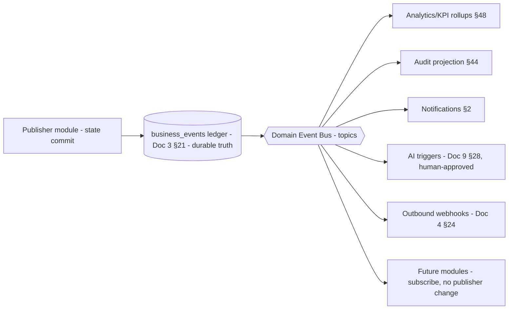
- **Durable-first (CD/D35):** a publisher **appends the event to the `business_events` ledger** (Doc 3 §21) as
  the source of truth, **then** publishes to the bus. Durability + replay come from the ledger; the bus adds
  low-latency fan-out (Redis pub/sub + per-subscriber durable queues on the async fabric §2).
- **Event envelope** = the `business_events` row shape (Doc 3 §21.4): `event_id (uuid) · event_type ·
  event_version · occurred_at · actor · subject · channel_type · connector_id · campaign_id · correlation_id ·
  trace_id · source · payload`.
- **Topics:** hierarchical by domain — `lead.*`, `campaign.*`, `payment.*`, `sim.*`, `ai.*`, `template.*`,
  `connector.*`, `user.*`. Subscribers register for topic patterns.
- **Publish rules:** a module publishes **exactly one authoritative event after its state commit**
  (write-then-publish); idempotent by `event_id`. No module publishes another module's events.
- **Subscribe rules:** each subscriber gets its **own durable delivery queue** (§2 shape) → **independent,
  isolated** processing; a slow/failing subscriber **never blocks** the publisher or other subscribers.
- **Ordering:** **per-subject ordering** preserved (events for one subject delivered in `occurred_at` order);
  global ordering is not guaranteed nor required (§11 pattern).
- **Idempotency:** at-least-once delivery + idempotent handlers (dedupe by `event_id` per subscriber) =
  **effectively-once** (§8).
- **Retry / DLQ:** subscriber failures retry with backoff (§6) → **per-subscriber dead-letter** (§7); nothing
  is lost; replay available.
- **Replay:** because the ledger is the durable log, any subscriber/projection is **rebuilt by idempotently
  replaying** events from any point (Doc 3 §21.5) — new analytics or a new module need no new capture.
- **Fan-out:** one event → N subscribers, fully decoupled.
- **Delivery guarantees:** at-least-once per subscriber; ordered per subject.
- **Correlation/trace:** `correlation_id`/`trace_id` propagate through the event chain (§13) for end-to-end
  traceability.
- **Versioning:** `event_version` in the envelope; additive payload changes are tolerated; subscribers handle
  known versions (§39 analogue).
- **Lifecycle:** emitted → persisted (ledger) → published → delivered per subscriber → processed/acked →
  retained/archived (Doc 3 §21.5).
- **Extension points:** a **new module subscribes to existing events** (e.g., a future analytics/commerce
  module) with **zero change to publishers** — the core decoupling guarantee.

**Design decisions.**
- **D35 — Durable-first event bus over the ledger.** *Why:* durability + replay without a separate event store;
  the ledger (Doc 3 §21) is the truth. *Alternative:* fire-and-forget pub/sub (rejected — loses events, no
  replay). *Trade-off:* one write before publish (already done for the ledger). *Migration:* a dedicated
  streaming bus (Kafka/NATS) can back the transport later without changing publishers/subscribers (§45).
- **D36 — Per-subscriber independent durable queues.** *Why:* isolation — one bad subscriber can't stall the
  system. *Alternative:* shared consumer of a single stream (rejected — coupling/back-pressure). *Trade-off:*
  more queues (cheap). *Migration:* consumer groups on a streaming bus.
- **D37 — Publish-after-commit, idempotent, per-subject ordered.** *Why:* correctness (no events for uncommitted
  state; no duplicates; consistent per-subject sequence). *Alternative:* publish-in-transaction/2PC (rejected —
  complexity); global ordering (rejected — unnecessary, costly). *Trade-off:* a brief publish lag. *Migration:*
  outbox pattern already effectively used (ledger = outbox).

**Trade-offs / failure / performance / scalability / security / future / cross-refs.**
*Trade-off:* an event-driven backbone adds indirection vs. direct calls — accepted for decoupling + extensibility.
*Failure:* subscriber failures are retried/DLQ'd; the publisher and ledger are unaffected (§6/§7). *Performance:*
publish is O(1); subscribers scale independently (§30). *Scalability:* add subscribers/modules with no publisher
change; transport scales to a streaming bus at volume (§45). *Security:* subscribers are permission-scoped;
customer-facing effects (e.g., AI) still require human approval (Doc 9 §30) — the bus never bypasses it.
*Future:* omnichannel/commerce/automation modules attach as subscribers (Doc 7 §29, Doc 12 §37). *Cross-refs:*
Doc 3 §21, §2/§6/§7/§8/§11/§13/§17/§39/§44/§45, Doc 4 §24, Doc 9 §28, Doc 12 §10/§14.

---

## 48. Business KPI Metric Catalog

**Purpose (additive, v1.2).** Define the authoritative enterprise **business** metrics — **not** dashboards
(Doc 5 Part G designs those) and **not** technical/operational monitoring (§13/§42; Doc 8 §52). Every KPI is
computed from the **business-event ledger** (Doc 3 §21) and the **cost engine** (§37). The Executive Business
Dashboard references **only** this catalog.

**Scope.** The metric definitions below. Each specifies **Purpose · Formula · Source events · Refresh · Owner ·
Retention · Future expansion.** *Refresh:* "stream" = updated continuously from the event bus (§47);
"rollup" = scheduled aggregation (§35). *Retention:* aligns with the ledger (Doc 3 §21.5) so history survives.

| KPI | Purpose | Formula | Source events (Doc 3 §21) | Refresh | Owner | Future |
|---|---|---|---|---|---|---|
| **Reactivation Rate** | Core success measure | `customer.reactivated` ÷ eligible targeted contacts (period) | `customer.reactivated`, campaign audience | rollup (daily) | Owner | by segment/region |
| **Conversion Rate** | Campaign effectiveness | `campaign.converted` ÷ `campaign.delivered` | `campaign.delivered`, `campaign.converted` | rollup | Product | per template/variant |
| **Campaign ROI** | Value vs spend | (revenue recovered attributed − campaign cost §37) ÷ campaign cost | `payment.received`/`sim.activated` (attributed), cost (§37) | rollup | Owner | multi-touch attribution |
| **Revenue Recovery** | Business value recovered | Σ `payment.received.amount` attributed to reactivation (period) | `payment.received` | rollup | Owner | forecast band |
| **Cost per Reactivation** | Unit economics | total (messaging+AI+infra) cost §37 ÷ `customer.reactivated` count | cost (§37), `customer.reactivated` | rollup | Owner | by channel |
| **Cost per Lead** | Acquisition efficiency | total cost §37 ÷ `lead.created` count | cost (§37), `lead.created` | rollup | Product | by source |
| **Lead Funnel** | Stage-by-stage drop-off | counts + stage-to-stage conversion across the lead pipeline | `lead.created→qualified→document.received→kyc.completed→payment.received→sim.activated→customer.reactivated` | rollup | Product | custom pipelines (Doc 7 §19) |
| **Lead Velocity** | Speed of progression | avg elapsed time between stage events (e.g., created→reactivated) | lead stage events | rollup | Product | SLA alerts |
| **Agent Productivity** | Team output (business) | leads progressed / reactivations per agent per period | `lead.assigned`, stage events, `customer.reactivated` | rollup | Ops | per team |
| **Customer Response Rate** | Engagement | inbound replies ÷ outbound messages (period) | message events (Doc 3 §9) | stream/rollup | Ops | per channel |
| **AI Acceptance Rate** | AI quality (business) | `ai.approved` ÷ (`ai.approved` + `ai.rejected`) | `ai.approved`, `ai.rejected` | stream | AI Op | per feature/model |
| **AI Productivity** | AI leverage | AI-assisted approved outputs ÷ agent effort proxy | `ai.draft_generated`, `ai.approved` | rollup | AI Op | time-saved model |
| **Queue Efficiency** | Delivery throughput health (business input) | throughput ÷ capacity; retry/exhaustion rate | derived (§35) | stream | SRE | per number/lane |
| **Connector Utilization** | Channel-2 capacity | active connector time ÷ capacity; msgs per connector | `connector.connected/disconnected`, message events | rollup | Support | per connector |
| **Forecast Metrics** | Forward view | projected reactivations/revenue/cost via trend model (§36) on the above | all of the above | rollup (scheduled) | Owner | scenario planning |

- **Retention (all):** aligned with the business-event ledger (Doc 3 §21.5) — rollups persisted before raw
  partitions prune, so KPI history is permanent.
- **Owner (all):** business KPIs are owned by the **Owner/Product**; operational-input KPIs (queue/connector)
  by SRE/Support — consistent with governance (Doc 12 §31/§63).

**Design decision.**
- **D38 — Event-sourced KPI catalog as the single business-metric contract.** *Why:* one authoritative
  definition (formula + source events) prevents divergent numbers across surfaces; derives from the immutable
  ledger so metrics are reproducible/replayable. *Alternative:* per-dashboard ad-hoc queries (rejected —
  inconsistent, unversioned). *Trade-off:* a catalog to govern. *Migration:* new KPIs are additive rows reading
  existing events.

**Trade-offs / failure / performance / scalability / security / future / cross-refs.** *Failure:* a missing
rollup self-heals on the next run (idempotent, §35). *Performance:* KPIs read pre-aggregated rollups, not the
raw ledger (fast). *Scalability:* rollups scale with the ledger (partitioned). *Security:* KPI/finance data is
permission-gated (`analytics:read`/`finance:read`, §37; new `analytics:executive` for the exec view, Doc 5
Part G — seeded via CHANGELOG). *Future:* new KPIs/forecasts read existing events additively. *Cross-refs:*
Doc 3 §21, §35/§36/§37/§47, Doc 5 Part G, Doc 12 §31.

---

*End of Document 6 — Queue & Scheduler Design (Version 1.2, FROZEN). §21–§34 (pass 1, v1.0); §35–§46 (pass 2,
v1.1); §47–§48 added in the final additive pass (v1.2): the Domain Event Bus & Extension Points and the Business
KPI Metric Catalog, both built on the business-event ledger (Doc 3 §21). Support Connector specifics are
authoritative in Doc 6.5 — Dual-Channel Architecture.*


