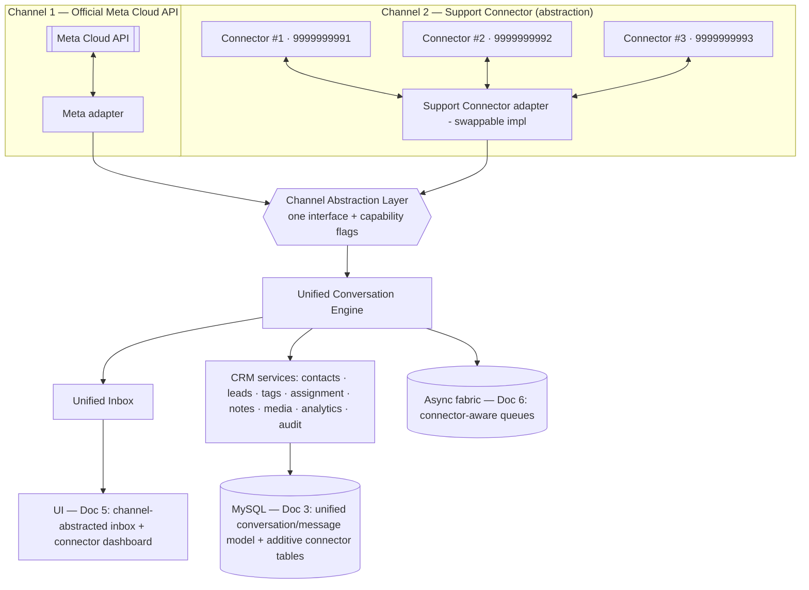
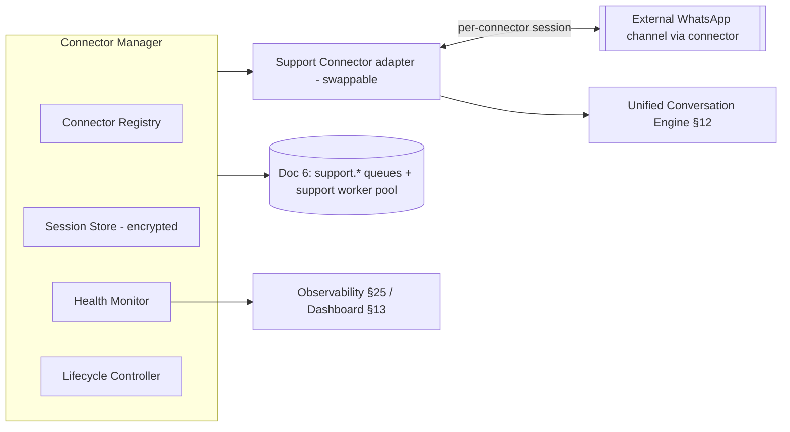
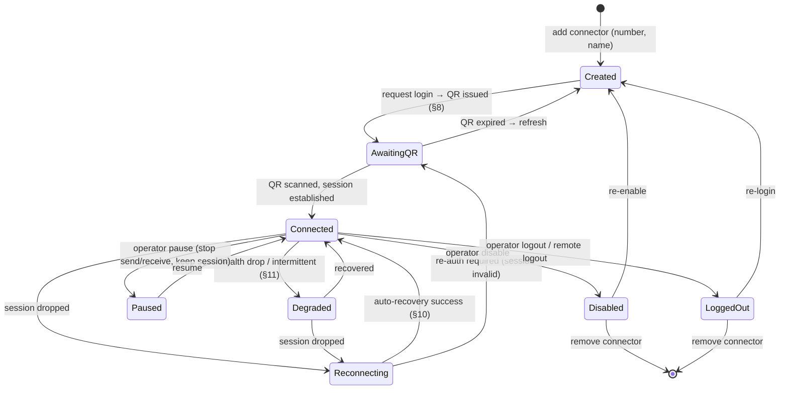
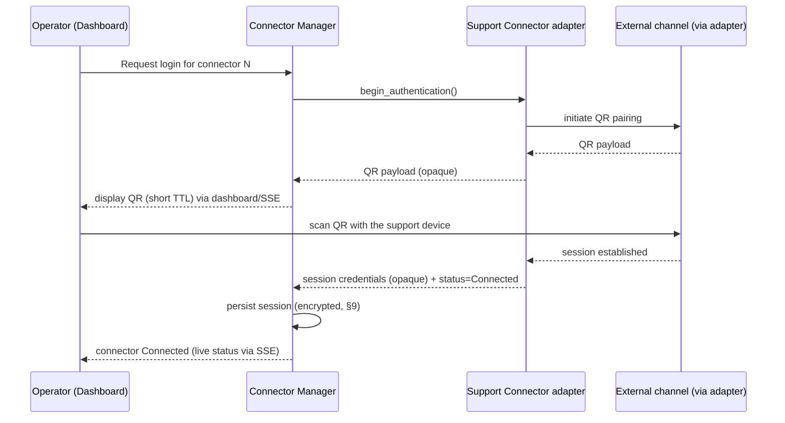
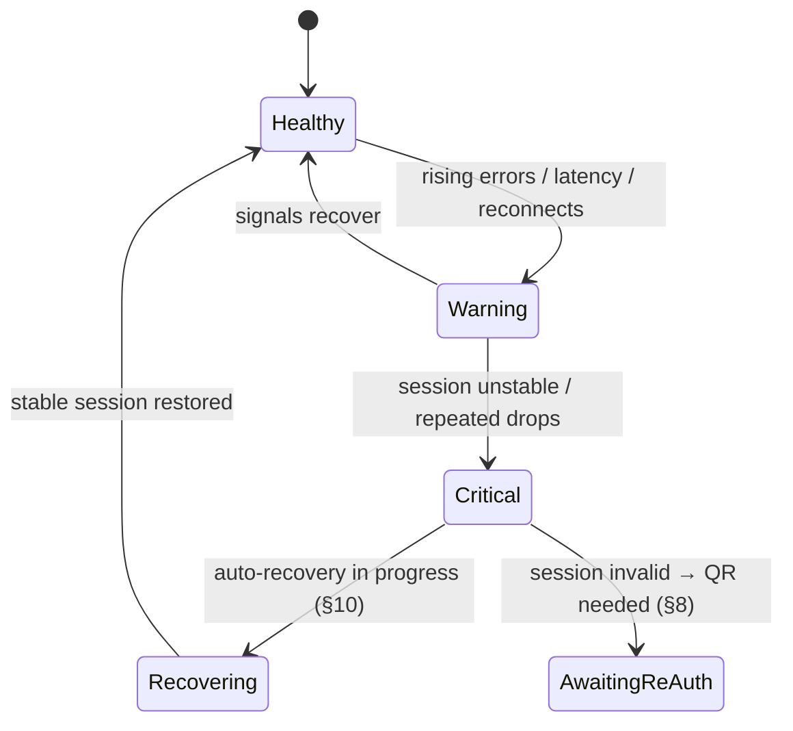
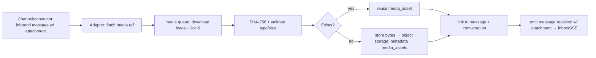

# Integrations & Channel Architecture
### Self-Hosted WhatsApp Business Platform

| | |
|---|---|
| **Document** | 7 of 8+ — Integrations & Channel Architecture (authoritative dual-channel specification) |
| **Version** | 1.0 (for approval) |
| **Date** | 2026-07-15 |
| **Status** | Draft awaiting owner approval |
| **Owner / sole user** | Internal — **Vi Reactivation Team** (single-tenant, not SaaS, not multi-tenant) |
| **Preceded by** | Docs 1–6 (frozen; referenced only) |
| **Realizes** | The dual-channel / Support Connector spec that frozen **Doc 6 forward-references as "Doc 6.5"** (mapped here to Doc 7) |
| **Followed by** | Doc 8 — Deployment & DevOps |

> This document is **architecture only** — no code, no API implementation, no database implementation, no UI
> implementation. It extends the frozen architecture **additively**: it introduces the second messaging
> channel and the abstraction that unifies both, referencing the frozen documents for anything already
> specified (schema, API surface, screens, queue fabric). It defines *how* two permanently coexisting
> channels — **Channel 1 (Official Meta Cloud API)** and **Channel 2 (Support Connector)** — feed one CRM
> without the CRM ever depending on a specific connector implementation.
>
> **Frozen-document rule:** Docs 1–6 are FINAL. Where this document introduces new concepts (connector
> registry, session model, lead pipelines), it defines them **logically** and marks them as **additive**
> extensions to the frozen schema/API/UI, to be applied via migrations/CHANGELOG when built — **never** by
> editing a frozen document.

---

## 1. Purpose

Define a **channel-agnostic integration architecture** in which two fundamentally different WhatsApp channels
operate as **first-class, permanent, coexisting citizens** of one platform:

- **Channel 1 — Official Meta Cloud API:** the primary outbound platform for utility templates, campaigns,
  bulk messaging, automation, official webhooks, official media, scheduling, and analytics. Primary business
  number: **9990329329**.
- **Channel 2 — Support Connector:** an **abstraction** for human, conversational customer support — manual
  chat, WhatsApp calls, rich media, customer verification, and agent workflows — delivered through one or more
  **connector instances**, each an independent connected number.

The purpose is to make both channels flow into **one Unified Conversation Engine and Unified Inbox**, sharing
contacts, tags, lead stages, notes, media, assignment, analytics, and audit — so that agents and the business
experience **one CRM**, while the **implementation behind each channel can change without changing the CRM**.

---

## 2. Scope

**In scope**
- The **Channel Abstraction Layer** and the contract every channel/connector implements.
- **Support Connector** architecture: unlimited independent connector instances; connector lifecycle; QR
  authentication; session management, recovery, and health monitoring.
- The **Unified Conversation Engine** and **Unified Inbox** across both channels.
- **Conversation and message routing**, **media/attachment flow**, and **webhook/event integration** for both
  channels.
- **Lead management** (customizable pipeline), **tag engine**, **assignment engine**, and **internal notes**
  for Support Connector conversations (and available to any channel that carries conversations).
- The **logical data model** extensions (connectors, sessions, pipelines, stages) that additively extend Doc 3.
- Failure handling, observability, performance, scalability, security, and future-channel extensibility
  (**SMS, Email, Voice, Web Chat** — **Instagram is explicitly excluded**).

**Out of scope**
- Any concrete connector *implementation* (this document depends only on the abstraction — §5).
- Anything already frozen: the send/queue fabric (Doc 6), the base schema (Doc 3), the base API surface
  (Doc 4), and the base UI system/screens (Doc 5) — referenced, not redefined.
- Campaign/broadcast mechanics (Doc 6) and template management (Docs 3–5) — Channel 1 concerns already
  specified.
- Deployment/provisioning (Doc 8), AI/automation (Doc 9), testing (Doc 10), and runbooks (Doc 11).

---

## 3. Responsibilities

| Layer | Responsibility |
|---|---|
| **Channel Abstraction Layer** | Present a single, stable channel/connector interface; declare per-adapter **capabilities**; hide all implementation detail from the rest of the platform. |
| **Channel adapters** (Meta, Support Connector, future) | Implement the interface for one channel; translate between the platform's canonical model and the channel's native protocol; the **only** components that vary per implementation. |
| **Connector Manager** | Manage the lifecycle, sessions, QR authentication, reconnect, and health of every Support Connector instance. |
| **Unified Conversation Engine** | Normalize inbound/outbound messages from every channel into one canonical conversation/message model; own routing. |
| **Unified Inbox** | Present all conversations from all channels/connectors identically to agents. |
| **CRM services** (leads, tags, assignment, notes, contacts, analytics, audit) | Operate on the canonical model — **never** on channel/connector specifics. |
| **Async fabric** (Doc 6) | Execute all channel work (send, inbound processing, session lifecycle, health) as connector-aware queued tasks. |

**Guiding invariant:** *the CRM, database, APIs, queues, analytics, AI, UI, permissions, reporting, and
business logic depend only on the abstraction; only adapters vary.* Replacing a connector implementation must
require changing **only that adapter** — no database, API, UI, queue, or business-logic redesign (Doc 6 §21,
§31; Doc 3 `channel_type`).

---

## 4. Architecture Overview

### 4.1 The two-channel, one-CRM shape

### 4.2 Key architectural principles
1. **Everything is a channel adapter behind one interface** — including the Meta Cloud API. The abstraction is
   not "WhatsApp Web vs. Cloud API"; it is "any channel that can carry conversations/messages/media/calls,"
   each declaring its **capabilities**.
2. **Capabilities, not identities, drive behavior.** The CRM asks "does this channel support bulk templates?"
   or "does this connector support calls?" — never "is this WhatsApp Web?". Channel 1 declares
   `{templates, campaigns, bulk, official_webhooks, scheduling}`; a Support Connector declares
   `{manual_chat, calls, media, qr_session}`.
3. **One canonical conversation/message model** (built on Doc 3's `channel_type`, `connector_id`,
   unified `conversations`/`messages`) — the CRM has no channel-specific tables for conversation content.
4. **Connectors are independent instances.** Unlimited Support Connectors, each with its own session, QR,
   health, metrics, media, conversation stream, unread count, assignment, tags, and lead stages.
5. **Implementation isolation.** The concrete mechanism behind a Support Connector is confined to the adapter;
   the platform never imports, references, or is coupled to it.

### 4.3 How the frozen documents fit
| Frozen doc | What it already provides for dual-channel |
|---|---|
| **Doc 1 — SRS** | Compliance (CMP), RBAC, NFRs, opt-in/window rules (Channel 1); this doc adds Channel-2 requirements additively. |
| **Doc 3 — Database** | `channel_type` on `phone_numbers`/`conversations`/`messages`; unified message ledger; media/attachments model — the canonical model this doc routes into. New connector/lead tables are **additive** (§ Logical Data Model). |
| **Doc 4 — API** | Channel-agnostic REST, cursor pagination, RFC 7807, SSE events, `Idempotency-Key`; new connector/lead endpoints are additive resources. |
| **Doc 5 — UI/UX** | Channel-abstracted inbox, design system, `channel_type` markers, future-channel readiness; the Connector Dashboard is a new screen using existing layout templates. |
| **Doc 6 — Queue/Scheduler** | Channel-aware scheduler (§21), worker affinity incl. Support Connector pool (§22), connector-aware task envelope (§31), health engine (§28), multi-server session re-pinning (§23) — the fabric that executes Channel-2 work. |

---

## 5. Channel Abstraction Layer

### 5.1 Purpose
Provide the **single seam** through which the entire platform talks to any channel — so channels can be added,
replaced, or upgraded by writing an adapter, with **zero** change to the CRM, database, API, queue, UI,
analytics, AI, permissions, or business logic.

### 5.2 The channel/connector interface (capability-based contract)
Every adapter implements one interface and **declares its capabilities**; the platform adapts to the declared
capabilities rather than branching on channel identity.

| Capability group | Operations (abstract) | Meta adapter | Support Connector adapter |
|---|---|---|---|
| **Identity** | `channel_type`, `connector_type`, `capabilities[]` | ✔ | ✔ (per instance) |
| **Session/auth** | `connect`, `authenticate` (token **or** QR), `disconnect`, `logout`, `status` | token-based (system-user token, Doc 3) | **QR-based session** (§8) |
| **Outbound messaging** | `send_text`, `send_media`, `send_location`, `send_contact`, `send_template*`, `send_reaction*` | text/media/interactive/**template**/bulk | text/media/location/contact/**manual** (no bulk/templates) |
| **Inbound stream** | `on_message`, `on_status`, `on_call*` | official webhooks (Doc 6 §11) | connector event stream (§17) |
| **Media** | `upload_attachment`, `download_attachment` | official media (Doc 3 media) | connector media (unified, §16) |
| **Calls** | `on_call`, `call_metadata*` | (Business Calling API where enabled) | **WhatsApp calls** (metadata/events) |
| **Health** | `heartbeat`, `health_signal` | number quality/tier (Doc 6 §28) | connector session health (§11) |

`*` = capability-flagged; present only where the channel supports it. The CRM **checks the flag** before
offering an action (e.g., "Broadcast" appears only for channels with `campaigns`; "Call" appears only for
connectors with `calls`). This is the mechanism behind Doc 5's channel-abstracted inbox and Doc 6's
connector-aware tasks.

### 5.3 Canonical model (what crosses the seam)
Adapters translate native payloads to/from the platform's **canonical** objects (defined by Doc 3):
`Conversation` (with `channel_type`, `connector_id`, `contact`, `phone_number`), `Message` (direction, type,
content, media reference, status), `Attachment`, `Contact`, and channel-neutral `Event`s. **Nothing
channel-specific leaks past the adapter.**

### 5.4 Adapter registration & routing
- Adapters register with the **Channel Registry** (identity + capabilities + routing/throttle/health profiles).
- The **routing policy** (Doc 6 §31) resolves `(channel_type, connector_type, capability, priority)` → the
  adapter + queue lane + throttle profile — so dispatch is a lookup, not a code branch.
- Adding a channel = **register an adapter + capabilities**; the engine is untouched (Doc 6 §31/§17).

### 5.5 Adapter compliance & selection responsibility (neutral, contained)
The platform depends only on the abstraction and is **agnostic** to how any adapter is implemented. Each
**concrete adapter is responsible for complying with the terms of the channel it integrates**; where an
official channel API exists, an **official adapter is the recommended implementation**, and the abstraction
makes replacing an adapter with an official one a **local change** (one adapter) with no CRM impact. This
document specifies the **Support Connector contract and management experience**, not any specific
implementation — precisely so the implementation can change (or be replaced by an official Meta solution)
without touching the rest of the platform.

### 5.6 Design decisions / trade-offs / failure / performance / scalability / future
- **Decision (CD1):** model **every** channel — including Meta — as an adapter behind one capability-based
  interface. *Alternative:* special-case Meta and bolt on Channel 2. *Rejected:* special-casing spreads
  channel knowledge across the CRM and blocks future channels. *Benefit:* uniformity + true extensibility.
  *Trade-off:* a capability-negotiation layer to maintain. *Migration:* new channels/adapters are additive.
- **Failure handling:** an adapter fault is isolated to its channel/connector (Doc 6 §21 lanes); the CRM keeps
  operating on the canonical model.
- **Performance:** the seam adds a thin translation step per message — negligible vs. network I/O.
- **Scalability:** adapters are stateless except for connector sessions (managed separately, §9); scale per
  channel (Doc 6 §22).
- **Future extensibility:** SMS/Email/Voice/Web-Chat adapters declare their own capabilities and slot in with
  no CRM redesign (§ Future Extensibility).
- **Cross-refs:** Doc 3 `channel_type`; Doc 6 §21/§31; Doc 5 (capability-driven UI).

---

## 6. Support Connector Architecture

### 6.1 Purpose
Deliver **human, conversational customer support** over WhatsApp through **unlimited independent connector
instances**, each behaving like its own connected support number — while every instance conforms to the same
Channel Abstraction Layer contract (§5) so the CRM treats them uniformly.

### 6.2 What a connector instance is
A **connector instance** is one connected support number (e.g., **9999999991**, **9999999992**,
**9999999993**) managed by the **Connector Manager** through the Support Connector adapter. Each instance is
**fully independent**:

| Independent per connector | Meaning |
|---|---|
| **Session** | Its own authenticated session + credentials (encrypted, §9) |
| **QR code** | Its own QR login/refresh flow (§8) |
| **Reconnect / logout** | Started/stopped independently |
| **Health** | Its own heartbeat + health score (§11) |
| **Metrics** | Its own counters (messages/calls/media today, response time, errors) |
| **Media** | Its own media stream into the unified media store (§16) |
| **Conversation stream** | Its own inbound/outbound conversations |
| **Unread count** | Its own unread tally in the inbox |
| **Assignment** | Its own agent assignment scope/rules (§21) |
| **Tags & lead stages** | Conversations carry connector context but share the global tag/pipeline definitions (§19/§20) |

### 6.3 Components

- **Connector Registry:** the source of truth for connector instances (id, display number, connector_type,
  capabilities, status, agent scope). *Additive table* (§ Logical Data Model).
- **Session Store:** encrypted session material per connector (§9).
- **Lifecycle Controller:** connect/QR/reconnect/logout/enable/disable/pause/resume (§7).
- **Health Monitor:** heartbeat, health score, auto-recovery (§11).
- **Adapter:** the only implementation-specific component; session-affine execution on the Doc 6 Support
  Connector worker pool (§22), one worker per connector session (lock-guarded, Doc 6 §9/§22).

### 6.4 Responsibilities / decisions / trade-offs / failure / performance / scalability / future
- **Responsibility split:** the Manager owns *orchestration* (registry, sessions, health, lifecycle); the
  adapter owns *protocol*; the engine owns *normalization*.
- **Decision (CD2):** connectors are **first-class independent instances**, not a single shared client — so
  one connector's session/health problem never affects another. *Trade-off:* more sessions to manage
  vs. isolation. *Migration:* the same model holds any number of connectors.
- **Failure handling:** a connector fault is isolated (its lane pauses; others continue — Doc 6 §21).
- **Performance:** per-connector streams are handled by session-affine workers; no cross-connector contention.
- **Scalability:** **unlimited connectors**; scale the Support Connector worker pool with connector count
  (Doc 6 §22/§32). **Future:** additional Support-Connector *types* (different implementations) register as new
  `connector_type`s under the same abstraction.
- **Cross-refs:** Doc 6 §22/§28/§31.

---

## 7. Connector Lifecycle

### 7.1 Purpose
Define the **explicit, enforced lifecycle** of a connector instance from creation to removal, so every state
transition is legal, observable (dashboard §13), recoverable (§10), and audited (Doc 6 §44).

### 7.2 Lifecycle state machine

### 7.3 Management operations (governed; Doc 6 §43)
Add, Remove, Rename, Enable, Disable, **Pause/Resume**, Reconnect, Logout, **Replace Session**, Health Check,
Connector Diagnostics. Each is a governed action mapped to RBAC (Doc 6 §43; permissions to be seeded per Doc 1
model) and **audited** (Doc 6 §44).

### 7.4 Transition rules & recovery
- **Created→Connected** requires a successful QR authentication (§8).
- **Connected↔Degraded/Reconnecting** are health-driven and mostly **automatic** (§10/§11).
- **Paused** stops send/receive but **keeps the session warm**; **Disabled** stops the connector entirely;
  **LoggedOut** invalidates the session (requires re-login).
- **Removal** requires Disabled/LoggedOut first; conversation history is retained (data ownership) and its
  `connector_id` remains valid for audit/analytics.
- Illegal transitions are rejected and surfaced on the dashboard; every transition is durable (survives
  restart) and recorded.

### 7.5 Decisions / trade-offs / failure / performance / scalability / future / cross-refs
- **Decision (CD3):** connector lifecycle is a **durable state machine** (state in MySQL, not just in a
  worker) so it survives restarts and multi-node failover (Doc 6 §23). *Trade-off:* state persistence overhead
  vs. reliability. **Failure:** a worker crash re-pins the session and resumes from the persisted state (Doc 6
  §22/§23). **Performance:** transitions are infrequent, cheap. **Scalability:** independent per connector.
  **Future:** new lifecycle states (e.g., "Migrating adapter") extend the machine additively.
  **Cross-refs:** §8–§11; Doc 6 §22/§23/§43/§44.

---

## 8. QR Authentication Architecture

### 8.1 Purpose
Specify the **QR-based login flow and its management** for connectors whose adapter requires QR pairing — as a
**capability-driven, implementation-neutral** orchestration. (Token-based channels like Meta skip this; the
abstraction supports both auth modes, §5.2.)

### 8.2 Flow (abstract; adapter performs the channel-native pairing)

### 8.3 QR management
- **QR display:** the QR payload is **opaque** to the platform (the adapter produces it); the dashboard renders
  it live and streams status via SSE (Doc 4 §24 events).
- **QR refresh:** QR codes are **short-lived**; an expired QR is refreshed on demand or automatically while the
  connector is in `AwaitingQR` — no stale codes.
- **One QR per connector:** each instance authenticates independently (§6.2).
- **Security:** QR payloads and resulting session credentials are treated as **secrets** — never logged, never
  persisted in plaintext, encrypted at rest (§9, §27).

### 8.4 Decisions / trade-offs / failure / performance / security / future / cross-refs
- **Decision (CD4):** QR is modeled as **one auth mode of the abstraction's `authenticate` capability**, not a
  first-class platform concept — so token-based and QR-based connectors coexist and a QR adapter can later be
  swapped for a token/official adapter with no CRM change. *Trade-off:* a small auth-mode negotiation.
  **Failure:** QR expiry/failed pairing returns to `AwaitingQR` with a refreshed code; never a dead end.
  **Performance:** QR issuance is on-demand and rare. **Security:** opaque payloads, encrypted sessions, TTL'd
  QR (§27). **Future:** additional auth modes (e.g., official onboarding) are new capability variants.
  **Cross-refs:** §5.2, §9; Doc 4 §24 (SSE), Doc 5 (dashboard QR).

---

## 9. Session Management

### 9.1 Purpose
Own the **secure, durable lifecycle of each connector's authenticated session** so connectors stay connected,
survive restarts/failover, and never leak credentials.

### 9.2 Architecture
- **Session Store:** each connector's session material is stored **encrypted at rest** (application-layer
  AES-GCM via a managed key, consistent with Doc 3's treatment of WABA tokens) in an *additive* connector
  session table (§ Logical Data Model). The plaintext session exists only in the session-affine worker's memory
  while active.
- **Single active holder:** exactly **one worker drives one connector session** at a time (session-affinity +
  per-connector lock, Doc 6 §9/§22) — no split-brain, no duplicate streams.
- **Heartbeat:** the holding worker maintains a heartbeat for the session (Doc 6 §23); loss of heartbeat →
  recovery (§10).
- **Session operations:** establish (§8), refresh, **replace session** (re-auth without removing the
  connector), disconnect, logout (invalidate).

### 9.3 State tracked per session
Connection status, connected-since, last-activity, reconnect attempts, health score, expiry/validity, holding
worker/node — surfaced on the dashboard (§13) and to observability (§25).

### 9.4 Decisions / trade-offs / failure / performance / security / scalability / future / cross-refs
- **Decision (CD5):** durable, encrypted, single-holder sessions — sessions are **operational secrets with
  strong lifecycle guarantees**. *Trade-off:* encryption + affinity coordination vs. security & correctness.
  **Failure:** holder loss triggers re-pin + recovery (§10) with no duplicate streams (lock/fencing, Doc 6 §9).
  **Performance:** session ops are infrequent; message throughput is unaffected. **Security:** encrypted at
  rest, never logged, least-privilege access, rotation on replace (§27). **Scalability:** sessions distribute
  across the support worker pool/nodes. **Future:** token-based sessions (official adapters) use the same store
  and lifecycle with a different credential shape. **Cross-refs:** Doc 3 (encryption pattern), Doc 6 §9/§22/§23.

---

## 10. Session Recovery

### 10.1 Purpose
Guarantee connectors **auto-recover** from drops, worker/node failures, restarts, and deployments — restoring
the stream with **no duplicate messages** and minimal operator involvement.

### 10.2 Recovery scenarios
| Event | Behavior | Operator action |
|---|---|---|
| **Transient session drop** | Auto-reconnect with backoff (bounded attempts); state `Reconnecting` | none (watch dashboard) |
| **Worker crash** | Session **re-pinned** to a healthy support worker (Doc 6 §22/§23); resume from persisted session | none |
| **Node failure** | Heartbeat lease expires → re-pin on another node; `acks_late` redelivers in-flight tasks | none |
| **Deployment restart** | Graceful drain (Doc 6 §3.5); session re-attached post-deploy | none |
| **Session invalidated** (remote logout/expiry) | State → `AwaitingQR`; **re-login required** | scan QR (§8) |
| **Repeated reconnect failure** | Escalate: alert + mark `Degraded/AwaitingQR`; auto-recovery paused pending operator | re-auth / diagnose |

### 10.3 No-duplicate guarantee
Recovery reuses the platform's canonical guarantees: **idempotent inbound processing** (dedupe by message id)
and **idempotent outbound** (idempotency key + DB uniqueness) from Doc 6 (§8/§11) — so a reconnected stream
re-delivering recent events is a safe no-op. Message ordering per conversation is preserved (conversation
serialization + monotonic status, Doc 6 §11).

### 10.4 Decisions / trade-offs / failure / performance / scalability / future / cross-refs
- **Decision (CD6):** **auto-recovery first, operator-escalation second** — bounded automatic reconnection with
  a clear escalation when re-auth is genuinely required. *Trade-off:* auto-retry noise vs. hands-off uptime.
  **Failure:** every drop class has a defined path; nothing silently dies. **Performance:** recovery uses the
  normal support pool. **Scalability:** independent per connector across the fleet. **Future:** the same model
  covers any session-based channel. **Cross-refs:** Doc 6 §8/§11/§22/§23.

---

## 11. Health Monitoring

### 11.1 Purpose
Continuously score each connector's health, drive **automatic protection/recovery**, and surface status to
operators — the Channel-2 analogue of Doc 6's Number Health Engine (§28), following the same state-machine
pattern so both channels are monitored consistently.

### 11.2 Health signals & score
A per-connector **health score** is derived from: heartbeat freshness, session status, reconnect attempts,
error count, message send/receive success rate, and average response latency. The score maps to a state:

### 11.3 Automatic behaviors
| State | Behavior | Operator signal |
|---|---|---|
| **Healthy** | normal send/receive | — |
| **Warning** | proactive throttle of non-urgent sends; increased health polling | dashboard warning |
| **Critical** | pause new outbound on the connector; prioritize recovery | **critical** alert (Doc 5 DS-16) |
| **Recovering** | reconnect/backoff; probe on restore | info |
| **AwaitingReAuth** | require QR re-login | actionable alert |

### 11.4 Decisions / trade-offs / failure / performance / scalability / security / future / cross-refs
- **Decision (CD7):** reuse Doc 6 §28's **health-state-machine pattern** for connectors — consistent monitoring
  across channels; auto-protect the connector as an asset. *Trade-off:* tuning thresholds. **Failure:** stale
  signals default to conservative behavior. **Performance:** lightweight periodic scoring. **Scalability:**
  per-connector, independent. **Security:** health data is operational (`system:read`). **Future:** future
  channels plug their signals into the same scorer. **Cross-refs:** Doc 6 §28; Doc 5 §13 (dashboard), DS-16.

---

## 12. Unified Conversation Engine

### 12.1 Purpose
Normalize messages from **every channel and connector** into **one canonical conversation/message model**, so
the CRM, inbox, analytics, AI, and audit operate identically regardless of origin — the heart of "two channels,
one CRM."

### 12.2 Architecture
Each adapter emits **canonical events** across the abstraction seam (§5.3). The engine:
1. **Resolves the contact** (by WhatsApp id / phone) — one contact record shared across channels (Doc 3
   `contacts`).
2. **Resolves/opens the conversation** keyed by `(channel_type, connector_id, contact)` — a conversation is
   scoped to the channel/connector that carries it, but all conversations share one schema (Doc 3
   `conversations` with `channel_type` + additive `connector_id`).
3. **Appends the message** to the unified `messages` ledger (Doc 3 §9.2) with `channel_type`/`connector_id`,
   type, content, media reference, and status.
4. **Emits domain events** (`message.received`, `message.status`, `conversation.assigned`, …) onto the internal
   bus → SSE to the inbox + notifications (Doc 4 §24), analytics, and automation (Doc 9).

### 12.3 Canonical conversation attributes
Every conversation — Channel 1 or Channel 2 — carries: `channel_type`, `connector_id`, `phone_number`,
assigned `agent`, `tags`, `lead_stage`, `notes`, `media`, `documents`, full `history`, and `analytics` — as
required, **without changing the rest of the CRM** (these are the canonical fields the CRM already understands;
`connector_id`/`lead_stage` are additive to Doc 3).

### 12.4 Decisions / trade-offs / failure / performance / scalability / future / cross-refs
- **Decision (CD8):** one canonical model + adapter normalization (no per-channel conversation tables).
  *Alternative:* separate stores per channel. *Rejected:* would fork the CRM and break unified search/analytics.
  *Benefit:* one inbox, one analytics, one audit. *Trade-off:* adapters must map faithfully. **Failure:**
  malformed adapter events are quarantined (Doc 6 DLQ §7) without corrupting the ledger. **Performance:**
  append to the partitioned ledger (Doc 3 §14). **Scalability:** conversations shard by connector/number lanes
  (Doc 6). **Future:** SMS/Email/Web-Chat messages normalize into the same model. **Cross-refs:** Doc 3 §9;
  Doc 6 §11.

---

## 13. Unified Inbox & Connector Dashboard

### 13.1 Purpose
Present **all conversations from all channels/connectors** in one agent workspace, and give operators a
**per-connector operational dashboard** — built on Doc 5's frozen design system and channel-abstracted inbox.

### 13.2 Unified Inbox (extends Doc 5 B7)
The inbox already renders conversations by the canonical model (Doc 5 B7, channel-abstracted). Channel-2
additions are **capability-driven UI**, not new inbox shapes:
- **Channel/connector markers** and filters: filter by channel, by connector (9999999991/2/3), by unread,
  assigned, lead stage, tag.
- **Independent unread counts** per connector (§6.2) roll up into the inbox.
- **Capability-aware composer:** manual chat + media + location + contact for connectors; the "call" affordance
  appears where the connector declares `calls`; templates/broadcast affordances appear only for Channel 1.
- **Window semantics:** Channel-1 shows the 24-hour window (Doc 5); Support Connector conversations follow the
  connector's conversational model (agent-driven, no template gating) — surfaced via capability flags, not
  branching logic.

### 13.3 Connector Dashboard (new screen; uses Doc 5 layout templates)
A per-connector operational view (Doc 5 L1/L4 templates, DS components). Each connector card/row shows:
**Connector Status, QR Status, Health (score/state), Unread Chats, Assigned Chats, Active Agents, Queue
Status, Connection Status, Media Usage, Last Sync/Activity, Errors** — plus actions **QR Login, QR Refresh,
Reconnect, Disconnect, Logout, Pause/Resume, Rename, Health Check, Diagnostics** (governed, Doc 6 §43;
audited, §44). Live updates via SSE (Doc 4 §24).

### 13.4 Decisions / trade-offs / failure / performance / accessibility / future / cross-refs
- **Decision (CD9):** the inbox is **one screen for all channels** (capability-driven), and the connector
  dashboard is **operational, separate from the inbox**. *Trade-off:* two surfaces vs. clarity of concern.
  **Failure:** a connector-down state is shown inline (never a broken inbox). **Performance:** virtualized
  lists, cached-first, SSE deltas (Doc 5 F15). **Accessibility:** inherits Doc 5 DS-10. **Future:** new
  channels appear as new markers/filters, not new inboxes. **Cross-refs:** Doc 5 B7/DS/F15; Doc 4 §24.

---

## 14. Conversation Routing

### 14.1 Purpose
Decide **which conversation an inbound message belongs to** and **who handles it**, consistently across
channels.

### 14.2 Routing rules
1. **Contact resolution:** map the sender to a canonical contact (create if new) — shared across channels.
2. **Conversation resolution:** `(channel_type, connector_id, contact)` → open conversation, or open a new one.
   A customer reaching the business on Channel 1 (9990329329) and on a Support Connector (9999999991) yields
   **two conversations under one contact** — unified in the contact timeline, distinct in handling context.
3. **Assignment routing:** apply the Assignment Engine (§21) — manual / round-robin / sticky-agent / queue —
   scoped per connector where configured.
4. **Automation hooks:** routing emits events for auto-replies/keyword rules and (future) the automation engine
   (Doc 9), gated by human-approval where AI is involved (Doc 1 FR-AI-10).

### 14.3 Decisions / failure / performance / scalability / future / cross-refs
- **Decision (CD10):** conversations are **per-channel/connector but linked by contact** — preserves handling
  context (a support thread ≠ a campaign reply) while unifying the customer view. **Failure:** ambiguous
  resolution defaults to a new conversation (never mis-merge). **Performance:** indexed lookups (Doc 3 §9.1).
  **Scalability:** sharded by conversation (Doc 6 §11). **Future:** cross-channel conversation *merging* is a
  possible later enhancement (contact-level today). **Cross-refs:** Doc 3 §6/§9; §21.

---

## 15. Message Routing

### 15.1 Purpose
Route **outbound** messages to the correct channel/connector and **inbound** messages to the engine — via the
connector-aware task envelope (Doc 6 §31), with no channel branching in business logic.

### 15.2 Outbound
- A send request carries the canonical target (conversation → `channel_type`/`connector_id`). The **routing
  policy** (Doc 6 §31) resolves it to the adapter + queue lane + throttle profile: Channel-1 sends go to the
  Meta lanes (tier/MPS rate gate, Doc 6 §5); Support Connector sends go to `support.*` lanes with the connector
  pacing profile.
- **Capability check first:** the request is validated against the channel's capabilities (e.g., a template/
  broadcast is only routable to Channel 1; a manual free-form message routes to a connector). Invalid routes are
  rejected with a clear reason (Doc 4 problem model), never mis-sent.
- **Idempotency & ordering:** idempotency key + per-conversation serialization (Doc 6 §8/§11) apply to both
  channels.

### 15.3 Inbound
Adapter inbound events → engine (§12) → conversation/message append → domain events → inbox/analytics/audit.
Inbound is **idempotent and deduplicated** per message id (Doc 6 §11) on both channels.

### 15.4 Decisions / failure / performance / scalability / future / cross-refs
- **Decision (CD11):** routing is **data-driven** via the Doc 6 §31 envelope — the message engine never asks
  "which channel is this?". **Failure:** unroutable/over-capability messages are rejected or DLQ'd, not
  mis-sent. **Performance:** O(1) routing. **Scalability:** per-lane. **Future:** new channels add lanes +
  envelope values. **Cross-refs:** Doc 6 §21/§31; Doc 4 (problem model).

---

## 16. Media Flow

### 16.1 Purpose
A **single, unified media architecture** for all inbound/outbound rich content across both channels —
images, video, audio, voice notes, documents (PDF/DOCX/XLSX/ZIP), stickers, location, and contact cards — so
media is stored, deduplicated, searched, previewed, retained, and governed identically regardless of origin.

### 16.2 Architecture
Media reuses the frozen media model (Doc 3 `media_assets` + object storage; Doc 4 §16; Doc 5 B6):
- **Inbound:** an adapter downloads the channel-native media, the platform stores **bytes in object storage**
  and **metadata in `media_assets`** (SHA-256 dedup, type/size validation), linked to the message
  (`channel_type`/`connector_id` recorded). Meta media uses official download; Support Connector media uses the
  adapter's fetch — both land in the **same store**.
- **Outbound:** media is referenced from the unified library (reuse via cached ids where applicable); the
  adapter uploads/attaches per the channel's mechanism.
- **Unified media features:** unified media **viewer**, **search**, **tagging**, **preview**, **download**, and
  **retention** (Doc 3 §15) operate on `media_assets` — channel-agnostic.

### 16.3 Supported media types (Support Connector)
Images · Video · Audio · Voice Notes · PDF · ZIP · DOCX · Excel · Contacts · Location · Stickers — validated to
per-channel limits at the adapter, stored via the unified model, and (per §5) exposed only where the channel's
capabilities allow.

### 16.4 Decisions / trade-offs / failure / performance / security / future / cross-refs
- **Decision (CD12):** **one media store for all channels** (metadata in MySQL, bytes in object storage) —
  never per-channel silos. *Trade-off:* adapters normalize media formats. **Failure:** media fetch retries via
  the `media` queue (Doc 6 §2); failures are surfaced, not lost. **Performance:** dedup avoids re-storage;
  thumbnails + lazy-load (Doc 5). **Security:** signed, expiring URLs; access-controlled (Doc 4 §16). **Future:**
  new channels' media use the same model. **Cross-refs:** Doc 3 §7.2/§3.11; Doc 4 §16; Doc 5 B6; Doc 6 §2.

---

## 17. Attachment Flow

### 17.1 Purpose
Specify the **end-to-end path of a single attachment** (a subset/companion of §16) so inbound and outbound
attachments are handled reliably and idempotently on both channels.

### 17.2 Inbound attachment path

### 17.3 Outbound attachment path
Reference a `media_asset` → capability check (channel supports the type) → adapter attaches/uploads per channel
→ send via the routed lane (§15) → status tracked like any message (Doc 6 §11). Idempotent (idempotency key +
dedup) so retries never double-send an attachment.

### 17.4 Decisions / failure / performance / security / future / cross-refs
- **Decision (CD13):** attachments flow through the **same download→dedup→store→link** pipeline for every
  channel. **Failure:** download failures retry (Doc 6 media queue) then surface; partial media never blocks the
  text message. **Performance:** dedup + async download keep the inbox responsive. **Security:** validated,
  signed access (§16). **Future:** new attachment types register at the adapter. **Cross-refs:** §16; Doc 6 §2;
  Doc 3 media.

---

## 18. Webhook & Event Integration

### 18.1 Purpose
Ingest inbound events from **both channels** through one reliable, idempotent pipeline: **Channel 1** via
**official Meta webhooks**; **Channel 2** via the **connector event stream** — both normalized into canonical
domain events.

### 18.2 Architecture
- **Channel 1 (official webhooks):** exactly as frozen — signature-verified, persist-first, `200` < 200 ms,
  processed async and idempotently, with dead-letter + replay (Doc 6 §11/§23; Doc 4 §23).
- **Channel 2 (connector events):** the Support Connector adapter delivers inbound messages, statuses, media,
  and call events as they arrive on the session; these are **ingested into the same async pipeline** — persisted
  first (durable), then processed idempotently by `support.inbound`/`webhooks.process` workers (Doc 6 §2/§11),
  emitting the same canonical domain events.
- **Unification:** downstream, **there is no difference** — both produce `message.received` / `message.status`
  / `conversation.*` / `call.*` events consumed identically by the engine, inbox (SSE), analytics, and audit.

### 18.3 Ordering, dedup, failure isolation
Per-conversation ordering (serialization + monotonic status), dedup by message id, and DLQ + replay apply to
**both** channels (Doc 6 §11/§7). A connector's event problems are isolated to its lane (Doc 6 §21) and never
stall Channel 1 or other connectors.

### 18.4 Decisions / trade-offs / failure / performance / scalability / security / future / cross-refs
- **Decision (CD14):** **one ingestion pipeline** for official webhooks and connector events — differing only at
  the adapter/ingest edge. *Trade-off:* the adapter must map connector events to the canonical event shape.
  **Failure:** persist-first + DLQ + replay guarantee no event is lost on either channel. **Performance:**
  decoupled ingest keeps both fast. **Scalability:** webhook/support pools scale on lag (Doc 6 §22). **Security:**
  Channel-1 signatures verified; connector events trusted only from the authenticated session (§9). **Future:**
  SMS/Email/Web-Chat inbound integrate at the same ingest edge. **Cross-refs:** Doc 6 §7/§11/§21/§23; Doc 4 §23.

---

## 19. Lead Management

### 19.1 Purpose
Give Support Connector conversations (and any conversation-carrying channel) **enterprise CRM lead management**
— a **fully customizable pipeline** with unlimited stages, drag-and-drop ordering, and per-conversation lead
context — built for the **Vi Reactivation Team's** workflow.

### 19.2 Pipeline model
- A **pipeline** is an ordered set of **lead stages**; the platform ships a **default pipeline** and supports
  **unlimited custom stages**, reordered by **drag-and-drop** (UI), renamed, added, hidden, or archived.
- **Default pipeline:** New Lead → Interested → Documents Received → Documents Pending → Verification Pending →
  Lead Confirmed → Activation Pending → Completed → Closed → Lost.
- Each conversation has exactly one **current lead stage**; stage changes are **tracked** (who/when/from→to) for
  audit and analytics (funnel/conversion).
- **Per-conversation lead context:** stage, priority, owner (agent), SLA/reminder/due-date/follow-up-date,
  internal comments, and links to **customer documents / verification files** (via the unified media model,
  §16).

### 19.3 Architecture
Pipelines/stages are **configuration** (additive tables, §23); a conversation references its `lead_stage`
(additive column on the canonical conversation). Stage transitions emit domain events (analytics, reminders,
automation Doc 9). The lead board (Kanban) is a Doc 5 screen using existing components (drag-and-drop per Doc 5
DS-9); this document specifies the **model and behavior**, not the UI implementation.

### 19.4 Decisions / trade-offs / failure / performance / scalability / security / future / cross-refs
- **Decision (CD15):** the pipeline is **data-driven configuration**, not hard-coded stages — so the team
  evolves its process without a code change. *Trade-off:* validation of custom stages. **Failure:** deleting a
  stage in use requires reassignment (never orphans a lead). **Performance:** stage is an indexed column;
  board views are paginated/virtualized. **Scalability:** independent of volume. **Security:** stage changes are
  permissioned + audited. **Future:** multiple pipelines (e.g., per campaign type) extend the model additively.
  **Cross-refs:** §23; Doc 3 §6 (contacts/attributes); Doc 5 DS-9; Doc 9 (automation).

---

## 20. Tag Engine

### 20.1 Purpose
Provide **unlimited, shared tags** to label conversations (and contacts) across both channels for filtering,
segmentation, routing, and analytics.

### 20.2 Architecture
Tags reuse the frozen tag model (Doc 3 `tags` + `contact_tags`), extended additively to also label
**conversations** (a `conversation_tags` association). Tags are **global definitions** (VIP, Urgent, Follow Up,
Documents Received, Customer Verified, Activation Done, Call Required, Priority, Internal, …), applied per
conversation/connector context. Tag membership drives inbox filters (§13), assignment rules (§21), lead views
(§19), and analytics.

### 20.3 Decisions / failure / performance / scalability / future / cross-refs
- **Decision (CD16):** **one tag taxonomy** shared across channels and applied to both contacts and
  conversations — consistent filtering/analytics everywhere. **Failure:** deleting a tag detaches cleanly.
  **Performance:** reverse indexes for "conversations/contacts with tag X" (Doc 3 §6.2 pattern). **Scalability:**
  unlimited tags. **Future:** label/segment features reuse the engine. **Cross-refs:** Doc 3 §6.2; §13/§21.

---

## 21. Assignment Engine

### 21.1 Purpose
Distribute conversations to agents fairly and predictably, with strategies suited to support operations —
**manual, round-robin, sticky-agent, reassignment, and queue-based** assignment, scoped per connector where
desired.

### 21.2 Strategies
| Strategy | Behavior | Use |
|---|---|---|
| **Manual** | An agent/supervisor assigns explicitly | full control |
| **Round-robin** | New conversations distributed evenly across eligible agents | balanced load |
| **Sticky agent** | A returning customer routes back to their **previous agent** (relationship continuity) | ongoing leads/verification |
| **Queue assignment** | Conversations enter a shared **queue**; agents pull/are pulled the next | high volume, pooled teams |
| **Reassignment** | Move a conversation to another agent/queue (with reason, audited) | escalation, handoff, absence |

- **Scope:** rules can be **global or per connector** (e.g., connector 9999999991 → Team A round-robin; 9992 →
  sticky). **Eligibility:** agent availability/permission/skill (tags) considered.
- **Consistency across channels:** the same engine assigns Channel-1 and Channel-2 conversations (capability
  permitting), so agents have one assignment model.

### 21.3 Architecture
Assignment runs as part of conversation routing (§14); rules are configuration (additive tables, §23);
round-robin/queue state is coordinated via the async fabric + Redis (Doc 6) with **locks** to prevent
double-assignment (Doc 6 §9). Assignments emit events (SSE, analytics, audit).

### 21.4 Decisions / trade-offs / failure / performance / scalability / security / future / cross-refs
- **Decision (CD17):** a **single, strategy-pluggable** assignment engine across channels, scoped per connector.
  *Trade-off:* rule configuration surface. **Failure:** if auto-assignment can't place a conversation, it lands
  in the **unassigned queue** (never dropped). **Performance:** assignment is a fast, lock-guarded decision.
  **Scalability:** per-connector scoping distributes load. **Security:** assignment/reassignment permissioned +
  audited. **Future:** skill-based/SLA-based routing extend the strategy set additively. **Cross-refs:** §14;
  Doc 6 §9; Doc 5 B7 (inbox assignment).

---

## 22. Internal Notes & Collaboration

### 22.1 Purpose
Enable agents to collaborate privately on conversations across both channels — **private notes, pinned notes,
@mentions/comments, and an audit history** — reusing the frozen collaboration model (Doc 5 F12; Doc 3
`internal_notes`).

### 22.2 Behavior
- **Private notes:** staff-only notes on a conversation (never sent to the customer), distinct styling (Doc 5
  B7).
- **Pinned notes:** pin key context (e.g., verification status) to the top of the conversation.
- **@Mentions / comments:** notify teammates; feed the notification center (Doc 5 F7/F12).
- **Audit history:** note creation/edits and lead/tag/assignment changes are recorded (Doc 6 §44) and viewable
  as conversation history.

### 22.3 Decisions / failure / performance / security / future / cross-refs
- **Decision (CD18):** collaboration is **channel-agnostic** (operates on the canonical conversation). **Failure:**
  notes are durable, independent of connector state (a note survives a connector logout). **Performance:**
  lightweight, indexed by conversation (Doc 3 §9.5). **Security:** notes are staff-only, permissioned, audited.
  **Future:** richer collaboration (tasks, approvals) extend the model. **Cross-refs:** Doc 3 §9.5; Doc 5
  F7/F12; Doc 6 §44.

---

## 23. Logical Data Model (additive extensions to Doc 3)

### 23.1 Purpose
Define, **logically** (no DDL — architecture only), the new entities Channel 2 introduces, as **additive**
extensions to the frozen Doc 3 schema. These reuse Doc 3 conventions (BIGINT + UUIDv7 ids, timestamps,
soft-delete, `channel_type`) and are applied via migration/CHANGELOG when built — **Doc 3 is not modified**.

### 23.2 New logical entities
| Entity | Purpose | Key fields (logical) | Relationships |
|---|---|---|---|
| `support_connectors` | Registry of connector instances | id/uuid, display_number, connector_type, capabilities, status, agent_scope, org | 1—N conversations/messages via `connector_id` |
| `connector_sessions` | Encrypted session lifecycle per connector | id/uuid, connector_id, status, credentials_enc, connected_since, last_activity, reconnect_attempts, health_score, holder_worker | N—1 `support_connectors` |
| `connector_health_events` | Health/score history (time-series) | id, connector_id, state, score, signal_json, occurred_at | N—1 connector |
| `lead_pipelines` | Customizable pipeline definitions | id/uuid, name, is_default | 1—N `lead_stages` |
| `lead_stages` | Ordered, customizable stages | id/uuid, pipeline_id, name, position, is_terminal | N—1 pipeline |
| `conversation_lead` | Per-conversation lead context | conversation_id, pipeline_id, stage_id, priority, owner_agent, sla_at, reminder_at, due_date, follow_up_date | 1—1 conversation |
| `lead_stage_transitions` | Stage-change audit/funnel | id, conversation_id, from_stage, to_stage, actor, reason, at | N—1 conversation |
| `conversation_tags` | Tag ↔ conversation association | conversation_id, tag_id, at, by | M—N (reuses Doc 3 `tags`) |
| `assignment_rules` | Assignment strategy config | id/uuid, scope (global/connector_id), strategy, params_json | — |

### 23.3 Reused frozen entities
`contacts`, `conversations` (+ additive `connector_id`, `lead_stage` reference), `messages` (unified ledger,
`channel_type`/`connector_id`), `media_assets` (unified media), `tags`, `internal_notes`, `audit_logs`,
`notifications`, `monitoring_metrics` — **all from Doc 3, unchanged**. The canonical conversation/message model
already carries `channel_type`; `connector_id` and lead references are the only additive columns on frozen
tables (applied via migration, logged in CHANGELOG).

### 23.4 Decisions / trade-offs / scalability / security / future / cross-refs
- **Decision (CD19):** new concepts are **additive tables + a few additive columns**, reusing the unified
  conversation/message/media/tag/audit model — so the CRM, analytics, and audit work on Channel 2 **for free**.
  *Trade-off:* a migration to add columns to frozen tables (governed via CHANGELOG). **Scalability:** connectors
  are few; sessions/health are small; lead/tag tables scale with conversations (indexed, partitioned where
  high-volume). **Security:** `connector_sessions.credentials_enc` encrypted at rest (§27). **Future:** future
  channels reuse the same entities (a `connector_id`/`channel_type` is all a channel needs). **Cross-refs:**
  Doc 3 (all reused tables); §12/§16/§19/§20/§21.

---

## 24. Failure Handling

### 24.1 Purpose
Ensure that failures in either channel — and especially in the more failure-prone connector sessions — are
**isolated, recovered, and never cause data loss or duplication**, reusing the frozen resilience machinery
(Doc 6 §6–§8, §15).

### 24.2 Failure matrix (Channel 2 focus; Channel 1 per Doc 6 §15)
| Failure | Behavior | Recovery | Loss? | Dupes? |
|---|---|---|---|---|
| **Connector session drop** | State `Reconnecting`; lane isolated | Auto-reconnect w/ backoff (§10) | No | No |
| **Connector session invalid** | State `AwaitingReAuth` | Operator QR re-login (§8) | No | No |
| **Support worker crash** | Session re-pinned | Doc 6 §22/§23; idempotent resume | No | No |
| **Adapter fault / bad event** | Event quarantined | DLQ + replay (Doc 6 §7) | No | No |
| **Media download failure** | Retry via media queue | Doc 6 §2; surfaced if exhausted | No | No |
| **One connector down** | Only its lane pauses | Others + Channel 1 unaffected (Doc 6 §21) | No | No |
| **Channel 1 (Meta) outage** | Per Doc 6 §15 F4 (breaker) | Channel 2 unaffected | No | No |
| **Redis/DB/node failures** | Per Doc 6 §15 | Canonical recovery (Doc 6 §8/§41) | No | No |

### 24.3 Isolation principle
Every channel and every connector is an **independent lane** (Doc 6 §21); a fault is contained to its lane and
surfaced (dashboard/alerts), never cascading. The canonical guarantees (idempotency, DB uniqueness, monotonic
status, checkpoints) make all recovery **effectively-once**.

### 24.4 Decisions / cross-refs
- **Decision (CD20):** **lane-isolated, canonical-recovery** failure handling — Channel 2 inherits Channel 1's
  proven resilience rather than inventing its own. **Cross-refs:** Doc 6 §6/§7/§8/§15/§21/§41.

---

## 25. Observability

### 25.1 Purpose
Make both channels — and every connector — fully observable, reusing the frozen observability stack (Doc 6 §13,
§35) and surfaces (Doc 5 System Health, Queue Monitor, Connector Dashboard).

### 25.2 What we observe (Channel-2 additions)
| Signal | Source |
|---|---|
| Connector status / session state | Connector Manager (§9) |
| Health score + state history | Health Monitor (§11) → `connector_health_events` |
| Per-connector metrics: messages/calls/media today, response time, errors, reconnect attempts | connector metrics |
| Inbound→UI latency (Channel 2) | engine + SSE |
| Support queue depth/lag | Doc 6 §13 (support.* queues) |
| Unread/assigned counts per connector | inbox (§13) |
| Media usage per connector | media model (§16) |

These flow into `monitoring_metrics` (Doc 3) + Prometheus (Doc 6 §13), appear on the Connector Dashboard
(§13.3) and System Health (Doc 5 B11.9), and drive alerts (Doc 5 DS-16). SLA objectives for `support.*` are in
Doc 6 §42.

### 25.3 Decisions / cross-refs
- **Decision (CD21):** connector observability **reuses the platform's telemetry** (one metrics pipeline, one
  alerting) — channel-labelled, not a separate stack. **Cross-refs:** Doc 6 §13/§35/§42; Doc 5 B11.8/B11.9,
  DS-16.

---

## 26. Performance

### 26.1 Purpose
Keep the unified experience **fast** across channels, honoring the frozen performance targets (Doc 1 §5.1;
Doc 5 F15; Doc 6 §14).

### 26.2 Targets & techniques
| Aspect | Target / technique |
|---|---|
| **Inbox render (both channels)** | instant — virtualized, cached-first, SSE deltas (Doc 5 F15) |
| **Channel-2 inbound → UI** | p95 < 3 s (Doc 6 §42 support SLA) |
| **Send latency** | Channel 1: rate-gated to Meta (Doc 6 §5/§14); Channel 2: connector pacing, session-affine |
| **Media** | dedup + async download + lazy-load (§16) |
| **Connector operations** | session/health ops are infrequent and off the message hot path |
| **Dashboard** | pre-aggregated counters + SSE (Doc 5 F15) |

### 26.3 Decisions / cross-refs
- **Decision (CD22):** the canonical model + async fabric mean Channel 2 **inherits** the platform's
  performance profile; connector work never blocks the API (Doc 6). **Cross-refs:** Doc 1 §5.1; Doc 5 F15;
  Doc 6 §14/§42.

---

## 27. Scalability

### 27.1 Purpose
Scale to **unlimited connectors** and growing conversation volume across both channels without redesign.

### 27.2 Dimensions
- **Connectors:** unlimited independent instances; scale the **Support Connector worker pool** with connector
  count (Doc 6 §22/§32); each session is an independent, session-affine unit.
- **Conversations/messages:** the unified ledger is partitioned (Doc 3 §14); inbox/analytics scale via cursor
  pagination + rollups (Doc 4/Doc 6).
- **Multi-node:** connector sessions distribute across nodes with heartbeat/registration/re-pinning (Doc 6
  §23).
- **Channels:** new channels are new lanes/pools/adapters (Doc 6 §21/§31) — additive scaling.

### 27.3 Decisions / cross-refs
- **Decision (CD23):** connector scaling is **horizontal and independent** (per connector, per node) — no shared
  bottleneck. **Cross-refs:** Doc 6 §22/§23/§32; Doc 3 §14/§16.

---

## 28. Security

### 28.1 Purpose
Protect connector sessions, media, and customer data across both channels, consistent with the frozen security
model (Doc 1 §5.4/§7; Doc 4 §25; Doc 6 §43/§44).

### 28.2 Controls
| Area | Control |
|---|---|
| **Session credentials** | `connector_sessions.credentials_enc` encrypted at rest (AES-GCM via managed key); never logged; rotated on replace (§9) |
| **QR payloads** | opaque, TTL'd, treated as secrets (§8) |
| **Single-holder sessions** | one worker per session (lock/fencing) — no session hijack/split-brain (Doc 6 §9) |
| **Media** | signed, expiring URLs; access-controlled; validated (§16; Doc 4 §16) |
| **Governance** | connector ops (login/logout/reconnect/replace/remove) are RBAC-governed + reason-required (Doc 6 §43) |
| **Audit** | every connector/lead/assignment action immutably audited (Doc 6 §44; Doc 3 audit) |
| **Channel-1 webhooks** | signature-verified (Doc 6 §11) |
| **Connector events** | trusted only from the authenticated session (§9/§18) |
| **Least privilege** | agents see only permitted connectors/conversations (Doc 1 RBAC; Doc 5 DS-20) |
| **Data protection** | contact data export/erasure and retention apply uniformly (Doc 1 CMP-09; Doc 3 §15) |

### 28.3 Adapter compliance (reiterated, neutral)
Per §5.5, each concrete adapter must comply with the terms of the channel it integrates; the platform depends
only on the abstraction and can replace an adapter (e.g., with an official Meta solution) as a **local change**.
This document specifies the contract, not any implementation.

### 28.4 Decisions / cross-refs
- **Decision (CD24):** connector security **reuses the platform's security posture** (encryption, RBAC, audit,
  signed media) — one model across channels. **Cross-refs:** Doc 1 §5.4/§7; Doc 4 §25; Doc 6 §43/§44.

---

## 29. Future Extensibility

### 29.1 Purpose
Guarantee that adding future channels requires **no redesign** — only a new adapter + capabilities + lane.

### 29.2 Ready-for channels (no redesign)
| Future channel | How it slots in |
|---|---|
| **SMS** | New adapter (capabilities: `text`, maybe `media`), new `channel_type`, own lane/pool + rate profile; conversations/messages normalize into the unified model |
| **Email** | New adapter (capabilities: `text`, `attachments`, threads), own lane; threads map to conversations |
| **Voice** | New adapter (capabilities: `calls`, call metadata/recordings); call events into the canonical event model (as connectors already do) |
| **Web Chat** | New adapter (capabilities: `text`, `media`, `presence`); real-time via the existing SSE bus |

**Explicitly excluded:** **Instagram** is **not** in scope and is not part of this architecture.

### 29.3 The no-redesign guarantee
Because the CRM depends only on the **Channel Abstraction Layer** (§5) and the **canonical model** (§12/§23),
and because the async fabric is **connector-aware** (Doc 6 §21/§31), a new channel is:
**(1)** a new adapter declaring capabilities, **(2)** a new `channel_type`/lane in the routing table,
**(3)** reuse of the unified conversation/message/media/tag/lead/assignment/audit model. **No database
redesign, no API redesign, no UI redesign, no queue redesign, no business-logic redesign** — the mandate is met
by construction.

### 29.4 Decisions / cross-refs
- **Decision (CD25):** **capability-declared adapters + canonical model + connector-aware fabric** = additive
  channel growth. **Cross-refs:** §5/§12/§23; Doc 6 §17/§21/§31.

---

## 30. Architecture Diagrams (index)

The diagrams appear inline where they are explained; this section indexes them.

| Diagram | Location |
|---|---|
| Two-channel / one-CRM overview | §4.1 |
| Support Connector components | §6.3 |
| Connector lifecycle state machine | §7.2 |
| QR authentication sequence | §8.2 |
| Connector health state machine | §11.2 |
| Inbound attachment flow | §17.2 |
| (Channel-aware queues, worker affinity, multi-server, campaign/queue/number-health/scheduler) | Doc 6 §2/§18/§23/§26/§27/§28 |

---

## 31. Decision Records

Consolidated architectural decisions introduced in this document (extending Doc 6's D-series with a **CD**
prefix for *channel* decisions). Each: **Decision · Why · Alternative rejected · Trade-off · Migration**.

| ID | Decision | Why | Alternative rejected | Trade-off | Migration |
|---|---|---|---|---|---|
| **CD1** | Model every channel (incl. Meta) as an adapter behind one capability interface | Uniformity + true extensibility | Special-case Meta, bolt on Ch.2 | capability-negotiation layer | new adapters additive |
| **CD2** | Connectors are first-class independent instances | Isolation of session/health | single shared client | more sessions to manage | unlimited connectors |
| **CD3** | Durable connector lifecycle state machine | survives restart/failover | in-worker-only state | persistence overhead | additive states |
| **CD4** | QR is one auth mode of the abstraction | token + QR coexist; swappable | QR as a platform concept | auth-mode negotiation | official adapter swap |
| **CD5** | Encrypted, single-holder sessions | security + correctness | plaintext / multi-holder | encryption + affinity | same store for tokens |
| **CD6** | Auto-recovery first, operator-escalation second | hands-off uptime | manual-only reconnect | retry noise | any session channel |
| **CD7** | Reuse Doc 6 §28 health-state pattern for connectors | consistent monitoring | bespoke health logic | threshold tuning | future channels reuse |
| **CD8** | One canonical model + adapter normalization | one inbox/analytics/audit | per-channel stores | adapters map faithfully | new channels normalize in |
| **CD9** | One inbox (capability-driven) + separate connector dashboard | clarity of concern | merge ops into inbox | two surfaces | new channels = markers |
| **CD10** | Conversations per channel/connector, linked by contact | preserve handling context | force-merge threads | two threads per contact | optional merge later |
| **CD11** | Data-driven message routing (Doc 6 §31 envelope) | no channel branching | if-channel logic | envelope discipline | new lanes additive |
| **CD12** | One unified media store for all channels | consistent media features | per-channel silos | adapters normalize media | new channels reuse |
| **CD13** | One attachment pipeline (download→dedup→store→link) | reliability + dedup | per-channel handling | mapping at adapter | new types at adapter |
| **CD14** | One ingestion pipeline for webhooks + connector events | uniform downstream | separate pipelines | adapter maps events | new inbound at edge |
| **CD15** | Data-driven customizable lead pipeline | process evolves w/o code | hard-coded stages | stage validation | multiple pipelines later |
| **CD16** | One shared tag taxonomy (contacts + conversations) | consistent filtering/analytics | per-channel tags | — | label/segment reuse |
| **CD17** | Single strategy-pluggable assignment engine | one model across channels | per-channel assignment | rule config surface | skill/SLA routing later |
| **CD18** | Channel-agnostic collaboration (notes/mentions) | works on canonical model | per-channel notes | — | tasks/approvals later |
| **CD19** | New concepts = additive tables + few additive columns | CRM/analytics/audit work "for free" | fork the schema | governed migration | future channels reuse |
| **CD20** | Lane-isolated, canonical-recovery failure handling | inherit proven resilience | reinvent per channel | — | future channels reuse |
| **CD21** | Connector observability reuses platform telemetry | one metrics/alerting | separate stack | — | channel-labelled |
| **CD22** | Channel 2 inherits performance profile via async fabric | fast, non-blocking | sync connector work | — | — |
| **CD23** | Horizontal, independent connector scaling | no shared bottleneck | shared client scaling | — | multi-node re-pin |
| **CD24** | Connector security reuses platform posture | one security model | bespoke security | — | official-adapter swap |
| **CD25** | Capability-declared adapters + canonical model + connector-aware fabric | additive channel growth, **no redesign** | per-channel rework | adapter per channel | SMS/Email/Voice/Web-Chat |

---

## 32. Trade-offs

| Trade-off | We accept it because |
|---|---|
| More sessions/lanes to operate (per connector) | Isolation prevents one connector's failure from affecting others or Channel 1 |
| Adapters must faithfully normalize native payloads → canonical model | It keeps the entire CRM channel-agnostic and future-proof |
| A migration to add `connector_id`/lead references to frozen tables | It makes Channel 2 reuse the unified model (one inbox/analytics/audit) — governed via CHANGELOG, not silent edits |
| Capability negotiation instead of simple channel checks | It enables unlimited future channels without CRM changes |
| Encrypted single-holder sessions add coordination | Security + zero split-brain/duplication |
| Two conversations per contact across channels | Preserves distinct handling context (support vs. campaign) while unifying the customer at contact level |

---

## 33. Cross References

| Document | Referenced for |
|---|---|
| **Doc 1 — SRS** (frozen) | Compliance (CMP), RBAC, NFRs, opt-in/window (Channel 1), data protection |
| **Doc 2 — Feature Matrix** (frozen) | Channel scope; omnichannel readiness; no-markup advantage |
| **Doc 3 — Database Design** (frozen) | `channel_type`, unified conversations/messages/media/tags/notes/audit; additive connector/lead entities extend it |
| **Doc 4 — API Design** (frozen) | Channel-agnostic REST, SSE events, problem model, idempotency, media (§16) |
| **Doc 5 — UI/UX** (frozen) | Channel-abstracted inbox (B7), design system, F7/F12 collaboration, F15 performance, DS-20 permissions; Connector Dashboard uses its layouts |
| **Doc 6 — Queue & Scheduler** (frozen v1.1) | Channel-aware scheduler (§21), worker affinity + support pool (§22), multi-server re-pin (§23), connector-aware envelope (§31), health engine (§28), webhooks/DLQ/replay (§7/§11), governance/audit (§43/§44), SLA matrix (§42). **Note:** Doc 6's forward-reference "Doc 6.5" is realized by **this document (Doc 7)**. |
| **Doc 8 — Deployment & DevOps** (planned) | Connector worker provisioning, session storage, egress, multi-node, secrets |
| **Doc 9 — AI & Automation** (planned) | Automation triggers on unified events; AI reply drafting (human-approved) across channels |
| **Doc 10 — Testing & QA** (planned) | Connector session/recovery tests, dual-channel routing/idempotency tests |
| **Doc 11 — Operations Runbook** (planned) | Connector reconnect, session replace, health recovery runbooks |

---

## 34. Glossary

| Term | Definition |
|---|---|
| **Channel** | A messaging medium the platform integrates (Meta Cloud API, Support Connector, future SMS/Email/Voice/Web Chat). |
| **Channel 1** | The Official Meta Cloud API channel (templates, campaigns, bulk, official webhooks). Primary number 9990329329. |
| **Channel 2 / Support Connector** | The abstraction for human, conversational support; delivered via one or more connector instances. |
| **Channel Abstraction Layer** | The single interface + capability contract through which the whole platform talks to any channel. |
| **Adapter** | The only implementation-specific component; implements the interface for one channel. Swappable. |
| **Connector instance** | One connected support number under the Support Connector (e.g., 9999999991), with its own session/health/streams. |
| **Connector Manager** | Owns connector registry, sessions, QR auth, reconnect, health. |
| **Capability** | A declared feature of a channel (`templates`, `campaigns`, `manual_chat`, `calls`, `qr_session`, …) the CRM checks before offering an action. |
| **Canonical model** | The channel-neutral conversation/message/attachment/contact/event objects (Doc 3) everything downstream uses. |
| **Unified Conversation Engine** | Normalizes all channels into the canonical model and routes conversations/messages. |
| **Unified Inbox** | The single agent workspace for all channels (Doc 5 B7). |
| **QR authentication** | A capability-driven login mode where an operator scans a QR to establish a connector session. |
| **Session** | A connector's authenticated, encrypted, single-holder connection lifecycle. |
| **Lead pipeline / stage** | The customizable sequence of lead states a conversation moves through. |
| **Sticky agent** | Assignment that routes a returning customer to their previous agent. |
| **Lane** | An isolated channel/connector execution path in the async fabric (Doc 6 §21). |

---

## 35. Self-review record

Reviewed as **Lead Enterprise Architect, Backend Lead, Distributed Systems Engineer, Frontend Architect,
Database Architect, Security Engineer, DevOps/SRE, QA Lead, Product Architect**; gaps closed before presenting:

- **Frozen-document integrity:** Docs 1–6 are only **referenced**, never modified; every new concept is
  **additive** (§23) and governed via CHANGELOG; Doc 6's "Doc 6.5" forward-reference is explicitly mapped to
  this document (§33). ✔
- **Abstraction-only dependency (Architect):** the CRM/DB/API/queue/UI/analytics/AI/permissions/business logic
  depend solely on the **Channel Abstraction Layer** and **canonical model**; only adapters vary — an adapter
  can be replaced (incl. by an official Meta solution) with no CRM redesign (§5/§12/§23/§29). ✔
- **Dual-channel, one CRM (Product):** both channels are first-class and permanent; capability-driven behavior
  (not channel identity) unifies inbox, media, leads, tags, assignment, notes, analytics, and audit. ✔
- **Multi-connector (Backend/SRE):** unlimited independent connectors — session, QR, reconnect, logout, health,
  metrics, media, stream, unread, assignment, tags, lead stages — each isolated (§6), session-affine (Doc 6
  §22), multi-node recoverable (§10; Doc 6 §23). ✔
- **Resilience (Distributed Systems):** connectors inherit the platform's idempotency, DLQ/replay, checkpoint,
  and lane-isolation guarantees — **no data loss, no duplicates** across every failure class (§24; Doc 6). ✔
- **Session security (Security):** encrypted single-holder sessions, opaque TTL'd QR, signed media, governed +
  audited connector ops; connector events trusted only from the authenticated session (§9/§27/§28). ✔
- **CRM feature completeness (Product/QA):** customizable drag-and-drop lead pipeline (unlimited stages),
  unlimited shared tags, full assignment strategies (manual/round-robin/sticky/queue/reassignment), internal
  notes/pins/mentions/audit — all specified (§19–§22). ✔
- **Data model (DBA):** additive entities reuse Doc 3 conventions and the unified model; only `connector_id`/
  lead references are new columns on frozen tables (migration, logged) — Channel 2 gets CRM/analytics/audit for
  free (§23). ✔
- **Observability/performance/scalability (SRE/Perf):** reuse the frozen telemetry, targets, and horizontal
  scaling; connectors scale independently to unlimited count (§25–§27; Doc 6). ✔
- **Future-ready (Architect):** SMS/Email/Voice/Web-Chat slot in as adapters+capabilities+lanes with **no
  redesign**; **Instagram explicitly excluded** (§29). ✔
- **Architecture-only discipline (all):** no code, no API/DB/UI implementation — flows, models, diagrams, and
  decision records only, matching the frozen documents' style and depth. ✔

**No architectural gaps identified.**

---

*End of Document 7 — Integrations & Channel Architecture. Awaiting owner approval. Do not generate Document 8
(Deployment & DevOps) until explicitly approved.*

