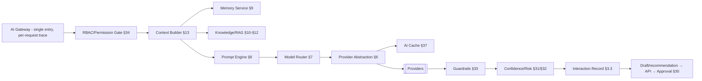
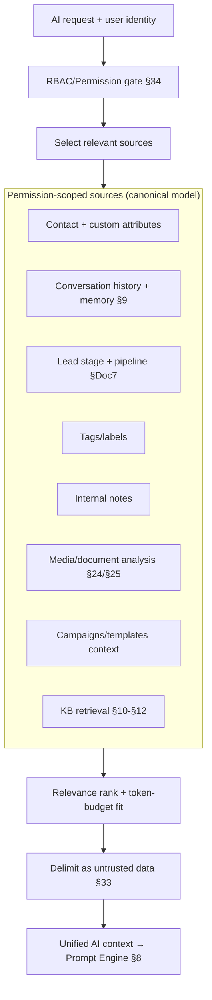
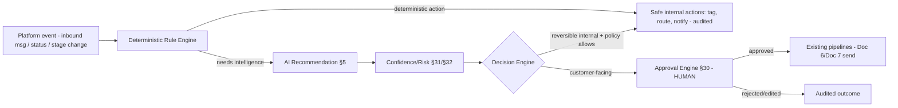
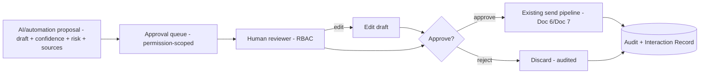
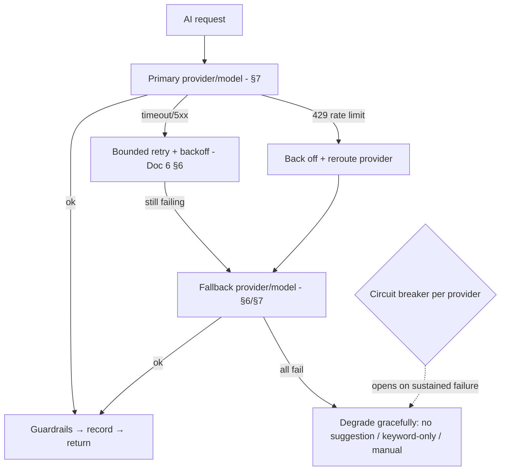

# AI & Automation Architecture
### Self-Hosted WhatsApp Business Platform

| | |
|---|---|
| **Document** | 9 — AI & Automation Architecture (authoritative AI specification) |
| **Version** | 1.0 (for approval) |
| **Date** | 2026-07-15 |
| **Status** | Draft awaiting owner approval |
| **Owner / sole user** | Internal — **Vi Reactivation Team** (single-tenant, self-hosted, not SaaS) |
| **Preceded by** | Docs 1–8 (frozen; referenced only) |

> This document defines **how Artificial Intelligence works throughout the entire platform** — architecture
> only. **No code, Python, SQL, YAML, JSON, API implementation, UI mockups, placeholders, or TODOs.** Every AI
> capability **plugs into the existing, frozen architecture** without changing it: it uses Doc 3's AI tables
> (extended only additively), Doc 4's AI endpoints/usage surface, Doc 6's `ai` queue + cost engine, Doc 8's AI
> services deployment, Doc 5's AI UX (with mandatory human approval), and Doc 7's channel abstraction (AI works
> identically across Channel 1 and Channel 2).
>
> **Reading convention:** each section carries the standard block — **Purpose · Scope · Architecture · Design
> Decisions · Alternatives Considered · Trade-offs · Failure Handling · Performance · Scalability · Security ·
> Future Extensibility · Cross References.** AI decisions are recorded as **AD1–AD32** (§49).

### The non-negotiable AI rules (enforced by the architecture, everywhere)
These are invariants; every section below upholds them and none may be bypassed:
1. **AI never sends messages directly** — AI produces *recommendations/drafts only* (Doc 1 FR-AI-10; Doc 5 F8).
2. **AI never bypasses approval** — a customer-facing AI output reaches a customer only after explicit **human
   approval** (§30).
3. **AI never bypasses RBAC** — AI operates strictly within the requesting user's permissions (Doc 1 §3.1;
   Doc 4 §4).
4. **AI never accesses data without permission** — the AI Context Builder only reads what the user may read
   (§13/§34).
5. **AI always explains why** — every recommendation includes a **reasoning summary** (§3.3).

### The AI Interaction Record (stored for *every* AI answer)
Every AI answer persists a complete, auditable record (additive fields on Doc 3's `ai_conversation_messages`):
**`confidence`** (§31), **`reasoning_summary`** (why), **`sources`** (KB/context attribution, §10/§13),
**`cost`** (tokens × rate, §36), **`latency`**, **`model_version`** (provider+model), plus the request trace id.
This makes every AI interaction **auditable, traceable, observable, measurable, and recoverable** — the
platform-wide requirement.

---

## 1. Purpose

**Purpose.** Define the complete, enterprise AI architecture for the platform: how AI is served, routed,
prompted, grounded (RAG), contextualized, applied to concrete features (replies, drafts, templates, campaigns,
classification, extraction, translation, media understanding), automated (recommend-only, human-approved),
guarded, secured, costed, monitored, evaluated, and scaled — all **on top of** the frozen architecture.

**Scope-setting.** AI is a **capability layer**, not a new spine: it consumes the canonical data model
(Doc 3), the API contract (Doc 4), the async fabric (Doc 6), the deployment (Doc 8), and the channel
abstraction (Doc 7), and it surfaces through the frozen UX (Doc 5). It **adds** intelligence; it **changes**
nothing beneath it.

**Design decisions.** AI as a pluggable capability layer with hard human-in-the-loop guarantees (AD1).
**Alternatives considered:** deeply embedding AI into core services; autonomous AI agents that act.
**Trade-offs:** a capability layer needs clean integration seams vs. autonomy — we deliberately choose control
+ auditability over autonomy. **Failure handling:** AI can fail without affecting core messaging (§39).
**Performance:** off the request hot path (Doc 6 `ai` pool). **Scalability:** provider-abstracted, queue-based
(§47). **Security:** RBAC + permission-scoped context + guardrails (§33–§35). **Future extensibility:** new
providers/models/agents/MCP without redesign (§6/§44/§45). **Cross-refs:** Docs 1–8.

---

## 2. Scope

**In scope.** AI service architecture; provider abstraction + model routing; the prompt engine; conversation
memory; the knowledge base (RAG), vector search, and embeddings; the AI context builder; all AI features
(suggested replies, draft generator, template/campaign generators, lead classification, intent, entity,
sentiment, language detection, translation, document analysis, media understanding, OCR, future vision); the
automation engine (recommend-only) with approval/confidence/risk; guardrails, security, privacy; cost
management; caching; performance; failure handling; monitoring/observability/analytics; the evaluation
framework; and future multi-agent/MCP/local-AI readiness.

**Out of scope.** Anything already frozen (schema, API surface, queue mechanics, deployment, UI system,
channel abstraction) — referenced, not redefined. **Autonomous AI sending** is explicitly out of scope by
policy (the rules above). Implementation details of any AI provider or connector.

**Cross-refs.** Doc 1 FR-AI-*/NFR-EXT-04; Doc 3 §10; Doc 4 §19/§32; Doc 5 B8/B9/F8; Doc 6 §2/§37; Doc 7; Doc 8
§17.

---

## 3. AI Architecture Overview

**Purpose.** Show how AI is layered onto the platform and how a request flows from a user action to a
human-approved outcome.

**Architecture.**
```mermaid
flowchart TB
  subgraph APP["Platform (frozen)"]
    UI[UI — Doc 5 B8/F8]:::f
    API[API — Doc 4 §19/§32]:::f
    Q[(ai queue — Doc 6 §2)]:::f
    DB[(MySQL — Doc 3 §10 + additive AI fields)]:::f
    CTX0[Canonical data: contacts, conversations, campaigns, templates, tags, leads, media, KB]:::f
  end
  subgraph AIL["AI capability layer (this document)"]
    GW[AI Service / Gateway §5]
    RBAC[Permission + RBAC gate §34]
    CB[Context Builder §13]
    PE[Prompt Engine §8]
    MR[Model Router §7]
    PAL[Provider Abstraction §6]
    GR[Guardrails §33]
    CONF[Confidence/Risk §31/§32]
    REC[(AI Interaction Record §3.3)]
  end
  PROV[[AI Providers — default Claude; future OpenAI/Gemini/…]]:::x
  APPR[Approval Engine §30 — human approves]
  UI --> API --> Q --> GW
  GW --> RBAC --> CB --> PE --> MR --> PAL --> PROV
  PROV --> GR --> CONF --> REC --> API
  REC --> DB
  API --> APPR --> UI
  APPR -->|approved| SEND[Existing send pipeline — Doc 6/Doc 7]
  classDef f fill:#eef2ff; classDef x fill:#f3f4f6;
```
**The flow (every AI request):** user action → API → **`ai` queue** (async, off the hot path) → **AI Service**
→ **RBAC/permission gate** (only permitted data) → **Context Builder** (assemble grounded context) → **Prompt
Engine** → **Model Router** → **Provider Abstraction** → provider → **Guardrails** (validate output) →
**Confidence/Risk** scoring → **AI Interaction Record** persisted → returned to the UI as a **draft/
recommendation** → **human approves** → only then does it enter the existing send pipeline. **AI itself never
sends.**

### 3.1 Layering
AI sits **beside** the platform, integrating only through defined seams: the canonical data model (read,
permission-scoped), the API (as AI endpoints), the async fabric (the `ai` pool), and the UI (draft/approval
surfaces). It has **no privileged path** to customers.

### 3.2 Channel-agnostic
AI works identically for **Channel 1 (Meta)** and **Channel 2 (Support Connector)** because it operates on the
**canonical conversation/message model** (Doc 7 §12) — it neither knows nor cares which channel a conversation
came from.

### 3.3 The AI Interaction Record (auditability spine)
Every answer stores `confidence · reasoning_summary · sources · cost · latency · model_version · trace_id`
(additive to Doc 3 `ai_conversation_messages`). This single artifact satisfies "auditable, traceable,
observable, measurable, recoverable" and the "always explain why" rule.

**Design decisions.** AI as a side-car capability layer with a mandatory interaction record + human-approval
gate (AD1/AD2). **Alternatives considered:** synchronous inline AI; AI with a direct send path (rejected by
policy). **Trade-offs:** async + approval add a step vs. safety, auditability, and non-blocking core.
**Failure handling:** §39. **Performance:** async `ai` pool (§38). **Scalability:** §47. **Security:** RBAC gate
+ guardrails (§33/§34). **Future extensibility:** multi-agent/MCP (§44/§45). **Cross-refs:** Doc 3 §10, Doc 4
§19/§32, Doc 5 F8, Doc 6 §2/§37, Doc 7 §12.

---

## 4. AI Design Principles

| # | Principle | Meaning |
|---|---|---|
| 1 | **Human-in-command** | AI recommends; humans decide and send. No autonomous customer contact (AD2). |
| 2 | **Grounded, not guessing** | Outputs are grounded in retrieved context/knowledge with **source attribution** (§10/§13); ungrounded answers are flagged low-confidence. |
| 3 | **Explainable** | Every output carries a reasoning summary + sources + confidence. |
| 4 | **Permission-scoped** | AI sees only what the requesting user may see; never bypasses RBAC (§34). |
| 5 | **Provider-agnostic** | The platform depends on an AI abstraction, not a vendor (§6). |
| 6 | **Right-model-for-the-job** | Model routing picks fast/reasoning/long-context/vision per task (§7). |
| 7 | **Safe by construction** | Guardrails prevent injection/jailbreak/PII leakage; validated before use (§33). |
| 8 | **Cost-aware** | Token cost tracked, budgeted, and forecast per user/feature/provider (§36). |
| 9 | **Non-blocking & resilient** | AI runs async and degrades gracefully; AI outage never affects messaging (§39). |
| 10 | **Auditable & measurable** | Every interaction is recorded, traced, monitored, and evaluable (§3.3/§40–§43). |
| 11 | **Additive integration** | AI plugs into frozen Docs 1–8; it changes none of them. |
| 12 | **Future-ready** | Multi-agent, MCP, and local models fit without redesign (§44–§46). |

**Design decisions / alternatives / trade-offs / failure / performance / scalability / security / future /
cross-refs:** these principles are ADR-backed (§49); each subsequent section applies them; they reference the
frozen documents throughout.

---

## 5. AI Service Architecture

**Purpose.** Define the internal structure of the AI capability layer as a set of cohesive, testable services
behind one gateway.

**Architecture (services).**

| Service | Responsibility |
|---|---|
| **AI Gateway** | Single entry for all AI requests; assigns a trace id; enforces the pipeline order; the *only* way to reach a provider. |
| **RBAC/Permission Gate** | Verifies the requesting user's permissions before any data access or provider call (§34). |
| **Context Builder** | Assembles permission-scoped, grounded context (§13). |
| **Memory Service** | Short/long/session memory + summarization (§9). |
| **Knowledge/RAG** | Retrieval over the KB via embeddings/vector search (§10–§12). |
| **Prompt Engine** | Deterministic prompt assembly from versioned templates (§8). |
| **Model Router** | Selects the right model class (§7). |
| **Provider Abstraction** | Uniform interface across providers (§6). |
| **AI Cache** | Reuse of embeddings/deterministic responses (§37). |
| **Guardrails** | Input/output safety validation (§33). |
| **Confidence/Risk** | Scores every output (§31/§32). |
| **Interaction Record** | Persists the auditable record (§3.3). |

**Deployment.** These services run in the **isolated `ai` worker pool / AI service** (Doc 8 §17) consuming the
**`ai` queue** (Doc 6 §2) — off the request hot path, independently scalable, provider-rate-bound.

**Design decisions.** One gateway enforcing a fixed, auditable pipeline (AD3). **Alternatives considered:**
scattered AI calls across services (no central control/audit). **Trade-offs:** a gateway hop vs. uniform
security/audit/routing. **Failure handling:** each stage has defined fallback (§39). **Performance:** async +
cache (§37/§38). **Scalability:** stateless services scale on the `ai` pool (§47). **Security:** RBAC gate is
mandatory and first (§34). **Future extensibility:** agents/MCP attach at the gateway (§44/§45). **Cross-refs:**
Doc 6 §2/§22, Doc 8 §17.

---

## 6. Provider Abstraction Layer

**Purpose.** Depend on an **AI provider interface**, never a specific vendor — so providers/models can be added
or swapped by configuration with **no architecture change** (Doc 1 NFR-EXT-04).

**Scope.** Default and future providers; capability declaration; uniform request/response contract.

**Architecture.**
- A single **provider interface** exposes uniform operations (chat/completion, embeddings, vision, tool-use)
  and **declares each provider's capabilities** (context window, vision, streaming, tool-use, embedding models,
  rate limits, cost profile). The AI layer talks only to this interface; adapters implement it per provider.
- **Default provider:** **Anthropic Claude (latest models)** — configured, not hard-coded.
- **Future providers (no architecture change):** OpenAI, Google Gemini, DeepSeek, Meta Llama, Mistral, Groq,
  and **local/self-hosted LLMs** — each is an adapter declaring its capabilities.
- **Selection is capability-driven** (§7): the router asks the abstraction "which providers/models satisfy this
  task's requirements?" — never "is this Claude?".

| Provider | Role |
|---|---|
| **Anthropic Claude (latest)** | **Default** for reasoning, drafting, long-context, vision |
| OpenAI / Gemini / DeepSeek / Mistral | Future adapters (config-driven) |
| Groq | Future low-latency serving of open models |
| Llama / local LLM | Future on-prem/offline option (§46) |

**Design decisions.** Capability-declaring provider interface; Claude default, all else adapters (AD4).
**Alternatives considered:** hard vendor coupling; a lowest-common-denominator interface. **Trade-offs:**
maintaining adapters + a capability model vs. total vendor independence. **Failure handling:** provider failure
→ fallback provider/model (§39). **Performance:** the abstraction is a thin dispatch. **Scalability:** add
providers to spread load/cost. **Security:** provider keys in the secret store (Doc 8 §20); no key in prompts.
**Future extensibility:** local models + MCP tools attach as adapters (§45/§46). **Cross-refs:** Doc 1
NFR-EXT-04, Doc 8 §17/§20, §7/§39.

---

## 7. Model Routing Engine

**Purpose.** Automatically select the **right model class** for each task, balancing quality, latency, context
size, modality, and cost.

**Scope.** Fast, reasoning, long-context, vision, and future model classes.

**Architecture.**
- Each AI task declares **requirements** (needs reasoning? long context? vision? low latency? max cost?). The
  router matches requirements against provider/model **capabilities** (§6) and a **routing policy** to pick a
  model — with a **fallback chain** (§39).

| Model class | Used for |
|---|---|
| **Fast model** | High-volume, latency-sensitive, simple tasks (classification, intent, language detection, short suggestions) |
| **Reasoning model** | Drafting, template/campaign generation, complex summarization, risk assessment |
| **Long-context model** | Whole-conversation summarization, large-document analysis, multi-source context |
| **Vision model** | Image/media understanding, OCR assist, document images (§25/§26/§27) |
| **Future models** | New classes register via the abstraction; policy extended, no redesign |

- **Policy inputs:** task type, required capabilities, org budget/limits (§36), current provider health (§39),
  and cost-per-quality preference. The **chosen `model_version` is recorded** on every interaction (§3.3).

**Design decisions.** Capability + policy based routing with fallbacks (AD5). **Alternatives considered:** one
fixed model for everything (costly/slow or weak). **Trade-offs:** routing complexity vs. cost/quality/latency
optimization. **Failure handling:** fallback chain on unavailable/failed model (§39). **Performance:** fast
models for hot-path tasks (§38). **Scalability:** route across providers to spread rate limits. **Security:**
routing respects data-sensitivity (e.g., prefer local for sensitive tasks — §46). **Future extensibility:** new
classes/providers plug in. **Cross-refs:** §6/§36/§38/§39/§46.

---

## 8. Prompt Engine

**Purpose.** Assemble prompts **deterministically, safely, and version-controlled** from reusable templates —
so AI behavior is consistent, testable, and governable.

**Scope.** Prompt templates, dynamic assembly, system prompts, context injection, guard prompts, variable
replacement, versioning, testing, governance.

**Architecture.**
| Element | Design |
|---|---|
| **Prompt templates** | Named, versioned templates per AI feature (reply, draft, template-gen, classify, …), stored as governed configuration. |
| **Dynamic assembly** | The engine composes: **system prompt** (role/rules) + **guard prompt** (safety instructions) + **injected context** (from the Context Builder §13) + **task template** + **variables** — in a fixed, auditable order. |
| **System prompts** | Encode the platform's role, the non-negotiable rules (no auto-send, explain-why), tone, and output contract. |
| **Context injection** | Grounded, permission-scoped context inserted with clear delimiters (§33 anti-injection). |
| **Guard prompts** | Safety directives (refuse out-of-scope, don't reveal secrets, treat retrieved content as untrusted data). |
| **Variable replacement** | Safe substitution of task variables; untrusted content is escaped/delimited, never treated as instructions (§33). |
| **Prompt versioning** | Every template is versioned; the version used is recorded on the interaction (§3.3) for reproducibility. |
| **Prompt testing** | Templates are evaluated against a test suite before promotion (§43). |
| **Prompt governance** | Prompt changes are reviewed, versioned, and audited (Doc 6 §44); who-changed-what tracked. |

**Design decisions.** Deterministic, versioned, governed prompt assembly with guard prompts (AD6). **Alternatives
considered:** ad-hoc inline prompts (unversioned, untestable, unsafe). **Trade-offs:** a prompt-management
surface vs. consistency, safety, reproducibility. **Failure handling:** a failing/regressed prompt version can
be rolled back (§43). **Performance:** assembly is cheap; cached where deterministic (§37). **Scalability:**
templates scale per feature. **Security:** guard prompts + delimited untrusted context resist injection (§33).
**Future extensibility:** tool/agent prompts (§44) reuse the engine. **Cross-refs:** §13/§33/§37/§43; Doc 6 §44.

---

## 9. Conversation Memory

**Purpose.** Give AI the right amount of conversation context — recent detail plus durable summary — without
unbounded token cost or leaking beyond permission scope.

**Scope.** Short-term, long-term, session memory, conversation summarization, memory pruning.

**Architecture.**
| Layer | Design |
|---|---|
| **Short-term memory** | The most recent messages of a conversation (verbatim), bounded by a token budget; drives immediate context. |
| **Session memory** | Working context for an agent's active AI session (the drafting/exploration thread, Doc 3 `ai_conversations`). |
| **Long-term memory** | Durable **summaries** of a conversation/contact (rolling summary + key facts), stored so old detail is retained cheaply. |
| **Summarization** | When a conversation exceeds the short-term budget, older messages are **summarized** (long-context model, §7) into long-term memory (Doc 5 F8 summarize). |
| **Memory pruning** | Bounded windows; summaries supersede raw old messages in context; retention aligns with Doc 3 §15. |
| **Grounding** | Memory is part of the Context Builder (§13), permission-scoped and attributed. |

- **The canonical conversation ledger (Doc 3) is the source of truth;** memory layers are **derived, cached
  views** for AI context — not a separate truth (rebuildable).

**Design decisions.** Tiered memory (short/session/long) with summarization + pruning over a bounded budget
(AD7). **Alternatives considered:** stuff the whole history each call (costly, exceeds context); no memory
(loses continuity). **Trade-offs:** summary fidelity vs. token cost. **Failure handling:** summarization failure
falls back to a truncated recent window; memory is rebuildable from the ledger. **Performance:** bounded tokens
keep cost/latency predictable (§36/§38). **Scalability:** summaries keep long conversations affordable.
**Security:** memory is permission-scoped and never crosses contacts/users. **Future extensibility:** semantic
memory (embeddings of past interactions) via the vector store (§11). **Cross-refs:** Doc 3 §9/§10/§15, Doc 5
F8, §13/§36/§38.

---

## 10. Knowledge Base (RAG)

**Purpose.** Ground AI answers in the team's own knowledge so responses are accurate, current, and
**attributable** — reducing hallucination and enabling trustworthy support/replies.

**Scope.** RAG, embeddings, chunking, metadata, versioning, document indexing, search ranking, knowledge
refresh, source attribution.

**Architecture (retrieval-augmented generation).**
- **Ingestion:** KB documents (Doc 3 `ai_knowledge_base`) are **chunked** (§ below), **embedded** (§12), and
  indexed into the **vector store** (§11) with **metadata** (source, section, version, timestamp, tags).
- **Retrieval:** at query time the Context Builder (§13) embeds the query, retrieves top-ranked chunks
  (semantic + keyword hybrid), and injects them as **grounded, attributed** context (delimited as untrusted
  data, §33).
- **Generation:** the model answers **from the retrieved context**, and the answer records its **sources**
  (§3.3) — every grounded claim is attributable to a KB chunk.

| Element | Design |
|---|---|
| **Chunking** | Documents split into semantically coherent, size-bounded chunks (`ai_knowledge_chunks`, Doc 3 §10) with overlap for context continuity. |
| **Metadata** | Each chunk carries source doc, position, version, tags, and access scope. |
| **Versioning** | KB docs and chunks are versioned; re-indexing on change; the version used is attributable. |
| **Document indexing** | Async ingestion via the `ai`/jobs queue (Doc 6); progress tracked as a job. |
| **Search ranking** | Hybrid ranking (vector similarity + keyword/FULLTEXT Doc 3 §13.3 + metadata/recency boosts); top-K selected within a token budget. |
| **Knowledge refresh** | Scheduled/triggered re-embedding when sources change (Doc 6 §10); stale chunks superseded. |
| **Source attribution** | Answers cite the KB chunks used (Doc 5 F8 "knowledge sources"); "no sources" answers are flagged low-confidence (§31). |

**Design decisions.** Hybrid RAG with mandatory source attribution + low-confidence flag when ungrounded (AD8).
**Alternatives considered:** fine-tuning on KB (costly, stale, opaque); no grounding (hallucination risk).
**Trade-offs:** retrieval/indexing infrastructure vs. accurate, current, attributable answers. **Failure
handling:** retrieval failure → answer flagged low-confidence / "no sources" (§31/§39). **Performance:** cached
embeddings (§37); bounded top-K. **Scalability:** vector store scales (§11). **Security:** retrieval is
**permission-scoped** — only KB the user may see is retrieved (§34). **Future extensibility:** semantic memory,
multi-KB, tool-augmented retrieval (§44). **Cross-refs:** Doc 3 §10/§13.3, Doc 5 F8, Doc 6 §10, §11/§12/§13/§31.

---

## 11. Vector Search Architecture

**Purpose.** Provide fast, scalable semantic retrieval over embedded knowledge (and, later, semantic memory).

**Scope.** Vector index, similarity search, hybrid ranking, capacity.

**Architecture.**
- **Store abstraction (AD9):** a **vector-store interface** decouples the platform from any specific engine.
  **Baseline:** vectors stored alongside chunk metadata (Doc 3 `ai_knowledge_chunks.embedding`) with
  application-side similarity for modest KBs. **At scale:** a dedicated vector engine (e.g., a pgvector/FAISS/
  Milvus-class store) plugs in behind the same interface **without business-logic change**.
- **Hybrid search:** vector similarity **fused** with keyword (Doc 3 §13.3 FULLTEXT) and metadata filters for
  precision + recall.
- **Filtering:** searches are **permission- and scope-filtered** (org, KB access) *before* ranking (§34).

**Design decisions.** Vector-store abstraction, DB-baseline → dedicated engine at scale (AD9). **Alternatives
considered:** hard-coding one vector DB day one (over-provisioned for a small KB). **Trade-offs:** app-side
similarity is simple but limited; the interface lets us upgrade seamlessly. **Failure handling:** search failure
degrades to keyword-only + low-confidence flag (§39). **Performance:** ANN indexing at scale; cached query
embeddings (§37). **Scalability:** swap to a dedicated engine as the KB/memory grows (§47). **Security:**
scope-filtered retrieval (§34). **Future extensibility:** semantic memory + cross-modal search. **Cross-refs:**
Doc 3 §10/§13.3, §10/§12/§34/§47.

---

## 12. Embedding Architecture

**Purpose.** Turn text (and later media-derived text) into vectors for retrieval and semantic features,
efficiently and consistently.

**Scope.** Embedding models, generation, caching, dimensionality, versioning.

**Architecture.**
| Element | Design |
|---|---|
| **Embedding models** | Provided via the provider abstraction (§6); the embedding `model_version` is recorded so vectors are reproducible/comparable. |
| **Generation** | Chunks/queries embedded asynchronously (`ai` queue) at ingestion and query time; batched for efficiency. |
| **Caching** | Content-hash → embedding cache (§37) avoids re-embedding identical text; query-embedding cache for repeated queries. |
| **Consistency** | All vectors in an index share the same embedding model/version; a model change triggers **re-embedding** (versioned migration) so similarity stays valid. |
| **Dimensionality/store** | Vector dimension per model; stored via the vector-store abstraction (§11). |

**Design decisions.** Provider-abstracted, cached, version-consistent embeddings (AD10). **Alternatives
considered:** mixing embedding models in one index (breaks similarity). **Trade-offs:** re-embedding cost on
model change vs. correctness. **Failure handling:** embedding failure retried (Doc 6 §6); falls back to keyword
search. **Performance:** caching + batching cut cost/latency (§36/§37). **Scalability:** batch pipelines scale on
the `ai`/jobs pool. **Security:** embeddings of sensitive text are access-scoped like their source. **Future
extensibility:** multimodal embeddings (image/audio) for §25. **Cross-refs:** §6/§10/§11/§37, Doc 6 §6.

---

## 13. AI Context Builder

**Purpose.** Assemble **one coherent, grounded, permission-scoped context** for every AI request by combining
all relevant platform data — the component that makes AI *aware* of the business.

**Scope.** Combine customer history, campaigns, templates, tags, lead stages, notes, media, conversation
history, and the knowledge base into a single AI context.

**Architecture.**

- **One context object** is produced per request: the model receives customer + conversation + CRM + KB context
  **as grounded, attributed, clearly-delimited data** (never as instructions — §33).
- **Permission-scoped first (AD11):** the RBAC gate runs **before** any source is read; only data the user may
  access enters the context. AI cannot see what the user cannot.
- **Budget-fit:** sources are ranked by relevance and fit to the model's token budget (long-context routing if
  needed, §7); memory summaries (§9) compress history.
- **Attribution:** every included source is tracked so the answer's `sources` field is complete (§3.3).

**Design decisions.** A single permission-scoped, attributed, budget-fit context builder (AD11). **Alternatives
considered:** per-feature ad-hoc context (inconsistent, unsafe, leak-prone). **Trade-offs:** a central builder
to maintain vs. consistent grounding, security, and attribution. **Failure handling:** a missing source is
omitted (answer notes reduced grounding, §31); never fails open on permissions. **Performance:** parallel,
cached source fetches within a budget (§37/§38). **Scalability:** works across both channels uniformly (Doc 7
§12). **Security:** the single choke point for permission-scoping AI data access (§34). **Future extensibility:**
new sources (e.g., commerce, new channels) register additively. **Cross-refs:** Doc 3 (all sources), Doc 7 §12,
§7/§8/§9/§10/§31/§34/§37.

---

## 14. Suggested Replies

**Purpose.** Offer agents grounded, ready-to-edit reply suggestions in the inbox to speed high-quality support
across both channels.

**Scope.** Context-aware reply suggestions; human-approved send only.

**Architecture.** On request in a conversation (Doc 5 B7 AI panel), the AI layer builds context (§13:
conversation + contact + lead + KB), routes to a fast/reasoning model (§7), applies guardrails (§33), scores
confidence (§31), and returns **1–N draft suggestions** with reasoning + sources. The agent edits and sends via
the **normal send flow** — **AI never sends** (§30). Channel-agnostic (Doc 7 §12).

**Design decisions.** Grounded, multi-suggestion, human-sent (AD12). **Alternatives considered:** auto-reply
(rejected by policy). **Trade-offs:** an approval step vs. safety/quality. **Failure handling:** on failure, no
suggestion (agent types normally); never blocks the inbox (§39). **Performance:** fast model + cache for common
intents (§37/§38). **Scalability:** `ai` pool. **Security:** permission-scoped context; window/compliance still
enforced on send (Doc 6/Doc 7). **Future extensibility:** tone variants, compare (Doc 5 F8). **Cross-refs:**
Doc 5 B7/F8, Doc 7 §12, §7/§13/§30/§31/§33.

---

## 15. AI Draft Generator

**Purpose.** Draft longer or more complex customer messages/responses (beyond quick replies) — e.g., detailed
support explanations, verification instructions — grounded and human-approved.

**Scope.** Draft generation for agent use; approval-gated.

**Architecture.** Same pipeline as §14 with a **reasoning model** (§7) and richer context (full memory summary
§9, relevant KB §10). Returns an editable draft with reasoning/sources/confidence; supports **regenerate** and
**compare** (Doc 5 F8). Enters a customer conversation only after **human approval** (§30).

**Design decisions.** Reasoning-model drafts, editable, approval-gated (AD13). **Alternatives considered:** auto-
respond. **Trade-offs:** latency of a reasoning model vs. quality. **Failure handling:** fallback model/none
(§39). **Performance:** async; not on the hot path. **Scalability:** `ai` pool. **Security:** scoped context;
guardrails (§33). **Future extensibility:** multi-turn agentic drafting (§44). **Cross-refs:** Doc 5 F8, §7/§9/
§10/§30/§31/§33.

---

## 16. Template Generator

**Purpose.** Help create **policy-compliant WhatsApp templates** for Channel 1 (Meta) — drafting body/variables/
buttons in the correct category — reducing rejection loops.

**Scope.** Draft template content for submission (Channel 1); human-reviewed before submission to Meta.

**Architecture.** Given a goal + category (marketing/utility/authentication), the AI drafts template components
(header/body/footer/buttons, variables) **aware of Meta's category and formatting rules** (grounded in KB
policy notes), scores confidence, and returns a draft into the **Template Builder** (Doc 5 B5.2). A human
reviews and **submits to Meta** (Doc 4 §15) — the AI never submits. Pre-submission validation (Doc 5 B5.2) still
applies.

**Design decisions.** Category-aware, compliance-grounded template drafts, human-submitted (AD14). **Alternatives
considered:** auto-create/submit (rejected). **Trade-offs:** review step vs. compliance safety. **Failure
handling:** none/fallback; validation catches issues pre-Meta. **Performance:** reasoning model, async.
**Scalability:** `ai` pool. **Security:** no customer PII needed. **Future extensibility:** learn from rejection
reasons (Doc 3 templates) to improve drafts. **Cross-refs:** Doc 3 §7, Doc 4 §15, Doc 5 B5.2, Doc 1 CMP-05.

---

## 17. Campaign Content Generator

**Purpose.** Draft campaign copy and variable mappings from a prompt + audience context, accelerating campaign
creation (Channel 1).

**Scope.** Draft campaign message content/variables; human-approved before send.

**Architecture.** In the Campaign Wizard (Doc 5 B4.2), given the objective, segment/audience context (§13), and
the chosen template, the AI drafts copy and suggests variable mappings, with reasoning/confidence. The marketer
edits; the campaign follows the **normal launch flow** with cost estimate, validation, and **human send** — AI
never launches. Compliance (opt-in/window/category) is enforced by the campaign engine regardless (Doc 6 §4/§5).

**Design decisions.** Audience-aware campaign drafts, human-launched (AD15). **Alternatives considered:** auto-
generate-and-send campaigns (rejected). **Trade-offs:** review vs. safety/brand control. **Failure handling:**
none/fallback; wizard still functions manually. **Performance:** reasoning model, async. **Scalability:** `ai`
pool. **Security:** audience context is permission-scoped (§34). **Future extensibility:** A/B variant
generation (Doc 2 F15). **Cross-refs:** Doc 5 B4.2, Doc 6 §4/§5, Doc 4 §17, §13/§30/§31.

---

> **Common pattern for the understanding features (§18–§27).** Each runs through the AI Service pipeline (§5):
> permission-scoped context (§13) → fast/appropriate model (§7) → guardrails (§33) → **confidence** (§31) →
> **AI Interaction Record** (§3.3, incl. reasoning + sources). Outputs are **suggestions/annotations** that a
> human confirms where they drive customer-facing actions (e.g., a suggested lead stage or tag); **AI never
> changes customer-facing state autonomously beyond safe, reversible internal annotations, and never sends**.
> All apply identically across Channel 1 and Channel 2 (canonical model, Doc 7 §12).

## 18. Lead Classification

**Purpose.** Suggest a conversation's **lead stage** (Doc 7 §19 pipeline) and priority from its content/history,
accelerating CRM triage.

**Architecture.** Context (§13) + fast/reasoning model classify against the **customizable pipeline** stages
(Doc 7 §19); returns a **suggested stage + confidence + reasoning**. An agent confirms the move (or auto-apply
is allowed only for reversible, audited internal state per org policy — never a send). Recorded (§3.3).

**Design decisions.** Suggest-and-confirm lead staging (AD16). *Alternatives:* auto-move leads silently
(rejected — human owns pipeline). *Trade-offs:* confirmation friction vs. control. *Failure handling:* none →
manual staging. *Performance:* fast model. *Scalability:* `ai` pool. *Security:* scoped context. *Future:* learns
from stage transitions (Doc 7 §23). *Cross-refs:* Doc 7 §19/§23, §7/§13/§31.

## 19. Intent Detection

**Purpose.** Identify **what the customer wants** (e.g., document submission, verification, activation, complaint)
to route/assist.

**Architecture.** Fast model classifies inbound messages into an **intent taxonomy** (config-driven, extensible);
returns intent + confidence. Drives suggested replies (§14), routing hints (Doc 7 §14/§21), and automation
recommendations (§28) — **recommend-only**. Recorded (§3.3).

**Design decisions.** Config-driven intent taxonomy, fast model (AD17). *Alternatives:* fixed hard-coded intents.
*Trade-offs:* taxonomy upkeep vs. accuracy. *Failure handling:* "unknown" intent → human handles. *Performance:*
fast/hot-path (§38). *Scalability:* `ai` pool. *Security:* scoped. *Future:* new intents additive. *Cross-refs:*
Doc 7 §14/§21, §14/§28/§31.

## 20. Entity Extraction

**Purpose.** Extract structured entities (names, IDs, amounts, dates, document references) from messages/documents
to populate CRM fields as **suggestions**.

**Architecture.** Model extracts typed entities mapped to **contact custom attributes** (Doc 3 §6.3) / lead
context (Doc 7); returns entities + confidence + source span. Suggested field updates are **human-confirmed**
(reversible, audited). Recorded (§3.3).

**Design decisions.** Suggested, confirmable entity → attribute mapping (AD18). *Alternatives:* silent auto-fill
(rejected). *Trade-offs:* confirmation vs. data-quality control. *Failure handling:* partial extraction; skip
low-confidence. *Performance:* fast/reasoning per complexity. *Scalability:* `ai` pool. *Security:* PII handled
per §35. *Future:* verification-document extraction (§24). *Cross-refs:* Doc 3 §6.3, Doc 7 §19, §24/§31/§35.

## 21. Sentiment Analysis

**Purpose.** Score conversation sentiment to surface at-risk/urgent conversations and feed analytics (Doc 5 F8;
Doc 6 §35).

**Architecture.** Fast model scores inbound sentiment (+ trend over a thread); surfaces in the inbox and
analytics; may **recommend** priority/escalation (recommend-only). Recorded (§3.3).

**Design decisions.** Lightweight sentiment scoring feeding UX + analytics (AD19). *Alternatives:* none.
*Trade-offs:* score noise vs. signal (trend smoothing). *Failure handling:* omit on failure. *Performance:* fast/
hot-path. *Scalability:* `ai` pool. *Security:* scoped. *Future:* emotion/urgency models. *Cross-refs:* Doc 5 F8,
Doc 6 §35, §31.

## 22. Language Detection

**Purpose.** Detect a message's language to drive translation (§23), correct model/prompt selection, and
agent-appropriate routing.

**Architecture.** Fast, low-cost detection on inbound text; result annotates the message and informs the prompt
engine (§8) and translation (§23). Recorded where it affects an AI output (§3.3).

**Design decisions.** Cheap, early language detection (AD20). *Alternatives:* assume one language. *Trade-offs:*
extra step vs. multilingual correctness. *Failure handling:* default to org locale. *Performance:* very fast.
*Scalability:* `ai` pool / lightweight. *Security:* n/a. *Future:* dialect/script handling. *Cross-refs:* §8/§23.

## 23. Translation Engine

**Purpose.** Translate inbound/outbound messages and AI drafts across languages so agents serve customers in any
language — with human approval before sending.

**Architecture.** On request, the model translates a message/draft (source language from §22) preserving intent/
tone; returns translation + confidence. Outbound translations are **drafts requiring human approval** (§30) —
**AI never sends the translation**. Recorded (§3.3).

**Design decisions.** Model-based, approval-gated translation (AD21). *Alternatives:* auto-translate-and-send
(rejected). *Trade-offs:* review vs. safety. *Failure handling:* none → agent handles. *Performance:* fast/
reasoning per length. *Scalability:* `ai` pool. *Security:* scoped. *Future:* glossary/brand-term consistency.
*Cross-refs:* Doc 5 F8, §22/§30/§31.

## 24. Document Analysis

**Purpose.** Understand customer-submitted documents (verification files, forms) to **assist** verification and
extraction (a Vi Reactivation core workflow, Doc 7 §19).

**Architecture.** Documents (from unified media, Doc 7 §16) are parsed (text via OCR §26 where needed), analyzed
by a reasoning/long-context (and vision where applicable) model to extract fields/verify presence, returning
**structured findings + confidence + source**. Findings are **suggestions** for a human verifier (never an
autonomous approval). Recorded (§3.3).

**Design decisions.** Assistive document analysis, human-verified (AD22). *Alternatives:* auto-verify (rejected —
verification is a human/compliance decision). *Trade-offs:* human verification vs. automation. *Failure handling:*
low-confidence → flag for manual review. *Performance:* async, long-context/vision routing. *Scalability:* `ai`/
jobs pool. *Security:* documents are sensitive — §35 PII handling, scoped access. *Future:* structured form
templates. *Cross-refs:* Doc 7 §16/§19, §20/§25/§26/§31/§35.

## 25. Media Understanding

**Purpose.** Interpret rich media across both channels — **images, PDFs, Word, Excel, voice notes** — to assist
support and CRM.

**Architecture.** Per media type: **images** → vision model (§27) description/analysis; **PDF/Word** → text
extraction (+ OCR §26 for scans) → reasoning model; **Excel** → structured parse → reasoning; **voice notes** →
**speech-to-text** (via a provider/local ASR through the abstraction §6) → text pipeline. Outputs are
attributed annotations/summaries feeding the Context Builder (§13) and Document Analysis (§24). Recorded (§3.3).

**Design decisions.** Type-routed media understanding via provider abstraction (AD23). *Alternatives:* text-only
AI (ignores media). *Trade-offs:* multimodal cost vs. capability. *Failure handling:* per-type fallback; media
that can't be understood is flagged. *Performance:* async, appropriate model per type. *Scalability:* `ai`/media
pools (Doc 6 §2). *Security:* media access-scoped; PII masking (§35). *Future:* audio diarization, video.
*Cross-refs:* Doc 7 §16, §6/§24/§26/§27/§35.

## 26. OCR Architecture

**Purpose.** Extract text from images/scanned documents so downstream analysis (§24) and RAG (§10) can use it.

**Architecture.** An **OCR capability** behind the provider abstraction (§6) — a vision model's OCR ability
and/or a dedicated OCR engine (pluggable) — converts image/scan content to text with layout/positions where
useful; the text flows into document analysis/RAG/context. OCR runs async (`ai`/jobs). Extracted text inherits
the source's access scope and PII handling (§35). Recorded where it feeds an AI output.

**Design decisions.** Pluggable OCR behind the abstraction (AD24). *Alternatives:* single hard-coded OCR engine.
*Trade-offs:* abstraction vs. engine-specific features. *Failure handling:* low-quality OCR flagged; manual
fallback. *Performance:* async; cached by content hash (§37). *Scalability:* `ai`/jobs pool. *Security:* PII-aware
(§35). *Future:* handwriting, table extraction. *Cross-refs:* §6/§24/§25/§35/§37.

## 27. Future Vision Model

**Purpose.** Keep the architecture ready for advancing **vision/multimodal** capabilities without redesign.

**Architecture.** Vision is a **capability of the provider abstraction (§6)** and a **model class of the router
(§7)** — default via Claude vision, extensible to future vision/multimodal models as adapters. New vision
capabilities register their capability flags; the router and media pipeline (§25) use them automatically. No
business-logic change to adopt a better vision model.

**Design decisions.** Vision-as-capability, adapter-extensible (AD25). *Alternatives:* bespoke per-model vision
code. *Trade-offs:* abstraction vs. bleeding-edge features. *Failure handling:* fallback to available vision/
OCR. *Performance:* routed per task. *Scalability:* provider spread. *Security:* media-scoped, PII-aware.
*Future:* video, multimodal reasoning, on-device vision (§46). *Cross-refs:* §6/§7/§25/§26/§46.

---

## 28. AI Automation Engine

**Purpose.** Let AI **drive efficiency without autonomy** — combining a deterministic **rule engine** with AI
**recommendations**, where every customer-facing action requires **human approval**. AI **can only recommend;
a human must approve.**

**Scope.** Decision engine, rule engine, human approval, no AI auto-send.

**Architecture.**

- **Rule engine (deterministic):** event-driven rules (Doc 6 event bus) perform **safe, reversible, internal**
  actions autonomously (e.g., add a tag, route to a queue, send an internal notification, mark active) — these
  are auditable and never message a customer.
- **AI recommendations:** for anything requiring judgment (a reply, a stage change, a template), AI **recommends**
  with confidence/risk/reasoning/sources.
- **Decision engine:** routes recommendations by type + risk (§32): **customer-facing → mandatory human approval
  (§30)**; low-risk reversible internal → may auto-apply if org policy allows (still audited).
- **Hard rule (AD26):** **no AI auto-send to customers, ever** — the only path to a customer is the existing
  send pipeline **after** human approval.

**Design decisions.** Rule engine + AI-recommend + mandatory human approval for customer-facing actions (AD26).
**Alternatives considered:** autonomous AI agents that act/send (rejected by policy). **Trade-offs:** approval
friction vs. safety/control/compliance. **Failure handling:** AI/automation failure → the platform works
manually; nothing sends without a human. **Performance:** rules are instant; AI async. **Scalability:** event-
driven over the async fabric (Doc 6). **Security:** every automated action is permission-checked + audited (Doc 6
§43/§44). **Future extensibility:** the future **flow/automation builder** and **multi-agent** (§44) plug into
the same engine with the same approval invariant. **Cross-refs:** Doc 6 (event bus/§43/§44), Doc 7, §29/§30/§31/
§32.

---

## 29. Workflow Automation

**Purpose.** Automate multi-step business workflows (follow-ups, reminders, verification chases, SLA nudges)
using triggers → conditions → actions, with AI assisting and humans approving customer-facing steps.

**Scope.** Trigger/condition/action workflows; scheduled + event-driven; AI-assisted, human-gated.

**Architecture.**
- **Triggers:** platform events (inbound message, lead-stage change, no-reply timeout, schedule) via the async
  fabric (Doc 6 §10 scheduler, event bus).
- **Conditions:** deterministic checks (tags, lead stage, attributes, time) + optional AI signals (intent/
  sentiment/risk) as inputs.
- **Actions:** **internal/safe** actions run automatically (tag, route, assign, notify, create reminder);
  **customer-facing** actions (send a template/message) are **queued as recommendations for human approval**
  (§30) — never auto-sent.
- **Definition:** workflows are **configuration** (additive, aligned with Doc 7 lead/assignment config), setting
  the stage for the future **visual flow builder** (Doc 6 §17 `automation.run`; Doc 7 §29).

**Design decisions.** Config-driven, event-triggered workflows; auto for internal, human-approved for customer-
facing (AD27). **Alternatives considered:** hard-coded workflows; fully autonomous flows. **Trade-offs:** config
surface vs. flexibility + safety. **Failure handling:** a failed step is retried/DLQ'd (Doc 6 §6/§7); customer
steps never fire without approval. **Performance:** event-driven, async. **Scalability:** `automation.run` queue
(Doc 6 §17). **Security:** actions RBAC-checked + audited. **Future extensibility:** the visual flow builder is
this engine with a UI. **Cross-refs:** Doc 6 §10/§17, Doc 7 §19/§21/§29, §28/§30.

---

## 30. Approval Engine

**Purpose.** Enforce **mandatory human approval** for every AI-generated or automation-proposed **customer-facing
action** — the gate that guarantees "AI never sends."

**Scope.** Approval workflow, roles, audit, optional multi-approver, edit-before-approve.

**Architecture.**

- **Every customer-facing AI/automation output** enters the approval queue with its full context (draft,
  confidence §31, risk §32, reasoning, sources).
- **RBAC-gated (AD28):** only users with the appropriate permission (e.g., `messages:send`/`campaigns:send`) can
  approve; approval respects the same permissions as a manual send.
- **Edit-before-approve:** reviewers may edit the draft; the sent version and the AI original are both recorded.
- **Optional second approver** for high-risk items (§32) or sensitive templates.
- **Approval → send** goes through the **existing pipeline only** (Doc 6/Doc 7) — with all compliance checks
  (opt-in, window, template approval, rate limits) still enforced. **There is no other path to a customer.**
- **Fully audited:** approve/reject/edit with actor, timestamp, and the AI record (Doc 6 §44; §3.3).

**Design decisions.** Mandatory, RBAC-gated, audited human approval as the sole customer-facing path (AD28).
**Alternatives considered:** confidence-threshold auto-send (rejected — no autonomy). **Trade-offs:** an approval
step per customer message vs. absolute safety/compliance/control. **Failure handling:** if approval tooling is
down, nothing customer-facing sends (fails safe); manual sending still works. **Performance:** approval is a fast
human action; the queue is real-time (SSE). **Scalability:** approval queue scales with volume. **Security:**
the core enforcement of RBAC + no-auto-send (§34). **Future extensibility:** delegated/rule-based approval
routing (still human). **Cross-refs:** Doc 1 FR-AI-10, Doc 4 §4, Doc 5 F8, Doc 6 §43/§44, Doc 7, §28/§31/§32.

---

## 31. Confidence Scoring

**Purpose.** Attach a **confidence** to every AI output so humans can triage trust — a core field of the AI
Interaction Record (§3.3).

**Scope.** Confidence computation, display, thresholds.

**Architecture.** Confidence is derived from signals: **grounding** (were sources retrieved? how relevant? §10),
model self-assessment, output validation (guardrails §33), and consistency (e.g., agreement across compared
variants §15). It is normalized to a clear scale, **displayed** with every recommendation (Doc 5 F8), and drives
behavior: **low confidence** nudges human review, flags "ungrounded/no sources," and can raise risk (§32).
Stored on every interaction (§3.3).

**Design decisions.** Multi-signal confidence, always shown, drives triage (AD29). **Alternatives considered:**
no confidence (blind trust); raw model logprobs only (incomplete). **Trade-offs:** approximate score vs. useful
triage signal. **Failure handling:** unknown confidence → treated as low. **Performance:** cheap to compute.
**Scalability:** per interaction. **Security:** never used to bypass approval (approval is unconditional).
**Future extensibility:** calibrated confidence from the eval framework (§43). **Cross-refs:** Doc 5 F8, §3.3/§10/
§15/§32/§33/§43.

---

## 32. Risk Scoring

**Purpose.** Score the **risk of acting on** an AI output so higher-risk actions get stronger human scrutiny
(e.g., second approver).

**Scope.** Risk computation, escalation, policy.

**Architecture.** Risk combines: **action type** (customer-facing > internal), **content sensitivity** (PII,
financial, verification, complaint), **confidence** (§31, inverse), **audience size** (a campaign > one reply),
and **compliance sensitivity** (marketing category, opt-in edge cases). High risk → **mandatory second approver
/ stricter review** (§30); very high risk → block until reviewed. Stored per interaction.

**Design decisions.** Composite risk gating review depth (AD30). **Alternatives considered:** treat all outputs
equally (over- or under-scrutinizes). **Trade-offs:** scoring logic vs. proportionate control. **Failure
handling:** unknown risk → treat as high. **Performance:** cheap. **Scalability:** per interaction. **Security:**
risk **raises** scrutiny; it can never lower the approval requirement. **Future extensibility:** learned risk
from outcomes (§43). **Cross-refs:** §30/§31/§33/§35/§43.

---

## 33. AI Guardrails

**Purpose.** Prevent unsafe or manipulated AI behavior — the safety validation around every AI input and output.

**Scope.** Hallucination prevention, prompt-injection prevention, jailbreak protection, PII protection,
sensitive-data masking.

**Architecture.**
| Guardrail | Design |
|---|---|
| **Hallucination prevention** | Grounding + source attribution (§10/§13); ungrounded claims flagged low-confidence (§31); the system prompt forbids fabrication and instructs "say what you don't know." |
| **Prompt-injection prevention** | Retrieved/customer content is inserted as **clearly-delimited untrusted data**, never as instructions (§8/§13); the model is instructed to ignore instructions found in data; tool/action requests from content are ignored. |
| **Jailbreak protection** | Hardened system/guard prompts; output policy checks; refusal on out-of-scope/unsafe requests; no path for AI to escalate its own permissions. |
| **PII protection** | The context builder is permission-scoped (§34); PII-flagged attributes (Doc 3 §6.3) are minimized; PII is not sent to providers beyond necessity; local models preferred for the most sensitive tasks (§46). |
| **Sensitive-data masking** | Masking/redaction of sensitive fields before they reach a provider where full values aren't needed; verification/financial data handled per §35. |
| **Output validation** | Structure/format/policy validation of model output before it's shown or used; invalid → rejected/regenerated. |

- **Both directions:** guardrails run on **input** (what goes to the provider) and **output** (what comes back)
  — the model is never trusted blindly, and untrusted content never becomes instructions.

**Design decisions.** Bidirectional guardrails with delimited-untrusted-context + grounding + masking (AD31).
**Alternatives considered:** trust the model/prompt alone (unsafe). **Trade-offs:** guardrail overhead vs.
safety. **Failure handling:** a guardrail failure blocks the output (fail safe), not passes it. **Performance:**
lightweight checks + a small validation pass. **Scalability:** per interaction. **Security (primary):** this is a
core security control (§34/§35). **Future extensibility:** dedicated safety-classifier models; policy updates
without redesign. **Cross-refs:** Doc 1 NFR-SEC, Doc 3 §6.3, §8/§10/§13/§31/§34/§35/§46.

---

## 34. AI Security

**Purpose.** Ensure AI operates strictly within the platform's security model — **never** bypassing RBAC,
permissions, or the send/approval controls.

**Scope.** RBAC enforcement, permission-scoped data access, provider-key security, tenant/data isolation,
audit.

**Architecture.**
| Control | Design |
|---|---|
| **RBAC enforcement (AD32)** | The **RBAC/Permission Gate (§5) runs first** on every AI request; AI acts **as the requesting user**, with that user's permissions — never elevated. |
| **Permission-scoped data** | The Context Builder (§13) reads **only** data the user may read; retrieval/KB is scope-filtered (§11); AI can never surface data the user couldn't otherwise see. |
| **No privileged actions** | AI has **no ability to send, change settings, alter RBAC, or bypass approval** — the only customer path is human approval (§30). |
| **Provider-key security** | Provider keys live in the secret store (Doc 8 §20), injected to the AI service; never in prompts, logs, or client. |
| **Isolation** | AI runs in the isolated `ai` pool (Doc 8 §17); single-tenant today, `organization_id`-scoped so future multi-workspace stays isolated. |
| **Audit & trace** | Every AI request/response is recorded (§3.3) and auditable (Doc 6 §44) with a trace id (Doc 6 §13). |
| **Injection/jailbreak** | Guardrails (§33) prevent content-borne instruction hijacking. |

**Design decisions.** AI-as-the-user, permission-gated first, no privileged path (AD32). **Alternatives
considered:** a privileged AI service account (would bypass RBAC — rejected). **Trade-offs:** per-request
permission resolution vs. airtight security. **Failure handling:** on any permission ambiguity, **deny**
(fail-closed). **Performance:** cached permission resolution (Doc 4 §4). **Scalability:** per request.
**Security (primary):** enforces all five non-negotiable rules. **Future extensibility:** finer-grained AI
permissions (e.g., `ai:use` scopes, Doc 4 §4.3). **Cross-refs:** Doc 1 §3.1, Doc 4 §4, Doc 6 §13/§44, Doc 8 §17/
§20, §5/§13/§30/§33.

---

## 35. AI Privacy

**Purpose.** Protect customer and business data used by AI — minimizing exposure to providers and honoring
data-protection obligations (Doc 8 §48).

**Scope.** Data minimization, PII handling, provider data policy, retention, residency.

**Architecture.**
| Aspect | Design |
|---|---|
| **Data minimization** | Only the **necessary** context is sent to a provider; PII-flagged attributes (Doc 3 §6.3) are included only when required; masking where full values aren't needed (§33). |
| **PII handling** | Verification/financial/identity data is treated as sensitive; masked/redacted or processed by **local models** (§46) where policy demands. |
| **Provider data policy** | Use providers under terms that **do not train on the data**; the abstraction records which provider/model handled each request (§3.3) for auditability. |
| **Retention** | AI interactions/records retained per policy (Doc 3 §15; Doc 8 §36); prompts/outputs are business data subject to retention/erasure. |
| **Erasure** | Contact-level privacy erasure (Doc 1 FR-DL-08) extends to AI records referencing that contact. |
| **Residency** | Sensitive-data tasks can be pinned to **local/on-prem models** (§46) so data never leaves the deployment. |

**Design decisions.** Minimize + mask + prefer-local-for-sensitive + non-training providers (AD33). **Alternatives
considered:** send everything to a hosted model (max exposure). **Trade-offs:** minimization/masking effort +
possible quality trade vs. privacy. **Failure handling:** if a task can't be done privately, it's flagged for
human handling rather than over-exposing data. **Performance:** minimization also reduces tokens/cost.
**Scalability:** policy scales per task type. **Security:** aligns with §33/§34. **Future extensibility:** on-prem
LLMs make full-privacy processing the default for sensitive workflows (§46). **Cross-refs:** Doc 1 FR-DL/CMP-09,
Doc 3 §6.3/§15, Doc 8 §36/§48, §33/§34/§46.

---

## 36. Cost Management

**Purpose.** Make AI spend **visible, attributable, forecastable, and bounded** — integrating with the platform
cost engine (Doc 6 §37; Doc 4 §32).

**Scope.** Token tracking, per-user/feature/provider usage, forecasting, budgets, alerts, cost dashboards.

**Architecture.**
| Element | Design |
|---|---|
| **Token tracking** | Every AI call records prompt+completion tokens and cost (§3.3), keyed to user, feature, provider/model, and trace id (Doc 4 §32). |
| **Per-user / per-feature / per-provider** | Usage aggregated along these dimensions for attribution (Doc 6 §37 cost engine). |
| **Forecasting** | AI-spend forecasts via the predictive engine (Doc 6 §36) on historical usage. |
| **Budgets** | Per-org/feature **budgets** (soft by default, hard-cap optional); approaching a cap raises alerts and can throttle non-critical AI. |
| **Alerts** | Threshold/anomaly alerts on spend spikes (a runaway feature/user) — Doc 5 DS-16. |
| **Cost dashboards** | AI cost views by dimension (Doc 5 B10 analytics; Doc 6 §37). |

**Design decisions.** Full token attribution + budgets/alerts + forecasting on the existing cost engine (AD34).
**Alternatives considered:** untracked AI spend (surprise bills). **Trade-offs:** tracking overhead vs. control.
**Failure handling:** budget breach throttles non-critical AI, never core messaging. **Performance:** tracking is
metadata on each call. **Scalability:** aggregates via rollups (Doc 6 §35). **Security:** cost data gated (Doc 6
§37 `finance:read`). **Future extensibility:** per-model cost optimization + routing to cheaper-adequate models
(§7). **Cross-refs:** Doc 4 §32, Doc 5 B10/DS-16, Doc 6 §35/§36/§37, §3.3/§7.

---

## 37. Caching Strategy

**Purpose.** Cut latency and cost by reusing deterministic AI work — without ever serving stale or wrong
grounded answers.

**Scope.** Embedding cache, response cache, retrieval cache, prompt/template cache.

**Architecture.**
| Cache | Design |
|---|---|
| **Embedding cache** | Content-hash → embedding (§12); avoids re-embedding identical chunks/queries. |
| **Response cache** | Only for **deterministic, non-personalized** results (e.g., a fixed classification of identical input, a translation of identical text) keyed by (prompt-version, model, input-hash); **never** cache personalized customer-facing drafts. |
| **Retrieval cache** | Short-TTL cache of KB retrieval for repeated queries (invalidated on KB refresh §10). |
| **Prompt/template cache** | Assembled deterministic prompt fragments. |
| **Store** | Redis (Doc 6 §12) with TTLs + explicit invalidation on source/version change. |

- **Correctness rules (AD35):** cache keys include **prompt version + model version**; grounded/personalized
  outputs are **not** cached; any KB/source change **invalidates** dependent caches.

**Design decisions.** Cache deterministic work only, versioned keys, invalidate on change (AD35). **Alternatives
considered:** caching all responses (risks stale/wrong/leaked answers). **Trade-offs:** cache management vs.
cost/latency savings. **Failure handling:** cache miss → normal compute; cache never a source of truth.
**Performance:** big savings on embeddings + repeated classifications (§38). **Scalability:** Redis-backed.
**Security:** never cache across permission scopes; personalized data uncached. **Future extensibility:** semantic
cache for near-duplicate queries. **Cross-refs:** Doc 6 §12, §8/§10/§12/§38.

---

## 38. Performance Targets

**Purpose.** Set concrete AI performance expectations consistent with the platform (Doc 1 §5.1, Doc 6 §14).

**Scope.** Latency, throughput, non-blocking behavior.

**Architecture (targets).**
| Metric | Target |
|---|---|
| **Suggested reply / classification (fast model)** | p95 **< 3 s** to draft (async; streamed where possible) |
| **Draft / template / campaign (reasoning model)** | p95 **< 8 s**; streaming tokens to the UI |
| **Long-document / whole-conversation analysis** | async job; progress shown; minutes acceptable |
| **Embedding (per chunk, batched)** | high-throughput batch; cached (§37) |
| **Retrieval (RAG)** | **< 500 ms** for top-K (cached embeddings) |
| **Non-blocking** | AI **never** blocks the API or messaging — always via the `ai` queue (Doc 6 §2) |
| **Streaming** | token streaming to the UI for perceived speed (Doc 5 F8) |

**Design decisions.** Async + streaming + cache to meet targets without blocking core (AD36). **Alternatives
considered:** synchronous AI in the request path (blocks, times out). **Trade-offs:** async two-step UX vs.
responsiveness + resilience. **Failure handling:** timeouts + fallback models (§39). **Performance:** *this is the
section.* **Scalability:** scale the `ai` pool (Doc 6 §30). **Security:** unaffected. **Future extensibility:**
faster models/providers (Groq/local) reduce latency (§6/§46). **Cross-refs:** Doc 1 §5.1, Doc 5 F8, Doc 6 §2/§14/
§30, §37/§39.

---

## 39. Failure Handling

**Purpose.** Ensure AI is **resilient and non-critical** — any AI failure degrades gracefully and **never**
affects core messaging or blocks agents.

**Scope.** Provider outage, timeout, rate limits, fallback models, circuit breaker, retry, queue integration.

**Architecture.**

| Failure | Handling |
|---|---|
| **Provider outage** | Circuit breaker opens for that provider; **fallback provider/model** (§6/§7); if all down, degrade to manual/no-AI. |
| **Timeout** | Soft/hard timeouts (Doc 6 §2); retry with backoff, then fallback. |
| **Rate limits (429)** | Back off + **reroute to another provider** (§6); respect budgets (§36). |
| **Fallback models** | The router's fallback chain (§7) provides an alternate model of the needed class. |
| **Circuit breaker** | Per provider/model (like Doc 6 §21); half-open probes to recover. |
| **Retry** | Bounded, idempotent (the `ai_request_id` idempotency, Doc 6 §2). |
| **Queue integration** | All AI runs on the `ai` queue (Doc 6): `acks_late`, DLQ for poison tasks, checkpointed — **auditable, recoverable** (§3.3). |
| **Graceful degradation** | If AI is unavailable, agents work **fully manually**; RAG degrades to keyword search; the platform is never blocked. |

**Design decisions.** AI is **non-critical**, with fallbacks/breakers and full graceful degradation (AD37).
**Alternatives considered:** treating AI as critical-path (would make a provider outage an outage). **Trade-offs:**
fallback complexity vs. resilience. **Failure handling:** *this is the section.* **Performance:** breakers avoid
hammering failing providers. **Scalability:** spread load across providers. **Security:** fallbacks respect the
same guardrails/RBAC. **Future extensibility:** local model as an always-available last-resort fallback (§46).
**Cross-refs:** Doc 6 §2/§6/§21, §6/§7/§36/§46.

---

## 40. Monitoring

**Purpose.** Make AI operations continuously monitored, reusing the platform stack (Doc 8 §18; Doc 6 §13).

**Scope.** Latency, error/fallback rates, token/cost, provider health, queue depth, guardrail hits.

**Architecture.** The AI service emits metrics to Prometheus (Doc 8 §18): per-feature/model **latency**, **error
& fallback rates**, **circuit-breaker state** per provider, **token usage & cost** (§36), **`ai` queue depth/
lag** (Doc 6 §13), **guardrail trigger counts** (§33), **confidence/risk distributions** (§31/§32). Dashboards +
alerts (Alertmanager, Doc 5 DS-16) cover AI health; a provider-outage or cost-spike raises alerts.

**Design decisions.** Reuse platform monitoring; AI-specific signals added. **Alternatives considered:** separate
AI monitoring stack. **Trade-offs:** none material. **Failure handling:** monitoring loss never affects AI or
core. **Performance:** cheap emission. **Scalability:** per Doc 8 §18. **Security:** dashboards access-gated.
**Future extensibility:** model-quality monitoring (§43). **Cross-refs:** Doc 6 §13, Doc 8 §18, §31/§32/§33/§36.

---

## 41. Observability

**Purpose.** Make every AI operation **traceable end-to-end** and explainable after the fact.

**Scope.** Tracing, the AI Interaction Record, correlation, structured logs.

**Architecture.** Every AI request carries a **trace id** (propagated API→queue→AI service→provider, Doc 6 §13);
the **AI Interaction Record** (§3.3) captures inputs used (sources), prompt+model versions, output, confidence,
risk, cost, latency, and outcome (approved/edited/rejected). Structured logs → Loki (Doc 8 §19); no secrets/raw
PII in logs (§35). One can reconstruct *why* any recommendation was made and *what happened* to it — satisfying
"traceable, observable, auditable, recoverable."

**Design decisions.** Trace + full interaction record as the observability spine (AD38). **Alternatives
considered:** logging outputs only (can't explain/reproduce). **Trade-offs:** record storage vs. full
explainability/audit. **Failure handling:** record-write failure alerts; the answer's effect still traceable via
logs. **Performance:** record is metadata. **Scalability:** partitioned like other high-volume data (Doc 3 §14).
**Security:** record access is permission-gated; PII-aware. **Future extensibility:** OpenTelemetry tracing.
**Cross-refs:** Doc 3 §10/§14, Doc 6 §13, Doc 8 §19, §3.3/§35.

---

## 42. AI Analytics

**Purpose.** Measure AI's value and behavior over time — adoption, quality, cost-effectiveness, and impact on
operations.

**Scope.** Usage, acceptance, quality, cost, and outcome analytics.

**Architecture.** From the interaction records + outcomes, compute: **adoption** (AI usage per feature/agent),
**acceptance rate** (approved vs. edited vs. rejected — a proxy for quality), **edit distance** (how much humans
change drafts), **confidence calibration** (predicted vs. actual acceptance), **cost per accepted output**
(§36), **latency**, **feature impact** (e.g., response-time reduction), and **guardrail/risk incidence**. Served
via the analytics layer (Doc 6 §35; Doc 5 B10) and used to improve prompts/models (§43).

**Design decisions.** Outcome-driven AI analytics closing the quality loop. **Alternatives considered:** usage
counts only. **Trade-offs:** outcome capture vs. richer insight. **Failure handling:** analytics loss ≠ AI
impact. **Performance:** rollups (Doc 6 §35). **Scalability:** per rollup infra. **Security:** access-gated.
**Future extensibility:** automated prompt/model tuning from analytics. **Cross-refs:** Doc 5 B10, Doc 6 §35,
§36/§43.

---

## 43. Evaluation Framework

**Purpose.** Continuously verify AI quality and safety before and after changes — so prompt/model/provider
changes don't silently regress.

**Scope.** Prompt evaluation, model evaluation, regression testing, benchmarking.

**Architecture.**
| Element | Design |
|---|---|
| **Test sets** | Curated, versioned evaluation sets per feature (representative inputs + expected properties), incl. **safety/injection** cases. |
| **Prompt evaluation** | New prompt versions (§8) evaluated against the set before promotion; scores gate release. |
| **Model evaluation** | Candidate models/providers (§6) benchmarked on quality/latency/cost per feature to inform routing (§7). |
| **Regression testing** | The eval suite runs in CI (Doc 8 §43) on AI-affecting changes; regressions block. |
| **Benchmarking** | Periodic comparison across models/providers to keep routing optimal and costs efficient. |
| **Confidence calibration** | Compare predicted confidence (§31) to real acceptance (§42) to calibrate. |
| **Human-in-the-loop eval** | Sampled human review of live outputs feeds the sets (blameless quality loop). |

**Design decisions.** Versioned eval sets gating prompt/model changes in CI (AD39). **Alternatives considered:**
ship prompt/model changes untested (regression risk). **Trade-offs:** eval upkeep vs. reliable quality/safety.
**Failure handling:** a failed eval blocks promotion (§46 release). **Performance:** offline/CI. **Scalability:**
sets grow per feature. **Security:** includes adversarial/injection tests (§33). **Future extensibility:**
automated eval-driven routing/prompt selection. **Cross-refs:** Doc 8 §43, §6/§7/§8/§31/§42.

---

## 44. Future Multi-Agent Architecture

**Purpose.** Keep the architecture ready for **multi-agent** workflows (specialized agents collaborating) — with
the human-approval invariant intact.

**Scope.** Agent roles, orchestration, tools, approval.

**Architecture (future-ready).** Agents attach at the **AI Gateway (§5)** as specialized roles (e.g., a
"verification agent," a "reply agent") that use **tools** (retrieval, extraction, CRM lookups) — all still
**permission-scoped (§34)**, **guardrailed (§33)**, and **recommend-only**: any customer-facing agent output
still passes the **Approval Engine (§30)**. Orchestration runs on the async fabric (Doc 6 §17 `automation.run`)
and, optionally, a workflow engine (Doc 6 §45 Temporal option). **No autonomy to send.**

**Design decisions.** Multi-agent as an extension of the same gated pipeline (AD40). **Alternatives considered:**
autonomous acting agents (rejected — violates the rules). **Trade-offs:** orchestration complexity vs. capability.
**Failure handling:** agent failure degrades to single-model/manual. **Performance:** async, bounded. **Scalability:**
`ai`/`automation.run` pools. **Security:** every agent action RBAC-checked + audited; no self-escalation.
**Future extensibility:** the whole reason for the gateway design. **Cross-refs:** Doc 6 §17/§45, §5/§28/§30/§33/
§34.

---

## 45. Future MCP Compatibility

**Purpose.** Be ready for the **Model Context Protocol (MCP)** so AI can use standardized tools/data sources
(internal and, cautiously, external) without redesign.

**Scope.** MCP tools/resources, integration point, governance.

**Architecture (future-ready).** MCP tools/resources register at the **AI Gateway/Provider Abstraction (§5/§6)**
as capabilities the model may call. Governance: MCP tool calls are **permission-scoped (§34)**, **guardrailed
(§33)**, **audited (§3.3)**, and any customer-facing effect still goes through **approval (§30)** — MCP does not
create an autonomous path. Internal MCP servers can expose CRM/KB tools; external MCP tools are opt-in and
sandboxed.

**Design decisions.** MCP as governed tools behind the gateway (AD41). **Alternatives considered:** bespoke
tool integrations only. **Trade-offs:** MCP governance vs. standardized extensibility. **Failure handling:** a
tool failure degrades gracefully (§39). **Performance:** tool calls bounded/timed. **Scalability:** tools scale
independently. **Security:** strict scoping/sandboxing/audit; no privilege escalation. **Future extensibility:**
rich tool ecosystem without core changes. **Cross-refs:** §5/§6/§30/§33/§34, Doc 6 §17.

---

## 46. Future Local AI Support

**Purpose.** Be ready to run **local/on-prem models** for privacy, cost, latency, and offline resilience —
without architecture change.

**Scope.** Local model adapters, routing, privacy pinning, fallback.

**Architecture (future-ready).** A **local LLM (e.g., Llama-class) served on-prem** is just another **provider
adapter (§6)**. Routing (§7) can **pin sensitive-data tasks to local models** (privacy, §35), use local models
as an **always-available fallback** (§39), and cut cost/latency for suitable tasks. Everything else (context,
guardrails, approval, records) is unchanged.

**Design decisions.** Local models as first-class provider adapters with privacy pinning (AD42). **Alternatives
considered:** hosted-only (privacy/cost/availability limits). **Trade-offs:** on-prem GPU/ops vs. privacy/cost/
resilience. **Failure handling:** local model as last-resort fallback keeps AI available offline. **Performance:**
low-latency local inference for hot tasks. **Scalability:** add local capacity as needed. **Security/Privacy:**
sensitive data can stay entirely on-prem (§35). **Future extensibility:** hybrid routing (local + hosted).
**Cross-refs:** §6/§7/§35/§39, Doc 8 §17/§27.

---

## 47. Scalability

**Purpose.** Ensure the AI layer scales with usage, providers, and future capabilities.

**Scope.** Compute, providers, knowledge/vectors, agents.

**Architecture.** AI scales on the **isolated `ai` worker pool** (Doc 6 §22/§30; Doc 8 §17) — add replicas on
queue depth/latency, bounded by provider limits (spread across providers §6 to raise aggregate throughput). The
**vector store** scales from DB-baseline to a dedicated engine (§11). **Embeddings/RAG** batch and cache (§12/
§37). **Cost** is the practical governor (budgets §36). Multi-agent/MCP scale as additional pooled workloads
(§44/§45). Single-tenant now; `organization_id`-scoped for future multi-workspace.

**Design decisions.** Provider-spread, pool-scaled, cache-optimized AI (AD43). **Alternatives considered:** one
provider/one node. **Trade-offs:** multi-provider ops vs. throughput/cost/resilience. **Failure handling:** load
spread + fallbacks (§39). **Performance:** async + cache. **Scalability:** *this is the section.* **Security:**
unchanged by scale. **Future extensibility:** local + hosted hybrid at scale. **Cross-refs:** Doc 6 §22/§30, Doc 8
§17, §6/§11/§12/§36/§37/§44.

---

## 48. Design Trade-offs

| Trade-off | We accept it because |
|---|---|
| **Human approval on every customer-facing AI output** | Absolute safety, compliance, and brand control outweigh the speed of autonomy (the core policy). |
| **Async (two-step) AI UX** | Non-blocking core + resilience + auditability outweigh synchronous immediacy. |
| **Provider abstraction + routing complexity** | Vendor independence, cost/quality/latency optimization, and future-proofing. |
| **RAG/embedding/vector infrastructure** | Accurate, current, attributable answers (less hallucination) vs. no grounding. |
| **Recording every interaction (confidence/reasoning/sources/cost/latency/model)** | Auditability, explainability, evaluation, and cost control. |
| **Guardrails + permission-scoping overhead** | Security/privacy/safety are non-negotiable. |
| **Caching only deterministic work** | Correctness/privacy over maximal cache savings. |
| **Prefer local models for sensitive tasks (future)** | Privacy/residency over always using the strongest hosted model. |

**Cross-refs:** all sections; the trade-offs realize the AI Design Principles (§4) and the non-negotiable rules.

---

## 49. Architecture Decision Records (AD1–AD43)

Each: **Decision · Why · Alternative (rejected) · Benefits · Trade-offs · Migration.** (≥30 required; 43
provided.)

| ID | Decision | Why | Alternative rejected | Benefits | Trade-offs | Migration |
|---|---|---|---|---|---|---|
| **AD1** | AI as a pluggable capability layer, human-in-command | Safety + additive integration | embed/autonomous AI | control, no core changes | integration seams | new capabilities additive |
| **AD2** | Mandatory interaction record + approval gate | Auditability + no auto-send | log-only / auto-send | full audit, safety | extra step/storage | additive fields |
| **AD3** | One AI gateway, fixed auditable pipeline | Central control/audit/routing | scattered AI calls | uniform security | a hop | agents/MCP attach here |
| **AD4** | Capability-declaring provider interface, Claude default | Vendor independence | hard coupling | swap providers freely | adapters upkeep | add adapters |
| **AD5** | Capability+policy model routing + fallbacks | Cost/quality/latency fit | one fixed model | optimized per task | routing logic | new classes additive |
| **AD6** | Versioned, governed prompt assembly + guard prompts | Consistency/safety/testable | ad-hoc prompts | reproducible, safe | prompt mgmt | version + rollback |
| **AD7** | Tiered memory + summarization + pruning | Bounded cost, continuity | full history / none | affordable context | summary fidelity | semantic memory later |
| **AD8** | Hybrid RAG + mandatory attribution | Accuracy, less hallucination | fine-tune / none | grounded, current | retrieval infra | multi-KB/tools |
| **AD9** | Vector-store abstraction, DB→engine | Right-size then scale | one vector DB now | seamless upgrade | app-side limits early | swap engine |
| **AD10** | Cached, version-consistent embeddings | Cost + correctness | mixed models | cheap, valid similarity | re-embed on change | versioned migration |
| **AD11** | Single permission-scoped context builder | Consistency/security/attribution | per-feature context | one safe choke point | central component | new sources additive |
| **AD12** | Grounded multi-suggestion, human-sent replies | Speed + safety | auto-reply | fast quality support | approval step | tone/compare |
| **AD13** | Reasoning-model drafts, approval-gated | Quality + safety | auto-respond | good drafts | latency | agentic drafting |
| **AD14** | Compliance-grounded template drafts, human-submitted | Fewer rejections + safety | auto-submit | compliant drafts | review | learn from rejections |
| **AD15** | Audience-aware campaign drafts, human-launched | Speed + brand/compliance control | auto-send campaigns | faster creation | review | A/B variants |
| **AD16** | Suggest-and-confirm lead staging | Human owns pipeline | silent auto-move | fast triage | confirm friction | learn from transitions |
| **AD17** | Config-driven intent taxonomy | Extensible accuracy | hard-coded intents | routing/assist | taxonomy upkeep | additive intents |
| **AD18** | Suggested, confirmable entity→attribute | Data quality control | silent auto-fill | populated CRM | confirm step | doc extraction |
| **AD19** | Sentiment feeding UX + analytics | Surface urgency | none | prioritization | score noise | emotion models |
| **AD20** | Cheap early language detection | Multilingual correctness | assume one language | correct routing/translation | extra step | dialects |
| **AD21** | Approval-gated translation | Reach + safety | auto-translate-send | multilingual service | review | glossary consistency |
| **AD22** | Assistive doc analysis, human-verified | Verification is human/compliance | auto-verify | faster verification | human step | form templates |
| **AD23** | Type-routed media understanding | Multimodal capability | text-only | richer context | multimodal cost | audio/video |
| **AD24** | Pluggable OCR behind abstraction | Flexibility | one OCR engine | best-of-breed | abstraction | handwriting/tables |
| **AD25** | Vision-as-capability, adapter-extensible | Future vision w/o redesign | bespoke per model | easy upgrades | abstraction | video/multimodal |
| **AD26** | Rule engine + AI-recommend + mandatory approval; **no auto-send** | Efficiency without autonomy | autonomous agents | safe automation | approval friction | flow builder/agents |
| **AD27** | Config event workflows; auto internal, human customer-facing | Flexible + safe | hard-coded/autonomous | automated ops | config surface | visual flow builder |
| **AD28** | RBAC-gated, audited human approval = sole customer path | Absolute safety/compliance | confidence auto-send | guaranteed control | per-message step | delegated routing |
| **AD29** | Multi-signal confidence, always shown | Human triage | no confidence | trust signal | approximate | calibration |
| **AD30** | Composite risk gates review depth | Proportionate scrutiny | equal treatment | focus on risky | scoring logic | learned risk |
| **AD31** | Bidirectional guardrails + delimited untrusted context | Safety/injection defense | trust model/prompt | secure by construction | overhead | safety classifiers |
| **AD32** | AI-as-the-user, permission-gated first, no privileged path | Airtight RBAC | privileged AI account | can't leak/escalate | per-req resolution | finer AI scopes |
| **AD33** | Minimize+mask+prefer-local+non-training providers | Privacy | send everything hosted | low exposure | quality/effort | on-prem default (sensitive) |
| **AD34** | Full token attribution + budgets/alerts/forecast | Cost control | untracked spend | no surprise bills | tracking | cheaper-model routing |
| **AD35** | Cache deterministic only, versioned keys, invalidate | Correctness + savings | cache everything | cost/latency cut | cache mgmt | semantic cache |
| **AD36** | Async + streaming + cache | Non-blocking + fast-feel | sync AI | resilient, responsive | two-step UX | faster models |
| **AD37** | AI non-critical + fallbacks/breakers + degradation | Resilience | AI critical-path | outages don't block | fallback complexity | local last-resort |
| **AD38** | Trace + full interaction record | Explainability/audit | output-only logs | reconstruct any decision | storage | OpenTelemetry |
| **AD39** | Versioned eval sets gate changes in CI | No silent regressions | ship untested | reliable quality/safety | eval upkeep | eval-driven routing |
| **AD40** | Multi-agent as extension of gated pipeline | Capability + safety | autonomous agents | powerful, still safe | orchestration | workflow engine |
| **AD41** | MCP as governed tools behind gateway | Standard extensibility | bespoke tools only | rich tools, governed | governance | tool ecosystem |
| **AD42** | Local models as first-class adapters + privacy pinning | Privacy/cost/resilience | hosted-only | private/offline capable | GPU/ops | hybrid routing |
| **AD43** | Provider-spread, pool-scaled, cache-optimized scaling | Throughput/cost/resilience | one provider/node | scales with usage | multi-provider ops | local+hosted hybrid |

---

## 50. Cross References

| Document | Referenced for (not duplicated) |
|---|---|
| **Doc 1 — SRS** (frozen) | FR-AI-* (incl. FR-AI-10 human approval), NFR-EXT-04 (provider abstraction), RBAC, CMP, FR-DL |
| **Doc 2 — Feature Matrix** (frozen) | AI feature scope, no-markup cost stance |
| **Doc 3 — Database Design** (frozen) | `ai_knowledge_base`/`_chunks`, `ai_conversations`/`_messages` (+additive interaction-record fields), attributes/PII flags, retention |
| **Doc 4 — API Design** (frozen) | §19 AI endpoints (draft-only), §32 usage/quotas, §4 RBAC/permissions |
| **Doc 5 — UI/UX** (frozen) | B8 AI Assistant, B9 Knowledge Base, F8 AI workspace (approval/confidence/sources/compare) |
| **Doc 6 — Queue & Scheduler** (frozen v1.1) | `ai` queue (§2), event bus/automation (§17), retry/DLQ (§6/§7), health/breaker (§21), cost engine (§37), analytics rollups (§35), governance/audit (§43/§44), Temporal option (§45) |
| **Doc 7 — Integrations & Channel** (frozen) | Canonical model (§12) → channel-agnostic AI; lead/tag/assignment context; unified media (§16) |
| **Doc 8 — Deployment & DevOps** (frozen v1.1) | AI services deployment (§17), secrets (§20), monitoring/logging (§18/§19), CI eval gating (§43), compliance (§48), cost (§37) |
| **Doc 10 — Testing & QA** (planned) | AI evaluation/regression/safety test execution |
| **Doc 11 — Operations Runbook** (planned) | AI provider-outage/fallback/cost-incident runbooks |

---

## 51. Glossary

| Term | Definition |
|---|---|
| **AI capability layer** | The side-car set of AI services (§5); adds intelligence without changing the core. |
| **AI Gateway** | The single entry enforcing the RBAC→context→prompt→route→provider→guardrail→score→record pipeline. |
| **Provider abstraction** | The vendor-neutral interface adapters implement (§6); Claude default. |
| **Model router** | Selects the model class (fast/reasoning/long-context/vision) per task (§7). |
| **RAG** | Retrieval-augmented generation — grounding answers in retrieved knowledge (§10). |
| **Embedding / vector** | Numeric representation of text for semantic retrieval (§11/§12). |
| **Context Builder** | Assembles one permission-scoped, attributed AI context (§13). |
| **AI Interaction Record** | The stored `confidence·reasoning·sources·cost·latency·model_version·trace` per answer (§3.3). |
| **Confidence / Risk** | Trust score / action-risk score attached to every output (§31/§32). |
| **Guardrails** | Bidirectional safety controls (injection/jailbreak/PII/hallucination) (§33). |
| **Approval Engine** | The mandatory human gate; the only path from AI to a customer (§30). |
| **Recommend-only** | AI proposes; humans decide/send — the core policy. |
| **MCP** | Model Context Protocol — standardized, governed tool/data access (§45). |

---

## 52. Self-Review

Reviewed as **AI Architect, ML Engineer, Backend Architect, Security Architect, Prompt Engineer, DevOps
Architect, Performance Engineer, Enterprise Architect, Compliance Officer, Software Architect**:

- **AI Architect:** a coherent capability layer (gateway → context → prompt → route → provider → guardrail →
  score → record → approval); provider/model-agnostic; future-ready (agents/MCP/local). ✔
- **ML Engineer:** RAG with hybrid retrieval + attribution, versioned embeddings, model routing, and an
  **evaluation framework** gating changes — no silent regressions. ✔
- **Backend Architect:** plugs into frozen Docs 1–8 only through defined seams (canonical data, API, `ai` queue,
  UI); **no frozen document modified**; new fields are additive to Doc 3's AI tables. ✔
- **Security Architect:** **all five non-negotiable rules enforced** — AI never sends, never bypasses approval,
  never bypasses RBAC, never accesses data without permission, always explains why; permission-gate-first,
  guardrails, no privileged AI path (§30/§33/§34). ✔
- **Prompt Engineer:** deterministic, versioned, governed prompts with guard prompts + delimited untrusted
  context (injection-safe), tested before promotion (§8/§33/§43). ✔
- **DevOps Architect:** runs in the isolated `ai` pool (Doc 8 §17), monitored/logged/traced, eval-gated in CI,
  cost-tracked/budgeted; provider-abstracted for swap/scale. ✔
- **Performance Engineer:** async + streaming + caching meet targets and **never block core messaging** (§38);
  fallbacks/breakers keep AI non-critical (§39). ✔
- **Enterprise Architect:** additive, single-tenant, channel-agnostic (works across Meta + Support Connector via
  the canonical model), scalable, and future-proof (§44–§47). ✔
- **Compliance Officer:** human-approval + full audit trail + confidence/reasoning/sources on every answer;
  privacy via minimization/masking/local-model pinning; retention/erasure honored (§34/§35; Doc 8 §48). ✔
- **Software Architect:** every AI answer stores confidence, reasoning, sources, cost, latency, model version;
  every interaction is auditable, traceable, observable, measurable, and recoverable (§3.3/§40/§41). ✔

**Confirmations:** No placeholders · No TODOs · No code · Architecture only · Integrates with Docs 1–8 without
changing them · All special AI rules enforced. **No architectural gaps identified.**

---

*End of Document 9 — AI & Automation Architecture. Awaiting owner approval to freeze as Version 1.0.*


