# Testing & Quality Assurance Architecture
### Self-Hosted WhatsApp Business Platform

| | |
|---|---|
| **Document** | 10 — Testing & QA Architecture (authoritative production testing strategy) |
| **Version** | 1.1 — **FROZEN** (first post-freeze enhancement pass) |
| **Date** | 2026-07-15 |
| **Status** | ✅ Frozen — record changes in `CHANGELOG.md`. §1–§60 = v1.0 baseline; §61–§72 added in the enhancement pass (v1.0 → v1.1). |
| **Owner / sole user** | Internal — **Vi Reactivation Team** (single-tenant, self-hosted) |
| **Preceded by** | Docs 1–9 (frozen; referenced only) |

> This document is the **authoritative testing strategy** — architecture only. **No code, Python, YAML, Docker
> Compose, SQL, JSON, API code, placeholders, or TODOs.** It defines *how quality is engineered and verified*
> across every layer from developer workstation to production validation. It **references** the frozen
> documents for anything already specified (requirements Doc 1, schema Doc 3, API Doc 4, UI Doc 5, queue Doc 6,
> channels Doc 7, deployment/CI Doc 8, AI Doc 9) and **never duplicates** their architecture.
>
> **Reading convention:** each section carries the standard block — **Purpose · Scope · Architecture · Design
> Decisions · Alternatives Considered · Trade-offs · Failure Handling · Performance Impact · Scalability ·
> Security · Future Extensibility · Cross References.** Testing decisions are recorded as **TD1–TD37** (§56).

**What "tested" means here.** Every requirement (Doc 1), every API contract (Doc 4), every queue guarantee
(Doc 6), every channel behavior (Doc 7), and every AI rule (Doc 9) has a corresponding, traceable test
strategy. The dual-channel and human-in-the-loop AI invariants are **first-class test targets**.

---

## 1. Purpose

**Purpose.** Define a complete, enterprise-grade testing architecture that gives the team confidence to ship
and operate the platform safely — catching defects early (shift-left), validating continuously in CI/CD, and
verifying resilience and correctness in production (shift-right).

**Scope-setting.** Testing is a **cross-cutting quality system**, not a phase: it spans unit → integration →
end-to-end → API/contract → performance → security → AI → connector → database → deployment → observability →
chaos → disaster-recovery testing, plus the governance, metrics, and automation that bind them.

**Design decisions.** Quality as an engineered, continuous, traceable system (TD1). **Alternatives considered:**
manual QA phase at the end; testing as an afterthought. **Trade-offs:** upfront test engineering vs. defect
cost/risk later. **Failure handling:** quality gates block unsafe releases (§4). **Performance impact:** CI
compute cost — bounded by test tiering (§3). **Scalability:** the strategy scales with the platform (§many).
**Security:** security testing is a first-class layer (§38/§39). **Future extensibility:** mutation/property/
fuzz/AI-generated tests (§55). **Cross-refs:** Docs 1–9.

---

## 2. Scope

**In scope.** Testing strategy and pyramid/diamond; quality gates + DoR/DoD + release criteria; environments +
isolation + test-data management; unit/integration/E2E; API/contract; queue; performance; security; AI;
Support Connector; database; deployment validation; observability validation; chaos engineering; DR testing;
automation strategy; continuous testing; quality metrics; governance; production validation; flakiness
management; reporting/traceability; non-functional/accessibility/compliance testing; and future readiness.

**Out of scope.** Anything already frozen (the system architecture itself) — referenced, not redefined; and
test *implementation* (frameworks/scripts are chosen at build time, not here). This document defines the
**what and why** of testing, aligned to Doc 8's CI/CD (§43) and environments (§42).

**Cross-refs.** Doc 1 (acceptance/traceability §8), Doc 6 (§41 disaster replay, §42 SLA), Doc 8 (§42 environments,
§43 CI/CD, §51 readiness checklist, §52 KPIs), Doc 9 (§43 AI evaluation framework).

---

## 3. Enterprise Testing Strategy

**Purpose.** Establish the overarching model — where testing effort goes, when it runs, and how risk drives
depth.

**Scope.** Testing pyramid/diamond, shift-left, shift-right, continuous testing, risk-based testing.

**Architecture.**
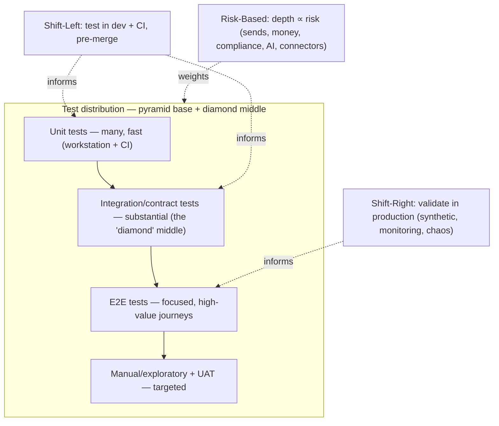
- **Pyramid + Diamond (TD2):** a broad **unit** base (fast, cheap), a **thick integration/contract middle**
  (the platform's value is in integrations — API, queue, connectors, Meta, AI — so we favor a **testing
  diamond** with strong integration coverage), and a **focused E2E** top on the highest-value journeys.
- **Shift-Left:** most defects are caught **before merge** — on the workstation and in CI (Doc 8 §43).
- **Shift-Right:** production is continuously validated via synthetic monitoring (§51), observability
  validation (§44), and chaos/DR drills (§45/§46).
- **Continuous testing:** tests run at every stage — commit, PR, nightly, weekly, release, and in production
  (§47).
- **Risk-based testing (TD3):** depth is proportional to risk — **highest** for anything touching customer
  **sends**, **compliance** (opt-in/window/limits), **money/cost**, **AI approval**, and **connector sessions**;
  lighter for low-risk read paths.

**Design decisions.** Diamond-weighted, shift-left+right, risk-based continuous testing (TD2/TD3). **Alternatives
considered:** classic pyramid only; heavy manual QA; uniform coverage regardless of risk. **Trade-offs:** more
integration-test infra vs. catching the defects that matter for an integration-heavy platform. **Failure
handling:** gaps surface via bug-escape metrics (§49) and feed back into coverage. **Performance impact:** test
tiering keeps CI fast (§47). **Scalability:** the model scales with modules/channels. **Security:** risk
weighting elevates security-sensitive paths. **Future extensibility:** AI-generated tests broaden coverage
cheaply (§55). **Cross-refs:** Doc 8 §43, Doc 9 §43, §47/§49/§51.

---

## 4. Quality Gates

**Purpose.** Define the automated/human checkpoints a change must pass to progress — the enforcement points of
the strategy.

**Scope.** Per-stage gates from commit to production.

**Architecture.**
| Gate (stage) | Must pass |
|---|---|
| **Pre-commit (dev)** | lint, type-check, unit tests for touched code, secret scan |
| **PR / pre-merge** | full unit + affected integration + static analysis + SAST + dependency scan (Doc 8 §43); coverage threshold; review approval |
| **Post-merge (CI)** | full integration + contract tests + image scan; AI eval suite for AI-affecting changes (Doc 9 §43) |
| **Pre-staging** | E2E on key journeys; DB migration test (§42) |
| **Pre-production** | smoke + health verification on staging; performance regression check; security regression |
| **Production** | post-deploy smoke + synthetic monitoring green (§51); error-budget healthy (Doc 8 §33) |

- **Gates are blocking (TD4):** a red gate stops promotion; overrides require documented **risk acceptance**
  (§50), governed and audited (Doc 6 §43/§44).

**Design decisions.** Blocking, staged quality gates aligned to Doc 8 CI/CD (TD4). **Alternatives considered:**
advisory-only checks. **Trade-offs:** occasional release friction vs. preventing regressions/incidents.
**Failure handling:** a failed gate blocks; flaky-gate policy (§52) prevents false blocks. **Performance
impact:** gates parallelized to bound CI time. **Scalability:** gates per new module/channel. **Security:**
security scans are gating. **Future extensibility:** progressive gates (canary metrics) later. **Cross-refs:**
Doc 6 §43/§44, Doc 8 §33/§43, Doc 9 §43, §50/§52.

---

## 5. Definition of Ready & Definition of Done

**Purpose.** Make quality expectations explicit at the **start** (Ready) and **end** (Done) of work so nothing
is under-specified or under-tested.

**Scope.** DoR and DoD checklists.

**Architecture.**
- **Definition of Ready (a work item may start when):** requirement traces to Doc 1 (an FR/NFR/CMP id);
  acceptance criteria are testable; affected docs (Docs 1–9) identified; risk level assigned (§3); test approach
  noted; dependencies known.
- **Definition of Done (a work item is complete when):** code + tests merged; **all Must acceptance tests pass**
  (Doc 1 §8 "Module DoD"); coverage threshold met; integration/contract tests green; security checks pass;
  docs/changelog updated; deployed to staging and smoke-verified; owner-reviewed. For AI changes, the **AI eval
  suite passes** (Doc 9 §43); for connector changes, **connector recovery tests pass** (§41).

**Design decisions.** Explicit DoR/DoD tied to Doc 1 traceability (TD5). **Alternatives considered:** implicit
"looks done." **Trade-offs:** upfront rigor vs. rework/ambiguity. **Failure handling:** items failing DoD don't
merge/release. **Performance impact:** none. **Scalability:** applies to every item. **Security:** security
checks are in DoD. **Future extensibility:** DoR/DoD extended per domain. **Cross-refs:** Doc 1 §8, Doc 9 §43,
§4/§41.

---

## 6. Release Criteria

**Purpose.** Define the objective bar for shipping a release to production.

**Scope.** Release readiness across quality, security, performance, ops.

**Architecture.**
| Criterion | Bar |
|---|---|
| **Functional** | All Must-priority acceptance tests pass (Doc 1); no open critical/major defects |
| **Regression** | Full regression suite green (§47); no new regressions vs. baseline |
| **Performance** | Meets targets (Doc 1 §5.1, Doc 6 §14, Doc 9 §38); no perf regression beyond tolerance |
| **Security** | Security regression + scans clean; no unresolved high/critical findings (§38/§39) |
| **AI** | AI eval suite passes; guardrail/approval tests green (Doc 9 §43; §40) |
| **Connectors** | Connector session/recovery/multi-connector tests green (§41) |
| **Migration** | DB migration + rollback tested (§42); expand-migrate-contract validated (Doc 8 §24) |
| **Ops** | Production Readiness Checklist satisfied (Doc 8 §51); rollback rehearsed; monitoring/alerts ready |
| **Sign-off** | UAT accepted; release approved (§50, governed) |

**Design decisions.** Objective, multi-dimensional release criteria mapped to frozen targets (TD6). **Alternatives
considered:** ship-on-green-unit-tests only. **Trade-offs:** thorough gate vs. speed. **Failure handling:** any
unmet criterion blocks release; risk-accepted exceptions documented (§50). **Performance impact:** none.
**Scalability:** per release. **Security:** security is a hard criterion. **Future extensibility:** progressive/
canary release criteria. **Cross-refs:** Doc 1 §5.1/§8, Doc 6 §14, Doc 8 §24/§51, Doc 9 §38/§43, §38–§42/§47/§50.

---

## 7. Test Environment Architecture

**Purpose.** Define the environments in which each test layer runs, aligned to Doc 8 §42's environment lifecycle
(referenced, not redefined).

**Scope.** Developer/local, QA, UAT, Staging, Production validation, DR testing, Performance Lab, AI Testing,
Connector Testing.

**Architecture.**
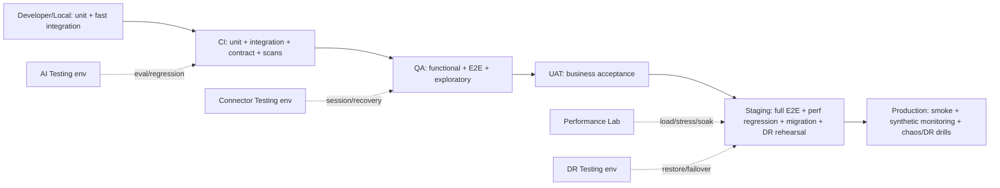
| Environment | Testing role |
|---|---|
| **Developer / Local** | Unit + fast integration against ephemeral local services (Doc 8 §42). |
| **QA** | Functional, E2E, exploratory against a stable build; isolated data. |
| **UAT** | Business acceptance by the Vi Reactivation Team; prod-like, anonymized data. |
| **Staging** | Full E2E, performance regression, migration + DR rehearsals (Doc 8 §22/§24/§42). |
| **Production Validation** | Smoke, synthetic monitoring, controlled chaos/DR drills (§45/§46/§51). |
| **Performance Lab** | Isolated, prod-sized environment for load/stress/soak (§36) without risking prod. |
| **AI Testing** | Isolated env for prompt/model/provider evaluation without prod data/budgets (Doc 8 §42; Doc 9 §43). |
| **Connector Testing** | Isolated env with test connectors for QR/session/recovery/media (§41). |
| **DR Testing** | The warm-standby/restore target used to validate recovery (Doc 8 §22/§23). |

**Design decisions.** Reuse Doc 8's environments + dedicated Performance/AI/Connector/DR test contexts (TD7).
**Alternatives considered:** testing in prod only; one shared test env. **Trade-offs:** environment cost vs.
safe, representative validation. **Failure handling:** lower envs catch defects pre-prod. **Performance impact:**
Performance Lab isolates load from other work. **Scalability:** envs scale down from prod topology.
**Security:** isolated, anonymized data (§9). **Future extensibility:** ephemeral per-PR preview envs.
**Cross-refs:** Doc 8 §22/§23/§24/§42, Doc 9 §43, §9/§36/§41/§45/§46.

---

## 8. Environment Isolation

**Purpose.** Guarantee tests can't interfere with each other, with production, or with real customers.

**Scope.** Network/data/secret isolation; **no real customer messaging from tests**.

**Architecture.**
- **Separate data/secrets per environment** (Doc 8 §42): each env has its own DB/Redis/object storage and its
  own secret set; production secrets exist only in production.
- **No live sends from non-prod (TD8):** test environments use **mocked/sandboxed** Meta and Support Connector
  adapters (§21/§41) so **no real WhatsApp message or call ever originates from a test** — a hard safety rule.
- **Network isolation:** test envs are network-isolated (Doc 8 §5 zoning); no egress to real Meta/customers
  from test contexts.
- **Idempotent, self-cleaning tests:** tests set up and tear down their own data; parallel tests use isolated
  namespaces to avoid collisions.

**Design decisions.** Hard isolation + mocked external channels in non-prod (TD8). **Alternatives considered:**
shared test data; hitting real Meta in test (risk of real sends/bans). **Trade-offs:** mock maintenance vs.
zero risk to customers/quality. **Failure handling:** a test that would send externally is blocked by the
sandbox. **Performance impact:** isolation adds setup cost; parallelized. **Scalability:** namespaced parallel
runs. **Security:** no prod secrets/data downstream; no external egress. **Future extensibility:** contract
tests keep mocks honest (§21/§31). **Cross-refs:** Doc 8 §5/§42, §9/§21/§31/§41.

---

## 9. Test Data Management

**Purpose.** Provide realistic, safe test data so tests are meaningful without exposing real customer data.

**Scope.** Synthetic data, masked production data, data lifecycle for tests.

**Architecture.**
| Approach | Design |
|---|---|
| **Synthetic data** | Generated datasets covering contacts, conversations, campaigns, leads, media, KB — including edge cases (E.164 variants, multilingual, large imports) — the default for most testing (TD9). |
| **Masked production data** | For staging/perf realism, production data is **anonymized/masked** (PII removed/tokenized) before use — **raw prod data never enters lower environments** (Doc 8 §42; Doc 1 CMP-09). |
| **Deterministic seeds** | Reproducible seed sets so tests are stable and debuggable. |
| **Data volume** | Scaled datasets for performance/scale tests (1M contacts, 10M messages — Doc 1 §5.1; Doc 3 §14). |
| **Lifecycle** | Test data is created/torn down per run; ephemeral; retention short. |

**Design decisions.** Synthetic-first, masked-prod for realism, never raw prod (TD9). **Alternatives considered:**
copying production data (privacy/legal risk). **Trade-offs:** generation/masking effort vs. privacy + realism.
**Failure handling:** masking failures block the dataset. **Performance impact:** large synthetic sets sized for
perf labs. **Scalability:** generators scale to target volumes. **Security:** no real PII in tests; masking
audited. **Future extensibility:** property-based generators (§55). **Cross-refs:** Doc 1 §5.1/CMP-09, Doc 3 §14,
Doc 8 §42, §36.

---

> **Common structure for test-layer sections (§10–§25).** Each states its **targets**, the **key properties
> verified**, and how it plugs into CI (Doc 8 §43) and the quality gates (§4). Unless noted, all run in CI,
> use isolated data (§9), mock external channels in non-prod (§8), and feed coverage/quality metrics (§49).

## 10. Unit Testing — Backend

**Purpose.** Verify backend logic in isolation — fast, deterministic, high-coverage.
**Architecture.** Test pure functions, domain logic, and service methods with mocked dependencies (DB/Redis/
providers). Targets: business rules (campaign eligibility, window/opt-in checks per Doc 1 §7, cost calc), state
machines (campaign Doc 6 §26; connector Doc 7 §7). Deterministic, run pre-commit + CI. **Decisions:** heavy unit
base for logic (TD10). **Alternatives:** integration-only (slow feedback). **Trade-offs:** mock upkeep vs. speed.
**Failure/Perf/Scale/Security/Future/Cross-refs:** fast feedback; parallel; validators covered in §14; scales
per module; security logic in §14; property tests later (§55); Doc 1/Doc 6/Doc 7.

## 11. Unit Testing — Frontend

**Purpose.** Verify React components/hooks/state in isolation.
**Architecture.** Component rendering, hooks, state/reducers, form validation, permission-gated rendering
(Doc 5 DS-20), accessibility unit checks (DS-10). Mock API via the typed client. **Decisions:** component-level
tests + a11y checks (TD11). **Alternatives:** E2E-only UI testing (slow, brittle). **Trade-offs:** component
test upkeep vs. fast UI feedback. **Failure/Perf/Scale/Security/Future/Cross-refs:** fast; parallel; per
component; permission rendering tested; visual/interaction later; Doc 5.

## 12. Unit Testing — Services & Repositories

**Purpose.** Verify the service layer (business logic) and repository layer (data-access contracts).
**Architecture.** Services tested with mocked repositories; repositories tested against a real (ephemeral) DB in
integration (§18) but their query contracts unit-checked. Verifies the Clean-Architecture boundaries (Doc 1
§2.6). **Decisions:** test layers at their boundaries (TD12). **Alternatives:** test everything through the API.
**Trade-offs:** layered tests vs. end-to-end only. **Cross-refs:** Doc 1, Doc 3, Doc 4.

## 13. Unit Testing — Utilities

**Purpose.** Verify shared utilities (E.164 normalization, formatting, pagination cursors, date/tz handling).
**Architecture.** Pure-function tests with exhaustive edge cases (the dedup/normalization utilities are high-
risk, Doc 3 §6.1). **Decisions:** exhaustive edge-case coverage for shared utils (TD13). **Cross-refs:** Doc 3
§6, Doc 4 §6.

## 14. Unit Testing — Validators & Security Components

**Purpose.** Verify input validation and security primitives.
**Architecture.** Pydantic-schema-equivalent validation rules, permission checks (RBAC decision logic), token/
hash utilities (Argon2/JWT verify logic), webhook signature verification, idempotency-key handling — all
unit-tested with valid/invalid/malicious inputs. **Security-critical → highest coverage (TD14).** **Cross-refs:**
Doc 1 §5.4, Doc 4 §5/§8, Doc 6 §11.

## 15. Unit Testing — AI Components

**Purpose.** Verify AI-layer logic that is deterministic (not the model itself — that's §40).
**Architecture.** Prompt assembly (deterministic given inputs, Doc 9 §8), context-builder permission scoping
(Doc 9 §13/§34), guardrail input/output validators (Doc 9 §33), confidence/risk computation (Doc 9 §31/§32),
interaction-record construction (Doc 9 §3.3), routing policy selection (Doc 9 §7) — all unit-tested with mocked
providers. **Decisions:** unit-test all deterministic AI logic incl. the safety rules (TD15). **Cross-refs:**
Doc 9 §7/§8/§13/§31/§32/§33/§34.

## 16. Unit Testing — Queue Workers & Schedulers

**Purpose.** Verify task logic and scheduling decisions in isolation.
**Architecture.** Task handlers tested with mocked broker/DB (idempotency, retry classification Doc 6 §6, error
mapping), scheduler due-detection logic (Doc 6 §10), rate-gate math (Doc 6 §5), checkpoint/resume logic (Doc 6
§8). **Decisions:** unit-test task determinism + idempotency logic (TD16). **Cross-refs:** Doc 6 §5/§6/§8/§10.

---

> **Integration testing (§17–§25)** exercises real component boundaries (real DB/Redis/queue; **mocked/
> sandboxed external channels** per §8) to verify the wiring the platform's value depends on — the thick
> "diamond" middle (§3). All run in CI (Doc 8 §43) as a gating stage (§4).

## 17. Integration Testing — API

**Purpose.** Verify API endpoints end-to-end within the backend (routing → auth → service → repository → DB).
**Architecture.** Drive endpoints via the ASGI app against a real ephemeral DB/Redis; assert responses,
persistence, events, and error contracts (RFC 7807 Doc 4 §5). Covers CRUD, pagination/filtering (Doc 4 §6/§7),
idempotency (Doc 4 §8), and async `202`+job flows. **Decisions:** in-process API integration against real data
stores (TD17). **Alternatives:** mock the DB (misses real query behavior). **Trade-offs:** slower than unit vs.
real confidence. **Failure/Perf/Scale/Security/Future/Cross-refs:** parallel with isolated DBs; per resource;
authz asserted (§23); contract tests in §31; Doc 4.

## 18. Integration Testing — Database

**Purpose.** Verify repositories, constraints, indexes, and partitioned-table behavior against real MySQL.
**Architecture.** Repository queries against real MySQL 8; assert constraints (unique/dedup Doc 3 §6.1),
cascade rules, soft-delete, partition routing (Doc 3 §14), and keyset pagination correctness. Migration/rollback
covered in §42. **Decisions:** real-MySQL repository tests (TD18). **Cross-refs:** Doc 3 §1/§6/§14.

## 19. Integration Testing — Redis, Queue & Celery

**Purpose.** Verify broker/cache/lock/rate behavior and end-to-end task execution.
**Architecture.** Real Redis + real workers: enqueue → execute → assert durable state (Doc 6); verify rate-gate
token buckets (§5), distributed locks (§9), idempotency, and cache invalidation. Deeper queue-failure scenarios
in §35. **Decisions:** real Redis + worker integration (TD19). **Cross-refs:** Doc 6 §5/§9/§12.

## 20. Integration Testing — Support Connector

**Purpose.** Verify the platform ↔ Support Connector adapter integration through the **abstraction** (Doc 7 §5).
**Architecture.** Against a **sandbox connector adapter** (test double implementing the Doc 7 interface): send/
receive canonical messages, media, session-status events; assert the Unified Conversation Engine normalizes
correctly (Doc 7 §12) and never depends on implementation. Session/QR/recovery in §41. **Decisions:** test
against the abstraction with a conformant sandbox adapter (TD20) — keeps tests implementation-neutral.
**Cross-refs:** Doc 7 §5/§12, §41.

## 21. Integration Testing — Meta Cloud API

**Purpose.** Verify Channel-1 integration without hitting real Meta (no real sends).
**Architecture.** A **Meta sandbox/mock** honoring the Cloud API contract (send responses, status webhooks,
media, errors); assert outbound send handling, `wamid` capture, webhook ingestion/idempotency (Doc 6 §11), and
error classification (Doc 6 §6). **Contract tests (§31)** keep the mock faithful to Meta. **Decisions:** mock
Meta with contract-verified fidelity (TD21). **Alternatives:** hit real Meta (risk of real sends/bans/cost).
**Cross-refs:** Doc 6 §6/§11, Doc 1 §7, §31.

## 22. Integration Testing — Media

**Purpose.** Verify the unified media pipeline across both channels.
**Architecture.** Upload/download/dedup (SHA-256), object-storage put/get with signed URLs, metadata in DB
(Doc 3 §7.2), thumbnailing, and attachment linking (Doc 7 §16/§17); Meta media-id caching (Doc 3 FR-MED-07).
**Decisions:** real object storage + DB media integration (TD22). **Cross-refs:** Doc 3 §7.2, Doc 4 §16, Doc 7
§16/§17.

## 23. Integration Testing — Authentication & RBAC

**Purpose.** Verify auth flows and permission enforcement across the API.
**Architecture.** Login/refresh/rotation/revocation (Doc 4 §11), MFA, and **RBAC on every protected route**
(Doc 4 §4): assert forbidden actions return `403` and hidden data is never returned — including the rule that
**no visible action ever 403s** (Doc 5 DS-20). **Security-critical → thorough (TD23).** **Cross-refs:** Doc 1
§3.1, Doc 4 §4/§11, Doc 5 DS-20.

## 24. Integration Testing — Notifications

**Purpose.** Verify in-app/email/webhook notifications and the real-time (SSE) bus.
**Architecture.** Assert events (Doc 4 §24) produce notifications (Doc 5 DS-16), SSE delivery, and preference/
mute/snooze behavior (Doc 5 F7); email/webhook via sandboxed sinks. **Decisions:** event→notification→SSE
integration (TD24). **Cross-refs:** Doc 4 §24, Doc 5 DS-16/F7.

## 25. Integration Testing — AI Services

**Purpose.** Verify the AI pipeline integration (gateway → context → prompt → route → provider → guardrail →
score → record → approval) with a **mock provider** (deterministic).
**Architecture.** Assert permission-scoped context (Doc 9 §13/§34), guardrail enforcement (§33), interaction-
record completeness (§3.3), **and the hard rule that AI output cannot reach a customer without approval**
(Doc 9 §30). Model-quality is tested separately (§40). **Decisions:** integration-test the AI pipeline + the
no-auto-send invariant with a mock provider (TD25). **Cross-refs:** Doc 9 §5/§13/§30/§33/§34, §40.

---

## 26. End-to-End Testing (overview)

**Purpose.** Verify the **highest-value user journeys** through the real, integrated stack (UI → API → queue →
data → mocked channels) — proving the platform works as a whole for the Vi Reactivation Team.

**Scope.** Focused E2E on critical journeys; not exhaustive UI permutations (those are unit/integration).

**Architecture.**
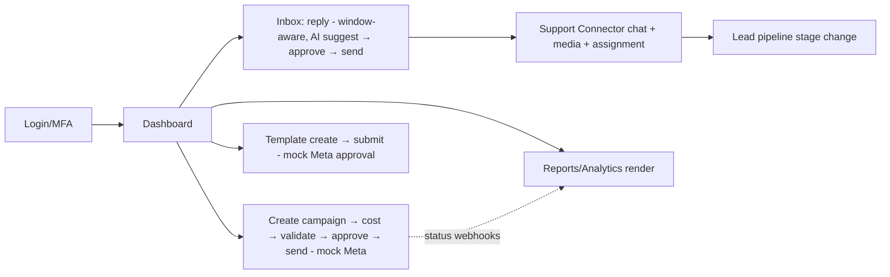
E2E journeys run on QA/Staging (§7) against sandboxed channels (§8/§21/§41), driven through the real UI (Doc 5).
Each asserts business outcomes + persisted state + emitted events. **Decisions:** focused, high-value E2E on
real stack (TD26). **Alternatives:** exhaustive E2E (slow/brittle). **Trade-offs:** fewer E2E vs. maintainable,
meaningful coverage. **Failure/Perf/Scale/Security/Future/Cross-refs:** flaky-managed (§52); run nightly +
pre-release; per-journey; auth/compliance asserted; visual/synthetic later; Doc 5, §27–§30.

## 27. E2E — Campaign & Messaging Flows

**Purpose.** Verify the full campaign lifecycle and single/batch sends.
**Architecture.** Campaign Wizard (Doc 5 B4.2) → audience/opt-in filter → template → **cost estimate** → pre-send
validation (opt-in/window/limit) → **human send** → per-recipient ledger → status webhooks (mock Meta) →
analytics. Asserts **compliance is enforced** and **no send bypasses validation** (Doc 1 §7; Doc 6 §4/§5).
**Cross-refs:** Doc 5 B4, Doc 6 §4/§5, Doc 4 §17.

## 28. E2E — Inbox & Support Connector

**Purpose.** Verify agent support across both channels in the unified inbox.
**Architecture.** Inbound (mock Meta + sandbox connector) → conversation routing (Doc 7 §14) → agent reply
(window-aware Channel 1; free-form connector) → media/voice-note handling → assignment (§ Doc 7 §21) → status.
Asserts channel-agnostic behavior via the canonical model (Doc 7 §12). **Cross-refs:** Doc 5 B7, Doc 7 §12/§14/
§21, §41.

## 29. E2E — Lead Pipeline & AI Approval

**Purpose.** Verify CRM lead flow and the AI human-approval path.
**Architecture.** A support conversation → AI suggested reply/draft (mock provider) → **confidence/sources
shown** → agent edits → **approves** → send (only then). Lead stage transitions (Doc 7 §19) and document-analysis
suggestions (Doc 9 §24) are confirmed by a human. Asserts **AI never sends without approval** end-to-end.
**Cross-refs:** Doc 7 §19, Doc 9 §14/§24/§30, Doc 5 F8.

## 30. E2E — Templates, Media, Reports & Analytics

**Purpose.** Verify template management, media library, and reporting.
**Architecture.** Template create → submit (mock Meta) → approval webhook → usable in campaign; media upload →
reuse; reports/analytics (delivery/read/failure/cost/click) render from real data with export. **Cross-refs:**
Doc 5 B5/B6/B10, Doc 4 §15/§16/§20, Doc 6 §35.

---

## 31. API Testing — Contract & OpenAPI Validation

**Purpose.** Guarantee the API honors its contract (Doc 4) and that clients/mocks stay faithful to it.
**Scope.** Contract testing, OpenAPI validation.

**Architecture.**
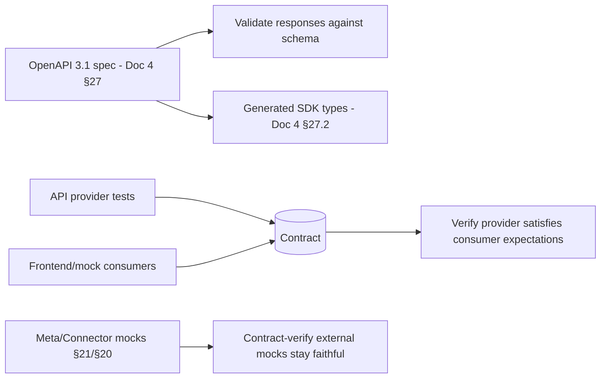
- **OpenAPI validation:** every endpoint's responses validate against the generated **OpenAPI 3.1** schema
  (Doc 4 §27) — drift fails CI.
- **Contract testing:** consumer-driven contracts between the API and its consumers (frontend/SDKs), and
  between the platform and its **external mocks** (Meta §21, Connector §20) so mocks can't silently diverge from
  reality. **Decisions:** spec + contract tests as gates (TD27). **Alternatives:** hand-written assertions only
  (drift-prone). **Trade-offs:** contract upkeep vs. drift protection. **Cross-refs:** Doc 4 §26/§27, §20/§21.

## 32. API Testing — Backward Compatibility & Versioning

**Purpose.** Ensure additive changes don't break existing clients and versioning rules hold (Doc 4 §26).
**Architecture.** Golden-response/compat tests assert existing `v1` fields/behaviors are unchanged; new fields
are optional; removed/renamed fields are rejected within a major version; deprecation headers honored. Validates
the **10-year stability** promise (Doc 4 §26). **Decisions:** enforce backward-compat in CI (TD28). **Cross-refs:**
Doc 4 §26/§27.

## 33. API Testing — Negative, Idempotency, Pagination, Filtering, Rate Limits

**Purpose.** Verify robustness and the cross-cutting API contracts.
**Architecture.** **Negative:** malformed/oversized/invalid inputs → correct `4xx` problems (Doc 4 §5).
**Idempotency:** duplicate `Idempotency-Key` returns the original, no double effect (Doc 4 §8) — critical for
sends. **Pagination:** cursor stability under concurrent writes (Doc 4 §6). **Filtering:** the filter grammar
(Doc 4 §7). **Rate limits:** `429` + `Retry-After` at thresholds (Doc 4 §9). **Decisions:** exhaustive
cross-cutting-contract tests (TD29). **Cross-refs:** Doc 4 §5/§6/§7/§8/§9.

## 34. API Testing — Authentication & Authorization

**Purpose.** Verify auth/authz at the API boundary comprehensively.
**Architecture.** Token validity/expiry/rotation/reuse-detection (Doc 4 §11); every endpoint enforces its
required permission (Doc 4 §4) — automated **permission matrix** tests assert each role's allowed/denied set;
API-key auth + scopes; IP allow/block (Doc 4 §25). **Security-critical (TD30).** **Cross-refs:** Doc 1 §3.1,
Doc 4 §4/§11/§25.

---

## 35. Queue Testing

**Purpose.** Verify the async fabric's hard guarantees — **zero duplicates, crash-safe resume, no lost work** —
under failure (Doc 6).

**Scope.** Worker crash, retry, DLQ, recovery, checkpoint resume, Redis/node failure, duplicate prevention,
load distribution.

**Architecture.**
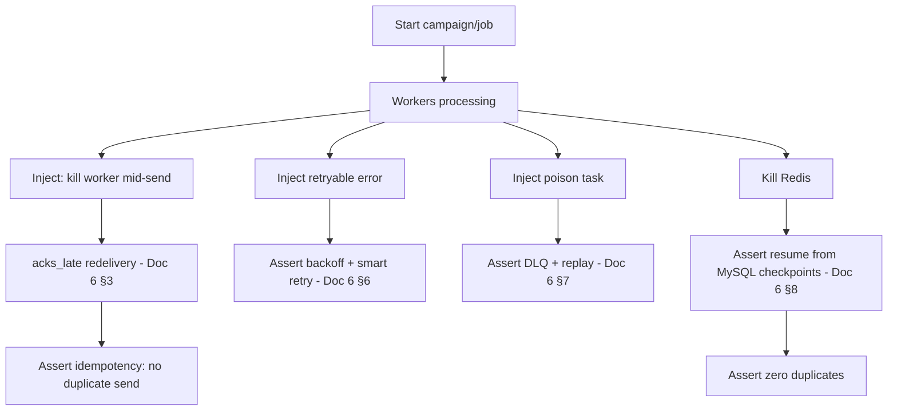
| Scenario | Assertion |
|---|---|
| **Worker crash mid-send** | `acks_late` redelivery; **no duplicate** message (Doc 6 §3/§8) |
| **Retry** | retryable errors back off + retry; terminal don't (Doc 6 §6) |
| **DLQ** | poison tasks land in DLQ; replay is idempotent (Doc 6 §7) |
| **Checkpoint resume** | interrupted campaign resumes from `campaign_batches`; already-sent skipped (Doc 6 §8) |
| **Redis failure** | pending work rebuilt from MySQL; no loss (Doc 6 §8.4) |
| **Node failure** | tasks redelivered; connector sessions re-pinned (Doc 6 §22/§23) |
| **Duplicate prevention** | idempotency key + DB unique constraints hold under races (Doc 6 §8.5) |
| **Load distribution** | bounded prefetch → even distribution; no starvation of priority lanes (Doc 6 §3/§24) |

**Decisions:** fault-injection tests for every queue guarantee (TD31). **Alternatives:** trust the design
untested (risky for the core reliability promise). **Trade-offs:** fault-injection harness vs. proven
resilience. **Failure/Perf/Scale/Security/Future/Cross-refs:** run in Staging/Chaos (§45); perf-isolated; scales
with pools; governed; extends to new channels; Doc 6 §3/§6/§7/§8/§22/§23/§24.

---

## 36. Performance Testing — Load, Stress, Spike, Soak

**Purpose.** Verify the platform meets performance/scale targets and stays stable under sustained/extreme load.
**Scope.** Load, stress, spike, soak/endurance.

**Architecture.**
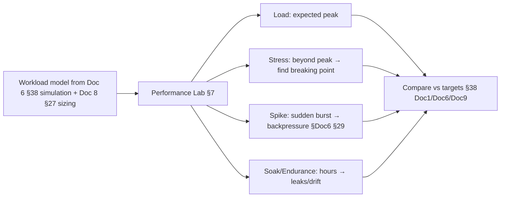
- **Load:** at expected peak (per number/connector counts, Doc 8 §27) → assert latency/throughput targets
  (Doc 1 §5.1, Doc 6 §14, Doc 9 §38). **Stress:** push beyond peak to find the breaking point + graceful
  degradation (Doc 6 §29). **Spike:** sudden bursts → assert backpressure/admission control (Doc 6 §29). **Soak/
  Endurance:** multi-hour runs → assert no memory leaks/drift (Doc 6 §25; Doc 5 F15 memory budget).
**Decisions:** model-driven perf testing in an isolated lab (TD32). **Alternatives:** perf-test in prod/staging
shared (risky/noisy). **Cross-refs:** Doc 1 §5.1, Doc 6 §14/§25/§29/§38, Doc 8 §27, Doc 9 §38, §37.

## 37. Performance Testing — Capacity, Scalability & Throughput

**Purpose.** Validate capacity-planning assumptions and per-subsystem throughput.
**Architecture.** Measure **queue throughput** (sends/sec per number, Doc 6 §14), **database throughput** (reads/
writes at 1M contacts/10M messages, Doc 3 §14), **API throughput** (RPS at p95 targets), and **connector
throughput** (per-connector message rate, Doc 7). Validate **horizontal scalability** by adding worker replicas/
nodes and confirming near-linear scaling to Meta limits (Doc 6 §16; Doc 8 §23). Feeds capacity sizing (Doc 8
§27) and predictive planning (Doc 6 §36). **Decisions:** measure each subsystem's throughput + scale-out (TD33).
**Cross-refs:** Doc 3 §14, Doc 6 §14/§16/§36, Doc 7, Doc 8 §23/§27.

---

## 38. Security Testing — Application

**Purpose.** Verify the platform resists application-level attacks (target OWASP ASVS L2, Doc 1 §5.4).
**Scope.** Pen testing, OWASP, RBAC, CSRF, XSS, SQL injection.

**Architecture.**
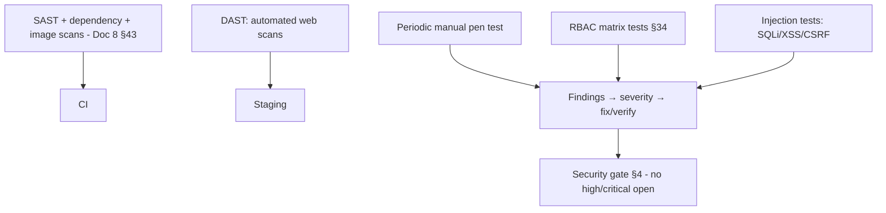
| Area | Test |
|---|---|
| **OWASP / pen testing** | Automated DAST in CI/staging + periodic manual pen tests against the OWASP Top 10 |
| **RBAC** | Permission-matrix tests; privilege-escalation attempts denied (§34) |
| **CSRF** | Bearer-header auth (not CSRF-exploitable); cookie-mode CSRF tokens if used (Doc 1 NFR-SEC-01) |
| **XSS** | Injection into names/notes/templates → assert escaping/CSP (Doc 1 NFR-SEC-02/03) |
| **SQL injection** | Parameterized/ORM safety; injection attempts fail (Doc 3) |
- **Decisions:** layered SAST/DAST/pen + gating (TD34). **Cross-refs:** Doc 1 §5.4, Doc 8 §26/§43, §4/§34/§39.

## 39. Security Testing — AI, Secrets & Connector

**Purpose.** Verify the platform-specific security surfaces: AI, secrets, sessions, connectors.
**Architecture.**
| Area | Test |
|---|---|
| **Prompt injection** | Malicious content in messages/KB attempts to hijack the model → assert delimited-untrusted-context defenses hold (Doc 9 §33); no instruction execution |
| **Jailbreak** | Attempts to make AI break rules (send, reveal secrets, escalate) → refused; **no auto-send path exists** (Doc 9 §30/§34) |
| **Secrets** | Assert secrets never appear in logs/errors/responses/prompts/client bundle (Doc 8 §20; Doc 9 §34) |
| **Encryption** | Verify tokens/sessions/backups encrypted at rest (Doc 3, Doc 7 §9, Doc 8 §20) |
| **Session hijacking** | Refresh-token rotation/reuse-detection; single-holder connector sessions can't be hijacked (Doc 4 §11, Doc 7 §9) |
| **Connector security** | Session credential protection; only authenticated-session events trusted (Doc 7 §18/§28) |
- **Decisions:** dedicated tests for AI-safety + secrets + session/connector security (TD35). **Cross-refs:**
Doc 3, Doc 4 §11, Doc 7 §9/§18/§28, Doc 8 §20, Doc 9 §30/§33/§34.

---

## 40. AI Testing

**Purpose.** Verify AI **quality and safety** (the non-deterministic layer) — executing Doc 9's evaluation
framework (§43) as a test discipline.

**Scope.** Prompt evaluation, grounding, hallucination detection, confidence, guardrails, approval, model/
provider comparison, prompt regression, KB validation.

**Architecture.**
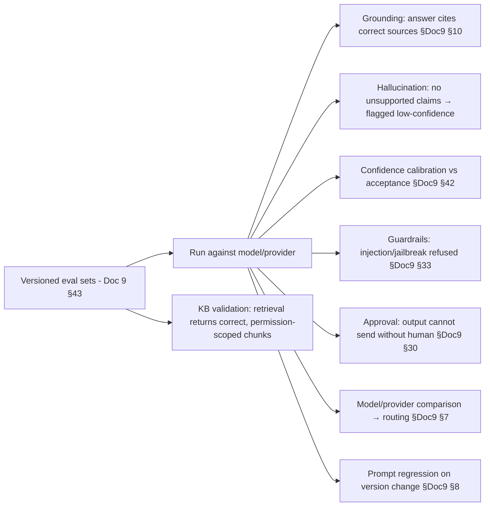
| Test | Assertion |
|---|---|
| **Prompt evaluation** | New prompt versions score ≥ threshold before promotion (Doc 9 §8/§43) |
| **Grounding** | Answers are attributable to correct KB chunks; ungrounded → low confidence (Doc 9 §10) |
| **Hallucination detection** | Unsupported claims flagged/penalized; measured hallucination rate below bar |
| **Confidence validation** | Confidence correlates with human acceptance (calibration, Doc 9 §31/§42) |
| **Guardrail testing** | Injection/jailbreak/PII cases blocked (Doc 9 §33) |
| **Approval testing** | End-to-end: **AI output never reaches a customer without human approval** (Doc 9 §30) |
| **Model/provider comparison** | Quality/latency/cost benchmarked → informs routing (Doc 9 §6/§7) |
| **Prompt regression** | Golden-set regression on any prompt/model/provider change (blocks on regression) |
| **KB validation** | Retrieval returns correct, **permission-scoped** chunks (Doc 9 §11/§34) |
- **Decisions:** run Doc 9's eval framework as gating tests, incl. adversarial + approval-invariant tests
  (TD36). **Alternatives:** ship AI changes untested (regression/safety risk). **Trade-offs:** eval-set upkeep +
  probabilistic assertions (thresholds, not exact) vs. reliable AI quality/safety. **Failure/Perf/Scale/Security/
  Future/Cross-refs:** regressions block promotion; runs in the AI Testing env (§7); scales with sets;
  adversarial-security included; AI-generated eval cases later (§55); Doc 9 §6/§7/§8/§10/§11/§30/§31/§33/§34/§42/§43.

---

## 41. Support Connector Testing

**Purpose.** Verify Channel-2 connector behavior — session lifecycle, recovery, media, and multi-connector
isolation — **through the abstraction** (Doc 7), never a specific implementation.

**Scope.** QR login, reconnect, disconnect, recovery, media, voice notes, documents, assignment, lead sync,
session persistence, multi-connector.

**Architecture.**
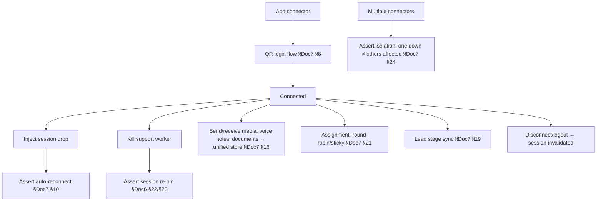
| Scenario | Assertion |
|---|---|
| **QR login / refresh** | QR issued, session established, persisted encrypted (Doc 7 §8/§9) |
| **Reconnect** | transient drop auto-recovers with backoff (Doc 7 §10) |
| **Disconnect / logout** | session invalidated; re-login required; history retained (Doc 7 §7) |
| **Recovery** | worker/node loss → re-pin; **no duplicate/lost messages** (Doc 6 §22/§23) |
| **Media / voice notes / documents** | inbound/outbound via unified media (Doc 7 §16/§17) |
| **Assignment** | manual/round-robin/sticky/queue behave correctly (Doc 7 §21) |
| **Lead sync** | conversation lead-stage transitions persist + audit (Doc 7 §19) |
| **Session persistence** | sessions survive restart/failover (Doc 7 §9) |
| **Multi-connector isolation** | one connector's fault never affects others or Channel 1 (Doc 7 §24) |
- **Decisions:** abstraction-level connector tests with a conformant sandbox + fault injection (TD37).
**Alternatives:** test a specific implementation (couples tests to it). **Trade-offs:** sandbox fidelity vs.
implementation-neutral tests (contract tests keep the sandbox honest). **Cross-refs:** Doc 6 §22/§23, Doc 7 §7–
§24, §20.

---

## 42. Database Testing

**Purpose.** Verify schema evolution, data integrity, and recoverability at the data tier.
**Scope.** Migration, rollback, partition, index, backup/restore, consistency, integrity.

**Architecture.**
| Test | Assertion |
|---|---|
| **Migration** | Each Alembic migration applies cleanly on a prod-like DB; **expand→migrate→contract** order verified (Doc 8 §24.6); zero-downtime compatibility |
| **Rollback** | Backward-compatible migrations roll back safely; no data loss |
| **Partition** | Monthly partition creation/pruning works; queries prune correctly (Doc 3 §14) |
| **Index validation** | Hot queries use intended indexes (no full scans); keyset pagination performant (Doc 3 §13) |
| **Backup/restore** | Backups restore to a correct state; **PITR** validated (Doc 8 §21/§22) — "untested backup = no backup" |
| **Consistency** | Denormalized counters reconcile to source (Doc 3 §17 reconciliation) |
| **Integrity** | Constraints/cascades/soft-delete/uniqueness enforced (Doc 3 §1/§6) |
- **Decisions:** migrations + restores are **tested, not assumed** (TD51). **Cross-refs:** Doc 3
§1/§6/§13/§14/§17, Doc 8 §21/§22/§24.

---

## 43. Deployment Validation

**Purpose.** Verify releases deploy safely with zero downtime and can roll back.
**Scope.** Blue-green, rolling, rollback, zero-downtime, health checks, smoke, post-deploy validation.

**Architecture.**
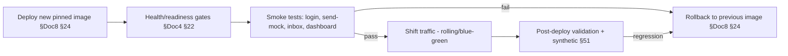
- **Zero-downtime** verified via continuous synthetic traffic during a rolling/blue-green deploy (no dropped
  requests). **Health checks** gate cutover; **smoke tests** exercise critical paths post-deploy; **rollback**
  is rehearsed every release. **Decisions:** every deploy is health-gated + smoke-validated + rollback-rehearsed
  (TD38). **Cross-refs:** Doc 4 §22, Doc 8 §24/§30, §51.

---

## 44. Observability Validation

**Purpose.** Verify that monitoring itself works — metrics, logs, traces, alerts, and dashboards are correct and
actionable (you must be able to trust your telemetry).
**Scope.** Metrics, logs, tracing, alerts, dashboards, health monitoring.

**Architecture.**
| Signal | Validation |
|---|---|
| **Metrics** | Key metrics emit with correct labels; values plausible (Doc 8 §18; Doc 6 §13) |
| **Logs** | Structured logs reach Loki with `request_id`; **no secrets/PII** in logs (Doc 8 §19; Doc 9 §35) |
| **Tracing** | A request/AI interaction is traceable end-to-end (Doc 6 §13; Doc 9 §41) |
| **Alerts** | Inject a threshold breach → assert the alert fires and routes (Doc 8 §33; Alertmanager) — **alert-firing is tested**, incl. a dead-man's switch |
| **Dashboards** | Key dashboards render correct data (queue/campaign/connector/API/DB/AI) |
| **Health monitoring** | `/health`/`/ready` reflect real dependency state (Doc 4 §22) |
- **Decisions:** validate telemetry + **test that alerts actually fire** (TD39). **Alternatives:** assume
monitoring works (silent blind spots). **Cross-refs:** Doc 4 §22, Doc 6 §13, Doc 8 §18/§19/§33, Doc 9 §41.

---

## 45. Chaos Engineering

**Purpose.** Prove resilience by **deliberately injecting failure** in controlled conditions and asserting
graceful degradation + recovery (validates Doc 6 §15/§29 and Doc 8 §22).
**Scope.** Kill workers/Redis/DB/AI/connector; network/Cloudflare failure; disk/CPU/memory exhaustion.

**Architecture.**
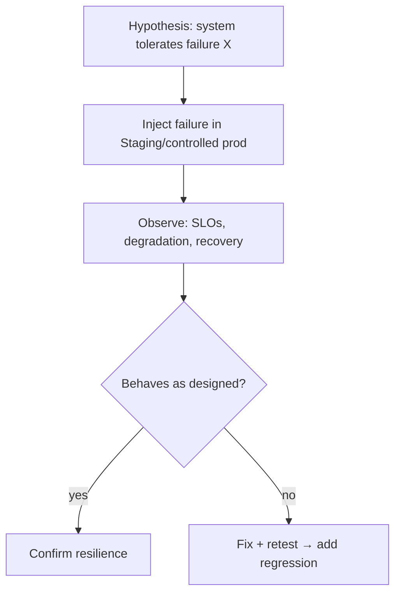
| Fault injected | Expected behavior |
|---|---|
| **Kill workers** | `acks_late` redelivery; no dup/loss (Doc 6 §3/§8) |
| **Kill Redis** | rebuild + resume from MySQL checkpoints (Doc 6 §8.4) |
| **Kill database** | sends pause, retry on recovery; no corruption (Doc 6 §15 F3) |
| **Kill AI** | AI degrades to manual; **core messaging unaffected** (Doc 9 §39) |
| **Kill connector** | that lane pauses + recovers; others + Channel 1 unaffected (Doc 7 §24) |
| **Network / Cloudflare failure** | origin fails closed; break-glass path; recovery (Doc 8 §9/§22) |
| **Disk full** | writes refused (not corrupted); alert; cleanup frees space (Doc 6 §15 F8) |
| **CPU / memory exhaustion** | cgroup limits + worker recycling protect the node (Doc 6 §25; Doc 8 §25) |
- **Decisions:** hypothesis-driven chaos in Staging (and cautious, governed prod game-days) (TD40). **Alternatives:**
hope resilience works. **Trade-offs:** chaos risk (controlled) vs. proven resilience. **Failure/Security/Future/
Cross-refs:** governed + audited (Doc 6 §43/§44); expands per subsystem; automated chaos later; Doc 6 §15/§25/§29,
Doc 7 §24, Doc 8 §22/§25, Doc 9 §39.

---

## 46. Disaster Recovery Testing

**Purpose.** Prove the platform can recover from catastrophic loss within RTO/RPO — validating Doc 8 §22 and
Doc 6 §41 as executed drills, not paper plans.
**Scope.** Restore/backup validation, failover, recovery time/point, business continuity.

**Architecture.**
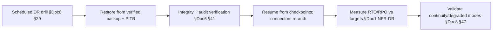
| Test | Assertion |
|---|---|
| **Backup validation** | Every backup is test-restored + integrity-checked (Doc 8 §21; "verified") |
| **Restore validation** | Cold + warm restore produce a correct, consistent system (Doc 8 §22) |
| **Failover** | Warm-standby promotion works; near-zero RTO path (Doc 8 §23) |
| **Recovery time (RTO)** | Measured ≤ target (Doc 1 NFR-DR-03) |
| **Recovery point (RPO)** | Accepted data loss ≈ 0 (Doc 1 NFR-DR-02; Doc 6 §8) |
| **Business continuity** | Degraded/manual modes + dual-channel continuity work (Doc 8 §47) |
- **Decisions:** DR is **drilled quarterly** and measured (TD41). **Alternatives:** untested DR plan (fails when
needed). **Cross-refs:** Doc 1 NFR-DR, Doc 6 §8/§41, Doc 8 §21/§22/§23/§29/§47.

---

## 47. Test Automation Strategy

**Purpose.** Define when each test suite runs so feedback is fast where it matters and thorough before release —
integrated with Doc 8 §43 CI/CD.
**Scope.** CI testing, regression suite, nightly, weekly, release, production validation.

**Architecture.**
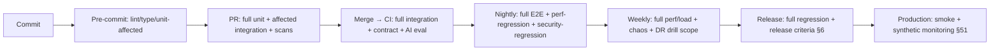
| Cadence | Suite |
|---|---|
| **CI (commit/PR/merge)** | unit, affected + full integration, contract, scans, AI eval (Doc 8 §43; Doc 9 §43) |
| **Nightly** | full E2E, performance regression, security regression |
| **Weekly** | full load/soak, chaos game-day, DR drill scope |
| **Release** | full regression + all release criteria (§6) |
| **Production** | continuous smoke + synthetic monitoring (§51) |
- **Decisions:** tiered cadence — fast in CI, heavy off-peak, continuous in prod (TD42). **Alternatives:** run
everything on every commit (slow) or only manually (misses regressions). **Trade-offs:** cadence complexity vs.
fast feedback + thorough coverage. **Cross-refs:** Doc 8 §43, Doc 9 §43, §6/§48/§51.

## 48. Continuous Testing (Shift-Left & Shift-Right)

**Purpose.** Embed testing across the whole lifecycle, not a phase.
**Architecture.** **Shift-left:** developers run unit/affected-integration locally; PRs gate on quality (§4);
contracts catch integration drift early. **Shift-right:** production is continuously validated (synthetic
monitoring §51, observability validation §44, chaos/DR drills §45/§46), and real incidents feed regression tests
(a defect becomes a test). **Decisions:** continuous, bidirectional testing (TD43). **Cross-refs:** §3/§4/§44/§45/
§46/§51.

## 49. Quality Metrics & KPIs

**Purpose.** Quantify quality and drive improvement (complements Doc 8 §52 operational KPIs).
**Architecture.**
| Metric | Meaning / target |
|---|---|
| **Coverage** | Line/branch coverage on business logic ≥ target (Doc 1 maintainability ≥80% on logic) |
| **Bug escape rate** | Defects found in prod ÷ total — trend down |
| **MTTD / MTTR** | Detect/recover times (Doc 8 §52) |
| **Regression rate** | New regressions per release — trend to zero |
| **Deployment success rate** | ≥99% (rollback on fail, Doc 8 §43) |
| **AI acceptance rate** | Approved vs edited vs rejected AI drafts (Doc 9 §42) — quality proxy |
| **Queue reliability** | Zero-duplicate + resume success in tests/prod (Doc 6) |
| **API reliability** | Contract-conformance + error-rate |
| **Flaky-test rate** | Quarantined/flaky ÷ total — kept low (§52) |
- **Decisions:** a defined QA KPI set feeding continuous improvement (TD44). **Cross-refs:** Doc 1, Doc 6, Doc 8
§52, Doc 9 §42, §52.

## 50. Test Governance

**Purpose.** Define ownership, review, and approval so quality is accountable.
**Architecture.**
| Aspect | Policy |
|---|---|
| **Test ownership** | Each module/domain owns its tests; connector/AI/security suites have named owners |
| **Review policy** | Tests are reviewed like code; new features require tests (DoD §5) |
| **Approval policy** | Release approval requires green gates + criteria (§4/§6), governed (Doc 6 §43) |
| **Release approval** | Named approver signs off; UAT accepted |
| **Risk acceptance** | A gate override requires **documented, audited risk acceptance** with an owner + remediation plan (Doc 6 §44) |
- **Decisions:** owned, reviewed, audited quality with explicit risk acceptance (TD45). **Cross-refs:** Doc 6 §43/
§44, §4/§5/§6.

## 51. Production Validation & Synthetic Monitoring

**Purpose.** Continuously prove production works from the user's perspective (shift-right), without touching real
customers.
**Architecture.** **Synthetic journeys** run continuously against production using **internal test identities +
sandboxed channels** (no real customer messages): login, dashboard load, an inbox/inbound flow (via a controlled
test path), and health endpoints — asserting availability + latency SLOs (Doc 8 §52). Failures alert on-call
(Doc 8 §34). Post-deploy smoke (§43) is the release-time instance of this. **Decisions:** continuous synthetic
production validation, customer-safe (TD46). **Alternatives:** rely on user reports (slow detection). **Trade-offs:**
synthetic upkeep vs. early detection. **Security:** test identities isolated; no real sends. **Cross-refs:** Doc 8
§33/§34/§52, §43/§44.

## 52. Flakiness Management & Test Reliability

**Purpose.** Keep the suite **trustworthy** — a flaky suite is worse than none (teams ignore it).
**Architecture.** Detect flaky tests (retry-variance tracking); **quarantine** flakies out of the blocking gate
while tracked for fix (never silently ignored); enforce determinism (no real time/network/order dependence,
isolated data §9); a **flaky-rate KPI** (§49) with a budget. Root-cause flakies (timing, shared state, external
calls). **Decisions:** detect-quarantine-fix flakies; protect gate trust (TD47). **Alternatives:** blanket
retries (masks real bugs). **Trade-offs:** quarantine risk vs. a trusted gate. **Cross-refs:** §4/§9/§49.

## 53. Test Reporting & Traceability

**Purpose.** Make quality **visible and traceable** — every requirement to its tests, every run to its results.
**Architecture.** A **requirement→test traceability** map (Doc 1 requirement ids → covering tests) proves
coverage of Must requirements (Doc 1 §8); test runs produce reports (pass/fail/coverage/duration/flaky) surfaced
to the team; failures link to logs/traces (§44). Release notes include the quality summary. **Decisions:**
requirement-linked traceability + reporting (TD48). **Cross-refs:** Doc 1 §8, §44/§49.

## 54. Non-Functional, Accessibility & Compliance Testing

**Purpose.** Verify qualities beyond functionality — accessibility, compliance, and NFRs.
**Architecture.** **Accessibility:** automated a11y checks (WCAG 2.1 AA, Doc 5 DS-10) in CI + manual audits on key
screens. **Compliance:** tests assert opt-in/opt-out/window/limit enforcement (Doc 1 §7), retention/erasure
(Doc 8 §36/§48), and audit-trail completeness (Doc 6 §44). **NFR:** performance/security/reliability covered in
their sections; usability via UAT. **Decisions:** treat a11y + compliance as gated test targets (TD49).
**Cross-refs:** Doc 1 §7, Doc 5 DS-10, Doc 6 §44, Doc 8 §36/§48.

## 55. Future Readiness

**Purpose.** Keep the testing architecture ready for advanced techniques without redesign.
**Architecture (future-ready).**
| Technique | Fit |
|---|---|
| **Mutation testing** | Measure test *effectiveness* (do tests catch injected faults?) on critical logic |
| **Property-based testing** | Generate wide input spaces for utilities/validators (§13/§14) |
| **Fuzz testing** | Fuzz API inputs, webhook/connector payloads, media parsers for robustness/security |
| **Synthetic monitoring** | Already introduced (§51); expand coverage |
| **Self-healing tests** | Auto-locator repair for UI E2E to cut maintenance |
| **AI-generated tests** | Use AI (Doc 9, human-reviewed) to propose test cases + eval sets — human-approved, never blindly trusted |
- **Decisions:** additive advanced testing behind the existing strategy (TD50). **Alternatives:** stagnate.
**Trade-offs:** tooling investment vs. deeper assurance. **Security:** fuzzing hardens inputs. **Cross-refs:** §13/
§14/§40/§51, Doc 9.

---

## 56. Testing Decision Records (TD1–TD51)

Each: **Decision · Why · Alternative rejected · Trade-off · Migration.** (≥35 required; 51 provided.)

| ID | Decision | Why | Alternative rejected | Trade-off | Migration |
|---|---|---|---|---|---|
| **TD1** | Quality as a continuous, traceable system | Catch defects early, ship safely | end-phase manual QA | test engineering effort | automate progressively |
| **TD2** | Diamond-weighted distribution (strong integration middle) | Value is in integrations | classic pyramid only | integration infra | add layers additively |
| **TD3** | Risk-based depth | Focus where it matters (sends/compliance/AI/connector) | uniform coverage | risk assessment upkeep | refine from escapes |
| **TD4** | Blocking staged quality gates | Prevent regressions | advisory checks | release friction | add canary gates |
| **TD5** | Explicit DoR/DoD tied to Doc 1 | No under-spec/under-test | implicit "done" | rigor | per-domain extend |
| **TD6** | Objective multi-dimensional release criteria | Safe ship bar | green-unit-only | thorough gate | progressive/canary |
| **TD7** | Reuse Doc 8 envs + dedicated perf/AI/connector/DR test contexts | Safe, representative | prod-only/one shared | env cost | ephemeral previews |
| **TD8** | Hard isolation + mocked external channels in non-prod | **No real sends from tests** | hit real Meta | mock upkeep | contract-verified mocks |
| **TD9** | Synthetic-first, masked-prod, never raw prod | Privacy + realism | copy prod data | generation effort | property generators |
| **TD10–TD16** | Broad unit base per target (backend/frontend/services/utils/validators/AI/workers) | Fast, deterministic feedback | integration-only | mock upkeep | property/mutation later |
| **TD17–TD25** | Integration tests against real stores, mocked channels, per subsystem | Verify the wiring | mock everything | slower than unit | contract-kept |
| **TD26** | Focused high-value E2E on real stack | Whole-system confidence | exhaustive E2E | fewer, maintained | self-healing later |
| **TD27** | OpenAPI + contract tests as gates | Prevent drift | hand assertions | contract upkeep | broaden consumers |
| **TD28** | Enforce backward compatibility | 10-year client stability | ad-hoc changes | compat tests | per major version |
| **TD29** | Exhaustive cross-cutting contract tests (negative/idempotency/pagination/filter/limits) | Robust API | happy-path only | breadth | reuse per resource |
| **TD30** | Comprehensive authn/authz + permission matrix | Security-critical | spot checks | matrix upkeep | auto-generate matrix |
| **TD31** | Fault-injection tests for every queue guarantee | Prove zero-dup/resume | trust design | harness | extend per channel |
| **TD32** | Model-driven perf testing in an isolated lab | Real limits, safe | perf in shared env | lab cost | automate load profiles |
| **TD33** | Per-subsystem throughput + scale-out tests | Validate capacity | guess capacity | measurement | predictive tuning |
| **TD34** | Layered SAST/DAST/pen + gating | Defensible security | perimeter-only | scan time | add threat models |
| **TD35** | Dedicated AI-safety/secrets/session/connector security tests | Platform-specific risks | generic tests only | adversarial upkeep | new attack classes |
| **TD36** | Run Doc 9 eval framework as gating (incl. approval invariant) | Reliable AI quality/safety | ship AI untested | probabilistic thresholds | AI-generated eval sets |
| **TD37** | Abstraction-level connector tests + sandbox + fault injection | Implementation-neutral | test a specific impl | sandbox fidelity | contract-kept |
| **TD38** | Health-gated + smoke-validated + rollback-rehearsed deploys | Zero-downtime safety | deploy-and-pray | rehearsal time | canary automation |
| **TD39** | Validate telemetry + **test alerts fire** | Trustworthy observability | assume monitoring | injection tests | synthetic checks |
| **TD40** | Hypothesis-driven chaos (staging + governed prod) | Proven resilience | hope | controlled risk | automated chaos |
| **TD41** | DR drilled quarterly + measured | Recovery works when needed | paper plan | drill effort | cross-region |
| **TD42** | Tiered automation cadence (CI/nightly/weekly/release/prod) | Fast + thorough | all-on-commit / manual | cadence complexity | more parallelism |
| **TD43** | Continuous bidirectional testing (shift-left+right) | Whole-lifecycle quality | phase testing | culture | expand synthetic |
| **TD44** | Defined QA KPI set | Drive improvement | vibes | measurement | dashboards |
| **TD45** | Owned/reviewed/audited quality + explicit risk acceptance | Accountable quality | ad-hoc | governance | tooling |
| **TD46** | Continuous customer-safe synthetic prod validation | Early detection | user reports | synthetic upkeep | broaden journeys |
| **TD47** | Detect-quarantine-fix flakies | Trusted gate | blanket retries | quarantine risk | auto-detection |
| **TD48** | Requirement-linked traceability + reporting | Visible coverage | opaque results | mapping upkeep | auto-trace |
| **TD49** | Gated accessibility + compliance testing | Non-functional quality | functional-only | audit effort | continuous a11y |
| **TD50** | Additive advanced testing (mutation/property/fuzz/self-healing/AI-gen) | Deeper assurance | stagnate | tooling invest | adopt incrementally |
| **TD51** | Migrations + backups are **tested, not assumed** | Schema/data safety | trust migrations/backups | test time | online-schema tooling |

---

## 57. Diagram Index

| Diagram | Location |
|---|---|
| Testing architecture / environment flow | §7 |
| Testing pyramid + diamond | §3 |
| CI/CD validation (automation cadence) | §47 |
| E2E journeys | §26 |
| API / contract testing | §31 |
| Queue testing (fault injection) | §35 |
| Performance pipeline | §36 |
| Security testing | §38 |
| AI testing | §40 |
| Support Connector testing | §41 |
| Deployment validation | §43 |
| Chaos engineering | §45 |
| Disaster recovery testing | §46 |

---

## 58. Cross References

| Document | Referenced for (not duplicated) |
|---|---|
| **Doc 1 — SRS** | Requirements + acceptance/traceability (§8), NFR targets (§5.1), compliance (§7) |
| **Doc 2 — Feature Matrix** | Feature scope under test |
| **Doc 3 — Database Design** | Schema/constraints/indexes/partitions/reconciliation under test (§18/§42) |
| **Doc 4 — API Design** | Contracts, errors, pagination, idempotency, auth, OpenAPI, SSE (§17/§31–§34) |
| **Doc 5 — UI/UX** | Components, a11y (DS-10), permission rendering (DS-20), performance budgets (F15) |
| **Doc 6 — Queue & Scheduler** | Retry/DLQ/checkpoint/idempotency/health/SLA/disaster-replay under test (§35/§45/§46) |
| **Doc 7 — Integrations & Channel** | Abstraction + connector lifecycle/session/media/lead under test (§20/§41) |
| **Doc 8 — Deployment & DevOps** | Environments (§42), CI/CD (§43), backup/DR (§21/§22), KPIs (§52), readiness (§51) |
| **Doc 9 — AI & Automation** | Evaluation framework (§43), guardrails/approval/RBAC invariants under test (§40) |
| **Doc 11 — Operations Runbook** (planned) | Executing chaos/DR/incident procedures validated here |

---

## 59. Glossary

| Term | Definition |
|---|---|
| **Testing pyramid / diamond** | Distribution of tests; diamond emphasizes the integration middle (§3). |
| **Shift-left / shift-right** | Test early in dev/CI / validate in production (§3/§48). |
| **Quality gate** | A blocking checkpoint a change must pass (§4). |
| **DoR / DoD** | Definition of Ready / Done (§5). |
| **Contract test** | A test that pins the agreement between a provider and its consumers/mocks (§31). |
| **Chaos engineering** | Deliberate fault injection to prove resilience (§45). |
| **Synthetic monitoring** | Continuous customer-safe production journey checks (§51). |
| **Flaky test** | A non-deterministic test; quarantined and fixed (§52). |
| **Sandbox adapter / mock** | A test double for Meta/Connector so no real sends occur (§8/§20/§21). |
| **Traceability** | Requirement → covering tests mapping (§53). |
| **RTO / RPO** | Recovery time / point objectives, validated by DR drills (§46). |

---

## 60. Self-Review

Reviewed as **Enterprise Architect, QA Architect, Test Automation Architect, Backend Architect, Frontend
Architect, DevOps Engineer, SRE, Security Engineer, AI Engineer, Database Architect, Performance Engineer,
Product Owner**:

- **Enterprise Architect:** a complete strategy (60 sections) from workstation to production, referencing Docs
  1–9 without duplicating them; risk-based, continuous, traceable. ✔
- **QA Architect:** pyramid+diamond distribution, quality gates, DoR/DoD, release criteria, governance, metrics,
  and flakiness management form a coherent quality system. ✔
- **Test Automation Architect:** tiered cadence (CI/nightly/weekly/release/prod) integrated with Doc 8 CI/CD;
  contract tests keep mocks honest; self-healing/AI-gen future path. ✔
- **Backend Architect:** unit + real-store integration + API/contract tests cover services/repositories, errors,
  idempotency, pagination, and versioning (Docs 3/4). ✔
- **Frontend Architect:** component + a11y + permission-rendering tests + focused E2E on real journeys (Doc 5).
  ✔
- **DevOps Engineer:** deployment validation (blue-green/rolling/rollback/zero-downtime/smoke) and migration/
  backup testing align with Doc 8 §24/§21/§43. ✔
- **SRE:** chaos engineering + DR drills + observability validation (alerts actually fire) + synthetic
  production monitoring validate Doc 6/Doc 8 resilience as executed, not assumed. ✔
- **Security Engineer:** SAST/DAST/pen + RBAC matrix + injection + **AI prompt-injection/jailbreak** + secrets/
  session/connector security tests, gated (Docs 1/8/9). ✔
- **AI Engineer:** Doc 9's evaluation framework is executed as gating tests — grounding, hallucination,
  confidence calibration, guardrails, and the **no-auto-send/approval invariant** are explicitly tested. ✔
- **Database Architect:** migration/rollback/partition/index/backup-restore/consistency/integrity are tested,
  not assumed (§18/§42/§51). ✔
- **Performance Engineer:** load/stress/spike/soak + per-subsystem throughput + scale-out in an isolated lab,
  measured against frozen targets (Docs 1/6/8/9). ✔
- **Product Owner:** DoR/DoD + release criteria + UAT + traceability tie testing to business requirements and
  the Vi Reactivation Team's critical journeys. ✔

**Confirmations:** No placeholders · No TODOs · No code · Architecture only · References Docs 1–9 without
duplication · Dual-channel + human-in-the-loop AI invariants are first-class test targets. **No gaps
identified.**

---

## 61. Enterprise Test Case Management Architecture

**Purpose.** Define how test cases are stored, organized, owned, versioned, reviewed, approved, and retired — so
the test suite is a governed, traceable asset, not scattered scripts.

**Scope.** Test repository, suite hierarchy, module organization, requirement traceability, ownership, review,
versioning, approval, lifecycle, deprecation, audit.

**Architecture.**
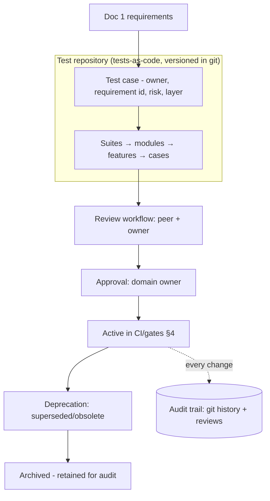
| Aspect | Design |
|---|---|
| **Test repository** | **Tests-as-code**, versioned in git alongside the source (single source of truth, TD52); no separate opaque tool as the master. |
| **Suite hierarchy** | Suite → module → feature → test case, mirroring the platform modules (Docs 3–9). |
| **Module organization** | Tests co-located with the module they cover (auth, contacts, campaigns, inbox, connector, AI…). |
| **Requirement traceability** | Each case tags the Doc 1 requirement id(s) it validates (feeds §53/§69). |
| **Test ownership** | Every suite has a named owner (§50); connector/AI/security suites have specialist owners. |
| **Review workflow** | Tests are peer-reviewed like code; new features require tests (DoD §5). |
| **Versioning strategy** | Tests version with the code; a test's history is its git history; golden/eval sets are versioned artifacts (§40; Doc 9 §43). |
| **Approval workflow** | Changes to gating suites require domain-owner approval before they can block/unblock releases. |
| **Lifecycle management** | Cases move Draft → Active → Deprecated → Archived; flaky cases quarantined (§52). |
| **Deprecation policy** | A case is deprecated when its requirement is removed/superseded; archived (not deleted) for audit. |
| **Audit trail** | Git history + review records provide a complete, immutable audit of every test change (aligns with Doc 6 §44 governance ethos). |

**Design decisions.** Tests-as-code, requirement-tagged, owned, reviewed, and lifecycle-governed (TD52).
**Alternatives considered:** a separate manual test-management tool as master (drifts from code; opaque audit).
**Trade-offs:** discipline of tests-in-repo vs. a GUI test manager — we favor traceable, versioned truth (a
reporting layer can read from it, §53). **Failure handling:** an unowned/stale suite is flagged in governance
review. **Performance impact:** none. **Scalability:** hierarchy scales per module/channel. **Security:** test
changes audited; no secrets in tests. **Future extensibility:** AI-proposed cases enter the same review/approval
flow (§55). **Cross-refs:** Doc 1 §8, Doc 6 §44, Doc 9 §43, §5/§40/§50/§52/§53/§69.

---

## 62. Defect & Bug Management Architecture

**Purpose.** Define how defects are captured, triaged, fixed, verified, and closed — with severity/priority
matrices, SLAs, RCA, and metrics — so quality issues are handled predictably.

**Scope.** Defect lifecycle, severity/priority matrices, RCA, duplicate detection, regression classification,
ownership, SLA matrix, escalation, verification, closure, metrics.

**Architecture.**
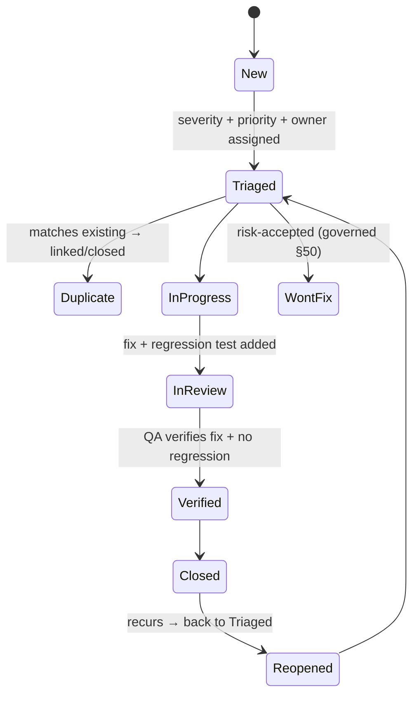
| Element | Design |
|---|---|
| **Severity matrix** | S1 critical (data loss / **duplicate/lost sends** / security breach / outage) · S2 major (broken key flow, no workaround) · S3 moderate (workaround exists) · S4 minor (cosmetic). |
| **Priority matrix** | P1 immediate · P2 next release · P3 backlog · P4 opportunistic — derived from severity × business impact × risk (§3). |
| **Root cause analysis** | Mandatory RCA for **S1/S2** (and any prod incident) — 5-whys/fishbone; the fix includes a **regression test** so it can't recur (§48). |
| **Duplicate detection** | Triage links duplicates (by fingerprint/component/error, mirroring Doc 6 §35 fingerprinting) to avoid noise. |
| **Regression classification** | Each defect tagged *new* vs *regression* (previously working) — regressions trigger a gap-analysis of why tests missed it (feeds §49 bug-escape). |
| **Ownership rules** | Defects routed to the owning module/team (§50/§61); connector/AI/security defects to specialists. |
| **SLA matrix** | Response/resolution targets: S1 = immediate response, hours to resolve; S2 = same-day response, next-release resolve; S3/S4 = scheduled. Tracked against MTTR (§49; Doc 8 §52). |
| **Escalation workflow** | Breached SLA / S1 → escalate to the owner then Operations Lead/CTO (§72); governed + audited. |
| **Verification process** | A fix is closed only after **QA verifies** the fix and the added regression test passes (no self-close). |
| **Closure process** | Closed with root cause, fix, test reference, and verification evidence recorded. |
| **Metrics** | Escape rate, MTTR, regression rate, reopen rate, defect density per module (§49). |

**Design decisions.** Structured defect lifecycle with severity/priority matrices, mandatory RCA+regression for
S1/S2, and QA-verified closure (TD53/TD63/TD64). **Alternatives considered:** ad-hoc bug lists; developer
self-closure (misses verification). **Trade-offs:** process overhead vs. predictable, learning-driven quality.
**Failure handling:** SLA breaches escalate; reopened defects re-enter triage. **Performance impact:** none.
**Scalability:** scales per module/team. **Security:** security defects have expedited SLAs + restricted
visibility. **Future extensibility:** AI-assisted triage/duplicate detection. **Cross-refs:** Doc 6 §35, Doc 8
§52, §3/§48/§49/§50/§61/§72.

---

## 63. Release Certification Framework

**Purpose.** Provide a **quantitative, enterprise Go / No-Go model** — a weighted Quality Index across
dimensions, with a risk matrix, certification levels, and an approval workflow — so release decisions are
objective and defensible.

**Scope.** Per-dimension scores, Overall Quality Index, risk matrix, certification levels, approval.

**Architecture.**
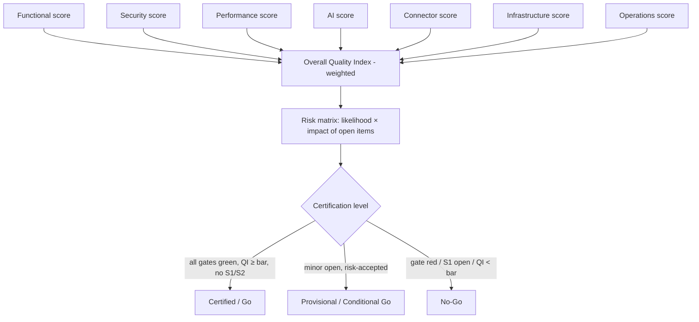
| Dimension | Score derived from |
|---|---|
| **Functional** | acceptance/regression/E2E pass rate (§6/§26/§47) |
| **Security** | scans/pen/RBAC/injection results; open high/critical = 0 (§38/§39) |
| **Performance** | targets met vs. baseline; no regression (§36/§37) |
| **AI** | AI eval suite + guardrail/approval invariants (§40; Doc 9 §43) |
| **Connector** | session/recovery/multi-connector pass rate (§41) |
| **Infrastructure** | deployment validation + DR readiness (§43/§46; Doc 8 §51) |
| **Operations** | monitoring/alerts/runbooks/readiness checklist (§44; Doc 8 §51) |

- **Overall Quality Index (TD54):** a **weighted composite** of the seven scores (weights reflect risk — sends/
  compliance/security/AI weighted highest, §3); published per release.
- **Risk matrix:** open items plotted by likelihood × impact; any **high-impact/high-likelihood** item is a
  blocker.
- **Certification levels (TD55):** **Certified (Go)** — all gates green, QI ≥ bar, no S1/S2 open; **Provisional
  (Conditional Go)** — only low-risk items open with documented, audited risk acceptance (§50); **No-Go** — any
  blocker.
- **Approval workflow:** the certification report + QI + risk matrix go to the named approver (§50); sign-off is
  governed + audited (Doc 6 §43/§44).

**Design decisions.** A quantitative, weighted, risk-aware Go/No-Go with certification levels (TD54/TD55).
**Alternatives considered:** subjective "feels ready"; pure pass/fail without risk weighting. **Trade-offs:**
scoring maintenance vs. objective, defensible releases. **Failure handling:** No-Go blocks release; Provisional
requires a remediation plan. **Performance impact:** none. **Scalability:** dimensions/weights extend per new
module. **Security:** security is a heavily-weighted, veto-capable dimension. **Future extensibility:** automated
QI computation from CI results. **Cross-refs:** Doc 6 §43/§44, Doc 8 §51, Doc 9 §43, §3/§6/§36–§46/§50/§67.

---

## 64. User Acceptance Testing Architecture

**Purpose.** Ensure the **Vi Reactivation Team** validates that the platform meets their real business needs
before release — with evidence and formal sign-off.

**Scope.** Business acceptance strategy, acceptance matrix, business scenarios, owner responsibilities,
approval, evidence, traceability, sign-off.

**Architecture.**
| Element | Design |
|---|---|
| **Business acceptance strategy** | UAT on **prod-like Staging with anonymized data** (§7/§9); business users execute real-world scenarios, not technical tests. |
| **Acceptance matrix** | Maps **business scenarios → acceptance criteria → pass/fail → evidence**, traced to Doc 1 requirements. |
| **Business scenarios** | The Vi Reactivation Team's core journeys: reactivation campaign, inbound support (both channels), document verification lead flow, AI-assisted-and-approved reply, reporting. |
| **Owner responsibilities** | A business owner per scenario executes and judges acceptance; QA facilitates; engineering supports. |
| **Approval workflow** | Each scenario is accepted/rejected; rejections become defects (§62); all Must scenarios must pass. |
| **Evidence collection** | Screenshots/recordings/notes captured as **acceptance evidence** (retained per audit). |
| **Traceability** | Each accepted scenario links to its requirement id(s) and its automated E2E counterpart (§26) — closing the loop between business and engineering tests. |
| **Sign-off process** | Formal, recorded **owner sign-off** is a release criterion (§6); governed + audited. |

**Design decisions.** Evidence-based UAT with formal sign-off tied to Doc 1 acceptance (TD56). **Alternatives
considered:** skip UAT (engineering "done" ≠ business "acceptable"); informal verbal acceptance (no evidence).
**Trade-offs:** UAT cycle time vs. business confidence + a documented acceptance record. **Failure handling:**
rejected scenarios block release until fixed + re-accepted. **Performance impact:** none. **Scalability:**
matrix grows per feature. **Security:** anonymized data; no real customer contact. **Future extensibility:**
UAT scenarios seed synthetic production journeys (§66). **Cross-refs:** Doc 1 §8, §6/§7/§9/§26/§62.

## 65. Exploratory Testing Architecture

**Purpose.** Complement scripted tests with **structured human exploration** to find defects automation misses —
usability, edge cases, and unexpected interactions — especially in high-risk areas.

**Scope.** Session-based testing, risk exploration, edge-case discovery, UI/AI/Support-Connector/campaign
exploration, reporting.

**Architecture.**
| Element | Design |
|---|---|
| **Session-based testing (TD57)** | Time-boxed, **chartered** sessions (a stated mission + risk focus); findings logged with reproduction steps → defects (§62). |
| **Risk exploration** | Sessions target the highest-risk areas (§3): sends/compliance, AI approval, connector recovery, money/cost. |
| **Edge-case discovery** | Unusual inputs, race conditions, boundary values, multilingual/large-media cases beyond scripted coverage. |
| **UI exploration** | Usability, responsive/mobile behavior, keyboard/a11y, error states (Doc 5). |
| **AI exploration** | Adversarial prompts, ambiguous context, low-confidence handling, approval UX (Doc 9) — human probing of the non-deterministic layer. |
| **Support Connector exploration** | QR/session edge cases, reconnection under odd conditions, media variety, multi-connector interactions (Doc 7). |
| **Campaign exploration** | Audience edge cases, scheduling boundaries, pause/resume timing, cost-estimate corner cases (Doc 6). |
| **Reporting** | Each session produces notes, coverage of the charter, defects raised, and follow-up test ideas (feed §61 automated cases). |

**Design decisions.** Chartered, session-based exploratory testing focused by risk (TD57). **Alternatives
considered:** unstructured ad-hoc testing (unrepeatable, unmeasured); no exploratory testing (misses what scripts
don't anticipate). **Trade-offs:** human time vs. finding high-impact, hard-to-script defects. **Failure
handling:** findings become tracked defects + new automated cases. **Performance impact:** none. **Scalability:**
charters per risk area/release. **Security:** adversarial AI/security exploration included. **Future
extensibility:** exploratory findings seed property/fuzz tests (§55). **Cross-refs:** Doc 5, Doc 6, Doc 7, Doc 9,
§3/§55/§61/§62.

---

## 66. Production Verification Framework

**Purpose.** Verify each release **in production** safely and continuously — proving real-world correctness with
fast rollback if reality disagrees.

**Scope.** Canary validation, feature-flag validation, production smoke tests, business-KPI validation,
customer-journey validation, rollback triggers, continuous verification.

**Architecture.**
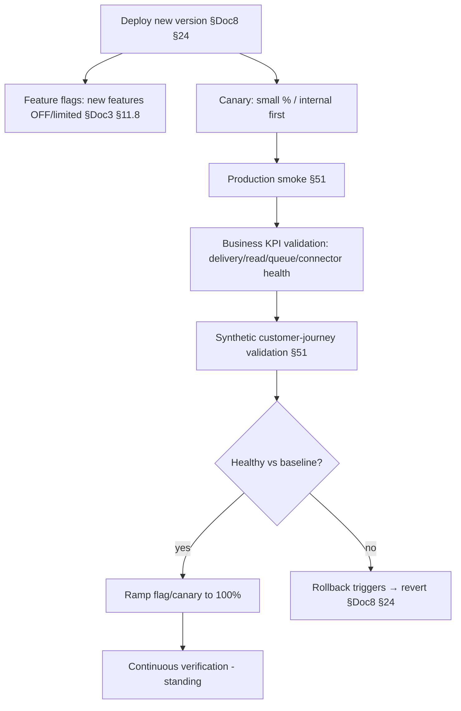
| Element | Design |
|---|---|
| **Canary validation** | Release to a small/internal cohort first; compare canary metrics to baseline before full rollout. |
| **Feature-flag validation** | New features ship **dark** behind flags (Doc 3 §11.8; Doc 5 F10); enabled progressively with validation at each step. |
| **Production smoke tests** | Post-deploy critical-path checks via internal identities + sandboxed channels (§51) — **no real customer messages**. |
| **Business-KPI validation** | Confirm delivery/read/failure rates, queue/connector health, and cost stay within expected bands (Doc 6 §35; Doc 8 §52) after release. |
| **Customer-journey validation** | Continuous synthetic journeys (§51) confirm end-to-end health from the user's perspective. |
| **Rollback triggers (TD58)** | Objective triggers — smoke failure, KPI/SLO breach, error-budget burn (Doc 8 §33) — auto/one-click revert (Doc 8 §24). |
| **Continuous verification** | Verification is a **standing control**, not a one-off — always-on synthetic + monitoring (§48/§51). |

**Design decisions.** Canary + flags + KPI/journey validation with objective rollback triggers (TD58).
**Alternatives considered:** full-rollout-and-hope; manual eyeballing. **Trade-offs:** progressive-rollout
complexity vs. safe, reversible releases. **Failure handling:** any trigger → rollback; incident process (Doc 8
§34). **Performance impact:** canary limits blast radius. **Scalability:** per release/feature. **Security:**
customer-safe (no real sends). **Future extensibility:** automated canary-analysis gates. **Cross-refs:** Doc 3
§11.8, Doc 5 F10, Doc 6 §35, Doc 8 §24/§33/§34/§52, §43/§48/§51.

---

## 67. Enterprise Certification Matrix

**Purpose.** Define, per platform component, exactly **what must be tested, who owns it, who approves, and what
evidence is required** to certify it for release — the operational checklist behind §63.

**Scope.** API, Database, Queue, AI, Deployment, Dashboard, CRM, Campaigns, Inbox, Support Connector, Analytics.

**Architecture (certification matrix).**
| Component | Required tests | Owner | Approval authority | Evidence required |
|---|---|---|---|---|
| **API** | contract/OpenAPI, negative, idempotency, authn/authz (§31–§34) | API/Backend owner | QA Architect | contract report, coverage, auth-matrix results |
| **Database** | migration/rollback, integrity, backup-restore (§42) | DB Architect | DBA + QA | migration + restore logs, integrity report |
| **Queue** | fault-injection, dup-prevention, resume (§35) | Backend/SRE | SRE | chaos/queue test results |
| **AI** | eval suite, guardrails, **approval invariant** (§40) | AI Engineer | AI Architect + Security | eval scores, guardrail/approval logs |
| **Deployment** | blue-green/rolling/rollback, smoke (§43) | DevOps | DevOps Architect | deploy validation + rollback rehearsal |
| **Dashboard** | component/a11y, E2E, real-time (§11/§26/§44) | Frontend owner | QA | E2E + a11y reports |
| **CRM (leads/tags/notes)** | integration + E2E lead flow (§28/§29) | Backend/Product | Product Owner | E2E + UAT evidence |
| **Campaigns** | E2E lifecycle, compliance, cost (§27) | Campaign owner | Product + QA | E2E + compliance assertions |
| **Inbox** | E2E both channels, window/assignment (§28) | Backend/Frontend | QA | E2E across Channel 1 + Connector |
| **Support Connector** | session/recovery/media/multi-connector (§41) | Connector owner | SRE + Security | connector test + recovery drill logs |
| **Analytics** | rollup correctness, cost analytics (§30) | Data owner | QA | analytics validation report |

- **Certification (TD59):** a component is **certified** for a release only when its required tests pass, its
  owner and approval authority sign off, and its evidence is recorded — feeding the §63 Quality Index and the
  §50 governance/audit trail (Doc 6 §44).

**Design decisions.** Per-component certification with named owners, approvers, and required evidence (TD59).
**Alternatives considered:** a single blanket sign-off (hides component gaps). **Trade-offs:** per-component
rigor vs. blind spots. **Failure handling:** an uncertified component blocks the release (§63). **Performance
impact:** none. **Scalability:** rows added per new component/channel. **Security:** AI/Connector require Security
approval. **Future extensibility:** auto-populated from CI evidence. **Cross-refs:** Doc 6 §44, §26/§27/§28/§29/
§30/§31–§46/§50/§63.

---

## 68. Enterprise Test Data Governance

**Purpose.** Govern test data as a controlled asset — expanding §9 with ownership, retention, refresh, masking,
encryption, compliance, audit, and lifecycle.

**Scope.** Data ownership, retention, refresh, synthetic generation, masking, encryption, compliance, audit,
lifecycle.

**Architecture.**
| Aspect | Design |
|---|---|
| **Data ownership** | A named owner governs each test dataset (synthetic sets, masked-prod snapshots); changes are reviewed. |
| **Retention policy** | Test data is short-lived and environment-scoped; masked snapshots expire on a schedule (aligned to Doc 3 §15 principles). |
| **Refresh strategy** | Datasets refreshed on a cadence (and on schema change) so tests reflect current structure; deterministic seeds for reproducibility. |
| **Synthetic data generation** | The primary source (§9): generators cover edge cases + scale volumes (1M/10M); versioned generator definitions. |
| **Data masking** | Production-derived data (staging/perf) is **irreversibly anonymized/tokenized** — raw PII never leaves prod (Doc 1 CMP-09; Doc 8 §42). |
| **Encryption** | Test datasets containing any sensitive-shaped data are encrypted at rest like production data (Doc 8 §20); masked snapshots stored securely. |
| **Compliance** | Governance aligns with GDPR/DPDP (Doc 8 §48): minimization, no raw PII downstream, erasable, auditable. |
| **Audit** | Dataset creation/masking/refresh/deletion is logged (who/when/what) for compliance evidence. |
| **Lifecycle** | Create → use → refresh → expire/purge; ephemeral per run for CI; governed for shared datasets. |

**Design decisions.** Governed, owned, masked/encrypted, auditable test data (TD60). **Alternatives considered:**
ungoverned test data; raw prod copies (privacy/legal risk). **Trade-offs:** governance overhead vs. privacy +
reproducibility + realism. **Failure handling:** a masking/compliance failure blocks dataset use. **Performance
impact:** generation sized for perf labs. **Scalability:** generators scale to target volumes. **Security:** no
raw PII in non-prod; encrypted; audited. **Future extensibility:** property/AI-based generation (§55).
**Cross-refs:** Doc 1 CMP-09, Doc 3 §15, Doc 8 §20/§42/§48, §9/§55.

## 69. Cross-Document Traceability

**Purpose.** Prove that **every architectural guarantee** in the frozen documents is validated by a defined test
strategy — closing the loop between architecture and assurance.

**Scope.** Map testing to Docs 1, 3, 4, 5, 6, 7, 8, 9, 10.

**Architecture (guarantee → validation).**
| Document | Key guarantee | How it is validated (this doc) |
|---|---|---|
| **Doc 1 — SRS** | Every Must requirement met; compliance (opt-in/window/limits) | Requirement→test traceability (§53/§61); compliance tests (§54); acceptance (§64) |
| **Doc 3 — Database** | Integrity, constraints, partitioning, recoverable | DB integration + migration/backup-restore/consistency (§18/§42/§51) |
| **Doc 4 — API** | Stable contract, RBAC, idempotency, pagination | Contract/OpenAPI + negative + idempotency + authn/authz (§31–§34) |
| **Doc 5 — UI/UX** | Accessible, permission-aware, performant UI | Component + a11y + permission-render + E2E + perf budgets (§11/§26/§36/§54) |
| **Doc 6 — Queue** | **Zero duplicates, crash-safe resume, no loss**; SLAs | Queue fault-injection + chaos + DR (§35/§45/§46) |
| **Doc 7 — Channels** | Dual-channel via abstraction; connector isolation/recovery | Connector + integration + E2E across both channels (§20/§28/§41) |
| **Doc 8 — Deployment** | Zero-downtime deploys; verified backups; DR RTO/RPO | Deployment/observability validation + DR drills (§43/§44/§46) |
| **Doc 9 — AI** | **AI never sends without approval**; grounded, guarded | AI eval + guardrail + **approval-invariant** tests (§25/§40) |
| **Doc 10 — Testing** | Quality is engineered, governed, certified | This document's own governance/certification (§50/§61–§67) |

- **Every guarantee has an owner + evidence (TD61):** the traceability map, the certification matrix (§67), and
  the Quality Index (§63) together ensure no architectural promise ships unvalidated.

**Design decisions.** Explicit guarantee-to-test traceability across all frozen docs (TD61). **Alternatives
considered:** trust that "we tested it" (unverifiable coverage). **Trade-offs:** mapping upkeep vs. provable
coverage. **Failure handling:** a guarantee with no covering test is a gap flagged in governance (§50).
**Performance impact:** none. **Scalability:** rows per new guarantee/module. **Security:** security/AI/connector
guarantees explicitly mapped. **Future extensibility:** auto-generated from test tags. **Cross-refs:** Docs 1/3–9,
§50/§53/§61/§63/§67.

---

## 70. Testing Maturity Model

**Purpose.** Provide a **five-level maturity model** so the team can assess where its testing practice stands and
plan improvement over the platform's multi-year life.

**Scope.** Levels 1–5 across automation, governance, coverage, quality metrics, AI usage, documentation, and
operations readiness.

**Architecture.**
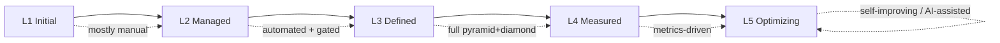
| Dimension | L1 Initial | L2 Managed | L3 Defined | L4 Measured | L5 Optimizing |
|---|---|---|---|---|---|
| **Automation** | mostly manual | unit + basic CI | full unit/integration/E2E in CI | + perf/security/chaos automated | self-healing, AI-generated tests |
| **Governance** | none | basic ownership | gates + DoR/DoD (§4/§5) | certification + risk model (§63) | continuous governance, auto-evidence |
| **Coverage** | ad-hoc | key paths | pyramid+diamond (§3) | risk-weighted, traced (§53/§69) | mutation-verified effectiveness (§55) |
| **Quality metrics** | none | pass/fail | coverage + escape rate | full KPI set (§49) + Quality Index (§63) | predictive quality, trend-driven |
| **AI usage** | none | AI-feature tests | AI eval framework (§40) | AI-safety + calibration measured | AI-assisted test generation/triage |
| **Documentation** | tribal | some test docs | this architecture (Doc 10) | traceable + certified | living, auto-updated |
| **Operations readiness** | reactive | smoke tests | deployment + DR validation (§43/§46) | continuous prod verification (§66) | proactive, self-verifying prod |

- **Target (TD62):** the platform aims for **Level 4 (Measured)** at launch — automated, gated, certified,
  metrics-driven — with **Level 5** as the continuous-improvement horizon (AI-assisted, self-improving).

**Design decisions.** A five-level maturity model as an improvement roadmap, targeting L4 at launch (TD62).
**Alternatives considered:** no maturity framing (no improvement compass). **Trade-offs:** self-assessment effort
vs. deliberate progression. **Failure handling:** a level regression is a governance signal. **Performance
impact:** none. **Scalability:** applies as the platform/team grows. **Security:** security testing maturity is a
dimension. **Future extensibility:** L5 practices (§55) adopted incrementally. **Cross-refs:** §3/§4/§5/§40/§49/
§53/§55/§63/§66/§69.

---

## 71. Enterprise Testing Decision Appendix (TD52–TD65)

Extends the decision record (§56) with the enhancement-pass decisions. Same format:
**Decision · Why · Alternatives · Why rejected · Benefits · Trade-offs · Migration.**

| ID | Decision | Why | Alternatives (rejected) | Benefits | Trade-offs | Migration |
|---|---|---|---|---|---|---|
| **TD52** | Tests-as-code test-case management (git, requirement-tagged, owned) | Traceable, versioned truth | separate manual TM tool as master | audit + traceability | in-repo discipline | reporting layer reads from it |
| **TD53** | Structured defect lifecycle + severity/priority matrices | Predictable handling | ad-hoc bug lists | consistency | process overhead | tool-assisted |
| **TD54** | Weighted Overall Quality Index | Objective Go/No-Go | subjective "feels ready" | defensible releases | scoring upkeep | auto-compute from CI |
| **TD55** | Certification levels (Certified/Provisional/No-Go) | Nuanced release decisions | binary pass/fail | risk-aware shipping | level criteria | automate gating |
| **TD56** | Evidence-based UAT + formal sign-off | Business acceptance ≠ eng "done" | skip/informal UAT | documented acceptance | cycle time | seed synthetic journeys |
| **TD57** | Chartered session-based exploratory testing | Find what scripts miss | ad-hoc/no exploratory | high-impact defects | human time | findings→automation |
| **TD58** | Canary + flags + KPI/journey validation + rollback triggers | Safe, reversible prod releases | full-rollout-and-hope | limited blast radius | rollout complexity | automated canary analysis |
| **TD59** | Per-component certification matrix (owner/authority/evidence) | No component ships unverified | blanket sign-off | closes blind spots | per-component rigor | auto-populate evidence |
| **TD60** | Governed/masked/encrypted/audited test data | Privacy + reproducibility | ungoverned/raw-prod data | compliant realism | governance overhead | property/AI generation |
| **TD61** | Guarantee-to-test cross-document traceability | Provable coverage of guarantees | "we tested it" | no unvalidated promise | mapping upkeep | auto-generate from tags |
| **TD62** | Five-level maturity model, target L4 at launch | Deliberate improvement | no maturity compass | measurable progression | self-assessment | adopt L5 incrementally |
| **TD63** | Defect SLA matrix + escalation | Timely resolution | best-effort | predictable MTTR | tracking | tool SLAs |
| **TD64** | Mandatory RCA + regression test for S1/S2 | Defects can't recur | fix-and-forget | learning loop | RCA effort | RCA templates |
| **TD65** | Continuous production verification as a standing control | Reality is the final test | one-off post-deploy checks | early detection | synthetic upkeep | broaden journeys |

---

### Glossary (v1.1 addendum)
Extends §59 with terms introduced in §61–§72:

| Term | Definition |
|---|---|
| **Tests-as-code** | Test cases stored/versioned in the repository as the single source of truth (§61). |
| **Certification level** | Certified / Provisional / No-Go release verdict (§63). |
| **Overall Quality Index** | Weighted composite of dimension scores driving Go/No-Go (§63). |
| **Certification matrix** | Per-component required-tests/owner/approver/evidence table (§67). |
| **Charter (exploratory)** | The stated mission + risk focus of a time-boxed exploratory session (§65). |
| **Canary** | A limited-cohort release validated before full rollout (§66). |
| **Rollback trigger** | An objective condition that reverts a release (§66). |
| **RCA** | Root-cause analysis, mandatory for S1/S2 defects (§62). |
| **Regression (classification)** | A defect in previously-working behavior (§62). |
| **Maturity level** | L1–L5 testing-practice maturity (§70). |
| **Quality gate** *(see §59)* | (already defined) — referenced by the certification framework. |

### Cross References (v1.1 addendum)
The v1.1 sections reference the frozen documents as follows (extends §58): **§61** governance ↔ Doc 6 §44, Doc 9
§43; **§62** defects ↔ Doc 6 §35, Doc 8 §52; **§63/§67** certification ↔ Doc 6 §43/§44, Doc 8 §51, Doc 9 §43;
**§64** UAT ↔ Doc 1 §8; **§66** production verification ↔ Doc 3 §11.8, Doc 5 F10, Doc 8 §24/§33/§34/§52; **§68**
test-data governance ↔ Doc 1 CMP-09, Doc 3 §15, Doc 8 §20/§42/§48; **§69** traceability ↔ Docs 1/3–9; **§70**
maturity ↔ Doc 10 §3–§55. No frozen document is modified.

---

## 72. Final Enterprise Review (v1.1)

Re-reviewed the **entire** document (§1–§71) from fifteen perspectives; the enhancement is additive and
consistent with §1–§60 and Docs 1–9:

- **Enterprise Architect:** §61–§72 extend the strategy with governance, certification, and maturity — coherent
  with §1–§60; no existing text changed. ✔
- **QA Architect:** test-case management, defect lifecycle, UAT, and exploratory testing complete the QA
  discipline. ✔
- **Test Architect:** tests-as-code + traceability + certification matrix make coverage provable and owned. ✔
- **Backend Architect:** component certification (API/Queue/CRM) maps to the existing integration/queue tests
  (§17/§19/§35/§67). ✔
- **Frontend Architect:** dashboard/inbox certification + exploratory UI/a11y complete UI assurance. ✔
- **Database Architect:** DB certification requires tested migrations/restores/integrity (§42/§67). ✔
- **DevOps Architect:** production verification (canary/flags/rollback) + deployment certification align with
  Doc 8 §24/§33. ✔
- **SRE:** rollback triggers, continuous verification, and defect SLAs/escalation strengthen operability. ✔
- **Security Engineer:** AI/Connector certification requires Security approval; test-data governance enforces
  masking/encryption; adversarial exploratory testing included. ✔
- **Performance Engineer:** performance is a weighted certification dimension with regression gating (§63). ✔
- **AI Architect:** the **AI-never-sends-without-approval invariant** is a required, evidenced certification item
  (§40/§67); AI exploratory testing added. ✔
- **Product Owner:** evidence-based UAT + sign-off + acceptance matrix tie release to the Vi Reactivation Team's
  real needs. ✔
- **Compliance Officer:** test-data governance (masking/encryption/audit) + compliance tests satisfy GDPR/DPDP
  (Doc 8 §48). ✔
- **Operations Lead:** defect escalation, production verification, and continuous verification map cleanly to
  incident management (Doc 8 §34). ✔
- **CTO:** a quantitative, risk-aware Go/No-Go (Quality Index + certification levels) plus a maturity roadmap
  give executive-grade release confidence. ✔

### Final document consistency verification
- **Additive integrity:** §1–§60 unchanged; §61–§72 appended; numbering continuous (61→72); TD series extended
  TD52–TD65 (no renumber of TD1–TD51). ✔
- **Style/format:** identical section structure, decision-record format, diagram style, and terminology. ✔
- **Cross-references:** all references resolve to frozen documents/sections; glossary and cross-references
  extended additively. ✔
- **Additional requirements met:** **5 new Mermaid diagrams** (§61, §62, §63, §66, §70), **14 new decision
  records** (TD52–TD65), updated glossary + cross-references, CHANGELOG updated. ✔
- **Discipline:** architecture only — no code/placeholders/TODOs. ✔

**No gaps identified. Document 10 frozen as Version 1.1.**

---

*End of Document 10 — Testing & QA Architecture (Version 1.1, FROZEN). §1–§60 = v1.0 baseline; §61–§72 added in
the enhancement pass (test-case management, defect management, release certification, UAT, exploratory testing,
production verification, certification matrix, test-data governance, cross-document traceability, maturity
model, decision appendix TD52–TD65, and the 15-perspective final review).*

