# Operations Runbook
### Self-Hosted WhatsApp Business Platform — Production Operations Manual

| | |
|---|---|
| **Document** | 11 — Operations Runbook (production operations manual) |
| **Version** | 1.0 (for approval) |
| **Date** | 2026-07-15 |
| **Status** | Draft awaiting owner approval |
| **Owner / sole user** | Internal — **Vi Reactivation Team** (single-tenant, self-hosted) |
| **Preceded by** | Docs 1–10 (frozen; referenced only) |

> This is an **operations manual**, not architecture — it explains **how to operate** the production system
> defined by the frozen documents. **No code, shell scripts, YAML, Docker Compose, or SQL.** It is the document
> an **Operations Engineer, System Administrator, Support Engineer, DevOps Engineer, or Incident Commander**
> follows day to day and during incidents. Architecture is **referenced**, never repeated (the *why* lives in
> Docs 1–10; the *how to run it* lives here).
>
> **The standard operational block.** Every SOP section is written to a fixed shape so on-call staff always know
> where to look: **Purpose · Scope · Responsibilities · Procedure · Decision Criteria · Failure Handling ·
> Escalation · Security Considerations · Monitoring · Verification · Recovery · Cross References.** Where a field
> is the same as the platform default, it is stated briefly and inherits §2 (philosophy), §26 (alerts), §28/§29
> (incident model), and §58/§62 (escalation). Operations decisions are recorded as **OD1–OD40** (§60).
>
> **Two-channel, one operation.** Operations cover **Channel 1 (Official Meta Cloud API, number 9990329329)**
> and **Channel 2 (Support Connector, the vendor-neutral abstraction of Doc 7)** as one system; connector
> procedures depend only on the abstraction, never an implementation.

---

## 1. Executive Overview

**Purpose.** Give operators a one-page mental model of the running system so every later procedure has context.
**Scope.** What runs, what must never break, and what "healthy" means.
**Responsibilities.** Operations owns availability, health, incident response, backups/DR, upgrades, and
capacity; engineering owns fixes; the owner (Vi Reactivation Team lead) owns business decisions.
**Procedure (orientation).** The platform (Docs 3–9) runs on one hardened Ubuntu host in Docker behind
Cloudflare + Nginx (Doc 8), processing WhatsApp messaging over two channels (Doc 7) via an async fabric (Doc 6),
with AI as a human-approved capability layer (Doc 9). Operators keep it healthy using the monitoring stack
(Prometheus/Grafana/Loki/Alertmanager, Doc 8 §18) and the procedures in this document.
**Decision Criteria.** "Healthy" = all dependencies green (Doc 4 `/ready`), queues within SLA (Doc 6 §42),
numbers/connectors green (Doc 6 §28, Doc 7 §11), no active S1/S2 incident.
**Failure Handling / Escalation.** Any breach → the incident model (§27–§29) and escalation tree (§62).
**Security Considerations.** All privileged operations are governed (Doc 6 §43) and audited (Doc 6 §44).
**Monitoring / Verification / Recovery.** Continuous (Doc 8 §18); verify via dashboards + `/ready`; recover via
the relevant SOP. **Cross References.** Docs 3–10; §2–§60.

---

## 2. Operations Philosophy

**Purpose.** State the principles that govern every operational decision, so operators act consistently under
pressure.
**Scope.** All operations.

**Architecture (operating principles).**
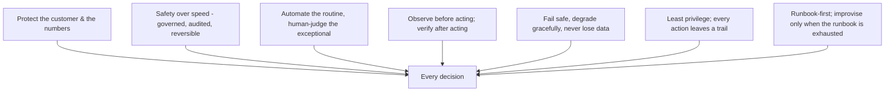
| Principle | In practice |
|---|---|
| **Protect the customer & the numbers** | Never risk message quality/bans; quality-RED pauses marketing (Doc 6 §28). |
| **Safety over speed** | Destructive/customer-facing actions are governed, audited, reversible (Doc 6 §43/§44). |
| **Automate routine, human-judge exceptional** | Health/scaling automated; incidents and AI sends need humans (Doc 9). |
| **Observe → act → verify** | Read dashboards/logs first; confirm the outcome after (§9/§22–§25). |
| **Fail safe** | Under doubt, pause (safe) rather than push (risky); nothing accepted is lost (Doc 6). |
| **Least privilege + auditability** | Operators use scoped access; every privileged action is recorded. |
| **Runbook-first** | Follow the SOP; deviations are captured in the post-incident review (§69). |

**Responsibilities / Decision Criteria / Failure / Escalation / Security / Monitoring / Verification / Recovery.**
These principles are the defaults every SOP inherits. **Cross References.** Doc 6 §28/§43/§44, Doc 9, §26–§29.

---

## 3. Team Roles & Responsibilities

**Purpose.** Define who does what so ownership is never ambiguous during routine ops or incidents.
**Scope.** All operational roles (a small team; one person may hold several roles).

**Architecture (roles).**
| Role | Responsibility |
|---|---|
| **Operations Engineer / On-call** | Daily health, alert handling, first response, routine SOPs. |
| **System Administrator** | Host/OS, networking, certificates, backups, hardening (Doc 8 §26). |
| **DevOps Engineer** | Deployments, upgrades, rollbacks, CI/CD, infra changes (Doc 8 §24/§43). |
| **SRE** | Reliability, SLOs/error budgets, chaos/DR, capacity (Doc 6 §42; Doc 8 §52). |
| **Support Engineer** | Support Connector operations, agent-facing issues, connector recovery (Doc 7). |
| **Security Engineer** | Security incidents, secrets/rotations, access reviews, audits (Doc 8 §26). |
| **AI Operator** | AI provider health, budgets, guardrail/incident handling (Doc 9). |
| **Database Administrator** | MySQL health, migrations, backups/restore, partitions (Doc 3/Doc 8). |
| **Incident Commander (IC)** | Runs major incidents: coordination, decisions, comms (§29/§62). |
| **Owner / Business Lead** | Business decisions, release/risk sign-off, customer comms approval. |

**Responsibilities.** As above. **Decision Criteria.** Role activation follows the incident severity (§28).
**Failure/Escalation.** Unfilled role → escalate per §62. **Security.** Roles map to RBAC (Doc 1 §3.1) and
governed ops (Doc 6 §43). **Monitoring/Verification/Recovery.** N/A (defines accountability). **Cross
References.** Doc 1 §3.1, Doc 6 §42/§43, Doc 8, §4/§29/§62.

---

## 4. Responsibility Matrix (RACI)

**Purpose.** Make accountability explicit for the operations that matter most (R=Responsible, A=Accountable,
C=Consulted, I=Informed).
**Scope.** Key operational activities.

**Architecture (RACI).**
| Activity | Ops/On-call | DevOps | SRE | SysAdmin | Security | DBA | AI Op | IC | Owner |
|---|---|---|---|---|---|---|---|---|---|
| Daily health checks | **R/A** | I | C | I | I | I | I | — | I |
| Alert triage/first response | **R** | C | C | C | C | C | C | **A**(major) | I |
| Deployment / upgrade | C | **R** | C | I | I | C | I | — | **A** |
| Emergency rollback | C | **R** | C | I | I | I | I | **A** | I |
| Backup verification | R | I | C | **A** | I | **R** | — | — | I |
| Restore / DR | C | R | **A** | R | C | **R** | I | **A**(during incident) | I |
| Secret/token rotation | I | C | C | R | **R/A** | C | C | — | I |
| Security incident | I | C | C | C | **R/A** | C | C | **A** | **I** |
| Connector recovery | **R** (Support) | C | C | I | C | I | I | C | I |
| AI incident | C | I | C | I | C | I | **R/A** | C | I |
| Campaign emergency stop | **R** | C | C | I | I | I | I | **A** | **C** |
| Release approval | I | C | C | I | C | I | I | C | **A/R** |

**Responsibilities / Decision Criteria / Failure / Escalation / Security / Monitoring / Verification / Recovery.**
Accountability (**A**) owns the decision; escalation follows §62 when **A** is unavailable; all governed actions
audited (Doc 6 §44). **Cross References.** §3/§29/§60/§62; Doc 6 §43/§44.

---

## 5. Daily Operations Checklist

**Purpose.** A single, ordered daily routine that keeps the platform healthy and surfaces issues early.
**Scope.** Every operational day. **Responsibilities.** On-call Operations Engineer.

**Procedure (daily flow).**

**Decision Criteria.** Any red/amber item → open the relevant SOP; if customer-impacting → declare an incident
(§27). **Failure Handling.** A failed daily check becomes a tracked action or incident. **Escalation.** Per §62.
**Security Considerations.** Review the audit log for unexpected privileged actions (Doc 6 §44). **Monitoring.**
Grafana dashboards (§23). **Verification.** All checklist items green + logged. **Recovery.** Via the specific
SOP. **Cross References.** §6–§26/§45; Doc 8 §18.

## 6. Morning Health Verification

**Purpose.** Confirm the platform is fully healthy at the start of the day.
**Procedure.** (1) `/ready` all-green (Doc 4 §22); (2) dependency status (MySQL/Redis/Meta) green; (3) queue
depth/age within SLA (Doc 6 §42); (4) all numbers GREEN + within tier (Doc 6 §28); (5) all Support Connectors
Connected/Healthy (Doc 7 §11); (6) overnight alerts reviewed/cleared; (7) overnight backup verified (§45);
(8) error/DLQ counts normal.
**Decision Criteria.** Any amber → investigate before business hours; any red/customer-impact → incident (§27).
**Responsibilities.** On-call. **Failure/Escalation.** §62. **Security.** Check auth-failure spikes (§30).
**Monitoring/Verification.** Health + connector dashboards (§23). **Recovery.** Relevant SOP. **Cross Refs.**
Doc 4 §22, Doc 6 §28/§42, Doc 7 §11, §45.

## 7. Evening Health Verification

**Purpose.** Confirm the platform is stable and safe to run unattended overnight.
**Procedure.** Repeat §6 checks; additionally confirm: scheduled/recurring campaigns for the night are correct
(Doc 6 §10), no campaign is in an unexpected state, retry/DLQ queues are draining, disk/memory headroom is
sufficient for overnight (Doc 8 §25), and on-call coverage + alert routing are active (§26/§62).
**Decision Criteria.** Any risk to unattended running → resolve or hold the risky operation until staffed.
**Responsibilities.** On-call. **Failure/Escalation/Security/Monitoring/Verification/Recovery.** As §6.
**Cross References.** Doc 6 §10/§25, §6/§26/§51.

## 8. Shift Handover SOP

**Purpose.** Transfer operational context between shifts with zero loss of situational awareness.
**Procedure.** The outgoing operator records: current health state, open incidents/actions + their status,
in-flight campaigns and their expected completion, any degraded/paused component and why, recent changes/
deploys, and watch-items for the next shift. The incoming operator acknowledges and reviews open items.
**Decision Criteria.** No handover is complete until acknowledged; open S1/S2 incidents require a live verbal
handover to the IC. **Responsibilities.** Outgoing + incoming operators. **Failure/Escalation.** Missing
handover → incoming operator runs §6 fresh + escalates gaps. **Security.** Note any security-sensitive items for
awareness only (no secrets in notes). **Monitoring/Verification.** Handover log complete. **Recovery.** N/A.
**Cross References.** §5/§29/§69.

## 9. Dashboard Review Procedure

**Purpose.** Systematically read the operational dashboards to assess platform state at a glance.
**Procedure.** Review, in order: **Health/System** (deps, latency, error rate), **Queue** (depth/age/throughput
per queue), **Campaign** (progress/failures), **Connector** (per-connector health/unread), **API** (p95/error),
**Database/Redis** (connections/memory/slow queries), **Cost** (spend vs budget, Doc 6 §37). Compare to baselines;
note anomalies.
**Decision Criteria.** Metric outside its normal band → drill into logs (§25) and the relevant SOP; SLO breach
→ alert/incident (§26/§27). **Responsibilities.** On-call. **Failure/Escalation.** §62. **Security.** Watch for
auth-failure/rate-limit spikes (§30). **Monitoring.** Grafana (§23), Prometheus (§24). **Verification.** All
panels within expected bands. **Recovery.** Via SOP. **Cross References.** Doc 5 B11.8/B11.9, Doc 6 §13/§37/§42,
Doc 8 §18, §22–§26.

---

> **Health-SOP convention (§10–§21).** Each states what "healthy" looks like, how to check it, how to read
> trouble, and how to recover — inheriting the standard block (§2). All read the monitoring stack (Doc 8 §18)
> and, for privileged remediation, use governed + audited actions (Doc 6 §43/§44).

## 10. Queue Health SOP

**Purpose.** Keep the async fabric flowing within SLA (Doc 6 §42). **Scope.** All queues (Doc 6 §2).
**Responsibilities.** On-call/SRE. **Procedure.** Check per-queue **depth, oldest-message age, throughput,
failure/retry rate, DLQ size** (Queue Monitor, Doc 5 B11.8). **Decision Criteria.** Depth/age over SLO →
identify producer-bound vs consumer-bound (Doc 6 §35 bottleneck detection): consumer-bound → scale the pool
(§11); producer-bound → investigate upstream. Rising DLQ → §38. **Failure Handling.** Stalled queue → check
workers (§11), Redis (§12), and dependencies. **Escalation.** SLA breach → SRE → §62. **Security.** Governed
scaling/pausing (Doc 6 §43). **Monitoring.** Queue dashboards. **Verification.** Depth/age back within SLO.
**Recovery.** Scale/drain; DLQ replay (§38). **Cross References.** Doc 6 §2/§13/§35/§42, §11/§38.

## 11. Worker Health SOP

**Purpose.** Ensure worker pools are alive and correctly sized. **Procedure.** Check worker liveness/heartbeat,
active/reserved tasks, failure rate, restarts, and per-pool utilization (Doc 6 §13/§22). **Decision Criteria.**
Missing heartbeats → the orchestrator replaces the worker (Doc 6 §23); sustained high utilization + backlog →
scale out the hot pool (Doc 6 §30); crash-looping pool → suspect poison task → check DLQ (§38). **Failure
Handling.** `acks_late` redelivery means a dead worker's tasks are safe (Doc 6 §3). **Escalation.** Repeated
crashes → SRE. **Security.** Governed scaling. **Monitoring.** Worker dashboards. **Verification.** Pool healthy,
backlog draining. **Recovery.** Restart/replace/scale. **Cross References.** Doc 6 §3/§22/§23/§25/§30.

## 12. Redis Health SOP

**Purpose.** Keep Redis (broker/cache/locks/rate) healthy — it's rebuildable but its loss degrades performance
(Doc 6 §12). **Procedure.** Check memory usage, hit rate, evictions, latency, connections, AOF status
(Doc 8 §11). **Decision Criteria.** Broker/rate instance approaching memory limit (`noeviction`) → **critical**:
add capacity/investigate backlog before it refuses writes; cache instance high eviction is normal (LRU). Redis
down → §37. **Failure Handling.** On loss, pending work rebuilds from MySQL (Doc 6 §8.4) — no message loss.
**Escalation.** Memory-critical/down → SRE/SysAdmin. **Security.** Network-restricted; auth intact (Doc 8 §26).
**Monitoring.** Redis exporter. **Verification.** Memory/latency normal, hit rate healthy. **Recovery.** §37.
**Cross References.** Doc 6 §8/§12, Doc 8 §11, §37.

## 13. MySQL Health SOP

**Purpose.** Keep the source of truth healthy and performant (Doc 3; Doc 8 §10). **Procedure.** Check
connectivity, connection count, slow queries, replication lag (if used), disk headroom, and partition status
(Doc 3 §14). **Decision Criteria.** Connection saturation → check for pool misconfiguration/leaks; slow-query
spike → identify + index/optimize (with DBA); disk < threshold → **critical**, run cleanup/retention (§36 F8;
Doc 6 §10). DB down/corrupt → §36. **Failure Handling.** Sends pause safely if the DB is unavailable (can't
checkpoint). **Escalation.** DBA + SRE. **Security.** Least-privilege DB users; encrypted backups (Doc 8 §20).
**Monitoring.** MySQL exporter. **Verification.** Connections/slow-queries/disk normal. **Recovery.** §36/§46.
**Cross References.** Doc 3 §14, Doc 8 §10/§21, §36/§46.

## 14. Storage Health SOP

**Purpose.** Keep object storage (media/exports/backups) available and within capacity (Doc 8 §14).
**Procedure.** Check capacity/growth, availability, error rate, lifecycle-rule execution, and signed-URL
serving. **Decision Criteria.** Capacity trending to full → expand/prune (lifecycle, §36 data cleanup);
serving errors → check backend + credentials. **Failure Handling.** Media fetch/serve failures retry (Doc 6
media queue) and surface; backups have off-host copies (§45). **Escalation.** SysAdmin. **Security.** Private,
signed access; encrypted at rest (Doc 8 §14/§20). **Monitoring.** Storage metrics. **Verification.** Capacity +
serving healthy. **Recovery.** Expand/restore. **Cross References.** Doc 8 §14/§21, Doc 3 §15, §36/§45.

## 15. AI Service Health SOP

**Purpose.** Keep the AI capability layer healthy and within budget — **AI is non-critical** (Doc 9 §39).
**Procedure.** Check `ai` queue depth, per-model latency/error/fallback rates, provider circuit-breaker state,
token spend vs budget (Doc 9 §36/§40). **Decision Criteria.** Provider errors/breaker open → confirm fallback
is serving (Doc 9 §39); if all providers down → AI degrades to manual (**core messaging unaffected**); budget
near cap → throttle non-critical AI, alert owner. Provider outage → §39. **Failure Handling.** AI failure never
blocks messaging. **Escalation.** AI Operator. **Security.** Provider keys secured; guardrails intact (Doc 9
§33/§34). **Monitoring.** AI dashboards. **Verification.** Latency/error/cost within bands. **Recovery.** §39.
**Cross References.** Doc 9 §36/§39/§40, §39.

## 16. Support Connector Health SOP

**Purpose.** Keep every Support Connector session Connected/Healthy (Doc 7 §11) — through the abstraction only.
**Procedure.** For each connector: check status (Connected/Degraded/Reconnecting/AwaitingReAuth), health score,
last activity, reconnect attempts, and per-connector metrics on the Connector Dashboard (Doc 7 §13.3).
**Decision Criteria.** Degraded → allow auto-recovery (Doc 7 §10); AwaitingReAuth → perform QR re-login (Doc 7
§8); one connector down → confirm others + Channel 1 unaffected (isolation, Doc 7 §24); systemic → §33.
**Failure Handling.** Session drops auto-reconnect; worker/node loss re-pins (Doc 6 §22/§23). **Escalation.**
Support Engineer → SRE. **Security.** Sessions encrypted; only authenticated events trusted (Doc 7 §9/§18).
**Monitoring.** Connector Dashboard. **Verification.** All connectors Healthy. **Recovery.** §33/§74.
**Cross References.** Doc 7 §7–§13/§24, Doc 6 §22/§23, §33/§74.

## 17. Meta Cloud API Health SOP

**Purpose.** Confirm Channel-1 reachability, number quality, and messaging limits (Doc 1 §7; Doc 6 §5/§28).
**Procedure.** Check outbound send success/latency, `429`/error rates, per-number **quality rating** and
**messaging tier/limit** usage, and webhook ingestion lag (Doc 6 §11). **Decision Criteria.** Quality drop to
YELLOW → pacing auto-reduces; **RED → marketing auto-pauses on that number** + alert (Doc 6 §28) — investigate
content/complaints; near tier cap → sends pace across the window; sustained Meta errors → §32. **Failure
Handling.** Circuit breaker + fallback pacing (Doc 6 §21). **Escalation.** SRE + owner (quality/business
impact). **Security.** Tokens secured (Doc 8 §20). **Monitoring.** Number-health + Meta dashboards.
**Verification.** Numbers GREEN, sends flowing, webhooks current. **Recovery.** §32. **Cross References.** Doc 1
§7, Doc 6 §5/§11/§21/§28, §32.

---

## 18. Campaign Monitoring SOP

**Purpose.** Ensure running campaigns progress correctly and safely (Doc 6 §4). **Procedure.** For active
campaigns: watch progress (sent/delivered/read/failed), send rate vs number tier, failure codes, cost vs
estimate, and ETA (Doc 5 B4.3). **Decision Criteria.** Stalled campaign → check queue/workers (§10/§11);
failure spike → inspect Meta error codes (Doc 6 §6) and consider pause; quality-RED on the sending number →
campaign auto-pauses (§17). Runaway/incorrect campaign → **emergency stop** (§75). **Failure Handling.** Smart
retry handles retryable failures (Doc 6 §6). **Escalation.** Owner for business-impacting decisions.
**Security.** Pause/cancel are governed. **Monitoring.** Campaign dashboard. **Verification.** Progress + cost
nominal. **Recovery.** Pause/resume/retry (§76/§77) or emergency stop (§75). **Cross References.** Doc 6 §4/§5/§6,
Doc 5 B4, §17/§75–§77.

## 19. Scheduler Monitoring SOP

**Purpose.** Ensure Beat and scheduled/recurring jobs fire correctly (Doc 6 §10). **Procedure.** Confirm Beat is
alive (singleton + standby), due schedules fired on time, no missed ticks, and system cadences (rollups/cleanup/
partition/backups) ran. **Decision Criteria.** Missed ticks → check Beat leader/standby; a missed one-time
schedule within grace → fires once (Doc 6 §10.5), else marked missed + alert. **Failure Handling.** Standby
takes over on Beat loss. **Escalation.** SRE. **Security.** Governed. **Monitoring.** Scheduler/queue metrics.
**Verification.** `next_run_at` current; cadences complete. **Recovery.** Restart Beat/standby. **Cross Refs.**
Doc 6 §10, §7.

## 20. Webhook Monitoring SOP

**Purpose.** Ensure inbound webhooks (Meta + connector events) are ingested and processed (Doc 6 §11; Doc 7 §18).
**Procedure.** Check webhook ingestion lag, processing lag, duplicate rate, failure rate, and dead-letter size
(Doc 5 B11.7). **Decision Criteria.** Rising ingest lag → scale webhook pool; rising DLQ → inspect + replay
(governed, Doc 4 §23.1); signature failures → investigate config/attack (§30). **Failure Handling.** Persist-
first + DLQ mean no event is lost. **Escalation.** SRE. **Security.** Signature verification; replay audited.
**Monitoring.** Webhook dashboard. **Verification.** Lag low, DLQ draining. **Recovery.** Replay (§38/Doc 4
§23.1). **Cross References.** Doc 4 §23, Doc 6 §7/§11, Doc 7 §18, §30/§38.

## 21. Notification Monitoring SOP

**Purpose.** Ensure operational/business notifications and the real-time (SSE) bus deliver (Doc 5 DS-16/F7).
**Procedure.** Confirm in-app notifications, email/webhook dispatch, and SSE streams are healthy; check the
notifications queue and any delivery failures. **Decision Criteria.** Delivery failures → check SMTP/webhook
sinks + the notifications queue; SSE issues → check the gateway/leader-tab. **Failure Handling.** Notification
loss never affects core processing (best-effort). **Escalation.** On-call. **Security.** No secrets/PII in
notifications. **Monitoring.** Notification metrics. **Verification.** Test event delivers. **Recovery.** Restart/
retry. **Cross References.** Doc 4 §24, Doc 5 DS-16/F7.

## 22. Log Review SOP

**Purpose.** Use logs to detect and diagnose issues (Doc 8 §19). **Procedure.** Review error/warning volume and
new error fingerprints (Doc 6 §35), correlate by `request_id`, and check audit-log for unexpected privileged
actions (Doc 6 §44). **Decision Criteria.** New/rising error fingerprint → open a defect (Doc 10 §62); security-
relevant log → §30. **Failure Handling.** Missing logs → check shipping/Loki (§25). **Escalation.** Per finding.
**Security.** Confirm **no secrets/PII** appear in logs (Doc 9 §35). **Monitoring.** Loki (§25). **Verification.**
Error rate within baseline. **Recovery.** Via the diagnosed SOP. **Cross References.** Doc 8 §19, Doc 6 §35/§44,
§25/§30.

## 23. Grafana Review SOP

**Purpose.** Read the operational dashboards effectively (Doc 8 §18). **Procedure.** Open the standard dashboard
set (Health, Queue, Campaign, Connector, API, DB, Redis, Cost, SLA-compliance); compare to baselines/SLOs
(Doc 6 §42). **Decision Criteria.** Panel outside band → drill to Prometheus (§24) / Loki (§25). **Failure
Handling.** Dashboard down → check Grafana/Prometheus. **Escalation.** SRE. **Security.** Dashboards access-
gated (Cloudflare Access). **Monitoring.** N/A (this is the monitoring surface). **Verification.** All panels
green. **Recovery.** Restart Grafana. **Cross References.** Doc 8 §18, Doc 6 §42, §9/§24/§25.

## 24. Prometheus Review SOP

**Purpose.** Query underlying metrics and verify collection (Doc 8 §18). **Procedure.** Confirm all targets are
being scraped (no down exporters), inspect specific metric series/trends, and validate alert-rule evaluation.
**Decision Criteria.** Missing target → fix the exporter/scrape; alert not firing when expected → §26/§44 (Doc
10). **Failure Handling.** Prometheus storage full → prune/expand. **Escalation.** SRE. **Security.** Internal-
only. **Monitoring.** Prometheus self-metrics. **Verification.** Targets up; rules evaluating. **Recovery.**
Restart/expand. **Cross References.** Doc 8 §18, §23/§26.

## 25. Loki Investigation SOP

**Purpose.** Search structured logs to investigate an issue or incident (Doc 8 §19). **Procedure.** Filter by
service/level/`request_id`/time window; follow a request/AI interaction end-to-end (trace, Doc 6 §13; Doc 9
§41); correlate with metrics (§24). **Decision Criteria.** Root cause identified → remediate via SOP + open a
defect/RCA (§69/§70). **Failure Handling.** Missing logs → check shipping. **Escalation.** Per finding.
**Security.** Confirm no secrets/PII in results; access-gated. **Monitoring.** Loki health. **Verification.**
Cause found + documented. **Recovery.** Via SOP. **Cross References.** Doc 8 §19, Doc 6 §13, Doc 9 §41, §22/§69/§70.

## 26. Alert Handling SOP

**Purpose.** Respond to every alert consistently — acknowledge, assess, act, verify, close.
**Procedure.**
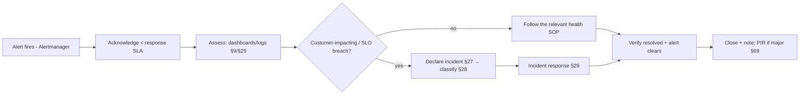
**Decision Criteria.** Severity from §28; a flapping/known-noisy alert → tune (governed), never silently ignore.
**Responsibilities.** On-call → IC for major. **Failure Handling.** No-ack within SLA → auto-escalate (§62).
**Escalation.** §62. **Security.** Security alerts → §30. **Monitoring.** Alertmanager. **Verification.** Alert
clears + condition resolved. **Recovery.** Via SOP. **Cross References.** Doc 8 §33, Doc 10 §44, §27–§29/§62/§69.

---

## 27. Incident Classification

**Purpose.** Consistently decide *what is an incident* and *what kind*, so response is proportionate.
**Scope.** Any unplanned event degrading service, safety, security, or compliance.
**Procedure.** Classify by **type** (availability, performance, data, security, compliance, connector, AI, cost)
and **severity** (§28). Anything customer-impacting, data-affecting, security-relevant, or SLO-breaching is an
incident. **Decision Criteria.** Non-incident issues become tracked defects (Doc 10 §62); incidents enter §29.
**Responsibilities.** Whoever detects declares; IC owns major incidents. **Failure Handling / Escalation.** When
in doubt, over-classify then downgrade; escalate per §62. **Security.** Security/compliance types trigger §30/§31.
**Monitoring / Verification / Recovery.** Via §29. **Cross References.** §28/§29/§62; Doc 10 §62.

## 28. Incident Severity Matrix

**Purpose.** Assign severity so response speed and roles match impact.
**Architecture (severity).**
| Sev | Definition (examples) | Response | Roles |
|---|---|---|---|
| **S1 Critical** | Outage; **duplicate/lost customer sends**; data breach; data loss; number-ban risk realized | Immediate, all-hands | IC + relevant leads + owner informed |
| **S2 Major** | Key flow broken (inbox/campaign/connector down) no workaround; severe degradation | Urgent, same-day | IC + owning role |
| **S3 Moderate** | Degraded with workaround; single connector down (others fine) | Scheduled, business hours | On-call/owning role |
| **S4 Minor** | Cosmetic/low impact | Backlog | Owning role |
**Decision Criteria.** Severity = impact × scope × reversibility; **customer/compliance/security impact raises
severity**. **Responsibilities.** IC confirms severity. **Failure/Escalation.** Severity can be raised mid-
incident. **Security.** Any breach = S1 (§31). **Monitoring/Verification/Recovery.** Per §29. **Cross Refs.**
Doc 6 §42, Doc 10 §62, §29–§40/§62.

## 29. Incident Response Workflow

**Purpose.** Run every incident through one disciplined workflow.
**Procedure.**
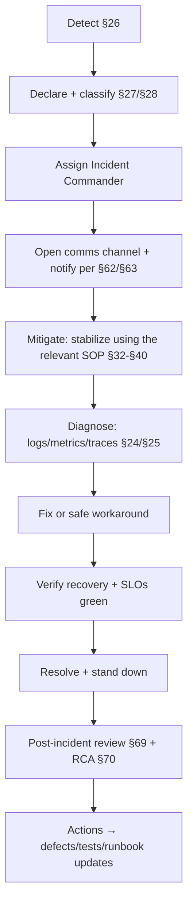
**Decision Criteria.** Stabilize before root-cause (stop the bleeding first — fail safe, §2); prefer reversible
mitigations. **Responsibilities.** IC coordinates; roles execute (§4). **Failure Handling.** If mitigation fails,
escalate severity + roles. **Escalation.** §62. **Security.** Governed + audited actions (Doc 6 §43/§44); comms
per §63. **Monitoring.** Continuous during the incident. **Verification.** SLOs green + condition resolved.
**Recovery.** Documented in the PIR (§69). **Cross References.** §26/§32–§40/§62/§63/§69/§70; Doc 6 §43/§44.

## 30. Security Incident Response

**Purpose.** Respond to suspected/confirmed security events (intrusion, credential compromise, abuse, injection).
**Procedure.**
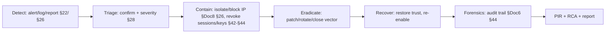
**Decision Criteria.** Confirmed compromise → S1; contain **before** eradicate; if personal data is exposed →
**data breach procedure (§31)**. **Responsibilities.** Security Engineer leads; IC coordinates; owner informed.
**Failure Handling.** If containment is uncertain, isolate broadly (fail safe). **Escalation.** Security → IC →
owner (§62). **Security Considerations.** Preserve evidence (immutable audit, Doc 6 §44); rotate affected
secrets (§42–§44); apply IP block/allow (Doc 8 §26). **Monitoring.** Heightened during/after. **Verification.**
Vector closed; no further indicators. **Recovery.** Trust restored; report filed. **Cross References.** Doc 6 §44,
Doc 8 §26, Doc 9 §33/§34, §31/§42–§44/§62.

## 31. Data Breach Procedure

**Purpose.** Handle confirmed exposure of personal/customer data lawfully and completely (Doc 8 §48).
**Procedure.** (1) Declare **S1**; invoke §30 containment. (2) Assess **scope** — what data, whose, how much,
how exposed. (3) Preserve evidence (audit, Doc 6 §44). (4) Notify: owner + (as legally required) authorities/
affected parties per **GDPR/DPDP** obligations (Doc 8 §48) — timelines and wording approved by the owner.
(5) Remediate the vector (§30). (6) Full PIR + RCA (§69/§70) + report. **Decision Criteria.** Any confirmed
personal-data exposure triggers this; notification decisions are the owner's (legal). **Responsibilities.**
Security Engineer + IC + **owner** (accountable). **Failure Handling.** If scope is uncertain, treat as larger
until proven otherwise. **Escalation.** Immediate to owner. **Security Considerations.** Minimize further
exposure; encrypted/least-privilege handling throughout. **Monitoring.** For ongoing exfiltration. **Verification.**
Exposure stopped; obligations met. **Recovery.** Systems + trust restored. **Cross References.** Doc 1 CMP-09,
Doc 8 §48, Doc 6 §44, §30/§69/§70.

---

> **Outage-procedure convention (§32–§40).** Each maps a failure class to its **operator actions**, building on
> the architecture's automatic handling (Doc 6 §15; Doc 8 §22) — the operator's job is to confirm automatic
> recovery, decide on manual steps, communicate, and verify. All map to the incident workflow (§29).

## 32. Meta API Outage Procedure

**Purpose.** Operate through a Channel-1 (Meta) outage without harming numbers or losing work.
**Procedure.** (1) Confirm via send error/latency + `429`/5xx spikes (§17); check Meta status. (2) Verify the
**circuit breaker** opened and sends **paused/paced** automatically (Doc 6 §15 F4/§21). (3) Confirm inbound is
unaffected long-term (Meta retries webhooks 7 days). (4) Keep **Channel 2 (Support Connector) operating** for
live support — continuity (Doc 8 §47). (5) Communicate status (§65). (6) On recovery, confirm breaker half-opens
and **paced catch-up** within tier. **Decision Criteria.** Do **not** force sends or bypass pacing (ban risk).
**Responsibilities.** SRE + owner. **Failure Handling.** Prolonged outage → hold campaigns; queued work resumes.
**Escalation.** Owner (business impact). **Security.** N/A. **Monitoring.** Meta/number dashboards.
**Verification.** Sends resume; numbers GREEN. **Recovery.** Automatic + confirm. **Cross References.** Doc 6
§15/§21/§28, Doc 8 §47, §17/§65.

## 33. Support Connector Outage Procedure

**Purpose.** Restore a failed connector (Channel 2) while keeping the rest of the platform running.
**Procedure.** (1) Identify the affected connector(s) on the Connector Dashboard (Doc 7 §13.3). (2) Confirm
**isolation** — other connectors + Channel 1 unaffected (Doc 7 §24). (3) For a transient drop, let **auto-
recovery** run (Doc 7 §10); for AwaitingReAuth, perform **QR re-login** (Doc 7 §8). (4) For worker/node loss,
confirm **re-pin** (Doc 6 §22/§23). (5) If systemic (all connectors), treat as S2, engage the connector incident
playbook (§74). (6) Communicate to affected agents (§65). **Decision Criteria.** Single connector down = S3;
all connectors = S2; Channel-1 unaffected either way. **Responsibilities.** Support Engineer → SRE. **Failure
Handling.** No message loss (idempotent recovery). **Escalation.** §62. **Security.** Re-auth via governed QR
flow; sessions encrypted. **Monitoring.** Connector Dashboard. **Verification.** Connector Healthy; streams flow.
**Recovery.** §74. **Cross References.** Doc 6 §22/§23, Doc 7 §8/§10/§13/§24, §65/§74.

## 34. Internet Failure Procedure

**Purpose.** Operate through loss of connectivity to Meta/customers/providers.
**Procedure.** (1) Confirm scope (egress vs ingress vs total). (2) Outbound sends **pause + queue**; AI/provider
calls fall back/degrade (Doc 9 §39). (3) Inbound (Meta) retried by Meta; connectors reconnect on restore.
(4) Enter **manual mode** notice to agents (Doc 6 §40). (5) On restore, confirm **auto-resume** from checkpoints
(Doc 6 §8). **Decision Criteria.** No data is lost; do not manually force partial sends. **Responsibilities.**
SysAdmin + SRE. **Failure Handling.** Extended outage → hold campaigns. **Escalation.** Owner. **Security.** N/A.
**Monitoring.** Connectivity + queue backlog. **Verification.** Sends/inbound resume. **Recovery.** Automatic.
**Cross References.** Doc 6 §8/§40, Doc 8 §22, Doc 9 §39.

## 35. Server Failure Procedure

**Purpose.** Recover from loss of the production host.
**Procedure.** (1) Confirm the host is down (not just a service). (2) If a **warm standby** exists → promote it
(Doc 8 §23) for near-zero RTO; else perform **cold restore** on a replacement host (§46/§47). (3) Restore data
from verified backups (§45/§46); redeploy pinned images (Doc 8 §24). (4) Verify integrity + resume from
checkpoints (Doc 6 §8/§41). (5) Communicate downtime (§65). **Decision Criteria.** Standby present → warm;
else cold. **Responsibilities.** DevOps + SysAdmin + DBA + IC. **Failure Handling.** RPO≈0 (verified backups).
**Escalation.** IC + owner. **Security.** Restore secrets securely (§44). **Monitoring.** Post-recovery watch.
**Verification.** `/ready` green; integrity verified (§46). **Recovery.** §47. **Cross References.** Doc 6 §8/§41,
Doc 8 §22/§23/§24, §45/§46/§47/§79.

## 36. Database Failure Procedure

**Purpose.** Recover from MySQL failure/corruption (source of truth).
**Procedure.** (1) Declare S1; confirm scope (down vs corrupt vs disk-full). (2) Sends **pause** (can't
checkpoint). (3) Disk-full → free space (cleanup/retention, Doc 6 §10) and resume. (4) Down/corrupt → restore
**latest verified backup + PITR** (Doc 8 §21/§22); or failover to a replica/standby (Doc 8 §10/§23).
(5) **Reconcile** denormalized counters + **resume interrupted campaigns** from checkpoints (Doc 6 §41).
(6) Verify integrity. **Decision Criteria.** Prefer failover (fast) if a healthy replica exists; else restore.
**Responsibilities.** DBA + SRE + IC. **Failure Handling.** Verified backups guarantee recoverability.
**Escalation.** IC + owner. **Security.** Encrypted backups; least-privilege. **Monitoring.** DB metrics.
**Verification.** Integrity + audit checks pass (Doc 6 §41). **Recovery.** §46/§47. **Cross References.** Doc 3,
Doc 6 §8/§41, Doc 8 §10/§21/§22, §13/§46.

## 37. Redis Failure Procedure

**Purpose.** Recover from Redis loss (broker/cache/locks/rate) — rebuildable, not a data-loss event.
**Procedure.** (1) Confirm which Redis role failed (§12). (2) Restart (AOF reload for broker/rate) or promote a
replica/Sentinel (Doc 8 §11). (3) Cache repopulates from MySQL; **re-enqueue pending work** reconciled from
durable checkpoints (Doc 6 §8.4). (4) Confirm rate-gate re-warms (fail-safe pacing meanwhile, Doc 6 §5.6).
**Decision Criteria.** Broker/rate loss is higher impact than cache loss. **Responsibilities.** SRE + SysAdmin.
**Failure Handling.** **No message loss**; idempotency prevents duplicates on re-enqueue. **Escalation.** SRE.
**Security.** Network-restricted; auth. **Monitoring.** Redis metrics. **Verification.** Broker/cache healthy;
sends flowing. **Recovery.** Automatic reconciliation. **Cross References.** Doc 6 §5/§8/§12, Doc 8 §11, §12.

## 38. Queue Failure Procedure

**Purpose.** Recover a stalled/failing async fabric.
**Procedure.** (1) Identify: workers (§11), Redis (§37), or a poison task. (2) Rising DLQ → inspect entries
(Doc 5 B11.7), root-cause (Doc 6 §7), and **replay** (governed, Doc 4 §23.1) once the cause is fixed. (3) Poison
task → confirm it's contained in the DLQ (not crash-looping the pool). (4) Backlog → scale the hot pool (Doc 6
§30). (5) If needed, **emergency pause** the affected campaign lane (§76) and **resume** after fix (§77).
**Decision Criteria.** Replay only after the root cause is fixed (else it re-fails). **Responsibilities.** SRE.
**Failure Handling.** `acks_late` + checkpoints = safe. **Escalation.** SRE → IC. **Security.** Replay/pause
governed + audited. **Monitoring.** Queue dashboards. **Verification.** DLQ draining; queues within SLO.
**Recovery.** Replay/scale/resume. **Cross References.** Doc 4 §23, Doc 6 §6/§7/§30, §10/§11/§76/§77.

## 39. AI Provider Failure Procedure

**Purpose.** Operate through an AI provider outage — AI is **non-critical** (Doc 9 §39).
**Procedure.** (1) Confirm provider errors/breaker-open (§15). (2) Verify **fallback provider/model** is serving
(Doc 9 §6/§7/§39); if all down, confirm **graceful degradation** — AI features show unavailable, **agents work
manually**, RAG degrades to keyword. (3) Communicate reduced AI capability (§65). (4) On recovery, confirm
breaker closes. **Decision Criteria.** Never let AI-down block messaging; do not disable human workflows.
**Responsibilities.** AI Operator. **Failure Handling.** Core messaging unaffected. **Escalation.** AI Operator →
owner (if budget/quality impact). **Security.** Fallbacks respect the same guardrails/RBAC. **Monitoring.** AI
dashboards. **Verification.** AI features restored or cleanly degraded. **Recovery.** Automatic. **Cross
References.** Doc 9 §6/§7/§33/§39, §15/§73.

## 40. Cloudflare Failure Procedure

**Purpose.** Operate through a Cloudflare (edge) outage.
**Procedure.** (1) Confirm scope (edge degraded vs DNS). (2) Recognize the origin **fails closed** (firewalled
to Cloudflare IPs, Doc 8 §5/§9) — this is by design. (3) For a prolonged outage, execute the documented
**break-glass** to temporarily allow controlled direct/alternate access (governed, owner-approved, Doc 8 §22).
(4) On recovery, **revert break-glass** (restore origin allowlisting). (5) Communicate (§65). **Decision
Criteria.** Break-glass only with owner approval + a revert plan (security trade-off). **Responsibilities.**
SysAdmin + Security + owner. **Failure Handling.** Origin stays protected until deliberately opened.
**Escalation.** Security + owner. **Security Considerations.** Break-glass widens exposure — time-boxed, audited,
reverted promptly. **Monitoring.** Edge + origin reachability. **Verification.** Edge restored; break-glass
reverted. **Recovery.** Revert to normal. **Cross References.** Doc 8 §5/§9/§22, §65.

---

## 41. SSL Certificate Renewal SOP

**Purpose.** Keep TLS valid end-to-end (Doc 8 §8). **Procedure.** Edge certs auto-renew at Cloudflare — monitor
expiry alerts; the **Origin CA cert** on Nginx is long-lived — rotate on schedule during a maintenance window
(§51): issue new origin cert, install, reload Nginx, verify, retire old. **Decision Criteria.** Renew well
before expiry; never let a cert lapse. **Responsibilities.** SysAdmin. **Failure Handling.** Impending expiry
without renewal → S2. **Escalation.** SysAdmin → SRE. **Security.** Strong TLS policy + HSTS maintained (Doc 8
§8). **Monitoring.** Cert-expiry alert. **Verification.** New cert served; no TLS errors; strict origin
validation intact. **Recovery.** Reinstall/rollback cert. **Cross References.** Doc 8 §8, §51.

## 42. Token Rotation SOP

**Purpose.** Rotate Meta system-user tokens and connector session credentials safely (Doc 8 §20; Doc 7 §9).
**Procedure.** For a **Meta token**: obtain new token → update the encrypted store (never plaintext) → verify
sends/webhooks with the new token → retire old. For a **connector session** (re-auth): use **Replace Session**
(Doc 7 §9) / QR re-login (Doc 7 §8) without removing the connector. **Decision Criteria.** Rotate on schedule
(§29 Doc 8) and immediately on suspected compromise (§30). **Responsibilities.** SysAdmin/Security. **Failure
Handling.** Keep the old token until the new one is verified (no gap). **Escalation.** Security. **Security
Considerations.** Encrypted at rest; never logged; audited (Doc 6 §44). **Monitoring.** Send/webhook success
post-rotation. **Verification.** New credential works; old revoked. **Recovery.** Re-issue if the new fails.
**Cross References.** Doc 7 §8/§9, Doc 8 §20, §30.

## 43. Password Rotation SOP

**Purpose.** Enforce credential hygiene for operator/user accounts. **Procedure.** Enforce the password policy
(Doc 1 FR-AUTH-04); rotate on schedule and immediately on compromise; require MFA where enabled; on rotation,
optionally revoke existing sessions (Doc 4 §11 "log out all"). **Decision Criteria.** Compromise/anomaly →
immediate rotation + session revocation. **Responsibilities.** Security + account owner. **Failure Handling.**
Locked-out legitimate user → admin reset (Doc 4 §12.1). **Escalation.** Security. **Security Considerations.**
Argon2id hashing; never store/transmit plaintext (Doc 1 §5.4). **Monitoring.** Auth-failure trends (§30).
**Verification.** New credential works; old invalid. **Recovery.** Admin reset. **Cross References.** Doc 1
FR-AUTH-04/§5.4, Doc 4 §11/§12.

## 44. Secret Rotation SOP

**Purpose.** Rotate encryption keys, API keys, provider/SMTP creds, and DB/Redis credentials (Doc 8 §20).
**Procedure.** Use **envelope encryption** so the master key can be rotated by re-wrapping data keys without mass
re-encryption; rotate provider/DB/Redis creds with a verify-before-retire step; rotate platform API keys via the
API-keys surface (Doc 4 §11, shown-once). **Decision Criteria.** Scheduled + on-compromise (§30). **Responsibilities.**
Security/SysAdmin. **Failure Handling.** Verify new secret works before retiring old (zero-downtime).
**Escalation.** Security. **Security Considerations.** A lost master key is a recovery event (§47); all rotations
audited. **Monitoring.** Post-rotation health. **Verification.** Services healthy on new secrets. **Recovery.**
Re-issue. **Cross References.** Doc 8 §20/§22, Doc 4 §11, §30/§47.

## 45. Backup Verification SOP

**Purpose.** Ensure backups are real — "untested backup = no backup" (Doc 8 §21).
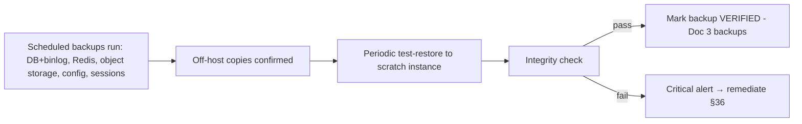
**Procedure.** Daily: confirm
scheduled backups ran (DB + binlog, Redis, object storage, config, connector sessions) and off-host copies
exist; periodically: **test-restore** to a scratch instance + integrity check; mark the backup **verified**
(Doc 3 `backups`). **Decision Criteria.** A backup counts only once a restore is proven. **Responsibilities.**
SysAdmin + DBA. **Failure Handling.** Failed backup/verify → **critical alert** + remediate immediately.
**Escalation.** SRE/SysAdmin. **Security.** Backups encrypted, access-controlled, off-site. **Monitoring.**
Backup-success + verification metrics. **Verification.** Latest backup verified. **Recovery.** Re-run backup.
**Cross References.** Doc 6 §41, Doc 8 §21, §46/§55.

## 46. Restore SOP

**Purpose.** Restore data/services correctly from a verified backup.
**Procedure.**
```mermaid
flowchart LR
  SEL[Select latest verified backup + PITR point §45] --> RESTORE[Restore DB/object/config to target]
  RESTORE --> RECON[Reconcile counters §Doc6 §41]
  RECON --> INTEG[Integrity + audit-chain verification]
  INTEG --> RESUME[Resume services; campaigns from checkpoints §Doc6 §8]
  RESUME --> VERIFY[/ready green + smoke §Doc10 §43]
```
**Decision Criteria.** Choose the newest verified backup that predates the corruption/loss; PITR to the safe
point. **Responsibilities.** DBA + DevOps + IC. **Failure Handling.** If a restore fails integrity, use the
prior verified backup. **Escalation.** IC + owner. **Security.** Restore secrets securely (§44). **Monitoring.**
During + after. **Verification.** Integrity + audit + smoke pass. **Recovery.** This *is* recovery. **Cross
References.** Doc 6 §8/§41, Doc 8 §21/§22, Doc 10 §42/§46, §45/§47.

## 47. Disaster Recovery SOP

**Purpose.** Execute full recovery from catastrophic loss within RTO/RPO (Doc 8 §22; Doc 6 §41).
**Procedure.**
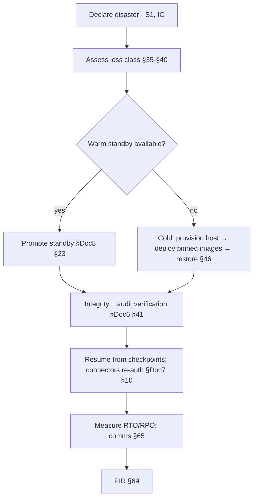
**Decision Criteria.** Warm (fast) vs cold (rebuild) by standby availability; integrity **must** verify before
resuming. **Responsibilities.** IC + SRE + DBA + DevOps + owner. **Failure Handling.** RPO≈0 for accepted data.
**Escalation.** Owner informed throughout. **Security.** Governed; secrets restored securely. **Monitoring.**
Continuous. **Verification.** RTO/RPO met; integrity verified. **Recovery.** Full service resumed. **Cross
References.** Doc 1 NFR-DR, Doc 6 §8/§41, Doc 8 §22/§23, Doc 10 §46, §35–§40/§46/§65/§69.

## 48. Upgrade Procedure

**Purpose.** Apply application/dependency upgrades safely (Doc 8 §30). **Procedure.** Validate in staging (Doc 10
§43); schedule a window if needed (§51); apply **expand→migrate→contract** DB changes (Doc 8 §24.6); deploy via
rolling/blue-green (§49); health-gate + smoke (Doc 10 §43); keep rollback ready (§50). **Decision Criteria.**
Backward-compatible → rolling, no window; breaking → staged + window. **Responsibilities.** DevOps + DBA +
owner (approval). **Failure Handling.** Health/smoke fail → rollback (§50). **Escalation.** DevOps → IC.
**Security.** Scanned, pinned images (Doc 8 §43). **Monitoring.** During + post (§66). **Verification.** Post-
deploy validation green (§66). **Recovery.** §50. **Cross References.** Doc 8 §24/§30/§43, Doc 10 §43/§66, §49/§50/§51.

## 49. Rolling Upgrade Procedure

**Purpose.** Upgrade with **zero downtime**. **Procedure.** Start new pinned containers → pass health/readiness →
drain old gracefully (Doc 6 §3.5) → shift traffic; workers use **task-payload versioning** so mixed versions
coexist (Doc 6 §39); connectors **re-pin** (Doc 6 §22/§23). **Decision Criteria.** Requires backward-compatible
schema/tasks. **Responsibilities.** DevOps. **Failure Handling.** Any unhealthy new instance → halt + rollback
(§50). **Escalation.** DevOps → IC. **Security.** Pinned/scanned images. **Monitoring.** Continuous synthetic
during cutover (Doc 10 §66). **Verification.** No dropped requests; all instances healthy. **Recovery.** §50.
**Cross References.** Doc 6 §3.5/§22/§39, Doc 8 §24, Doc 10 §66, §50.

## 50. Emergency Rollback Procedure

**Purpose.** Revert a bad release fast and safely.
**Procedure.**
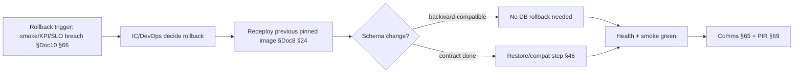
**Decision Criteria.** Trigger on objective signals (Doc 10 §66); because migrations are **expand→migrate→
contract**, rollback of code is safe (schema stays compatible). **Responsibilities.** DevOps + IC. **Failure
Handling.** If rollback also fails → DR path (§47). **Escalation.** IC + owner. **Security.** Governed image
revert. **Monitoring.** Post-rollback. **Verification.** Prior version healthy. **Recovery.** Stable release
restored. **Cross References.** Doc 8 §24, Doc 10 §66, §46/§47/§65/§69.

---

## 51. Maintenance Window SOP

**Purpose.** Perform disruptive maintenance safely with minimal impact. **Procedure.** Schedule during low-
traffic hours; announce (§65) + set the **maintenance banner** (Doc 6 §40); enter the appropriate mode (drain/
read-only); perform the work; verify (health + smoke); exit maintenance; confirm deferred writes/sends flush
(Doc 6 §40); communicate completion. **Decision Criteria.** Window required for breaking migrations, cert/secret
rotation, host maintenance. **Responsibilities.** DevOps/SysAdmin + owner (approval). **Failure Handling.**
Overrun → extend window or rollback (§50). **Escalation.** IC. **Security.** Governed + audited. **Monitoring.**
Throughout. **Verification.** System healthy post-window. **Recovery.** Rollback if needed. **Cross References.**
Doc 6 §40, Doc 8 §29, §41/§44/§48/§64/§65.

## 52. Capacity Review SOP

**Purpose.** Keep capacity ahead of demand (Doc 8 §27; Doc 6 §32/§36). **Procedure.** Review utilization (CPU/
RAM/disk/Redis/DB/workers/connectors) vs headroom; review growth trends + **predictive forecasts** (Doc 6 §36);
compare number/connector count to the sizing tiers (Doc 8 §27); plan additions before thresholds. **Decision
Criteria.** Any resource forecast to cross its threshold within the lead time → provision (§80). **Responsibilities.**
SRE. **Failure Handling.** Under-capacity → scale/expand; over-capacity → scale-in (Doc 6 §30/§50). **Escalation.**
Owner (cost). **Security.** N/A. **Monitoring.** Capacity dashboards. **Verification.** Headroom adequate.
**Recovery.** Expand (§80). **Cross References.** Doc 6 §32/§36, Doc 8 §27, §80.

## 53. Performance Review SOP

**Purpose.** Ensure the platform meets its performance targets over time (Doc 1 §5.1; Doc 6 §14; Doc 5 F15).
**Procedure.** Review API/queue/webhook latency, send throughput, dashboard load, and any regressions vs
baseline; correlate with recent changes; identify + remediate hotspots (indexes, pools, caching, Doc 8 §25).
**Decision Criteria.** Sustained target breach → performance incident + remediation. **Responsibilities.**
Performance Engineer/SRE. **Failure Handling.** Regression → open defect (Doc 10 §62) / rollback if release-
caused. **Escalation.** SRE. **Security.** N/A. **Monitoring.** Latency/throughput dashboards. **Verification.**
Targets met. **Recovery.** Tune/scale. **Cross References.** Doc 1 §5.1, Doc 6 §14, Doc 5 F15, Doc 8 §25.

## 54. Cost Review SOP

**Purpose.** Keep spend visible and within budget (Doc 6 §37; Doc 8 §28). **Procedure.** Review Meta messaging
spend (by category/country/campaign), AI token spend vs budget (Doc 9 §36), and infrastructure/storage cost;
compare to budgets; investigate anomalies (a runaway campaign/AI feature). **Decision Criteria.** Budget
approach/breach → alert owner; throttle non-critical AI if needed. **Responsibilities.** Ops + owner.
**Failure Handling.** Cost spike → investigate + contain. **Escalation.** Owner. **Security.** Cost data access-
gated (`finance:read`, Doc 6 §37). **Monitoring.** Cost dashboards + budget alerts. **Verification.** Spend
within budget. **Recovery.** Contain the cost driver. **Cross References.** Doc 6 §36/§37, Doc 9 §36, Doc 8 §28.

## 55. Compliance Review SOP

**Purpose.** Verify ongoing Meta-policy + data-protection compliance (Doc 1 §7; Doc 8 §48). **Procedure.** Confirm
opt-in/opt-out enforcement, 24-hour-window/template adherence, messaging-limit/quality compliance, retention/
erasure execution (Doc 8 §36), and audit-trail completeness (Doc 6 §44); confirm connector-adapter compliance
posture (Doc 7 §5.5). **Decision Criteria.** Any gap → remediate + record. **Responsibilities.** Compliance +
owner. **Failure Handling.** Compliance gap → treat per severity; policy breach can be S1. **Escalation.**
Owner. **Security.** Data-protection controls verified. **Monitoring.** Compliance metrics + audit. **Verification.**
Controls confirmed. **Recovery.** Remediate. **Cross References.** Doc 1 §7/CMP, Doc 6 §44, Doc 7 §5.5, Doc 8
§36/§48, §56.

## 56. Audit Preparation SOP

**Purpose.** Be audit-ready at any time. **Procedure.** Gather evidence: immutable audit logs (Doc 6 §44),
access/RBAC records, backup-verification records (§45), security-scan/pen results (Doc 10 §38), compliance
records (§55), and change history (§67). Confirm completeness + integrity (audit hash-chain). **Decision
Criteria.** Evidence gap → remediate before the audit. **Responsibilities.** Compliance + Security + owner.
**Failure Handling.** Missing evidence → document + close the gap. **Escalation.** Owner. **Security.** Evidence
handled confidentially. **Monitoring.** Continuous audit logging. **Verification.** Evidence set complete.
**Recovery.** N/A. **Cross References.** Doc 6 §44, Doc 8 §48, Doc 10 §38, §45/§55/§67.

## 57. Business Continuity SOP

**Purpose.** Keep the business operating through outages using degraded/manual modes (Doc 8 §47). **Procedure.**
On a dependency outage, apply the relevant outage procedure (§32–§40) and the **recovery-priority order**:
(1) data integrity → (2) inbound capture → (3) support inbox (Channel 2) → (4) outbound/campaigns (Channel 1)
→ (5) analytics (Doc 8 §47). Use **manual mode** (Doc 6 §40) and lean on **dual-channel continuity** (a single-
channel outage never halts all contact). **Decision Criteria.** Restore in priority order. **Responsibilities.**
IC + owner. **Failure Handling.** Extended outage → sustained degraded mode + comms (§65). **Escalation.** Owner.
**Security.** Governed break-glass where needed. **Monitoring.** Continuity dashboards. **Verification.** Priority
services restored in order. **Recovery.** Full service. **Cross References.** Doc 8 §47, Doc 7, Doc 6 §40, §32–§40/§65.

## 58. Emergency Contacts Matrix

**Purpose.** Reach the right person fast during an incident. **Procedure.** Maintain an up-to-date contact list
by role (On-call, IC, SRE, Security, DBA, DevOps, AI Operator, Support, **Owner**) with primary + backup
contact methods and availability; reviewed at each handover (§8) and monthly. **Decision Criteria.** Contact per
the escalation tree (§62) and severity (§28). **Responsibilities.** Ops maintains; owner approves. **Failure
Handling.** Unreachable primary → backup → next tier (§62). **Escalation.** §62. **Security.** Contact details
kept access-controlled (not in public docs/logs). **Monitoring.** N/A. **Verification.** List current + tested.
**Recovery.** N/A. **Cross References.** §8/§28/§62.

## 59. Operational KPIs

**Purpose.** Measure operational health and improvement (complements Doc 8 §52; Doc 10 §49). **Architecture
(KPIs).** Uptime/availability, API/queue/connector uptime, MTTD/MTTR, incident count/severity mix, alert
volume + false-positive rate, backup success + verification rate, deployment success + rollback rate, DR-drill
pass rate, capacity headroom, cost vs budget, SLA compliance (Doc 6 §42). **Decision Criteria.** KPI breach →
review + action (§53). **Responsibilities.** SRE/Ops. **Failure Handling.** Adverse trend → improvement action
(§82 maturity). **Escalation.** Owner (business KPIs). **Security.** Includes patch/scan compliance. **Monitoring.**
KPI dashboards. **Verification.** KPIs within target. **Recovery.** N/A. **Cross References.** Doc 6 §42, Doc 8
§52, Doc 10 §49, §82.

---

## 60. Operations Decision Records (OD1–OD40)

The operational decisions that govern this runbook. Each: **Decision · Why · Alternative (rejected) · Benefit ·
Trade-off · Migration.** (≥40 required; 40 provided.)

| ID | Decision | Why | Alternative rejected | Benefit | Trade-off | Migration |
|---|---|---|---|---|---|---|
| **OD1** | Runbook-first operations | Consistency under pressure | improvise | repeatable response | maintain runbook | living doc |
| **OD2** | Fail-safe: pause > push when uncertain | Protect customers/numbers | force through | no harm done | some delay | — |
| **OD3** | Observe → act → verify | Avoid blind changes | act on hunches | correct actions | discipline | — |
| **OD4** | Privileged actions governed + audited | Accountability/security | ungoverned ops | traceable | approval friction | tooling |
| **OD5** | Incident Commander for major incidents | Coordinated response | leaderless | fast, clear | role staffing | rotation |
| **OD6** | Severity-driven response (S1–S4) | Proportionate effort | one-size response | right urgency | classification | — |
| **OD7** | Stabilize before root-cause | Stop the bleeding | debug-first | faster recovery | temp fixes | permanent fix in PIR |
| **OD8** | Over-classify then downgrade | Don't under-respond | under-classify | safety margin | occasional over-response | — |
| **OD9** | Acknowledged shift handover | No lost context | informal handover | continuity | overhead | — |
| **OD10** | Morning + evening verification | Catch issues early | ad-hoc checks | early detection | routine time | automate checks |
| **OD11** | Confirm auto-recovery before manual steps | Avoid interfering | manual-first | leverage design | patience | — |
| **OD12** | Never force sends / bypass pacing | **Ban/quality protection** | push to catch up | healthy numbers | slower catch-up | — |
| **OD13** | Respect quality-RED auto-pause | Protect the asset | override | number survives | paused marketing | — |
| **OD14** | Dual-channel continuity as an operational asset | Single-channel outage ≠ total outage | single dependency | resilient support | operate two channels | more channels later |
| **OD15** | Connector ops via the abstraction only | Implementation-neutral | couple to impl | swappable | sandbox fidelity | official adapter |
| **OD16** | AI-down never blocks messaging | Core is critical, AI isn't | AI critical-path | resilient | manual fallback | local model |
| **OD17** | Break-glass owner-approved + reverted | Controlled exposure | fail-open | protected origin | reduced availability | Zero-Trust |
| **OD18** | Verified backups only | "Untested = no backup" | trust backups | real recoverability | test-restore cost | automate verify |
| **OD19** | Quarterly DR drills, measured | Recovery works when needed | paper plan | proven RTO/RPO | drill effort | cross-region |
| **OD20** | Warm standby preferred when available | Faster RTO | cold-only | near-zero downtime | standby cost | HA cluster |
| **OD21** | Expand→migrate→contract for safe rollback | Code rollback stays safe | in-place migration | reversible | multi-step | — |
| **OD22** | Zero-downtime rolling/blue-green deploys | Availability | stop-the-world | no downtime | complexity | canary |
| **OD23** | Objective rollback triggers | Fast, unbiased revert | subjective calls | quick recovery | trigger tuning | auto-canary |
| **OD24** | Maintenance windows for disruptive changes | Minimize impact | anytime disruption | controlled | scheduling | fewer windows |
| **OD25** | Rotate secrets verify-before-retire | Zero-downtime rotation | swap-and-pray | no gaps | two-step | automated |
| **OD26** | Immediate rotation on compromise | Limit blast radius | scheduled-only | contained | urgency | — |
| **OD27** | Contain before eradicate (security) | Stop spread first | fix-first | limited damage | temporary isolation | — |
| **OD28** | Personal-data exposure → breach procedure + owner | Legal/ethical duty | handle quietly | compliant response | disclosure effort | — |
| **OD29** | Alert-driven; no silent ignoring; tune noise | Trusted alerting | ignore/over-alert | signal not noise | tuning effort | ML alerting |
| **OD30** | No-ack auto-escalation | Nothing dropped | rely on memory | guaranteed pickup | escalation noise | — |
| **OD31** | DLQ replay only after fix | Avoid re-failure | blind replay | effective replay | investigation first | — |
| **OD32** | Provision ahead of forecast thresholds | Stay ahead of demand | reactive scaling | no capacity crunch | some slack cost | predictive auto |
| **OD33** | Cost budgets + alerts; throttle non-critical AI on breach | Avoid runaway spend | untracked | cost control | throttling | per-model routing |
| **OD34** | Continuous compliance review; breach can be S1 | Legal/policy safety | periodic-only | always compliant | review effort | automation |
| **OD35** | Audit-ready at all times | No scramble | prep-on-demand | fast audits | continuous logging | auto-evidence |
| **OD36** | Maintained + tested emergency contacts | Reach people fast | stale list | quick escalation | upkeep | on-call tooling |
| **OD37** | Mandatory PIR + RCA for S1/S2 | Learn, don't repeat | move on | fewer repeats | review time | templates §69/§70 |
| **OD38** | Change management for all prod changes | Controlled, traceable | ad-hoc changes | fewer self-inflicted incidents | process | GitOps |
| **OD39** | Owner approval for release + risk acceptance | Business accountability | eng-only decisions | aligned risk | approval step | — |
| **OD40** | Continuous improvement via maturity model + KPIs | Get better over time | static ops | rising reliability | measurement | L5 practices |

---

## 61. Runbook Index

**Purpose.** A fast lookup from symptom/situation to the right SOP.
**Architecture (index).**
| Situation | Go to |
|---|---|
| Daily routine | §5–§9 |
| A subsystem looks unhealthy | §10–§17 (queue/worker/redis/mysql/storage/AI/connector/Meta) |
| Campaign/scheduler/webhook/notification issue | §18–§21 |
| Reading dashboards/logs | §22–§25 |
| An alert fired | §26 → §27–§29 |
| Security event / data breach | §30 / §31 |
| A dependency is down | §32–§40 |
| Rotate a cert/token/password/secret | §41–§44 |
| Backup/restore/DR | §45–§47 |
| Deploy/upgrade/rollback | §48–§50 |
| Maintenance/capacity/perf/cost/compliance/audit | §51–§56 |
| Continuity / contacts / KPIs | §57–§59 |
| Emergency stop / pause / resume / broadcast | §75–§78 |
| Replace a server / expand infra | §79 / §80 |
**Responsibilities.** All operators. **Decision Criteria / Failure / Escalation / Security / Monitoring /
Verification / Recovery.** Navigational aid; defers to the target SOP. **Cross References.** All sections.

## 62. Escalation Tree

**Purpose.** Define who is contacted, in what order, for each incident type/severity.
**Architecture.**
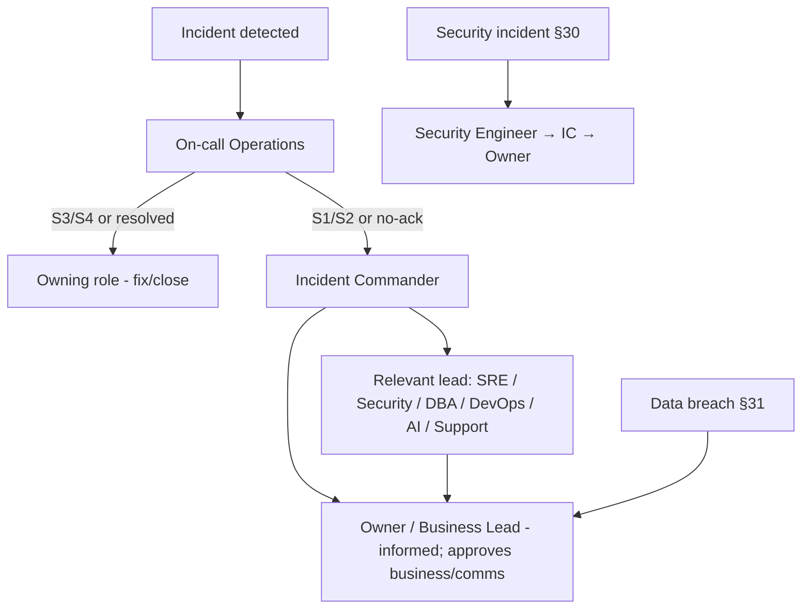
**Decision Criteria.** Severity (§28) + type (§27) select the path; unreachable contact → next tier (§58).
**Responsibilities.** On-call initiates; IC coordinates. **Failure Handling.** No-ack auto-escalates (OD30).
**Escalation.** This *is* escalation. **Security.** Security/breach paths reach the owner. **Monitoring.**
Alertmanager routing. **Verification.** Right people engaged. **Recovery.** Via §29. **Cross References.** §27–
§31/§58; Doc 8 §34.

## 63. Communication Templates

**Purpose.** Communicate consistently and calmly during incidents/maintenance (structure, not scripted text).
**Architecture (templates).** Each communication states: **what** is happening (impact in plain terms), **who**
is affected, **when** it started + next update time, **what** is being done, and **what** the audience should do
(if anything). Types: **internal incident update** (to the team/IC), **stakeholder/owner update**, **maintenance
notice** (§65), **resolution notice**, and **post-incident summary** (§69). **Decision Criteria.** Cadence by
severity (S1 = frequent updates). **Responsibilities.** IC (internal); owner approves any external wording.
**Failure Handling.** Silence erodes trust — always send the scheduled update even if "no change." **Escalation.**
Owner for external comms. **Security.** No sensitive details (secrets/PII/attack specifics) in broad comms.
**Monitoring / Verification / Recovery.** Comms sent on cadence. **Cross References.** §29/§65/§69.

## 64. Maintenance Calendar

**Purpose.** Plan recurring/one-off maintenance so it's predictable and low-impact. **Architecture.** A calendar
of the operational cadence (Doc 8 §29): daily checks, weekly reviews, monthly test-restore + secret rotation +
patching, quarterly DR drill + cert rotation + access review, yearly major upgrades + key rotation — plus one-
off windows (§51). **Decision Criteria.** Schedule disruptive items in low-traffic windows; avoid clustering
risky changes. **Responsibilities.** Ops + owner. **Failure Handling.** Missed maintenance → reschedule + note.
**Escalation.** Owner. **Security.** Includes rotation/patch cadence. **Monitoring.** Calendar adherence.
**Verification.** Scheduled items completed. **Recovery.** N/A. **Cross References.** Doc 8 §29, §41–§48/§51.

## 65. Downtime Communication SOP

**Purpose.** Inform stakeholders of planned/unplanned downtime appropriately. **Procedure.** For **planned**:
announce ahead (audience, window, impact) + set the maintenance banner (Doc 6 §40). For **unplanned**: on S1/S2,
send an initial impact notice quickly, then updates on cadence (§63), then a resolution notice. **Decision
Criteria.** Notify proportional to impact/audience; external wording is owner-approved. **Responsibilities.** IC
+ owner. **Failure Handling.** Under-communication → reputational harm; always update. **Escalation.** Owner.
**Security.** No sensitive detail externally. **Monitoring.** N/A. **Verification.** Notices delivered.
**Recovery.** Resolution notice sent. **Cross References.** Doc 6 §40, §51/§63/§66.

## 66. Customer Impact Assessment

**Purpose.** Judge how an incident affects the Vi Reactivation Team's customers, to prioritize and communicate.
**Procedure.** Assess: which channels/features affected, how many customers/conversations/campaigns, whether
**messages were delayed, failed, or duplicated** (Doc 6 guarantees mean no duplicates/loss — verify), and any
data/compliance impact. Rate impact (none/low/medium/high). **Decision Criteria.** Impact rating feeds severity
(§28) + comms (§65). **Responsibilities.** IC + owner. **Failure Handling.** Uncertain impact → assume higher.
**Escalation.** Owner. **Security.** Data/compliance impact → §31. **Monitoring.** Delivery/status metrics.
**Verification.** Impact quantified. **Recovery.** Remediate affected customers if needed. **Cross References.**
Doc 6, §28/§31/§65.

## 67. Change Management Workflow

**Purpose.** Ensure all production changes are reviewed, approved, scheduled, and reversible.
**Architecture.**
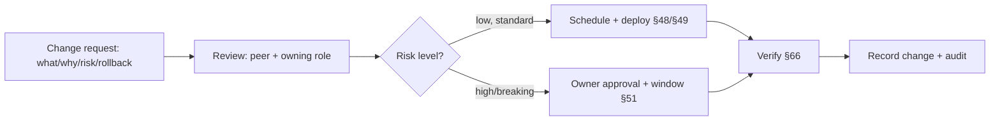
**Decision Criteria.** Standard low-risk changes fast-track; high-risk/breaking need owner approval + a window.
**Responsibilities.** Requester + reviewer + approver (owner for high-risk). **Failure Handling.** Change causes
issue → rollback (§50) + PIR (§69). **Escalation.** Owner. **Security.** Changes audited; scanned images (Doc 8
§43). **Monitoring.** Post-change (§66). **Verification.** Change verified + recorded. **Recovery.** §50.
**Cross References.** Doc 8 §24/§43, Doc 10 §66, §48–§51/§68/§69.

## 68. Release Approval Workflow

**Purpose.** Gate production releases on quality + business sign-off. **Procedure.** A release proceeds only when
**release criteria** (Doc 10 §6) and the **certification framework** (Doc 10 §63) are satisfied, the Quality
Index ≥ bar with no S1/S2 open, UAT is accepted, and the **owner approves** (governed, Doc 6 §43). **Decision
Criteria.** Any unmet criterion → No-Go; conditional-go requires documented risk acceptance (Doc 10 §50).
**Responsibilities.** QA + IC + **owner** (accountable). **Failure Handling.** No-Go blocks release.
**Escalation.** Owner. **Security.** Security certification required (Doc 10 §63/§67). **Monitoring.** Post-
release (§66). **Verification.** Sign-off recorded + audited. **Recovery.** Rollback (§50). **Cross References.**
Doc 6 §43, Doc 10 §6/§50/§63/§67, §48/§66.

## 69. Post-Incident Review Template

**Purpose.** Learn from every major incident (blameless). **Architecture (template fields).** Summary; timeline
(detect→resolve); impact (customer/data/duration); severity; what happened; **root cause** (§70); what went well;
what went poorly; detection/response gaps; **action items** (owners + due dates) → defects/tests/runbook updates
(Doc 10 §62). **Decision Criteria.** Mandatory for S1/S2 (OD37). **Responsibilities.** IC facilitates; team
contributes; owner reviews. **Failure Handling.** Missing PIR → the incident isn't closed. **Escalation.** Owner.
**Security.** Sensitive details access-controlled. **Monitoring.** Action-item completion. **Verification.**
Actions tracked to done. **Recovery.** Prevention embedded. **Cross References.** Doc 10 §62, §29/§70.

## 70. Root Cause Analysis Template

**Purpose.** Find the true cause so it can't recur. **Architecture (method).** 5-whys / fishbone from symptom to
root cause(s); distinguish trigger vs underlying cause; classify (code/config/capacity/dependency/process/human);
identify why detection/tests missed it; define the **permanent fix + a regression test** (Doc 10 §62/§64) and
any process/runbook change. **Decision Criteria.** Mandatory for S1/S2 and recurring issues. **Responsibilities.**
Owning role + IC. **Failure Handling.** Superficial RCA → recurrence; require true root cause. **Escalation.**
Owner. **Security.** Confidential where needed. **Monitoring.** Recurrence tracked. **Verification.** Fix + test
in place. **Recovery.** Recurrence prevented. **Cross References.** Doc 10 §62/§64, §69.

## 71. Risk Register

**Purpose.** Track known operational risks and their mitigations proactively. **Architecture.** A living register:
each risk has a description, likelihood × impact, current mitigation (which SOP/control), owner, and status.
Examples of tracked risk areas: single-node SPOF (mitigated by DR §47 + HA path Doc 8 §23), connector-adapter
compliance (Doc 7 §5.5), Meta quality/ban risk (Doc 6 §28), AI provider dependence (§39), secret compromise
(§30/§44), capacity exhaustion (§52). **Decision Criteria.** High-likelihood/high-impact risks get prioritized
mitigation. **Responsibilities.** SRE/owner. **Failure Handling.** A materialized risk → incident (§29).
**Escalation.** Owner. **Security.** Security risks tracked here. **Monitoring.** Reviewed at capacity/compliance
reviews (§52/§55). **Verification.** Register current. **Recovery.** Mitigation applied. **Cross References.**
§29/§39/§44/§47/§52/§55; Doc 6 §28, Doc 7 §5.5, Doc 8 §23.

## 72. Knowledge Base Maintenance

**Purpose.** Keep operational + AI knowledge current so the runbook and AI grounding stay accurate. **Procedure.**
Review/update this runbook after every PIR (§69) and change (§67); keep the AI Knowledge Base (Doc 9 §10) current
(policy/procedure docs) so AI answers stay grounded; version + review updates (Doc 10 §61). **Decision Criteria.**
Stale/incorrect knowledge → update promptly (drives wrong actions/answers). **Responsibilities.** Ops + AI
Operator. **Failure Handling.** Outdated runbook → operator error → captured in PIR. **Escalation.** Owner.
**Security.** No secrets in KB/runbook. **Monitoring.** Review cadence. **Verification.** Content current +
reviewed. **Recovery.** Correct + re-index (Doc 9 §10). **Cross References.** Doc 9 §10, Doc 10 §61, §67/§69.

---

## 73. AI Incident Playbook

**Purpose.** Handle AI-specific incidents — provider outage, cost spike, guardrail breach, quality regression,
or a suspected safety issue.
**Procedure.**
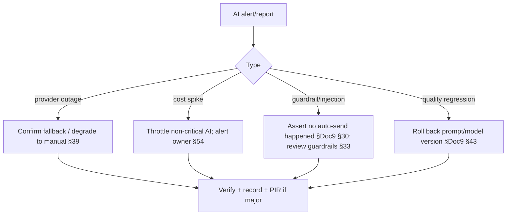
**Decision Criteria.** **Core messaging must remain unaffected**; a safety/guardrail breach is high severity even
without a send (verify the approval gate held). **Responsibilities.** AI Operator + Security (safety). **Failure
Handling.** All providers down → manual mode; never disable human workflows. **Escalation.** AI Operator → IC →
owner (cost/quality). **Security.** Confirm no data exposure; guardrails/PII controls intact (Doc 9 §33/§34).
**Monitoring.** AI dashboards. **Verification.** AI restored/degraded cleanly; **approval invariant confirmed**.
**Recovery.** Fallback or prompt/model rollback. **Cross References.** Doc 9 §30/§33/§34/§39/§43, §15/§39/§54.

## 74. Support Connector Incident Playbook

**Purpose.** Handle connector-specific incidents beyond a single transient drop.
**Procedure.**
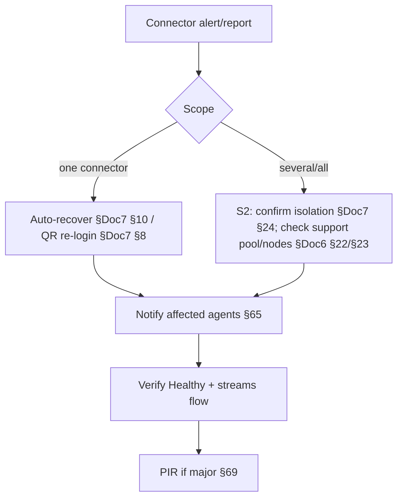
**Decision Criteria.** Single = S3; multiple = S2; **Channel 1 continues** regardless (continuity, §57).
**Responsibilities.** Support Engineer + SRE. **Failure Handling.** No message loss (idempotent recovery, Doc 6
§8). **Escalation.** §62. **Security.** Governed QR re-auth; sessions encrypted (Doc 7 §9). **Monitoring.**
Connector Dashboard. **Verification.** All connectors Healthy. **Recovery.** Reconnect/re-pin. **Cross
References.** Doc 6 §8/§22/§23, Doc 7 §8/§10/§24, §33/§57/§65.

## 75. Campaign Emergency Stop Procedure

**Purpose.** Immediately halt a campaign that is misconfigured, harmful, or risking numbers/compliance.
**Procedure.**
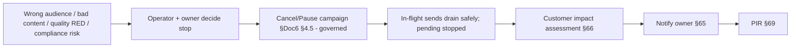
**Decision Criteria.** Stop immediately if wrong recipients, wrong content, quality-RED, or a compliance breach
is suspected — **erring toward stopping** (OD2). **Responsibilities.** On-call → **owner** consulted (business).
**Failure Handling.** Pause/cancel is safe + idempotent (no duplicate sends, Doc 6 §4.5). **Escalation.** Owner
+ IC. **Security.** Governed + audited action (Doc 6 §43/§44). **Monitoring.** Campaign dashboard. **Verification.**
Sending stopped; drained. **Recovery.** Fix + relaunch a corrected campaign after review. **Cross References.**
Doc 6 §4.5/§43/§44, §18/§66/§76.

## 76. Emergency Queue Pause

**Purpose.** Rapidly pause a queue/lane (e.g., all sends) during an incident. **Procedure.** Pause the affected
send lane/campaigns (governed, Doc 6 §43); in-flight tasks drain; new dispatch stops; **no data lost, no
duplicates** (Doc 6 §8). **Decision Criteria.** Use when continuing would cause harm (bad sends, Meta issue,
downstream failure). **Responsibilities.** On-call/SRE + IC. **Failure Handling.** Pause is always safe.
**Escalation.** IC. **Security.** Governed + audited. **Monitoring.** Queue dashboards. **Verification.** Lane
paused; drained. **Recovery.** Resume (§77). **Cross References.** Doc 6 §8/§29/§43, §38/§75/§77.

## 77. Emergency Resume

**Purpose.** Safely resume paused processing after the cause is resolved. **Procedure.** Confirm the root cause
is fixed (else it re-fails); resume the lane/campaign (governed); processing **continues from checkpoints**,
already-done work skipped (Doc 6 §8) — **no duplicates**. **Decision Criteria.** Resume only after verification.
**Responsibilities.** SRE + IC. **Failure Handling.** If issues recur → pause again + deeper diagnosis.
**Escalation.** IC. **Security.** Governed + audited. **Monitoring.** Post-resume watch. **Verification.**
Processing healthy; no duplicates. **Recovery.** Normal operation restored. **Cross References.** Doc 6 §8/§43,
§76.

## 78. Emergency Broadcast SOP

**Purpose.** Send an urgent, legitimate broadcast (e.g., a critical service notice) quickly but safely — **still
compliant, still human-approved**. **Procedure.** Use an **approved utility template** to opted-in contacts;
run the normal campaign path (cost/validation) on an expedited timeline with **owner approval**; the platform
still enforces opt-in/window/limit (no bypass). **Decision Criteria.** Only for genuinely urgent, compliant
messaging; owner approves. **Responsibilities.** Campaign owner + **owner** (approval). **Failure Handling.**
Compliance checks still apply; ineligible recipients excluded. **Escalation.** Owner. **Security.** Governed;
audited. **Monitoring.** Campaign dashboard. **Verification.** Delivered to eligible contacts. **Recovery.**
Standard campaign controls. **Cross References.** Doc 1 §7, Doc 6 §4/§5, §18/§68.

## 79. Server Replacement SOP

**Purpose.** Replace a failed/retiring host with minimal disruption. **Procedure.** Provision the new host
(hardened, Doc 8 §26); deploy pinned images (Doc 8 §24); restore/attach data (verified backups §46 or shared
data tier); rejoin the fleet (workers self-register, Doc 6 §23); verify (`/ready` + smoke, Doc 10 §43); retire
the old host. **Decision Criteria.** For a live failure, combine with §35 (server failure). **Responsibilities.**
SysAdmin + DevOps. **Failure Handling.** Verify before cutover; keep the old host until verified. **Escalation.**
IC. **Security.** Restore secrets securely (§44); harden before joining. **Monitoring.** Post-join. **Verification.**
New host healthy in the fleet. **Recovery.** Roll back to old host if needed. **Cross References.** Doc 6 §23,
Doc 8 §23/§24/§26, Doc 10 §43, §35/§44/§46.

## 80. Infrastructure Expansion SOP

**Purpose.** Add capacity (workers/nodes/connectors/Redis/DB) as the platform grows (Doc 8 §23/§27). **Procedure.**
From the capacity review (§52), add the needed resource: scale a worker pool (Doc 6 §30), add a worker node
(self-registers, Doc 6 §23), add a Support Connector (Doc 7 §7), split/cluster Redis (Doc 8 §11), add a MySQL
replica (Doc 8 §10) — following the sizing tiers (Doc 8 §27); verify + rebalance. **Decision Criteria.** Expand
before forecast thresholds (OD32). **Responsibilities.** SRE + SysAdmin + owner (cost). **Failure Handling.**
Mis-sized addition → adjust; stateless additions are low-risk. **Escalation.** Owner. **Security.** New nodes
hardened + zoned (Doc 8 §5/§26). **Monitoring.** Post-expansion utilization. **Verification.** Capacity increased;
load balanced. **Recovery.** Scale back if over-provisioned. **Cross References.** Doc 6 §23/§30, Doc 7 §7, Doc 8
§10/§11/§23/§27, §52.

## 81. Production Acceptance Checklist

**Purpose.** The final gate before the platform (or a major change) is accepted into production operation.
**Architecture (checklist).** Confirms: architecture docs current (Docs 1–11); **Production Readiness Checklist**
satisfied (Doc 8 §51); **release certification** passed (Doc 10 §63/§67); backups verified + DR drilled (§45/§47);
monitoring/alerts live + tested (§26; Doc 10 §44); runbooks (this doc) available + owners assigned (§3);
emergency contacts current (§58); security scans clean (Doc 10 §38); UAT accepted (Doc 10 §64); **owner sign-off**
(§68). **Decision Criteria.** All items green → accept; any gap → block. **Responsibilities.** IC/QA + **owner**
(accepts). **Failure Handling.** Unmet item blocks go-live. **Escalation.** Owner. **Security.** Security items
gating. **Monitoring.** Post-acceptance watch (§66). **Verification.** Checklist complete + signed.
**Recovery.** N/A. **Cross References.** Docs 1–10, Doc 8 §51, Doc 10 §63/§64/§67, §3/§26/§45/§47/§58/§68.

---

## 82. Operational Maturity Model

**Purpose.** Give operations a five-level maturity model to assess practice and plan improvement (parallels the
testing maturity model, Doc 10 §70).
**Architecture.**
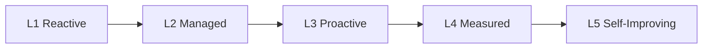
| Dimension | L1 Reactive | L2 Managed | L3 Proactive | L4 Measured | L5 Self-Improving |
|---|---|---|---|---|---|
| **Automation** | manual | scripted routine | health/scaling automated | most ops automated | self-healing |
| **Incident response** | firefighting | roles + severity | IC + runbooks (this doc) | metrics-driven (MTTD/MTTR) | prevention-driven |
| **Observability** | basic checks | dashboards | alerts + SLOs | full telemetry validated (Doc 10 §44) | predictive/anomaly |
| **DR readiness** | untested | backups exist | verified backups | quarterly drills measured | continuous DR readiness |
| **Governance** | ad-hoc | ownership | change mgmt + audit | risk register + KPIs | continuous governance |
| **Knowledge** | tribal | some runbooks | complete runbook | PIR-driven updates | AI-assisted knowledge |
| **Continuous improvement** | none | post-incident fixes | RCA + actions | KPI trends drive change | self-optimizing |

- **Target:** operate at **Level 4 (Measured)** — runbook-driven, metrics-informed, drilled — with **Level 5** as
  the continuous-improvement horizon. **Decision Criteria.** A regression in any dimension is an improvement
  action. **Responsibilities.** SRE/owner. **Failure Handling / Escalation / Security / Monitoring / Verification
  / Recovery.** Reviewed via KPIs (§59) and improvement actions. **Cross References.** Doc 10 §70, §59/§69/§70.

## 83. Cross-Document Traceability

**Purpose.** Show that every operational procedure is grounded in the frozen architecture it operates.
**Architecture (operation → architecture).**
| Operational area | Architecture operated (frozen) |
|---|---|
| Health SOPs (§10–§17) | Doc 6 (queue/workers/redis), Doc 3 (MySQL), Doc 8 (storage), Doc 9 (AI), Doc 7 (connector), Doc 1/§7 (Meta) |
| Monitoring/alerts (§22–§26) | Doc 8 §18/§19 (Prometheus/Grafana/Loki/Alertmanager), Doc 6 §13/§42 |
| Incident/outage (§27–§40) | Doc 6 §15/§21/§29 (failure handling/breakers), Doc 8 §22 (DR), Doc 7 §24 (isolation), Doc 9 §39 |
| Rotations (§41–§44) | Doc 8 §8/§20 (TLS/secrets), Doc 7 §9 (sessions), Doc 4 §11 (tokens/keys) |
| Backup/restore/DR (§45–§47) | Doc 8 §21/§22/§23, Doc 6 §8/§41, Doc 1 NFR-DR |
| Deploy/upgrade/rollback (§48–§50) | Doc 8 §24/§30, Doc 6 §3.5/§39, Doc 10 §66 |
| Reviews (§52–§56) | Doc 8 §27/§28/§48, Doc 6 §36/§37/§44, Doc 1 §7 |
| Continuity (§57) | Doc 8 §47, Doc 7 (dual-channel), Doc 6 §40 |
| Emergency procedures (§75–§78) | Doc 6 §4.5/§43/§44 (governed pause/cancel), Doc 1 §7 (compliance) |
| Playbooks (§73/§74) | Doc 9 (AI), Doc 7 (connector) |
| Release/change/acceptance (§67/§68/§81) | Doc 10 §6/§63/§67, Doc 8 §51, Doc 6 §43 |

- **Every procedure references its architecture and never redefines it** — the runbook is the *operating layer*
  over Docs 1–10. **Cross References.** Docs 1–10 (as mapped).

## 84. Glossary

| Term | Definition |
|---|---|
| **SOP** | Standard Operating Procedure — a repeatable operational procedure in this runbook. |
| **Incident Commander (IC)** | The person who coordinates a major incident (§3/§29). |
| **Severity (S1–S4)** | Incident impact level driving response (§28). |
| **Escalation tree** | The order in which people are engaged (§62). |
| **Break-glass** | A governed, owner-approved emergency override, reverted after use (§40). |
| **PIR / RCA** | Post-Incident Review / Root Cause Analysis (§69/§70). |
| **Runbook-first** | Follow the SOP before improvising (OD1). |
| **Fail-safe** | When uncertain, choose the safe (usually paused) option (OD2). |
| **Warm standby / cold restore** | A ready replica for fast recovery / rebuild-from-backup (§35/§47; Doc 8 §22/§23). |
| **Manual mode** | Degraded operating mode where writes/sends are deferred while reads/inbox remain (Doc 6 §40). |
| **Emergency stop** | Immediate governed halt of a campaign (§75). |
| **Maintenance window** | A scheduled period for disruptive maintenance (§51). |
| **RTO / RPO** | Recovery Time / Point Objective (§47; Doc 1 NFR-DR). |

## 85. Final Production Readiness Review

**Purpose.** Confirm this runbook is complete and the platform is operable in production.
**Review (from operational perspectives):**
- **Operations Engineer:** daily routines, health SOPs, alert handling, and an index (§61) make day-to-day
  operation clear and repeatable. ✔
- **System Administrator:** host/cert/secret/backup procedures (§41–§45) and server replacement (§79) are
  covered. ✔
- **Support Engineer:** connector health + incident + recovery procedures operate Channel 2 through the
  abstraction (§16/§33/§74). ✔
- **DevOps Engineer:** deploy/rolling-upgrade/rollback/change-management (§48–§50/§67) are safe and reversible. ✔
- **SRE:** incident model, outage procedures, DR, capacity, KPIs, and the maturity model give measured
  reliability (§27–§40/§47/§52/§59/§82). ✔
- **Security Engineer:** security-incident, data-breach, and rotation procedures + governed/audited actions are
  defined (§30/§31/§42–§44). ✔
- **AI Operator:** the AI incident playbook keeps **core messaging unaffected** and confirms the **approval
  invariant** (§73). ✔
- **Incident Commander:** severity matrix, response workflow, escalation tree, comms templates, PIR/RCA give a
  complete incident command system (§28/§29/§62/§63/§69/§70). ✔
- **Owner / Business Lead:** business decisions (release/risk/emergency-stop/comms) are explicitly owner-
  approved and RACI-mapped (§4/§68/§75). ✔
- **Compliance Officer:** compliance/audit reviews + data-breach + retention operations are covered (§31/§55/§56).
  ✔

**Confirmations:** No implementation code · No scripts/YAML/Compose/SQL · Operational documentation only ·
References Docs 1–10 without redefining them · **≥60 major sections (85 present), ≥15 Mermaid diagrams,
OD1–OD40, glossary, cross-document traceability, operational maturity model, and this final readiness review all
present.** Dual-channel operations and the human-in-the-loop AI invariant are operationalized. **No operational
gaps identified.**

---

*End of Document 11 — Operations Runbook. Awaiting owner approval to freeze as Version 1.0.*


