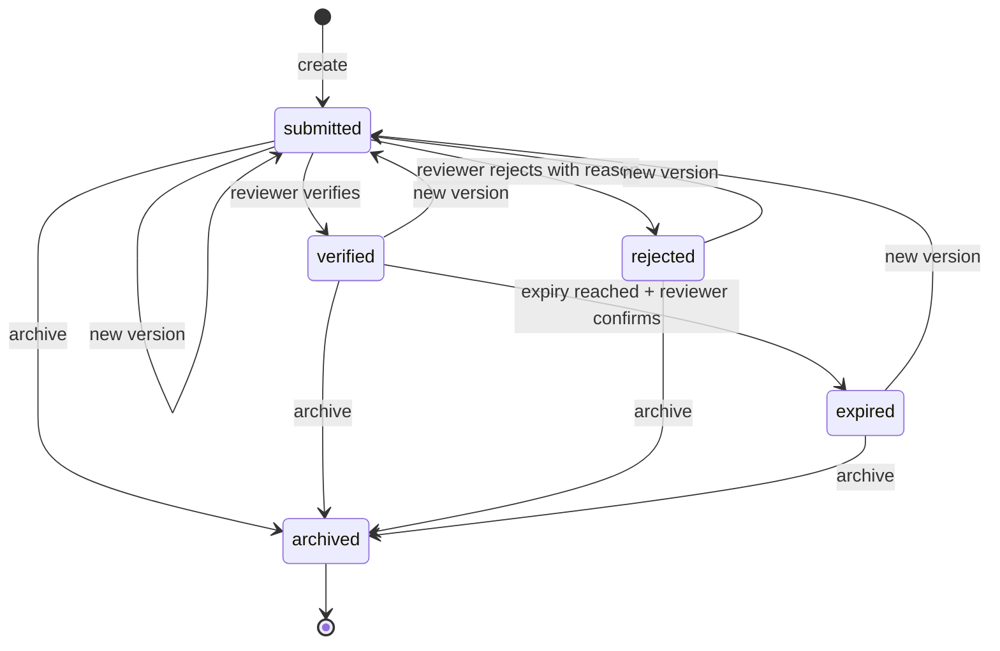

# Phase 4A — Governed Customer Documents

**Status:** RELEASE READY — verified 2026-07-30
**Scope:** Contact-linked documents, immutable versions, human verification, expiry, archive,
history, signed previews, Customer 360, and the Reactivation Document Center.
**Architecture impact:** Additive domain aggregate and API over the existing contacts, media,
RBAC, audit, and contact-timeline authorities. No send, provider, queue, campaign, inbox, KYC,
SIM, payment, scan, or automation-runtime behavior changes.

## Objective

Turn Phase 3's honest document boundary into an operational enterprise workflow without creating
a second blob store or weakening the platform's security model. A document is a governed customer
record; its bytes continue to live in `media_assets` and object storage.

## Reuse map

| Concern | Existing authority reused |
|---|---|
| Customer ownership and tenant scope | `contacts` and `organization_id` |
| File validation, malware scan, deduplication and storage | `MediaService` / `media_assets` |
| File delivery | Existing expiring signed-media URL |
| Authentication and permissions | Existing JWT/RBAC dependency chain |
| Security-relevant audit | `AuditService` / immutable `audit_logs` |
| Customer-visible activity | Append-only `contact_events` timeline |
| API client | Generated OpenAPI TypeScript definitions |
| UI language | Existing cards, badges, buttons, modals, skeletons, errors and empty states |

## Data model

`contact_documents` stores customer linkage, category, title, lifecycle state, expiry, reviewer
metadata, archive time, audit fields, soft delete, and optimistic `row_version`. It never stores
file bytes or a storage key.

`contact_document_versions` is append-only file lineage. Each row links one document to one
existing `media_asset`, with a monotonic version number, uploader, note, public UUID and creation
time. Adding a version increments the media usage guard so referenced content cannot be deleted.

`contact_document_events` is append-only decision history with actor, previous/new values, reason
and creation time. Material events also project to the existing customer timeline with
`ref_type="contact_document"`.

## State machine

- Creation always starts at `submitted` with version 1.
- Verification and rejection are accepted only from `submitted`; rejection requires a reason.
- A new version preserves all earlier versions and returns the document to `submitted`.
- Expiry is never inferred as a mutation during a read. `is_expired` reports a passed date; an
  authorized reviewer explicitly records the `expired` transition.
- Archive is terminal. Archived records and their versions remain readable for evidence.
- Every mutation accepts an optional expected row version and returns RFC 7807
  `version_conflict` when the caller acts on stale state.

## Permissions

| Permission | Owner/Admin | Manager | Agent | Analyst |
|---|---:|---:|---:|---:|
| `documents:read` | Yes | Yes | Yes | No |
| `documents:write` | Yes | Yes | Yes | No |
| `documents:verify` | Yes | Yes | No | No |

Document write permits metadata, eligible media attachment, versions and archive. Uploading a new
general media asset still requires `media:write`; document write never silently broadens storage
authority.

## API contract

| Method | Path | Permission |
|---|---|---|
| GET | `/contacts/{contact_id}/documents` | `documents:read` |
| POST | `/contacts/{contact_id}/documents` | `documents:write` |
| GET | `/documents/{document_id}` | `documents:read` |
| POST | `/documents/{document_id}/versions` | `documents:write` |
| POST | `/documents/{document_id}/verification` | `documents:verify` |
| POST | `/documents/{document_id}/expire` | `documents:verify` |
| POST | `/documents/{document_id}/archive` | `documents:write` |
| GET | `/documents/{document_id}/history` | `documents:read` |
| GET | `/documents/{document_id}/versions/{version_id}/content` | `documents:read` |

Every UUID lookup includes organization scope; a foreign-tenant UUID is indistinguishable from a
missing record. Responses expose safe file metadata only. Content is a short-lived signed link;
storage keys and file bytes never cross the authenticated metadata contract.

## Enterprise experience

- The Document Center starts with server-backed customer search because documents belong to one
  customer; it does not flatten unrelated files into a generic admin table.
- Customer 360 embeds the same workspace as Reactivation.
- Review metrics, search, filters, responsive records, skeletons, actionable empty states, signed
  previews, immutable version cards and decision history reuse the design system.
- Create/version can select a recent eligible media asset and offers direct upload only to users
  who already hold `media:write`.
- Verify, reject, expiry and archive controls render only with least-privilege permissions and
  legal source states.

## Invariants

1. No document row or version crosses an organization boundary.
2. A document version is immutable and references one retained media asset.
3. File bytes remain behind the existing media storage and signing boundary.
4. A rejected document always has reviewer context.
5. Reads never silently mutate lifecycle state.
6. History and timeline projections share the mutation transaction.
7. Existing APIs, tables, permissions, sends, queues and provider behavior remain intact.
8. KYC, SIM, activation, payments, scan runtime, automation runtime and AI execution remain out.

## Validation contract

- API tests cover safe metadata, versioning, legal transitions, rejection evidence, signed preview,
  media retention, stale versions, duplicates, permissions, tenant isolation, timeline and routes.
- Migration tests prove upgrade/downgrade/repeatability, permission seed count and the new head.
- Frontend regressions cover generated enums, presentation, history, concurrency and permission
  denial without a fetch.
- Release completion requires both full test suites, Ruff, strict mypy, ESLint, TypeScript,
  OpenAPI drift, production build, Docker image build and production smoke/deployed validation.

## Release evidence

- 912 backend tests and 600 frontend tests passed; Ruff, strict mypy across 232 backend source
  files, ESLint, TypeScript, browser-test types, OpenAPI drift, and production frontend build passed.
- OpenAPI 3.1.0 contains 141 paths; migration `0028_contact_documents` is the 28th linear revision.
- Production backend/frontend images rebuilt and passed metadata/runtime contracts, HIGH/CRITICAL
  vulnerability scans, and CycloneDX SBOM generation. The backend image imports 23 application
  Celery tasks and exposes the 141-path API contract.
- The isolated production topology passed migrations, owner bootstrap, API/worker/beat/queue and
  health checks, browser smoke, cleanup, and a 30-read p95 of 19.4 ms (<300 ms budget).
- One release-evidence defect was reproduced and fixed: `image_contract.py` retained the pre-Phase
  4A 133-path assertion. Updating it to 141 is safe because it changes no runtime, schema, API,
  permission, queue, tenant, or business behavior; focused regression coverage passes 14/14.

## Explicitly remaining Phase 4 backlog

KYC decisions/evidence, SIM fulfilment, lead-card transitions, scan execution, versioned automation
runtime, payments/reactivation analytics and AI-provider execution remain contract-gated. This
milestone does not authorize or simulate them.
