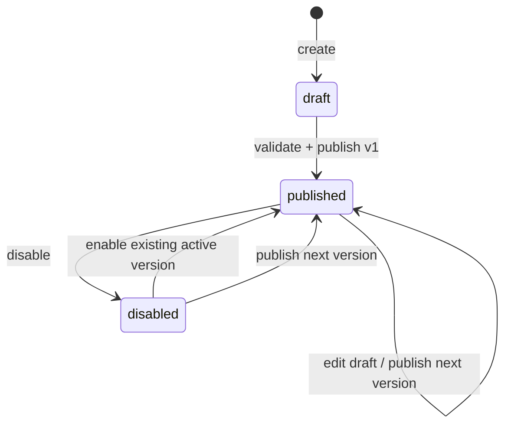

# MD5 Phase 2A — Versioned Automation Definitions

**Status:** RELEASE READY — verified 2026-07-30
**Roadmap item:** PAR-AUTO-01, first reversible slice
**Scope:** Durable flow drafts, typed graph validation, immutable publication history, draft
restore, enable/disable controls, RBAC, audit and the visual authoring surface.
**Explicitly out:** execution, triggers, scheduling, run/attempt ledger, retries/DLQ, outbound
webhooks, approval queue, messaging, WhatsApp Forms, AI and commerce.

## Objective

Replace the non-persistent Automation blueprint with a real enterprise authoring contract without
pretending the runtime exists. A published definition is deterministic, immutable and recoverable;
nothing in this milestone executes or sends.

## Existing authorities reused

| Concern | Authority |
|---|---|
| Identity and tenant scope | Existing authenticated `User.organization_id` |
| Permissions | Existing JWT/RBAC dependency chain and deploy-time role synchronization |
| Audit | `AuditService` and immutable `audit_logs` |
| Concurrency | Existing `row_version` conflict convention |
| API client | Generated OpenAPI TypeScript contract |
| UI | Existing layout, forms, cards, badges, skeletons, empty/error states and query cache |

## Data contract

### `automation_flows`

One mutable draft aggregate per automation: public UUID, organization, name, description, lifecycle
state (`draft`, `published`, `disabled`), draft graph JSON, draft content hash, active published
version number, audit fields, optimistic row version and timestamps. The active version remains
unchanged while later draft edits are made.

### `automation_flow_versions`

Append-only publication snapshots: public UUID, organization, parent flow, monotonic version,
snapshotted name/description/graph, SHA-256 content hash, publishing actor and timestamp. Historical
rows are never updated or deleted by the application.

## Typed graph

A draft contains bounded `nodes` and `edges`. Node kinds are the existing product vocabulary:
`trigger`, `condition`, `action`, `delay`, `tag`, `assignment`, `wait`, `webhook`, `campaign`,
`notification`, and `approval`. Every kind has a bounded, typed configuration; unknown fields are
rejected so definitions cannot silently change meaning between versions.

Drafts can be incomplete. Publication requires:

1. 1–100 nodes and no more than 200 edges.
2. Exactly one trigger.
3. Unique node and edge identifiers.
4. Every edge references existing, different nodes; duplicate source/target pairs are rejected.
5. The graph is acyclic and every node is reachable from the trigger.
6. The trigger has no incoming edge and every non-terminal node participates in a connected path.
7. Every `campaign` proposal has a downstream `approval` node; publication fails closed otherwise.

This validation makes a version safe to hand to the future runtime; it does not execute it.

## Lifecycle

- Saving changes mutates only the draft and increments `row_version`.
- Publishing atomically creates an immutable version and selects it as active.
- Restoring a prior version copies it into the draft and requires an explicit later publish.
- `has_unpublished_changes` is derived from draft and active content hashes.
- Disable/enable never modifies an immutable version.

## Permissions

| Permission | Owner/Admin | Manager | Agent | Analyst |
|---|---:|---:|---:|---:|
| `automations:read` | Yes | Yes | No | Yes |
| `automations:write` | Yes | Yes | No | No |
| `automations:publish` | Yes | Yes | No | No |

## API contract

| Method | Path | Permission | Purpose |
|---|---|---|---|
| GET | `/automations` | `automations:read` | Search/filter organization flows |
| POST | `/automations` | `automations:write` | Create a durable draft |
| GET | `/automations/{automation_id}` | `automations:read` | Read draft and active state |
| PATCH | `/automations/{automation_id}` | `automations:write` | Update draft with row-version guard |
| POST | `/automations/{automation_id}/validate` | `automations:read` | Return semantic publication issues |
| POST | `/automations/{automation_id}/publish` | `automations:publish` | Publish an immutable version |
| GET | `/automations/{automation_id}/versions` | `automations:read` | Read publication history |
| POST | `/automations/{automation_id}/versions/{version_no}/restore` | `automations:write` | Restore snapshot to draft |
| POST | `/automations/{automation_id}/disable` | `automations:publish` | Mark runtime-ineligible |
| POST | `/automations/{automation_id}/enable` | `automations:publish` | Re-enable active version |

Every UUID lookup is organization-scoped; foreign identifiers return the same 404 as missing
records. All mutations are audited in the same transaction.

## UI contract

- The Automation route opens a searchable flow workspace, not a generic admin table.
- New and existing drafts use the current three-pane builder with real name/description, typed node
  configuration, save state, validation summary, publish review and version history.
- Run/Test remains unavailable and clearly explains the missing run-ledger boundary.
- Customer-facing proposals remain visibly approval-gated.
- Loading, error, empty, permission and stale-write states use existing design-system patterns.

## Invariants

1. No flow or version crosses an organization boundary.
2. A published version is immutable and content-addressed.
3. Saving a draft never changes the active published version.
4. Restore never publishes or executes.
5. Invalid graphs cannot be published.
6. No Phase 2A code registers tasks, schedules work, invokes providers, mutates CRM/inbox/campaign
   records, or sends a message.
7. Future customer-facing effects must become approval proposals and may reach customers only
   through the existing permission/compliance checks and `SendService`.

## Validation contract

- Backend coverage: typed payloads, graph semantics, version immutability, hashes, lifecycle,
  optimistic concurrency, permission denial, tenant isolation, audit and OpenAPI routes.
- Migration coverage: linear `0029` head, upgrade/downgrade/repeatability and permission inserts.
- Frontend coverage: durable create/edit, node configuration, validation feedback, publish state,
  version restore, disabled execution control and permission-aware actions.
- Completion requires the repository's applicable backend/frontend/static/OpenAPI/build gates and a
  local browser workflow. Docker release/deployed evidence is required before Phase 2A is marked
  release ready.

## Release evidence

- Migration head `0029_automation_definitions`; OpenAPI 3.1.0 contains 149 paths.
- 921 backend tests, Ruff, and raw strict mypy across 237 files passed.
- 625 frontend tests, TypeScript, ESLint, and the production build passed.
- Production backend and frontend images rebuilt and contract-checked; the backend registry remains
  unchanged at 23 Celery tasks.
- The isolated ten-service gate passed migrations, API/worker/queue health, real browser draft
  create/save/publish, readiness degradation, redacted runtime logging, and 30 standard reads at
  p95 25.9 ms against the 300 ms budget.
- Two deployed-browser regressions were fixed with focused coverage: the compact More panel no
  longer overlays advanced workspaces, and server refresh no longer clears a successful save notice.
